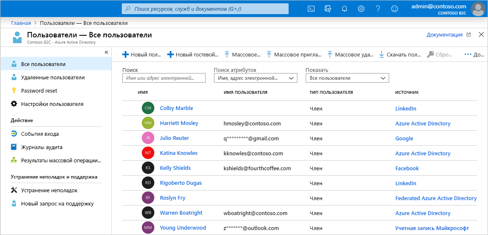
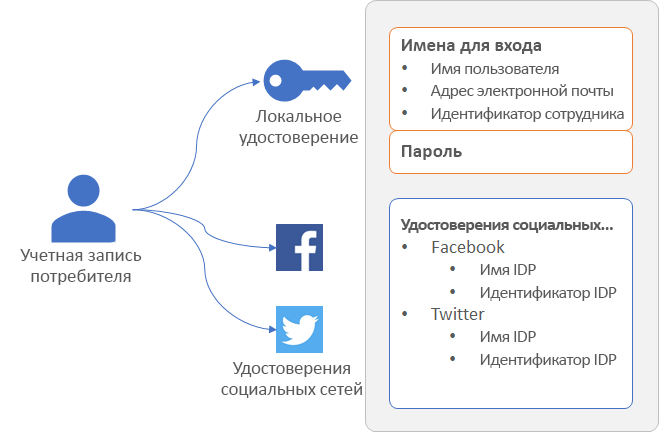
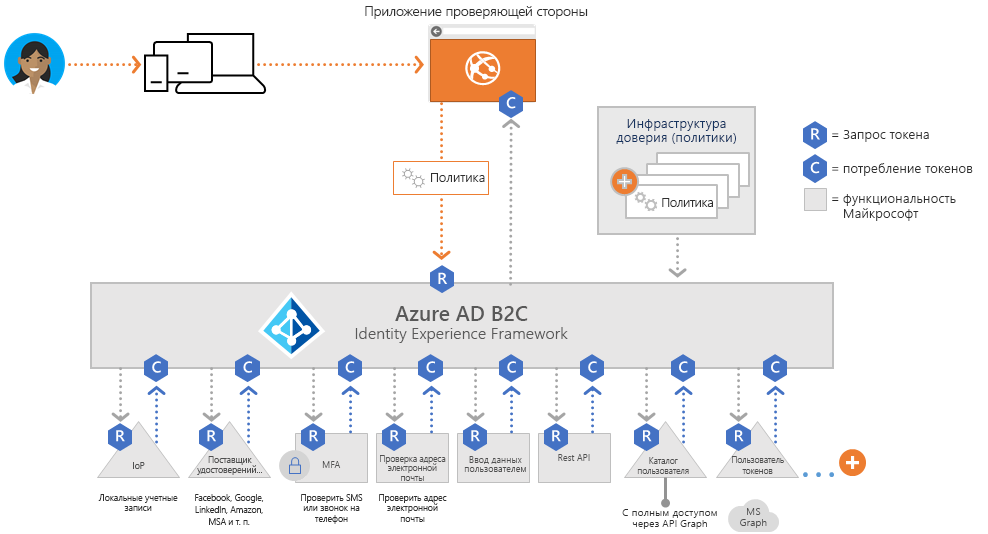
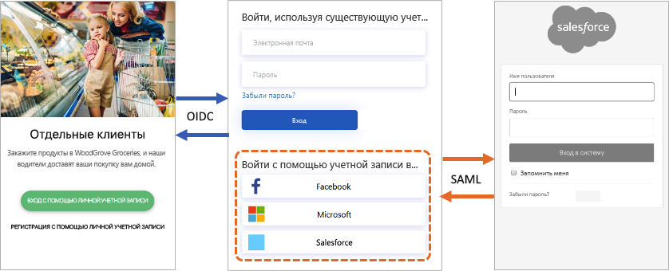
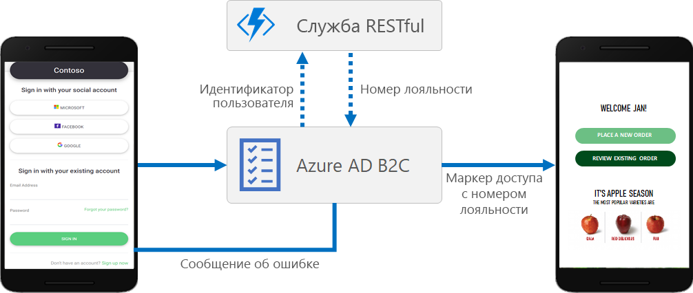
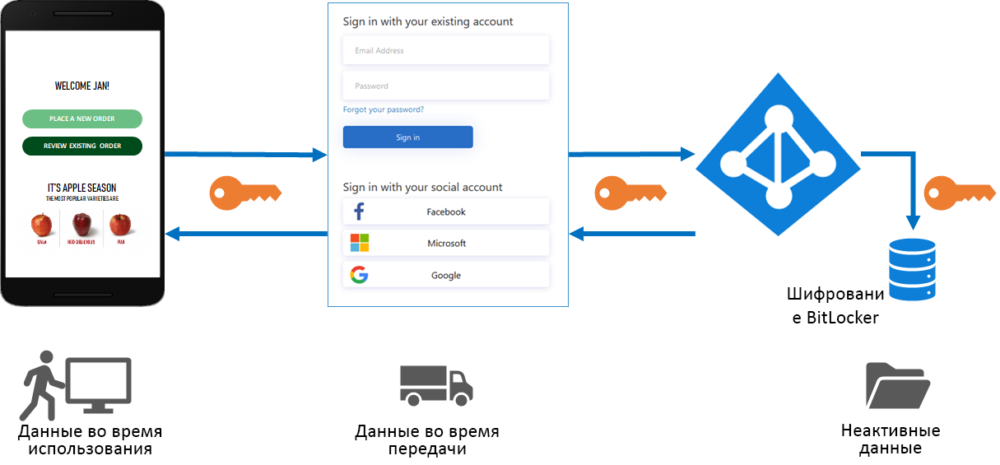
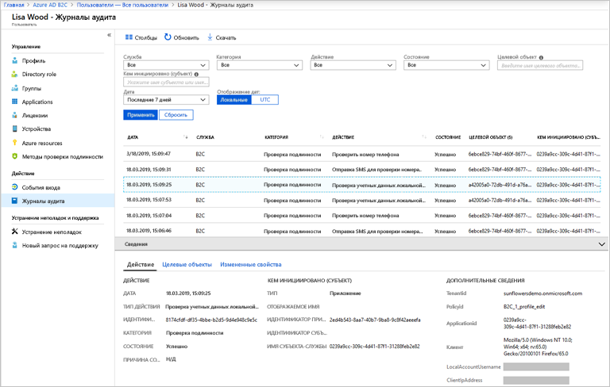

# Обзор технических возможностей и функций Azure Active Directory B2C

Эта статья является дополнением к статье [Что такое Azure Active Directory B2C](overview.md) и содержит более подробные сведения о службе. Здесь обсуждаются основные ресурсы, с которыми вы работаете в службе, ее функции и способы создания полностью настраиваемой системы идентификации для пользователей в ваших приложениях.

## Клиент Azure AD B2C

В Azure Active Directory B2C (Azure AD B2C) *клиент* представляет организацию и ее каталог пользователей. Каждый клиент Azure AD B2C отделен от остальных клиентов Azure AD B2C. Клиент Azure AD B2C отличается от клиента Azure Active Directory, если такой у вас уже есть.

Основные ресурсы, с которыми вы работаете в клиенте Azure AD B2C:

* **Каталог**. Именно в *каталоге* служба Azure AD B2C хранит учетные данные пользователей и сведения о профилях, а также регистрации приложений.
* **Регистрации приложений**. Регистрация веб-приложений, мобильных и классических приложений в Azure AD B2C позволяет применить для них управление удостоверениями. Это же применимо к любым API, которые вы намерены защитить с помощью Azure AD B2C.
* **Потоки пользователей** и **пользовательские политики**. Для ваших приложений доступны стандартные встроенные (потоки пользователей) и полностью настраиваемые (пользовательские политики) процессы управления удостоверениями.
  * Используйте *потоки пользователей* для быстрой настройки и включения типичных задач идентификации, таких как регистрация, вход в систему и редактирование профиля.
  * Применяйте *пользовательские политики*, чтобы создать процессы для менее типичных задач идентификации, которые нужны в сложных рабочих процессах идентификации с учетом уникальных особенностей организации, клиентов, сотрудников, партнеров и граждан.
* **Поставщики удостоверений**. Поддерживаются следующие варианты федерации:
  * поставщики удостоверений *социальных сетей*, таких как Facebook, LinkedIn или Twitter, которые должны поддерживаться в приложениях;
  * *внешние* поставщики удостоверений, которые поддерживают стандартные протоколы удостоверений OAuth 2.0, OpenID Connect и другие;
  * *локальные* учетные записи, с помощью которых пользователи могут регистрироваться и выполнять вход с указанием имени пользователя (адреса электронной почты или другого идентификатора) и пароля;
* **ключи** шифрования, которые можно добавлять и администрировать для подписывания и проверки токенов, секретов клиентов, сертификатов и паролей.

Клиент Azure AD B2C — это первый ресурс, который вам нужно создать для начала работы с Azure AD B2C. Этот процесс описан в [руководстве по созданию клиента Azure Active Directory B2C](tutorial-create-tenant.md).

## Учетные записи в Azure AD B2C

Для Azure AD B2C определены несколько типов учетных записей пользователей. Azure Active Directory, Azure Active Directory B2B и Azure Active Directory B2C поддерживают все эти типы учетных записей.

* **Рабочая учетная запись**. Пользователи с рабочей учетной записью могут получать управлять ресурсами в клиенте, а при наличии роли администратора могут управлять клиентами. Пользователи с рабочими учетными записями могут создавать новые учетные записи пользователей, сбрасывать пароли, блокировать и разблокировать учетные записи, а также устанавливать разрешения или назначать учетную запись в группу безопасности.
* **Гостевые учетные записи** обозначают внешних пользователей, которых вы пригласили в свой клиент в качестве гостей. Типичный сценарий приглашения гостевого пользователя в клиент Azure AD B2C — для совместного выполнения обязанностей администрирования.
* **Учетная запись потребителя**. Учетные записи потребителей создаются в каталоге Azure AD B2C, когда пользователь завершает процесс регистрации в приложении, которое вы зарегистрировали в клиенте.

 *Рисунок. Каталог пользователя в клиенте Azure AD B2C на портале Azure*

### Учетные записи потребителей

С учетной записью *потребителя* пользователи могут входить в приложения, защищенные с помощью Azure AD B2C. Но пользователи с учетными записями потребителей не получают доступ к ресурсам Azure, таким как портал Azure.

Учетную запись потребителя можно связать удостоверениями следующих типов.

* **Локальное** удостоверение с именем пользователя и паролем, которые хранятся локально в каталоге Azure AD B2C. Часто мы называем такие удостоверения "локальными учетными записями".
* Удостоверения **социальных сетей** или **предприятий**, управление которыми выполняет федеративный поставщик удостоверений, например Facebook, Майкрософт, ADFS или Salesforce.

Пользователь с учетной записью потребителя может использовать для входа в систему разные типы удостоверений, в том числе имя пользователя, адрес электронной почты, идентификатор сотрудника, удостоверение личности и др. Одна учетная запись может иметь несколько как локальных удостоверений, так и удостоверений социальных сетей.

 *Рисунок. Одна учетная запись потребителя с несколькими удостоверениями в Azure AD B2C*

Azure AD B2C позволяет управлять типичными атрибутами в профилях учетных записей потребителей, такими как отображаемое имя, фамилия, имя, город и другие. Вы также можете расширить схему Azure AD, чтобы сохранять дополнительные сведения о пользователях. Сюда относятся название страны или региона проживания, предпочитаемый язык, согласие на получение бюллетеней или многофакторную проверку подлинности.

Дополнительные сведения о типах учетных записей пользователей в Azure AD B2C см. в статье [Общие сведения об учетных записях пользователей в Azure Active Directory B2C](user-overview.md).

## Внешние поставщики удостоверений

Azure AD B2C позволяет разрешить пользователям вход в приложение с учетными данными внешних поставщиков удостоверений (социальных сетей или предприятий). Azure AD B2C поддерживает Facebook, учетные записи Майкрософт, Google, Твиттера и других внешних поставщиков удостоверений, совместимых с протоколами OAuth 1.0, OAuth 2.0, OpenID Connect и SAML.

Благодаря федерации с внешними поставщиками удостоверений вы сможете предложить потребителям возможность входа с их существующими учетными записями социальных сетей или предприятий, не вынуждая создавать новую учетную запись только для своего приложения.

На странице регистрации и входа в Azure AD B2C представлен список внешних поставщиков удостоверений, которые пользователь может выбрать для входа. Выбрав один из внешних поставщиков удостоверений, пользователь попадает на веб-сайт этого поставщика, где сможет завершить процесс входа. После успешного входа пользователь возвращается в Azure AD B2C для аутентификации учетной записи в вашем приложении.

Добавление поставщиков удостоверений в Azure AD B2C описано в статье [Учебник. Добавление поставщиков удостоверений приложениям в Azure Active Directory B2C](tutorial-add-identity-providers.md).

## Процессы идентификации: потоки пользователей или настраиваемые политики

Важнейшим преимуществом Azure AD B2C является инфраструктура расширяемых политик. Именно политики описывают процессы идентификации пользователей: регистрацию, вход, изменение профиля и т. п.

В Azure AD B2C вы можете применить два основных пути для организации процессов идентификации: потоки пользователей и настраиваемые политики.

* **Потоки пользователей** — это встроенные предопределенные политики с возможностью настройки, которые позволят вам за несколько минут организовать процессы для регистрации, входа и редактирования политик.

* **Пользовательские политики** позволяют создавать собственные пути взаимодействия с пользователями для сложных сценариев идентификации.

Как потоки пользователей, так и настраиваемые политики основаны на механизме *Identity Experience Framework*, которые используется в Azure AD B2C для оркестрации политик.

### Поток пользователя

Чтобы вы могли быстро настроить наиболее распространенные задачи идентификации, на портале Azure предоставляются несколько предопределенных настраиваемых политик, которые называются *потоками пользователей*.

Для них вы можете настроить некоторые параметры, чтобы управлять поведением приложений при работе с удостоверениями:

* типы учетных записей, используемые для входа в систему, такие как учетные записи социальных сетей, например Facebook, или локальные учетные записи с адресами электронной почты и паролями для входа;
* атрибуты, которые нужно получить от пользователя, например имя, почтовый индекс и страна или регион проживания;
* многофакторная проверка подлинности (MFA) Azure AD;
* настройка пользовательского интерфейса;
* набор утверждений в маркере, который получает приложение после того, как пользователь завершит поток пользователя;
* Управление сеансом
* и многое другое.

Наиболее распространенные сценарии идентификации для большинства мобильных, веб- и одностраничных приложений можно определить и эффективно реализовать с помощью потоков пользователей. Мы рекомендуем использовать встроенные потоки пользователей, если не предполагается сложных сценариев взаимодействия с пользователем, требующих полной гибкости настраиваемых политик.

Дополнительные сведения о потоках пользователей в Azure Active Directory B2C см. [здесь](user-flow-overview.md).

### Настраиваемая политика

Пользовательские политики открывают доступ к мощному механизму оркестрации Identity Experience Framework. С помощью пользовательских политик можно создать на основе Identity Experience Framework практически любой способ проверки подлинности, регистрации пользователей или редактирования профилей, какой вы только сможете придумать.

Identity Experience Framework дает возможность создавать пути взаимодействия пользователя с любым сочетанием шагов. Пример:

* Федерация с другими поставщиками удостоверений.
* Трудности при использовании собственных и сторонних систем многофакторной проверки подлинности.
* Получение данных, вводимых пользователем.
* Интеграция с внешними системами через интерфейсы REST API.

Каждый путь взаимодействия пользователя определяется политикой, и вы можете создать любое количество политик для оптимального взаимодействия с пользователями в вашей организации.

Пользовательские политики определяются одним или несколькими XML-файлами, которые иерархически ссылаются друг на друга. XML-элементы определяют схему утверждений, преобразования утверждений, определения содержимого, поставщиков утверждений, технические профили, шаги оркестрации в пути взаимодействия пользователя и другие элементы для работы с удостоверениями.

Высокая гибкость настраиваемых политик лучше всего подходит для случаев, когда вам нужно создать сложные сценарии идентификации. Разработчики, которые настраивают пользовательские политики, должны точно и подробно определить отношения доверия, чтобы добавить конечные точки метаданных, точные определения обмена утверждениями и настроить секретные данные, ключи и сертификаты, отличающиеся в зависимости от поставщика удостоверений.

Дополнительные сведения см. в статье [Пользовательские политики в Azure Active Directory B2C](custom-policy-overview.md).

## Протоколы и маркеры безопасности

- Для приложений Azure AD B2C поддерживает протоколы [OAuth 2.0](protocols-overview.md), [OpenID Connect](openid-connect.md) и [SAML](connect-with-saml-service-providers.md) в путях взаимодействия пользователей. Приложение запускает путь взаимодействия пользователя, отправляя в Azure AD B2C запросы на проверку подлинности. Результатом запроса к Azure AD B2C является маркер безопасности, например [маркер идентификатора, доступа](tokens-overview.md) или токен SAML. Этот маркер безопасности определяет идентификатор пользователя в приложении.

- Для внешних удостоверений Azure AD B2C поддерживает федерацию с любым поставщиком удостоверений по протоколам OAuth 1.0, OAuth 2.0, OpenID Connect и SAML.

На схеме ниже показано, как Azure AD B2C может взаимодействовать по нескольким протоколам в одном потоке проверки подлинности:

1. Приложение проверяющей стороны инициирует запрос авторизации к Azure AD B2C через OpenID Connect.
1. Когда пользователь приложения выбирает вход с использованием внешнего поставщика удостоверений, который использует протокол SAML, Azure AD B2C применяет протокол SAML для взаимодействия с этим поставщиком удостоверений.
1. Когда пользователь завершит операцию входа во внешний поставщик удостоверений, Azure AD B2C получит маркер и передаст его приложению проверяющей стороны через OpenID Connect.

## Интеграция приложений

Когда пользователь пытается войти в приложение (веб-приложение, мобильное, классическое или одностраничное приложение), оно направляет запрос авторизации в пользовательскую конечную точку, которая представляет поток пользователей или пользовательскую политику. Соответствующий поток пользователей или пользовательская политика определяют и контролируют взаимодействие с пользователем. Когда завершится поток пользователей, например *поток регистрации или входа*, Azure AD B2C создаст маркер и перенаправит пользователя обратно в приложение.

Один поток пользователя или одна пользовательская политика могут применяться в нескольких приложениях. Одно приложение может использовать несколько потоков пользователей и (или) настраиваемых политик.

Например, приложение использует поток для *регистрации или входа* пользователей в систему. После успешного входа пользователю может потребоваться изменить свой профиль, и в этом случае приложение инициирует другой запрос авторизации через поток пользователя для *изменения профиля*.

## Удобство работы для пользователей

В Azure AD B2C вы можете создавать собственные методы взаимодействия пользователей с удостоверениями, чтобы используемые страницы соответствовали стилю и внешнему виду бренда. Вы получаете почти полный контроль над содержимым HTML и CSS, которое представляется пользователям в процессах идентификации, используемых приложением. Такая гибкость позволяет поддерживать согласованность фирменной символики и визуального оформления между приложением и Azure AD B2C.

Дополнительные сведения о персонализации пользовательского интерфейса см. в статье [о настройке пользовательского интерфейса в Azure Active Directory B2C](customize-ui-overview.md).

## Локализация

Настройка языка в Azure AD B2C позволяет политике поддерживать разные языки в соответствии с требованиями пользователей. Корпорация Майкрософт предоставляет переводы на 36 языков. Кроме того, вы можете предоставить собственный перевод на любой язык. Даже если вам требуется только один язык, на странице можно настроить любой текст.

Локализация подробно описана в статье [Настройка языка в Azure Active Directory B2C](user-flow-language-customization.md).

## Добавление собственной бизнес-логики

Если вы решили использовать пользовательские политики, для пути взаимодействия пользователя можно интегрировать REST API и добавить собственную бизнес-логику. Например, Azure AD B2C может организовать обменен данными со службой на основе REST для следующих задач:

* отображение понятных и персонализированных сообщений об ошибках;
* проверка данных, полученных от пользователя, чтобы не сохранять в Azure AD B2C данные в недопустимом формате. Вы можете изменить введенные пользователем данные, например применить верхний регистр для первой буквы в имени пользователя;
* обогащение данных пользователя за счет расширенной интеграции с корпоративным бизнес-приложением;
* отправка push-уведомлений, обновление корпоративных баз данных, миграция пользователей, управление разрешениями, аудит баз данных и многое другое.

Еще один сценарий, который можно реализовать благодаря поддержке интерфейсов REST API в Azure AD B2C — это программы лояльности. Например, служба на основе REST может получить адрес электронной почты пользователя, обратиться к базе данных клиента и передать в Azure AD B2C номер личного счета пользователя. Полученные данные можно сохранить в учетной записи каталога пользователя в Azure AD B2C и проанализировать в последующих шагах политики или включить в маркер доступа.

Вы можете добавить вызов REST API в любой шаг пути взаимодействия пользователя, который определен пользовательской политикой. Например, вызовы к REST API можно выполнять:

* во время входа в систему перед тем, как Azure AD B2C проверит учетные данные;
* сразу после входа в систему;
* перед тем, как Azure AD B2C создаст учетную запись в каталоге;
* после того, как Azure AD B2C создаст учетную запись в каталоге;
* перед тем, как Azure AD B2C выдаст маркер доступа.

Использование пользовательских политик для интеграции REST API в Azure AD B2C описано в статье [Интеграция обмена утверждениями REST API в пользовательскую политики Azure AD B2C](custom-policy-rest-api-intro.md).

## Защита удостоверений пользователей

Azure AD B2C соответствует всем требованиям по безопасности, конфиденциальности и другим обязательствам, которые описаны в [центре управления безопасностью Microsoft Azure](https://www.microsoft.com/trustcenter/cloudservices/azure).

Сеансы моделируются как зашифрованные данные, ключ расшифровки которых известен только службе маркеров безопасности в Azure AD B2C. Используется стойкий алгоритм шифрования AES-192. Все пути обмена данными защищаются с помощью TLS для обеспечения конфиденциальности и целостности. Наша служба маркеров безопасности использует для TLS сертификат высокой расширенной проверки. В качестве основного метода защиты от атак межсайтовых сценариев (XSS), служба маркеров безопасности не выполняет преобразование ненадежных входных данных.

### Доступ к данным пользователей

Многие характеристики клиентов Azure AD B2C совпадают с характеристиками корпоративных клиентов Azure Active Directory, которые используются для сотрудников и партнеров. Например, у них общие механизмы просмотра ролей администрирования, назначения ролей и аудита.

Назначением ролей вы определяете, кто может выполнять конкретные административные действия в Azure AD B2C, включая:

* создание всех составляющих потоков пользователей и управление ими;
* создание схемы атрибутов, доступной для всех потоков пользователей, и управление ею;
* настройка поставщиков удостоверений для использования в прямой федерации;
* создание политик инфраструктуры доверия и управление ими в Identity Experience Framework (настраиваемые политики);
* управление секретами для федерации и шифрования в Identity Experience Framework (настраиваемые политики).

Дополнительные сведения о ролях Azure AD, в том числе о поддержке административных ролей Azure AD B2C, см. в статье [Разрешения роли администратора в Azure Active Directory](../active-directory/roles/permissions-reference.md).

### Многофакторная идентификация (MFA)

Многофакторная идентификация Azure AD B2C помогает защитить доступ к данным и приложениям, сохраняя при этом удобство работы пользователей. Эта служба повышает безопасность, применяя обязательный второй способ проверки подлинности, и обеспечивает строгую проверку, предлагая на выбор ряд простых методов. Применение многофакторной проверки подлинности для конкретных пользователей зависит от решений, которые принимает администратор.

Дополнительные сведения см. в статье [Включение многофакторной идентификации в Azure Active Directory B2C](custom-policy-multi-factor-authentication.md).

### Интеллектуальная блокировка учетной записи

Чтобы предотвратить попытки подбора и угадывания пароля, Azure AD B2C использует сложную стратегию блокировки учетных записей по IP-адресам запросов, введенным паролям и нескольким дополнительным факторам. Продолжительность блокировки автоматически увеличивается в зависимости от риска и количества попыток.

Дополнительные сведения об управлении параметрами защиты паролей см. в статье [Предотвращение угроз в Azure Active Directory B2C](threat-management.md).

### Сложность пароля

Во время регистрации или сброса паролей пользователям необходимо ввести пароль, отвечающий требованиям сложности. По умолчанию Azure AD B2C требует использовать надежные пароли. Также Azure AD B2C предоставляет параметры конфигурации, позволяющие указать требования к сложности паролей, используемых пользователями.

Вы можете настраивать сложность пароля как для [потоков пользователей](user-flow-password-complexity.md), так и для [пользовательских политик](custom-policy-password-complexity.md).

## Аудит и журналы

Azure AD B2C создает журналы аудита со сведениями о ресурсах, выданных маркерах и доступе с правами администратора. Эти журналы аудита можно применить для анализа действий и диагностики проблем с платформой. Записи журнала аудита становятся доступны вскоре после того действия, которое создает событие.

В журнале аудита, который предоставляется по клиентам Azure AD B2C и конкретным пользователям, можно найти сведения о следующих элементах.

* Действия, касающиеся авторизации пользователя для доступа к ресурсам B2C (например, доступ администратора к списку политик B2C)
* Действия, связанные с атрибутами каталога, полученными при входе администратора через портал Azure.
* Операции создания, чтения, обновления и удаления (CRUD) для приложений B2C.
* Операции CRUD для ключей, которые хранятся в контейнере ключей B2C.
* Операции CRUD для ресурсов B2C (например, политик и поставщиков удостоверений)
* Проверка учетных данных пользователя и выдача токенов

Дополнительные сведения о журналах аудита см. в статье [Обращение к журналам аудита Azure AD B2C](view-audit-logs.md).

### Информация об использовании

Azure AD B2C позволяет выяснить, когда пользователи выполняют регистрацию и вход в веб-приложение, где они находятся, какие браузеры и операционные системы они используют. Интеграция Application Insights Azure в Azure AD B2C с помощью пользовательских политик позволяет получить представление о том, как пользователи регистрируются, выполняют вход, сбрасывают пароль или изменяют профили. Эти сведения будут полезными при принятии обоснованных решений для предстоящих циклов разработки.

Дополнительные сведения об аналитике использования см. в статье [Отслеживание поведения пользователей в Azure Active Directory B2C с использованием Application Insights](analytics-with-application-insights.md).

## Дальнейшие действия

Итак, вы получили более глубокое представление о технических возможностях и функциях Azure Active Directory B2C. Теперь переходите к [учебнику по созданию арендатора Azure Active Directory B2C](tutorial-create-tenant.md).
