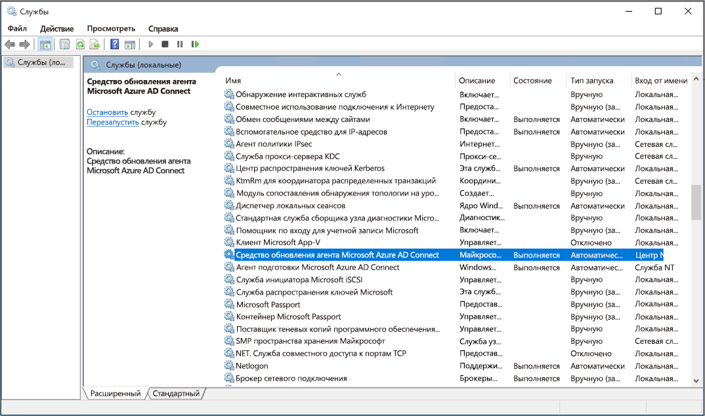

# Установка агента подготовки облака Azure AD Connect
В этом документе описывается процесс установки агента подготовки Azure Active Directory (Azure AD) Connect и его первоначальной настройки в портал Azure.

>[!IMPORTANT]
>Следующие инструкции по установке предполагают, что выполнены все [необходимые условия](how-to-prerequisites.md) .

Установка и настройка Azure AD Connect подготовка выполняется в следующих шагах:
    
- [Установка агента](#install-the-agent)
- [Проверка установки агента](#verify-agent-installation)

## Установка агента.
Чтобы установить агент, выполните следующие действия.

1. Войдите на сервер, который будет использоваться с разрешениями администратора предприятия.
1. Перейдите на портал Azure. Слева выберите **Azure Active Directory**.
1. Выберите **Управление подготовка (Предварительная версия)**  > **Просмотрите все агенты**.
1. Скачайте Azure AD Connect агент подготовки из портал Azure.

    
1. Запустите установщик подготовки Azure AD Connect (Аадконнектпровисионингажент. Installer).
1. На экране **Microsoft Azure AD подключить пакет агента подготовки** примите условия лицензионного соглашения и нажмите кнопку **установить**.

    

1. После завершения этой операции запускается мастер настройки. Войдите с учетной записью глобального администратора Azure AD.
1. На экране **подключение Active Directory** выберите **Добавить каталог**. Затем войдите с помощью учетной записи администратора Active Directory. Эта операция добавляет локальный каталог. Выберите **Далее**.

    

1. На экране **Конфигурация завершена** нажмите кнопку **подтвердить**. Эта операция регистрирует и перезапускает агент.

    

1. После завершения этой операции вы увидите уведомление о том, что **Конфигурация агента успешно проверена.** Выберите **выход**.

    
1. Если вы по-прежнему видите экран начальный **пакет агента подготовки Microsoft Azure AD подключения** , нажмите кнопку **Закрыть**.

## Проверка установки агента
Проверка агента выполняется в портал Azure и на локальном сервере, на котором выполняется агент.

### Проверка агента на портале Azure
Чтобы проверить, что агент отображается в Azure, выполните следующие действия.

1. Войдите на портал Azure.
1. Слева выберите **Azure Active Directory** > **Azure AD Connect**. В центре выберите **Управление подготовка (Предварительная версия)** .

    

1.  На экране **Подготовка Azure AD (Предварительная версия)** выберите **проверить все агенты**.

     
 
1. На экране **локальные агенты подготовки** вы увидите установленные агенты. Убедитесь, что нужный агент присутствует в этом списке с пометкой *active* (Активный).

    

### Проверка порта
Чтобы убедиться, что Azure прослушивает порт 443 и что агент может взаимодействовать с ним, выполните следующие действия.

https://aadap-portcheck.connectorporttest.msappproxy.net/ 

Этот тест проверяет, могут ли агенты обмениваться данными с Azure через порт 443. Откройте браузер и перейдите к предыдущему URL-адресу с сервера, на котором установлен агент.

### На локальном сервере
Чтобы проверить, работает ли агент, выполните следующие действия.

1.  Войдите на сервер с учетной записью администратора.
1.  Откройте **службы** , перейдя к ней или выбрав **Start** > **запустите** > **Services. msc**.
1.  В разделе " **службы**" убедитесь в том, что **Microsoft Azure AD Connect update Agent** and **Microsoft Azure AD Connect подготовка Agent** и их состояние *выполняется*.

    

>[!IMPORTANT]
>Агент был установлен, но его необходимо настроить и включить, прежде чем начнется синхронизация пользователей. Сведения о настройке нового агента см. в разделе [Azure AD Connect Cloud подготовка новой конфигурации агента](how-to-configure.md).

## Дальнейшие действия 

- [Что собой представляет подготовка?](what-is-provisioning.md)
- [What is Azure AD Connect cloud provisioning?](what-is-cloud-provisioning.md) (Что такое подготовка облака Azure AD Connect?)
 
