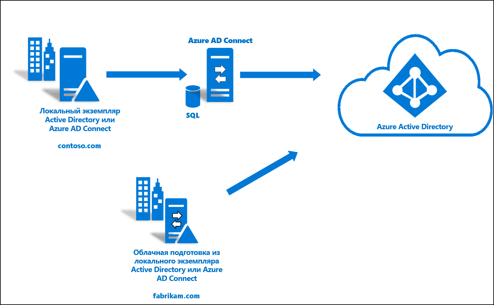
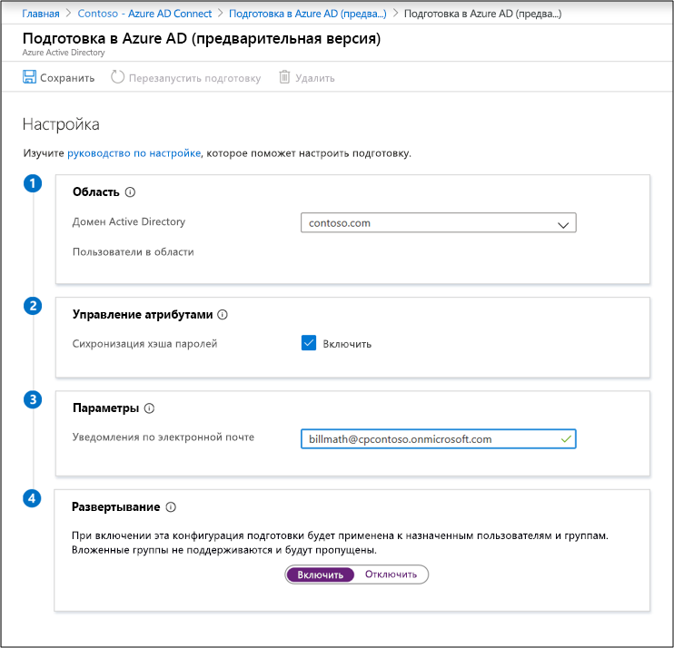

# Интеграция существующего и нового лесов с одним клиентом Azure AD

В этом руководстве описывается добавление подготовки облака в существующую среду гибридной идентификации. 

Среду, созданную в этом руководстве можно использовать для тестирования или дальнейшего знакомства с принципами работы гибридной идентификации. 

В этом сценарии есть существующий лес, синхронизированный с клиентом Azure AD с помощью Azure AD Connect. У вас есть новый лес, который нужно синхронизировать с одним и тем же клиентом Azure AD. Вы настроите подготовку облака для нового леса. 

## Предварительные требования
### В центре администрирования Azure Active Directory

1. Создайте облачную учетную запись глобального администратора в клиенте Azure AD. Таким образом, вы сможете управлять конфигурацией клиента, если работа локальных служб завершится сбоем или они станут недоступными. Узнайте больше о [добавлении облачной учетной записи глобального администратора](../active-directory-users-create-azure-portal.md). Этот шаг очень важен, чтобы не потерять доступ к клиенту.
2. Добавьте одно [имя личного домена](../active-directory-domains-add-azure-portal.md) (или несколько) в клиент Azure AD. Пользователи могут выполнить вход с помощью одного из этих доменных имен.

### В локальной среде

1. Идентификация присоединенного к домену сервера узла под управлением Windows Server 2012 R2 или более поздней версии с минимальным объемом ОЗУ 4 ГБ и .NET 4.7.1 + среда выполнения 

2. Если между серверами и Azure AD настроен брандмауэр, необходимо настроить указанные ниже элементы.
   - Убедитесь, что агенты могут передавать *исходящие* запросы в Azure AD через приведенные ниже порты.

     | Номер порта | Как он используется |
     | --- | --- |
     | **80** | Скачивание списков отзыва сертификатов при проверке SSL-сертификата. |
     | **443** | Обработка всего исходящего трафика для службы. |
     | **8080** (необязательно) | Агенты передают данные о своем состоянии каждые 10 минут через порт 8080, если порт 443 недоступен. Это данные о состоянии отображаются на портале Azure AD. |
     
     Если брандмауэр применяет правила в соответствии с отправляющими трафик пользователями, откройте эти порты для трафика, поступающего от служб Windows, которые работают как сетевая служба.
   - Если брандмауэр или прокси-сервер позволяет указать надежные суффиксы, можно добавить подключения к **\*.msappproxy.net** и **\*.servicebus.windows.net**. Если нет, разрешите доступ к [диапазонам IP-адресов центра обработки данных Azure](https://www.microsoft.com/download/details.aspx?id=41653). Список диапазонов IP-адресов обновляется еженедельно.
   - Агентам требуется доступ к адресам **login.windows.net** и **login.microsoftonline.com** для первоначальной регистрации. Откройте эти URL-адреса в брандмауэре.
   - Для проверки сертификатов разблокируйте следующие URL-адреса: **mscrl.microsoft.com:80**, **crl.microsoft.com:80**, **ocsp.msocsp.com:80** и **www\.microsoft.com:80**. Так как эти URL-адреса используются для проверки сертификатов в других продуктах Майкрософт, они уже могут быть разблокированы.

## Установка агента подготовки Azure AD Connect
1. Войдите на сервер, присоединенный к домену.  Если вы используете учебник [по созданию базовой среды AD и Azure](tutorial-basic-ad-azure.md), это будет DC1.
2. Войдите на портал Azure, используя учетные данные глобального администратора облака.
3. Слева выберите **Azure Active Directory**, щелкните **Azure AD Connect** и в центре выберите **Управление подготовкой (предварительная версия)** . 
 
4. Щелкните "Скачивание агента".
5. Запуск агента подготовки Azure AD Connect
6. На экране-заставке **примите** условия лицензионного соглашения и щелкните **Установить**. 
 

7. После завершения этой операции откроется мастер настройки.  Войдите с учетной записью глобального администратора Azure AD.  Обратите внимание, что если он включен повышенный уровень безопасности IE, вход будет заблокирован.  В этом случае закройте окно установки, отключите повышенный уровень безопасности IE в диспетчере сервера и щелкните значок **мастера агента подготовки AAD Connect**, чтобы снова запустить установку.
8. На экране **Connect Active Directory** (Подключение Active Directory) щелкните **Добавить каталог** и выполните вход с учетной записью администратора домена Active Directory.  Примечание. Учетная запись администратора домена не должна иметь требований к изменению пароля. Если пароль изменится или истечет срок его действия, вам придется повторно настроить новые учетные данные в агенте. Эта операция добавляет локальный каталог.  Щелкните **Далее**. 
 

9. На странице **Конфигурация завершена** щелкните **Подтвердить**.  Эта операция регистрирует и перезапускает агент. 
 

10. После завершения операции появится сообщение: **Your agent configuration was successfully verified** (Конфигурация агента успешно проверена).  Здесь можно щелкнуть **Выйти**. 
 
11. Если вы по-прежнему видите начальный экран-заставку, щелкните **Закрыть**.

## Проверка установки агента
Проверка агента выполняется на портале Azure и на локальном сервере, где выполняется агент.

### Проверка агента на портале Azure
Чтобы проверить, что агент доступен в Azure, сделайте следующее:

1. Войдите на портал Azure.
2. Слева выберите **Azure Active Directory**, щелкните **Azure AD Connect** и в центре выберите **Управление подготовкой (предварительная версия)** . 
 

3.  На экране **Подготовка Azure AD (предварительная версия)** щелкните **Проверить все агенты**.
 
 
4. На экране **локальных агентов подготовки** вы увидите установленные агенты.  Убедитесь, что нужный агент присутствует в этом списке с пометкой **active** (Активный).
 

### На локальном сервере
Чтобы убедиться, что агент выполняется, сделайте следующее.

1.  Войдите на сервер с учетной записью администратора.
2.  Откройте страницу **Службы**, перейдя к ней в интерфейсе или выполнив команду Services.msc в строке запуска из меню "Пуск".
3.  В разделе **Services** (Службы) убедитесь, что **Microsoft Azure AD Connect Agent Updater** (Агент обновления Microsoft Azure AD Connect) и **Microsoft Azure AD Connect Provisioning Agent** (Агент подготовки Microsoft Azure AD Connect) присутствуют в списке и имеют состояние **Running** (Выполняется).

## Настройка процесса подготовки облака Azure AD Connect
 Чтобы настроить подготовку, выполните следующие действия.

1.  Войдите на портал Azure AD.
2.  В меню **Azure Active Directory**
3.  Щелкните **Azure AD Connect**.
4.  Выберите **Управление подготовкой (предварительная версия)** 
.
5.  Щелкните **Новая конфигурация**
.
7.  На экране конфигурации перейдите к разделу **Сообщение электронной почты с уведомлением**, переместите селектор в положение **Включить** и щелкните **Сохранить**.

1.  Теперь состояние конфигурации должно быть **Healthy** (Работоспособное).

## Проверка создания пользователей и выполнения синхронизации
Теперь вы проверите, были ли пользователи из локального каталога синхронизированы и добавлены в клиент Azure AD.  Имейте в виду, что эта операция может занять несколько часов.  Чтобы проверить синхронизацию пользователей, выполните указанные ниже действия.

1. Перейдите на [портал Azure](https://portal.azure.com) и выполните вход с учетной записью, имеющей подписку Azure.
2. Слева выберите **Azure Active Directory**.
3. В разделе **Управление** выберите **Пользователи**.
4. Убедитесь в том, что новый пользователь отображается в клиенте. 
 

## Проверка входа с помощью одной из учетных записей

1. Перейдите на сайт [https://myapps.microsoft.com](https://myapps.microsoft.com).
2. Выполните вход с помощью учетной записи пользователя, которая была создана в новом клиенте.  Для этого следует использовать следующий формат: (user@domain.onmicrosoft.com). Используйте тот же пароль, что и для входа в локальную среду. 
    

Вы успешно настроили среду гибридной идентификации, которую можно использовать для тестирования и ознакомления с возможностями Azure.

## Дополнительная информация 

- [Что собой представляет подготовка?](what-is-provisioning.md)
- [What is Azure AD Connect cloud provisioning?](what-is-cloud-provisioning.md) (Что такое подготовка облака Azure AD Connect?)
