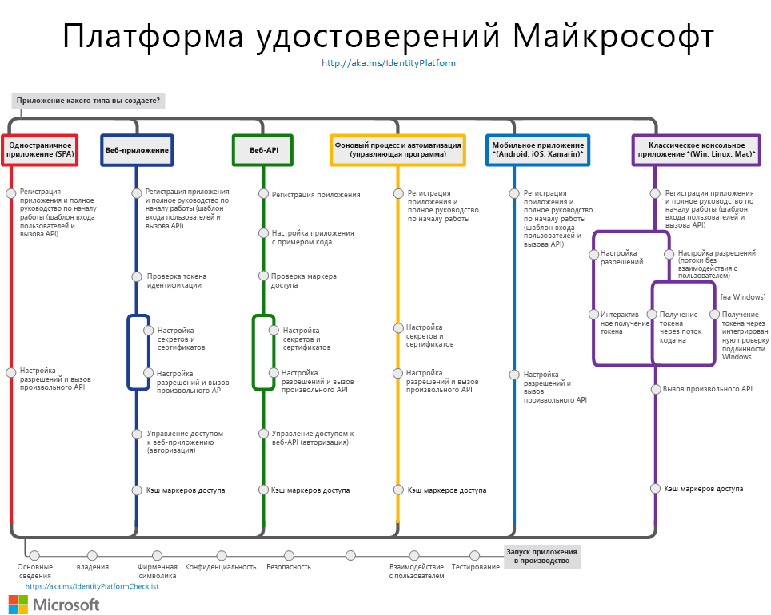

# Общие сведения о платформе удостоверений Майкрософт версии 2.0

Платформа удостоверений Майкрософт — это решение на основе платформы для разработчиков Azure Active Directory (Azure AD). С ее помощью разработчики могут создавать приложения, которые поддерживают вход с использованием любых удостоверений Майкрософт и получают маркеры для вызова таких программных API Майкрософт, как API Microsoft Graph или других API, созданных разработчиками. Платформа удостоверений Майкрософт состоит из нескольких компонентов:

- **Стандартные совместимые средства аутентификации OAuth 2.0 и OpenID Connect**. Они позволяют разработчикам аутентифицировать подлинность любого удостоверения Майкрософт, включая следующие:
  - рабочие или учебные учетные записи (подготовленные с помощью Azure AD);
  - личные учетные записи Майкрософт (например, Skype, Xbox и Outlook.com);
  - учетные записи социальных сетей и локальные учетные записи (Azure AD B2C).
- **Библиотеки с открытым кодом**. Это библиотеки аутентификации Майкрософт (MSAL) или любые другие библиотеки, соответствующие стандартам.
- **Портал управления приложениями**. Средства регистрации и настройки, предоставляемые порталом Azure наряду с другими возможностями управления Azure.
- **API настройки приложения и PowerShell**. Поддержка программной настройки приложений с помощью API Microsoft Graph и PowerShell для автоматизации задач DevOps.
- **Содержимое для разработчиков**. Обзорная и справочная документация, примеры для быстрого запуска, примеры кода, руководства и практические руководства.

Платформа удостоверений Microsoft поддерживает эффективную интеграцию в инновационные решения в сфере идентификации и безопасности, включая проверку подлинности без пароля, расширенную аутентификацию и условный доступ.  Вам не нужно самостоятельно реализовывать эти функции, так как приложения, интегрированные с платформой удостоверений Майкрософт, по умолчанию поддерживают такие возможности.

Благодаря платформе удостоверений Майкрософт вы можете написать код один раз и обеспечить взаимодействие с любым пользователем. Вы также можете создать приложение, которое будет работать на многих платформах, а также приложение, которое работает и как клиент, и как приложение ресурсов (API).

## Начало работы

Работа с удостоверениями не обязательно должна быть сложной. 

Просмотрите [видео по платформе удостоверений Майкрософт](identity-videos.md), чтобы ознакомиться с основными сведениями. 

Выберите подходящий [сценарий](authentication-flows-app-scenarios.md). Для каждого сценария предоставляются краткое руководство и обзорная страница, чтобы вы могли быстро начать работу:

- [Создание одностраничного приложения](scenario-spa-overview.md)
- [Создание веб-приложения, которое поддерживает вход пользователей](scenario-web-app-sign-user-overview.md)
- [Создание веб-приложения, которое вызывает веб-API](scenario-web-app-call-api-overview.md)
- [Создание защищенного веб-API](scenario-protected-web-api-overview.md)
- [Создание веб-API, который вызывает веб-API](scenario-web-api-call-api-overview.md)
- [Создание классического приложения](scenario-desktop-overview.md)
- [Создание управляющей программы](scenario-daemon-overview.md)
- [Создание мобильного приложения](scenario-mobile-overview.md)

На следующей схеме показаны распространенные сценарии аутентификации приложений. Вы можете использовать ее в качестве справочника при интеграции платформы удостоверений Майкрософт с вашим приложением.

## Дальнейшие действия

См. подробнее об основных понятиях, связанных с аутентификацией:

- [Потоки проверки подлинности и сценарии приложений](authentication-flows-app-scenarios.md)
- [Основные сведения об аутентификации](authentication-scenarios.md)
- [Приложения и субъекты-службы](app-objects-and-service-principals.md)
- [Аудитории](v2-supported-account-types.md)
- [Разрешения и согласие](v2-permissions-and-consent.md)
- [Маркеры доступа](id-tokens.md) и [маркеры идентификации](access-tokens.md)

Создайте приложение с большим объемом данных, которое вызывает [Microsoft Graph](https://docs.microsoft.com/graph/overview).

Когда все будет готово для запуска приложения в **рабочей среде**, рассмотрите следующие рекомендации:

- [Включите ведение журнала](msal-logging.md) в приложении.
- Включите телеметрию в приложении.
- Включите [прокси и настройте HTTP-клиенты](msal-net-provide-httpclient.md).
- Протестируйте интеграцию согласно [контрольному списку для интеграции платформы удостоверений Майкрософт](identity-platform-integration-checklist.md).

## Дополнительные сведения

Если вы планируете создать приложение для клиентов, которое поддерживает вход с использованием удостоверений социальных сетей и локальных удостоверений, см. [общие сведения об Azure AD B2C](https://docs.microsoft.com/azure/active-directory-b2c/tutorial-add-identity-providers).
