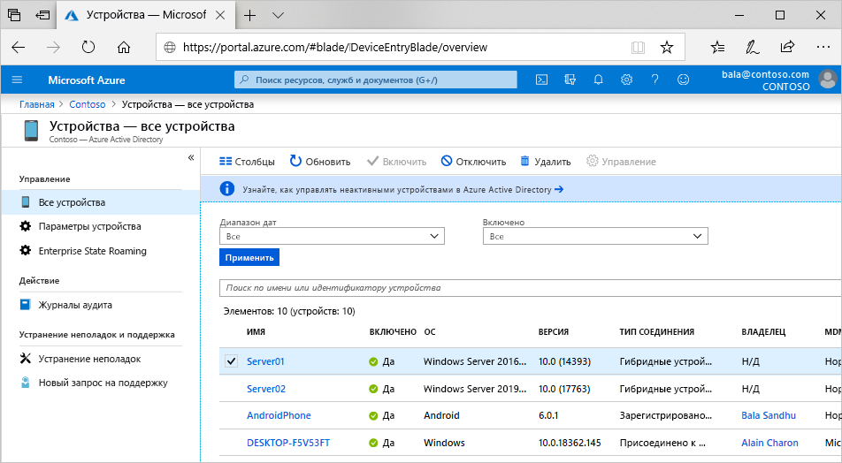

# Что такое удостоверение устройства?

В связи с увеличением количества устройств всех форматов и размеров и с внедрением концепции использования собственных устройств сотрудников (BYOD) ИТ-специалисты все чаще сталкиваются с двумя, в некоторой степени противоположными, задачами:

- позволять пользователям быть продуктивными в любом месте и в любое время;
- защищать ресурсы организации.

Чтобы защитить эти ресурсы, ИТ-персонал должен сначала начать управлять удостоверениями устройств. ИТ-специалисты могут использовать удостоверения устройства с помощью таких инструментов, как Microsoft Intune, чтобы обеспечить соблюдение стандартов безопасности и соответствовать нормативным требованиям. Azure Active Directory (Azure AD) обеспечивает единый вход на устройства, в приложения и службы откуда угодно через мобильные устройства.

- Ваши пользователи получают доступ к необходимым ресурсам организации. 
- Ваш ИТ-персонал получает элементы управления, необходимые для защиты организации.

Управление удостоверениями устройств лежит в основе [условного доступа на основе устройств](../conditional-access/require-managed-devices.md). Используя политику условного доступа на основе устройств, можно разрешать доступ к ресурсам в своей среде только управляемым устройствам.

## Добавление устройств в Azure AD

Существуют несколько вариантов добавления устройства в Azure AD.

- **Регистрация в Azure AD**
   - Устройства, зарегистрированные в Azure AD, обычно являются личными или мобильными устройствами, и для входа на них используется личная учетная запись Майкрософт или другая локальная учетная запись.
      - Windows 10
      - iOS
      - Android
      - MacOS
- **Присоединение к Azure AD**
   - Устройства, которые присоединены к Azure AD, принадлежат организации и входят в систему с учетной записью Azure AD, принадлежащей той же организации. Они существуют только в облаке.
      - Windows 10 
      - [Виртуальные машины Windows Server 2019, работающие в Azure] (./howto-vm-sign-in-azure-ad-windows.md) (Server Core не поддерживается)
- **присоединен к гибридному Azure AD**.
   - Устройства, которые присоединены к Azure AD с помощью гибридного присоединения, принадлежат организации и входят в систему с учетной записью Azure AD, принадлежащей той же организации. Они существуют в облаке и в локальной среде.
      - Windows 7, 8.1 или 10
      - Windows Server 2008 или более поздней версии

> [!NOTE]
> Гибридное состояние — это не просто состояние устройства. Чтобы гибридное состояние было допустимым, также требуется действительный пользователь Azure AD.

## Управление устройствами

Управлять устройствами в Azure AD можно с помощью инструментов управления мобильными устройствами (MDM), например Microsoft Intune, Microsoft Endpoint Configuration Manager, групповой политики (гибридное присоединения устройств к Azure AD), инструментов управления мобильными приложениями (MAM) или других сторонних инструментов.

## Доступ к ресурсам

Регистрация и присоединение устройств к Azure AD позволяет пользователям легко выполнять вход в облачные ресурсы. Этот процесс также позволяет администраторам применять политики условного доступа к ресурсам на основе устройства, с которого к ним осуществляется доступ. 

> [!NOTE]
> Для использования политик условного доступа на основе устройств требуются гибридные устройства, присоединенные к Azure AD, соответствующие устройства, присоединенные к Azure AD, или устройства, зарегистрированные в Azure AD.

Основной токен обновления содержит сведения об устройстве и является обязательным для единого входа. Если для приложения задана политика условного доступа на основе устройств без основного токена обновления, доступ запрещается. Для гибридных политик условного доступа требуется устройство с гибридным состоянием и действительный пользователь, выполнивший вход.

Устройства с присоединением к Azure AD или с гибридным присоединением к Azure AD получают преимущества от эффективного единого входа для локальных ресурсов вашей организации, а также для облачных ресурсов. Дополнительные сведения см. статье [Как работает единый вход с локальными ресурсами на присоединенных к Azure AD устройствах ](azuread-join-sso.md).

## Безопасность устройств

- **На зарегистрированных в Azure AD устройствах** используется учетная запись, управляемая пользователем. Эта учетная запись является либо учетной записью Майкрософт, либо другой учетной записью, управляемой локально, защищенной с помощью одного или нескольких из следующих вариантов.
   - Пароль
   - Пин-код
   - Модель
   - Windows Hello
- **Присоединенные к Azure AD или присоединенные к Azure AD с помощью гибридного присоединения устройства** используют учетную запись организации в Azure AD, защищенную одним или несколькими из следующих вариантов.
   - Пароль
   - Windows Hello для бизнеса

## Подготовка

Подготовка устройств в Azure AD может быть выполнена в режиме самообслуживания или в процессе подготовки под контролем администратора.

## Сводка

Управление удостоверениями устройств в Azure AD позволяет:

- упростить процесс добавления устройств в Azure AD и управления ими;
- предоставить пользователям простой доступ к облачным ресурсам организации.

## Требования лицензий

[!INCLUDE [Active Directory P1 license](../../../includes/active-directory-p1-license.md)]

## Дальнейшие действия

- Подробнее о [зарегистрированных устройствах в Azure AD](concept-azure-ad-register.md)
- Подробнее о [присоединенных к Azure AD устройствах](concept-azure-ad-join.md)
- Подробнее о[присоединенных к Azure AD с помощью гибридного присоединения устройствах](concept-azure-ad-join-hybrid.md)
- Чтобы получить общие сведения о том, как управлять удостоверениями устройств на портале Azure, ознакомьтесь с разделом [Как управлять устройствами с помощью портала Azure](device-management-azure-portal.md).
- См. сведения о [настройке требования использовать только управляемые устройства для доступа к облачным приложениям с помощью условного доступа](../conditional-access/require-managed-devices.md).
