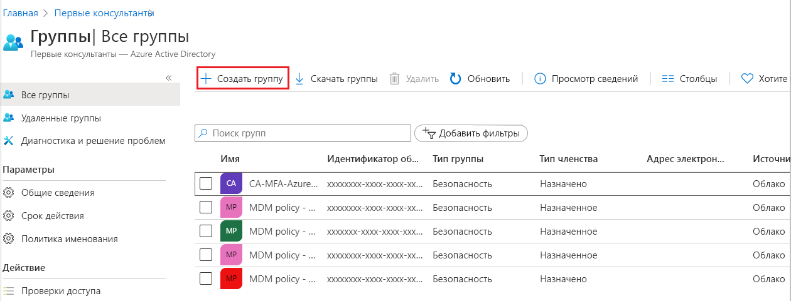

# Создание простой группы и добавление в нее участников с помощью Azure Active Directory
Можно создать простую группу с помощью портала Azure Active Directory (Azure AD). В целях этой статьи простая группа добавляется для отдельного ресурса владельцем этого ресурса (администратором) и включает в себя конкретных участников (сотрудников), которым требуется доступ к этому ресурсу. Более сложные сценарии, включая динамическое членство и создание правил, описываются в [документации по управлению пользователями Azure Active Directory](../users-groups-roles/index.yml).

## Типы групп и членства
Существует несколько типов групп и членства. Ниже приведены сведения о каждом типе группы и членства и их использовании, чтобы помочь вам решить, какие параметры следует использовать при создании группы.

### Типы групп:
- **Безопасность**. Используется для управления доступом участников и компьютеров к общим ресурсам группы пользователей. Например, можно создать группу безопасности для определенной политики безопасности. Поступив так, можно сразу предоставить набор разрешений всем участникам, а не добавлять эти разрешения каждому участнику по отдельности. Участниками группы безопасности могут быть пользователи, группы и субъекты-служб, а ее владельцами — пользователи и субъекты-служб. Дополнительные сведения об управлении доступом к ресурсам см. в разделе [Управление доступом к ресурсам с помощью групп Azure Active Directory](active-directory-manage-groups.md).
- **Microsoft 365**. Обеспечивает возможности совместной работы, предоставляя участникам доступ к общему почтовому ящику, календарю, файлам, сайту SharePoint и многое другое. Этот параметр также позволяет предоставить доступ к группе пользователям за пределами вашей организации. Группа Microsoft 365 может иметь только пользователей в качестве своих членов. Как пользователи, так и субъекты-службы могут быть владельцами группы Microsoft 365. Дополнительные сведения о группах Office 365 см. в [статье сведения о группах Microsoft 365](https://support.office.com/article/learn-about-office-365-groups-b565caa1-5c40-40ef-9915-60fdb2d97fa2).

### Тип членства:
- **Назначенный**. Позволяет добавить конкретных пользователей в эту группу и предоставить им уникальные разрешения. В целях этой статьи мы используем этот параметр.
- **Динамический пользователь**. Позволяет использовать правила динамического членства для автоматического добавления и удаления участников. Если атрибуты участника изменяются, система сверяется с правилами динамической группы для каталога, чтобы определить, соответствует ли этот участник требованиям правил (он добавляется) или больше не соответствует им (он удаляется).
- **Динамическое устройство**. Позволяет использовать правила динамической группы для автоматического добавления и удаления устройств. Если атрибуты устройства изменяются, система сверяется с правилами динамической группы для каталога, чтобы определить, соответствует ли это устройство требованиям правил (он добавляется) или больше не соответствует им (он удаляется).

    > [!IMPORTANT]
    > Можно создать динамическую группу для устройств или пользователей, но не для устройств и пользователей одновременно. Кроме того, вы не можете создать группу устройств на основе атрибутов их владельцев. Правила членства для устройств могут ссылаться только на атрибуты этих устройств. Дополнительные сведения о создании динамической группы для пользователей и устройств см. в разделе [Создание динамической группы и проверка состояния](../users-groups-roles/groups-create-rule.md)

## Создание простой группы и добавление участников
Можно создать простую группу и сразу добавить в нее участников. Для создания базовой группы и добавления членов используйте следующую процедуру:

1. Войдите на [портал Azure](https://portal.azure.com) с учетной записью глобального администратора каталога.

1. Найдите и выберите **Azure Active Directory**.

1. На странице **Active Directory** выберите **Группы**, а затем **Создать группу**.

    

1. Откроется область **Новая группа**, где необходимо указать обязательные сведения.

    

1. Выберите стандартный **тип группы**. Дополнительные сведения о типах групп см. в разделе [Типы групп и членства](#group-types).

1. Создайте и добавьте **имя группы**. Выберите осмысленное имя группы, которое легко запомнить. Начнется процесс проверки для определения того, используется ли имя для другой группы. Если имя уже используется, то во избежание повторяющихся имен вам будет предложено изменить имя своей группы.

1. Добавьте **адрес электронной почты группы** или оставьте автоматически введенный адрес электронной почты.

1. **Описание группы**. Добавьте дополнительное описание группы.

1. Выберите стандартный **Тип членства (обязательно)** . Дополнительные сведения о типах членства см. в разделе [Типы групп и членства](#membership-types).

1. Нажмите кнопку **создания**. Ваша группа создана и готова для добавления участников.

1. Выберите область **Члены** на странице **Группа**, а затем начните поиск участников для добавления в группу на странице **Выбрать участников**.

    

1. Добавив участников, щелкните **Выбрать**.

    Страница **Общие сведения о группе** обновится, чтобы отобразить количество участников, добавленных в группу.

    

## Отключение отправки приветственного сообщения электронной почты для группы

При создании любой новой группы Microsoft 365 независимо от того, включено ли динамическое или статическое членство, уведомление будет отправлено всем пользователям, добавленным в группу. Если изменяются любые атрибуты пользователя или устройства, все правила динамических групп в организации обрабатываются на предмет возможных изменений членства. После этого добавляемым пользователям также отправляются приветственные уведомления. Такое поведение можно отключить в [Exchange PowerShell](https://docs.microsoft.com/powershell/module/exchange/users-and-groups/Set-UnifiedGroup?view=exchange-ps). 

## Дальнейшие действия

- [Управление доступом к приложениям SaaS с помощью групп](../users-groups-roles/groups-saasapps.md)
- [Управление группами с помощью команд PowerShell](../users-groups-roles/groups-settings-v2-cmdlets.md)

