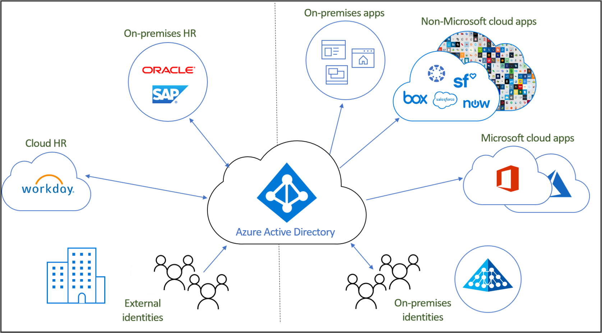

# Что такое управление жизненным циклом удостоверений?

Служба Identity Governance помогает организациям найти нужный баланс между показателями производительности (скорость, с которой сотрудник получает доступ к нужным ресурсам, например при начале работы в организации) и безопасности (динамика изменения уровня доступа со временем, например при изменении роли пользователя в организации).

**Управление жизненным циклом удостоверений**  — базовый процесс службы Identity Governance. Чтобы обеспечить эффективность управления в масштабе всей организации, необходимо модернизировать инфраструктуру управления жизненным циклом удостоверений для приложений. Управление жизненным циклом удостоверений предназначено для автоматизации и управления всем процессом жизненного цикла цифровых удостоверений. 

## Что такое цифровое удостоверение?

Цифровое удостоверение — это информация о сущности, используемой одним или несколькими вычислительными ресурсами, такими как операционные системы или приложения. Эти сущности могут представлять людей, организации, приложения или устройства.  Удостоверение обычно описывается с помощью связанных с ним атрибутов, таких как имя, идентификаторы, а также такими свойствами, как роли, используемые для управления доступом.  Эти атрибуты помогают системам определить, кто имеет доступ к чему-то или кто может использовать ту или иную систему.  

## Управление жизненным циклом цифровых удостоверений

Управление цифровыми удостоверениями является сложной задачей, особенно если оно связывает соответствующие реальные объекты, такие как человек и его причастность к организации в качестве сотрудника, с цифровым представлением.    В небольших организациях цифровое представление лиц, которым требуется удостоверение, может быть ручным процессом. При приеме сотрудника или прибытии подрядчика ИТ-специалист может создать для них учетную запись в каталоге и назначить необходимый им доступ.  Однако в средних и крупных организациях автоматизация может обеспечить более эффективное масштабирование организации и точность удостоверений.

Типичный процесс настройки управления жизненным циклом удостоверений в организации выполняется следующим образом:

1. Определите, существуют ли уже системы записи: источники данных, которые организация считает надежными.  Например, организация может иметь систему управления персоналом Workday, которая будет полномочной предоставлять текущий список сотрудников и некоторые их характеристики, такие как имя или отдел сотрудника.  Или систему адресов электронной почты, например, Exchange Online, которая будет полномочной для предоставления адреса электронной почты сотрудника.

2. Подключите эти системы записи с помощью одного или нескольких каталогов и баз данных, используемых приложениями, и устраните все несоответствия между каталогами и системами записи. Например, каталог может иметь устаревшие данные, такие как учетная запись уволенного сотрудника, которые больше не нужны. 

3. Определите, какие процессы можно использовать для предоставления достоверных сведений при отсутствии системы записи.  Например, если цифровые удостоверения есть, но они гостевые, а в организации нет базы данных для гостевых пользователей, возможно, потребуется найти альтернативный способ определения, когда цифровая идентификация гостевых пользователей не нужна.

4. Настройте системы так, чтобы изменения из системы записи или других процессов дублировались в каждый из каталогов или в каждую из баз данных, требующих обновления.

## Управление жизненным циклом удостоверений для представления сотрудников и других лиц, имеющих отношение к организации

При планировании управления жизненным циклом удостоверений для сотрудников или других лиц, имеющих отношение к организации, например подрядчика или учащегося, многие организации моделируют процесс "присоединение, перемещение и выход".  Эти особые значения приведены ниже.
    
   - Присоединение. Когда пользователь перейдет в область, для которой необходим доступ, для приложений потребуется удостоверение. Поэтому вам может понадобиться создать новое цифровое удостоверение, если оно еще не создано.
   - Перемещение. Когда пользователь перемещается между областями, которые требуют добавления дополнительных авторизаций прав доступа для цифрового удостоверения или их удаления.
   - Выход. Когда пользователь покидает область, к которой ему был необходим доступ, возможно, будет нужно удалить доступ. Впоследствии приложениям будет нужно удостоверение только для аудита или экспертизы.

Например, если к вашей организации присоединяется сотрудник, который ранее не был связан с ней, для него понадобится создать цифровое удостоверение, представленное в качестве учетной записи пользователя в Azure AD.  Создание этой учетной записи произойдет в процессе "Присоединение", который можно автоматизировать при наличии системы записи, например Workday, которая может указать время начала работы нового сотрудника.  Если позже сотрудник вашей организации будет переходить, скажем, из отдела продаж в отдел маркетинга, он попадет под процесс "Перемещение".  Для этого потребуется удалить ненужные права доступа, которые сотрудник имеет в отделе продаж организации, и предоставить ему права в отделе маркетинга.

## Управление жизненным циклом удостоверений для гостей

Аналогичные процессы также необходимы для гостей и других пользователей.  Управление правами Azure AD использует Совместную работу B2B Azure AD для предоставления средств контроля жизненного цикла, необходимых для совместной работы с пользователями за пределами организации, которым нужен доступ к ресурсам организации. С помощью Azure AD B2B внешние пользователи проходят проверку подлинности в своем домашнем каталоге, однако их представление также появляется и в вашем каталоге. Представление в каталоге позволяет назначать пользователю доступ к ресурсам.  Управление правами позволяет сотрудникам за пределами вашей организации запрашивать доступ, создавая при необходимости цифровые удостоверения. Эти цифровые удостоверения автоматически удаляются, когда пользователь теряет доступ.  

## Как Azure AD автоматизирует управление жизненным циклом удостоверений?

В настоящее время Azure AD предоставляет следующие возможности:

* Пользователи, представляющие сотрудников, могут автоматически создаваться и обновляться в Azure AD и Active Directory с помощью [подготовки на основе управления персоналом](what-is-hr-driven-provisioning.md)
* Пользователи, уже существующие в Active Directory, могут автоматически создаваться и поддерживаться в Azure AD с помощью [подготовки между каталогами](what-is-inter-directory-provisioning.md)
* Пользователи могут автоматически назначаться группам, в зависимости от их свойств, используя [динамические группы](../external-identities/use-dynamic-groups.md#what-are-dynamic-groups), а также назначаться по запросу группам, Teams, ролям Azure AD, ролям ресурсов Azure и сайтам SharePoint Online, используя [управление правами](entitlement-management-scenarios.md) и [управление привилегированными пользователями](../privileged-identity-management/pim-configure.md)
* Обновления для пользователей могут автоматически отправляться в другие приложения с помощью [подготовки приложений](what-is-app-provisioning.md)

## Дальнейшие действия 

- [Что собой представляет подготовка?](what-is-provisioning.md)
- [Управление доступом для внешних пользователей в управлении правами Azure AD](/azure/active-directory/governance/entitlement-management-external-users.md)
- [Что такое подготовка на основе управления персоналом?](what-is-hr-driven-provisioning.md)
- [Что такое подготовка приложений?](what-is-app-provisioning.md)
- [Что такое подготовка между каталогами?](what-is-inter-directory-provisioning.md)
