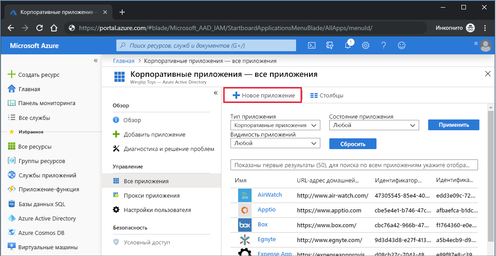
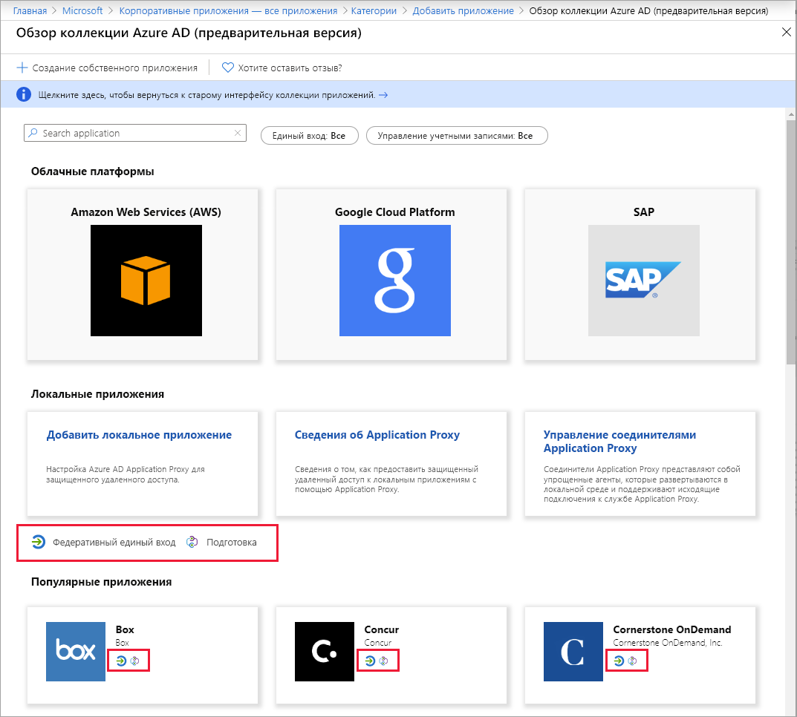
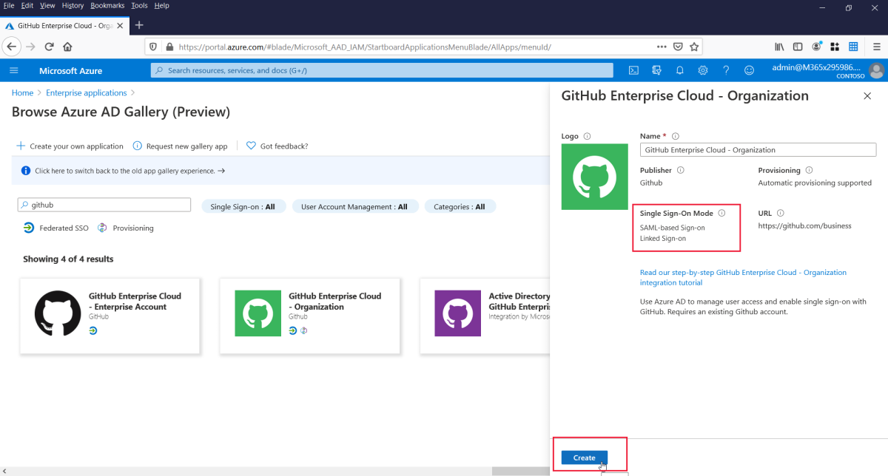
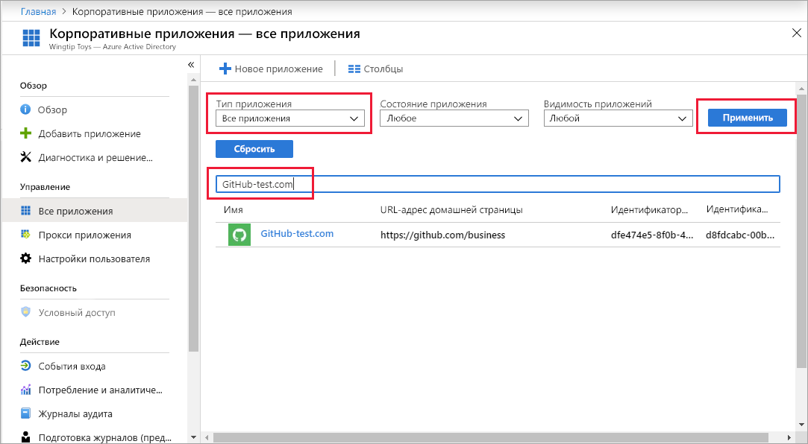
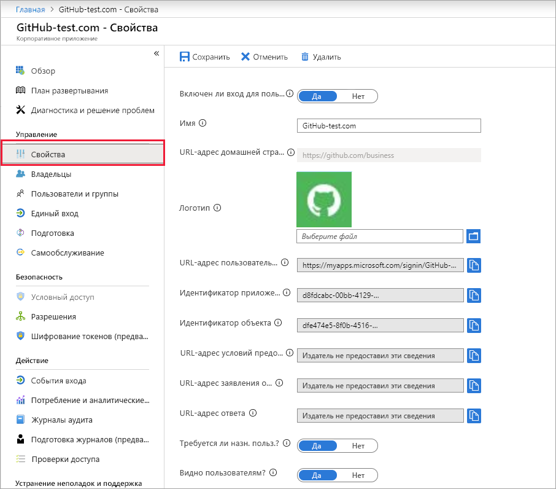

# Краткое руководство. Добавление приложения в клиент Azure Active Directory

Azure Active Directory (Azure AD) имеет галерею, содержащую тысячи предварительно интегрированных приложений. Некоторые приложения, которые используются вашей организацией, вероятно, находятся в коллекции. В этом кратком руководстве используется портал Azure для добавления приложения коллекции в клиент Azure Active Directory (Azure AD).

После добавления приложения в клиент Azure AD вы получите следующие возможности.

- Управлять доступом пользователей к приложению с помощью политики условного доступа.
- Настраивать единый вход в приложение для пользователей со своими учетными записями Azure AD.

## Перед началом работы

Чтобы добавить приложение в клиент, потребуется:

- подписка Azure AD;
- подписка с поддержкой единого входа для приложения.

Войдите на [портал Azure](https://portal.azure.com) в клиент Azure AD в качестве глобального администратора, администратора облачных приложений или администратора приложения.

Рекомендуется использовать нерабочую среду для проверки шагов в этом учебнике. Если у вас нет нерабочей среды Azure AD, можно [получить пробную версию на один месяц](https://azure.microsoft.com/pricing/free-trial/).

## Добавление приложения в клиент Azure AD

Чтобы добавить приложение коллекции в клиент Azure AD, выполните следующие действия.

1. На [портале Azure](https://portal.azure.com) в области навигации слева выберите **Azure Active Directory**.

2. В области **Azure Active Directory** выберите **Корпоративные приложения**. Откроется панель **Все приложения** с отображением случайной выборки из приложений в клиенте Azure AD.

3. Чтобы добавить приложение из коллекции в клиент, щелкните **Новое приложение**. 

    

 4. Переключитесь на новый интерфейс коллекции (предварительная версия): На баннере вверху страницы **Добавление приложения** перейдите по ссылке **Щелкните здесь, чтобы оценить новую улучшенную коллекцию приложений**.

5. Откроется область **Обзор коллекции Azure AD (предварительная версия)** , в котором отображаются плитки для облачных платформ, локальных приложений и популярных приложений. Обратите внимание, что приложения, перечисленные в разделе **Популярные приложения**, имеют значки, указывающие на наличие поддержки федеративного единого входа (SSO) и подготовки.

    

6. Чтобы добавить приложение, найдите его в коллекции или введите его имя в поле поиска. Затем выберите приложение в результатах поиска. В форме можно изменить имя приложения в соответствии с потребностями организации. В этом примере мы изменили имя на **GitHub-test**.

    

7. Нажмите кнопку **Создать**. На странице "Начало работы" отображаются параметры для настройки приложения организации.

Приложение добавлено. В следующих разделах показано, как изменить логотип и другие свойства приложения.

## Поиск клиента приложения Azure AD

Предположим, вам пришлось уйти, и теперь вы возвращаетесь, чтобы продолжить настройку своего приложения. Сначала нужно найти это приложение.

1. На **[портале Azure](https://portal.azure.com)** в области навигации слева выберите **Azure Active Directory**.
1. В области **Azure Active Directory** выберите **Корпоративные приложения**.
1. В раскрывающемся меню **Тип приложения** выберите **Все приложения** и щелкните **Применить**. Дополнительные сведения о параметрах просмотра см. в разделе [Просмотр всех корпоративных приложений, которыми вы можете управлять в Azure Active Directory](view-applications-portal.md).
1. Теперь видно список всех приложений в клиенте Azure AD. Список представляет собой случайную выборку. Чтобы просмотреть дополнительные приложения, щелкните элемент **Показать больше** один или несколько раз.
1. Чтобы быстро найти приложение в клиенте, в поле поиска введите имя приложения и выберите **Применить**. Этот пример находит тестовое приложение GitHub, которое было добавлено ранее.

    

## Настройка свойства входа пользователя

Теперь, когда приложение найдено, можно открыть и настроить его свойства.

Чтобы изменить свойства приложения, выполните следующие действия:

1. Выберите приложение, чтобы открыть его.
2. Выберите **Свойства**, чтобы открыть панель "Свойства" для редактирования.

    

3. Выделите минуту времени, чтобы разобраться в параметрах входа. Параметры определяют, как пользователи, которые назначены (или не назначены) приложению, могут входить в приложение. Они также определяют, может ли пользователь видеть приложение на панели доступа.

    - Параметр **Включено для входа пользователя?** определяет, могут ли пользователи, назначенные приложению, выполнять вход в приложение.
    - Параметр **Требуется назначение пользователей?** определяет, могут ли пользователи, не назначенные приложению, выполнять вход.
    - Параметр **Видно пользователям?** определяет, могут ли пользователи, назначенные приложению, видеть его на панели доступа и в средстве запуска O365.

4. Используйте следующие таблицы, чтобы выбрать параметры, которые лучше всего подходят для ваших потребностей.

   - Поведение **назначенных** пользователей.

       | Параметры свойств приложения | | | Взаимодействие с назначенным пользователем | |
       |---|---|---|---|---|
       | Включено для входа пользователей? | Требуется назначение пользователя? | Видимый для пользователей? | Могут ли назначенные пользователи войти? | Могут ли назначенные пользователи видеть приложение?* |
       | Да | Да | Да | Да | Да  |
       | Да | Да | Нет  | Да | Нет   |
       | Да | Нет  | Да | Да | Да  |
       | Да | Нет  | Нет  | Да | Нет   |
       | Нет  | Да | Да | Нет  | Нет   |
       | Нет  | Да | Нет  | Нет  | Нет   |
       | Нет  | Нет  | Да | Нет  | Нет   |
       | Нет  | Нет  | Нет  | Нет  | Нет   |

   - Поведение **неназначенных** пользователей.

       | Параметры свойств приложения | | | Взаимодействие с неназначенным пользователем | |
       |---|---|---|---|---|
       | Включено для входа пользователей? | Требуется назначение пользователя? | Видимый для пользователей? | Могут ли неназначенные пользователи войти? | Могут ли неназначенные пользователи видеть приложение?* |
       | Да | Да | Да | Нет  | Нет   |
       | Да | Да | Нет  | Нет  | Нет   |
       | Да | Нет  | Да | Да | Нет   |
       | Да | Нет  | Нет  | Да | Нет   |
       | Нет  | Да | Да | Нет  | Нет   |
       | Нет  | Да | Нет  | Нет  | Нет   |
       | Нет  | Нет  | Да | Нет  | Нет   |
       | Нет  | Нет  | Нет  | Нет  | Нет   |

     \* Может ли пользователь видеть приложение на панели доступа и средство запуска приложений Office 365?

## Использование пользовательского логотипа

Чтобы использовать пользовательский логотип, выполните следующие действия.

1. Создайте логотип размером 215 на 215 пикселей и сохраните его в формате PNG.
1. Так как приложение уже найдено, выберите его.
1. На левой панели выберите **Свойства**.
1. Загрузите логотип.
1. По завершении нажмите кнопку **Сохранить**. 

    

   > [!NOTE]
   > Эскиз, отображаемый в этой области **Свойства**, не обновляется сразу. Можно закрыть и снова открыть свойства, чтобы увидеть обновленный значок.

## Дополнительная информация

После добавления приложения в организацию Azure AD [выберите метод единого входа](what-is-single-sign-on.md#choosing-a-single-sign-on-method), который вы хотите использовать, и обратитесь к соответствующей статье ниже:

- [Настройка единого входа на основе SAML](configure-single-sign-on-non-gallery-applications.md)
- [Настройка пароля единого входа](configure-password-single-sign-on-non-gallery-applications.md)
- [Настройка связанного единого входа](configure-linked-sign-on.md)
