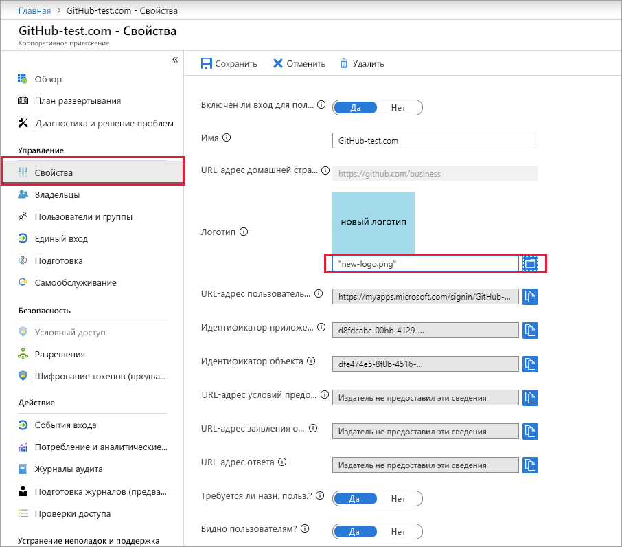

# Добавление приложения из коллекции в организацию Azure AD

Azure Active Directory (Azure AD) имеет галерею, содержащую тысячи предварительно интегрированных приложений с включенной функцией корпоративного единого входа. В этой статье описываются основные действия для добавления приложения из коллекции в организацию Azure AD.

> [!IMPORTANT]
> Сначала проверьте свое приложение в [списке учебников по интеграции приложений SaaS с Azure Active Directory](https://azure.microsoft.com/documentation/articles/active-directory-saas-tutorial-list/). Скорее всего, вы найдете пошаговое руководство для добавления и настройки приложения коллекции, которое вы хотите добавить.

## Добавление приложения из коллекции

1. Войдите на [портал Azure](https://portal.azure.com) в клиент Azure AD в качестве глобального администратора, администратора облачных приложений или администратора приложения.

1. На [портале Azure](https://portal.azure.com) в области навигации слева выберите **Azure Active Directory**.

1. В области **Azure Active Directory** выберите **Корпоративные приложения**.

    

1. Выберите **Новое приложение**.

    

1. В разделе **Добавление из коллекции**, поле поиска введите имя приложения, которое необходимо добавить. 

    

1. Выберите приложение из результатов поиска.

1. (Дополнительно) В форме конкретного приложения можно изменить имя приложения в соответствии с потребностями организации.

1. Выберите **Добавить**. Откроется страница приложения **Общие сведения**.

## Настройка свойства входа пользователя

1. Выберите **Свойства**, чтобы открыть панель "Свойства" для редактирования.

    

1. Задайте следующие параметры, чтобы определить, как назначенные или не назначенные приложению пользователи могут выполнять вход в приложение, а пользователь — видеть приложение на панели доступа.

    - Параметр **Включено для входа пользователя** определяет, могут ли пользователи, назначенные приложению, выполнять вход в приложение.
    - Параметр **Требуется назначение пользователей** определяет, могут ли пользователи, не назначенные приложению, выполнять вход.
    - Параметр **Видимый пользователю** определяет, могут ли пользователи, назначенные приложению, видеть его на панели доступа и в средстве запуска O365.

      Поведение **назначенных** пользователей.

       | Параметры свойств приложения | | | Взаимодействие с назначенным пользователем | |
       |---|---|---|---|---|
       | Включено для входа пользователей? | Требуется назначение пользователя? | Видимый для пользователей? | Могут ли назначенные пользователи войти? | Могут ли назначенные пользователи видеть приложение?* |
       | Да | Да | Да | Да | Да  |
       | Да | Да | Нет  | Да | Нет   |
       | Да | Нет  | Да | Да | Да  |
       | Да | Нет  | Нет  | Да | Нет   |
       | Нет  | Да | Да | Нет  | Нет   |
       | Нет  | Да | Нет  | Нет  | Нет   |
       | Нет  | Нет  | Да | Нет  | Нет   |
       | Нет  | Нет  | Нет  | Нет  | Нет   |

      Поведение **неназначенных** пользователей.

       | Параметры свойств приложения | | | Взаимодействие с неназначенным пользователем | |
       |---|---|---|---|---|
       | Включено для входа пользователей? | Требуется назначение пользователя? | Видимый для пользователей? | Могут ли неназначенные пользователи войти? | Могут ли неназначенные пользователи видеть приложение?* |
       | Да | Да | Да | Нет  | Нет   |
       | Да | Да | Нет  | Нет  | Нет   |
       | Да | Нет  | Да | Да | Нет   |
       | Да | Нет  | Нет  | Да | Нет   |
       | Нет  | Да | Да | Нет  | Нет   |
       | Нет  | Да | Нет  | Нет  | Нет   |
       | Нет  | Нет  | Да | Нет  | Нет   |
       | Нет  | Нет  | Нет  | Нет  | Нет   |

     \* Может ли пользователь видеть приложение на панели доступа и средство запуска приложений Office 365?

1. Чтобы использовать пользовательский логотип, создайте логотип размером 215 на 215 пикселей и сохраните его в формате PNG. Затем перейдите к логотипу и отправьте его.

    

1. По завершении нажмите кнопку **Сохранить**.

## Дополнительная информация

После добавления приложения в организацию Azure AD [выберите метод единого входа](what-is-single-sign-on.md#choosing-a-single-sign-on-method), который вы хотите использовать, и обратитесь к соответствующей статье ниже:

- [Настройка единого входа на основе SAML](configure-single-sign-on-non-gallery-applications.md)
- [Настройка пароля единого входа](configure-password-single-sign-on-non-gallery-applications.md)
- [Настройка связанного единого входа](configure-linked-sign-on.md)

