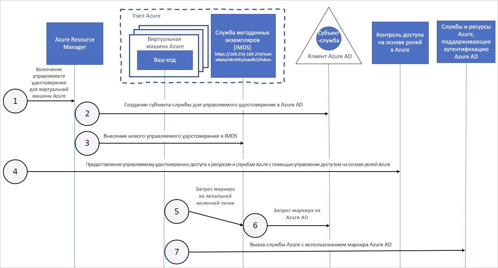

# Как управляемые удостоверения для ресурсов Azure работают с виртуальными машинами Azure

Функция управляемых удостоверений для ресурсов Azure предоставляет службам Azure автоматически управляемые удостоверения в Azure Active Directory. Это удостоверение можно использовать для аутентификации в любой службе, которая поддерживает аутентификацию Azure AD, не храня какие-либо учетные данные в коде.

В этой статье показано, как управляемые удостоверения работают с виртуальными машинами Azure.

## Принцип работы

На внутреннем уровне управляемые удостоверения — это субъекты-службы особого типа, которые можно использовать только с ресурсами Azure. При удалении управляемого удостоверения соответствующий субъект-служба автоматически удаляется.
Кроме того, при создании удостоверения, назначаемого пользователем или системой, для него поставщик ресурсов управляемых удостоверений (MSRP) на внутреннем уровне выдает сертификат. 

Затем ваш код может использовать управляемое удостоверение для запроса на получение маркеров доступа для служб, которые поддерживают аутентификацию Azure AD. Azure выполняет развертывание учетных данных, используемых экземпляром службы. 

Работа управляемых удостоверений служб с виртуальными машинами Azure показана на следующей схеме.

|  Свойство    | Управляемое удостоверение, назначаемое системой | Управляемое удостоверение, назначаемое пользователем |
|------|----------------------------------|--------------------------------|
| Создание |  Создано как часть ресурса Azure (например, виртуальная машина Azure или Служба приложений Azure). | Создано в качестве автономного ресурса Azure. |
| Жизненный цикл | Жизненный цикл в общем доступе с ресурсом Azure, указанным при создании управляемого удостоверения.   При удалении родительского ресурса управляемое удостоверение также удаляется. | Независимый жизненный цикл.   Должен быть явно удален. |
| Совместное использование ресурсов Azure | Невозможно настроить общий доступ.   Может быть связано только с одним ресурсом Azure. | Может быть в общем доступе.   Одно и то же назначаемое пользователем управляемое удостоверение может быть связано с несколькими ресурсами Azure. |
| Распространенные варианты использования | Рабочие нагрузки, которые содержатся в одном ресурсе Azure.   Рабочие нагрузки, для которых требуются независимые удостоверения.   Например, приложение, выполняющееся на одной виртуальной машине. | Рабочие нагрузки, которые выполняются на нескольких ресурсах и могут совместно использовать одно удостоверение.   Рабочие нагрузки, требующие предварительную авторизацию к защищенному ресурсу, как часть потока подготовки.   Рабочие нагрузки, где ресурсы перезапускаются часто, но разрешения должны быть согласованными.   Например, рабочая нагрузка, где нескольким виртуальным машинам требуется доступ к одному и тому же ресурсу. |

## Управляемое удостоверение, назначаемое системой

1. Azure Resource Manager получает запрос на включение назначаемого системой управляемого удостоверения MSI в виртуальной машине.

2. Azure Resource Manager создает субъект-службу в Azure AD для удостоверения виртуальной машины. В клиенте Azure AD, который является доверенным для этой подписки, создается субъект-служба.

3. Azure Resource Manager настраивает идентификатор в виртуальной машине, обновляя конечную точку удостоверения Службы метаданных экземпляров Azure с помощью идентификатора клиента и сертификата субъекта-службы.

4. После того как виртуальной машине было назначено удостоверение, для предоставления доступа виртуальной машины к ресурсам Azure используются сведения о субъекте-службе. Чтобы вызвать Azure Resource Manager, используйте управление доступом на основе ролей Azure (Azure RBAC), чтобы назначить соответствующую роль субъекту-службе виртуальной машины. Для вызова Key Vault следует предоставить доступ к определенному секрету или ключу в Key Vault.

5. Код, выполняющийся на виртуальной машине, может запросить маркер из конечной точки службы метаданных экземпляров Azure, доступной только на виртуальной машине: `http://169.254.169.254/metadata/identity/oauth2/token`
    - Параметр ресурса указывает службу, в которую отправляется маркер. Для проверки подлинности в Azure Resource Manager необходимо использовать `resource=https://management.azure.com/`.
    - Параметр версии API указывает версию IMDS. Используйте api-version=2018-02-01 или более позднюю версию.

6. В Azure AD выполняется вызов для запроса маркера доступа (как указано в шаге 5) с использованием идентификатора клиента и сертификата, настроенных на шаге 3. Azure AD возвращает маркер доступа JSON Web Token (JWT).

7. Код отправляет этот маркер доступа при вызове службы, которая поддерживает аутентификацию Azure AD.

## Управляемое удостоверение, назначаемое пользователем

1. Azure Resource Manager получает запрос на создание назначаемого пользователем управляемого удостоверения.

2. Azure Resource Manager создает субъект-службу в Azure AD для назначаемого пользователем управляемого удостоверения. В клиенте Azure AD, который является доверенным для этой подписки, создается субъект-служба.

3. Azure Resource Manager получает запрос на настройку назначаемого пользователем управляемого удостоверения на виртуальной машине и обновляет конечную точку удостоверения Службы метаданных экземпляра Azure, используя назначенный пользователем идентификатор клиента и сертификат субъекта-службы управляемого удостоверения.

4. Создав назначаемое пользователем управляемое удостоверение, примените сведения о субъекте-службе, чтобы предоставить этому удостоверению доступ к ресурсам Azure. Чтобы вызвать Azure Resource Manager, используйте Azure RBAC, чтобы назначить соответствующую роль субъекту-службе для назначенного пользователю удостоверения. Для вызова Key Vault следует предоставить доступ к определенному секрету или ключу в Key Vault.

   > [!Note]
   > Также данное действие можно выполнить перед шагом 3.

5. Код, выполняющийся на виртуальной машине, может запросить маркер из конечной точки Службы метаданных экземпляров Azure, доступной только на виртуальной машине: `http://169.254.169.254/metadata/identity/oauth2/token`
    - Параметр ресурса указывает службу, в которую отправляется маркер. Для проверки подлинности в Azure Resource Manager необходимо использовать `resource=https://management.azure.com/`.
    - Параметр идентификатора клиента определяет удостоверение, для которого запрашивается маркер. Это значение необходимо для устранения неоднозначности, когда на одной виртуальной машине доступны несколько назначаемых пользователем удостоверений.
    - Параметры версии API указывают версию Службы метаданных экземпляров Azure. Используйте `api-version=2018-02-01` или более поздней версии.

6. В Azure AD выполняется вызов для запроса маркера доступа (как указано в шаге 5) с использованием идентификатора клиента и сертификата, настроенных на шаге 3. Azure AD возвращает маркер доступа JSON Web Token (JWT).
7. Код отправляет этот маркер доступа при вызове службы, которая поддерживает аутентификацию Azure AD.

## Дальнейшие действия

Чтобы использовать управляемые удостоверения для ресурсов Azure, ознакомьтесь со следующими краткими руководствами:

* [Использование назначаемого системой управляемого удостоверения на виртуальной машине Windows для доступа к Resource Manager](tutorial-windows-vm-access-arm.md)
* [Использование назначаемого системой управляемого удостоверения на виртуальной машине Linux для доступа к Resource Manager](tutorial-linux-vm-access-arm.md)
