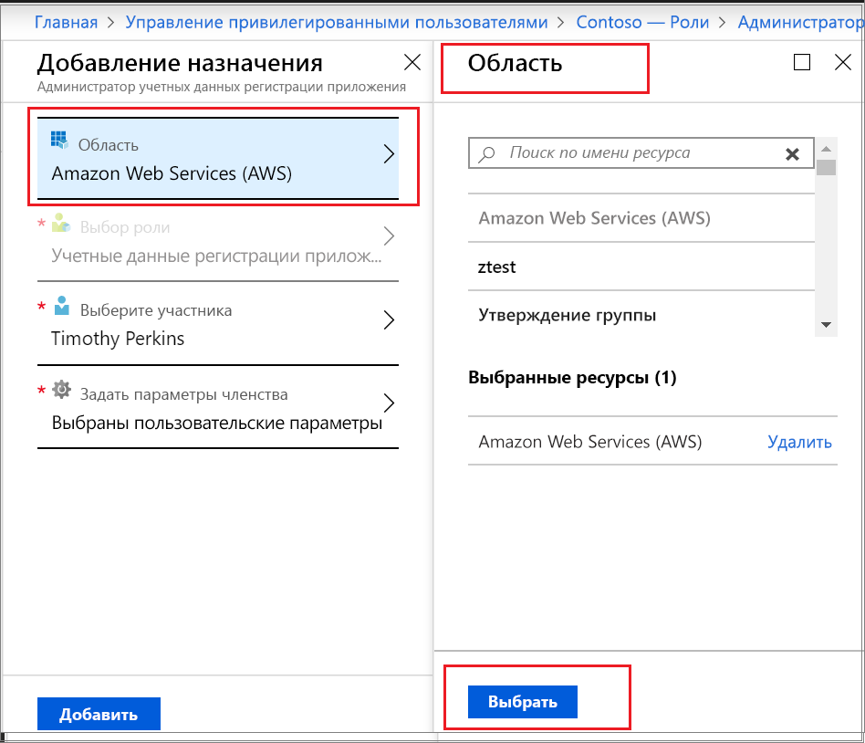

# Активация настраиваемой роли AAD через Privileged Identity Management

Privileged Identity Management (PIM) в Azure Active Directory (AAD) теперь поддерживает привязанные к задачам и ограниченные по времени назначения настраиваемых ролей, созданных для управления приложениями в административном интерфейсе управления пользователями и доступом. Дополнительные сведения о создании настраиваемых ролей для делегирования управления приложениями в AAD см. в статье [о настраиваемых ролях администратора в Azure Active Directory (предварительная версия)](../users-groups-roles/roles-custom-overview.md).

> [!NOTE]
> Настраиваемые роли AAD в период предварительной версии не интегрируются со встроенными ролями каталога. Как только эта возможность станет общедоступной, управление всеми ролями будет выполняться в интерфейсе для встроенных ролей.

## Активация роли

Чтобы активировать настраиваемую роль Azure AD, запросите активацию, выбрав параметр "Моя роль" в управление привилегированными пользователями.

1. Войдите на [портал Azure](https://portal.azure.com).
1. Откройте страницу Azure AD [Privileged Identity Management](https://portal.azure.com/?Microsoft_AAD_IAM_enableCustomRoleManagement=true&Microsoft_AAD_IAM_enableCustomRoleAssignment=true&feature.rbacv2roles=true&feature.rbacv2=true&Microsoft_AAD_RegisteredApps=demo#blade/Microsoft_Azure_PIMCommon/CommonMenuBlade/quickStart).

1. Выберите **Azure AD custom roles** (Настраиваемые роли AAD) для просмотра доступных назначений настраиваемых ролей AAD.

   

> [!Note] 
>  Перед назначением роли необходимо создать или настроить роль. Дополнительные сведения о настройке пользовательских ролей AAD см. [здесь] (https://docs.microsoft.com/azure/active-directory/privileged-identity-management/azure-ad-custom-roles-configure)

1. На странице **Azure AD custom roles (Preview)** (Настраиваемые роли AAD (предварительная версия)) найдите нужное назначение.
1. Щелкните **Активируйте роль**, чтобы открыть страницу **Активация**.
1. Если эта роль требует многофакторной проверки подлинности, щелкните **Чтобы продолжить, подтвердите свою личность**. Проверка подлинности требуется лишь один раз за сеанс.
1. Щелкните **Подтверждение вашей личности** и следуйте инструкциям по прохождению дополнительной проверки безопасности.
1. Чтобы указать настраиваемую область приложения, выберите **Область**, чтобы открыть панель фильтра. При доступе к роли следует запрашивать минимально необходимую область. Если назначение оформлено для области приложения, вы сможете активировать его только в этой области.

   

1. Если нужно, укажите время начала активации. Если используется этот параметр, участник роли активируется строго в указанное время.
1. В поле **Причина** введите основание для запроса активации. Их можно сделать обязательными в параметрах роли.
1. Выберите **Активировать**.

Если роль не требует утверждения, она будет активирована в соответствии с указанными настройками и добавлена в список активных ролей. Если вы хотите использовать активированную роль, начните с процедуры [назначения настраиваемой роли Azure AD через Privileged Identity Management](azure-ad-custom-roles-assign.md).

Если роль требует утверждения для вы получите уведомление Azure о том, что запрос ожидает утверждения.

## Дальнейшие действия

- [Назначение настраиваемой роли Azure AD](azure-ad-custom-roles-assign.md)
- [Update or remove an assigned Azure AD custom role in Privileged Identity Management](azure-ad-custom-roles-update-remove.md) (Обновление или удаление назначенной настраиваемой роли AAD в Privileged Identity Management)
- [Настройка назначения настраиваемой роли Azure AD](azure-ad-custom-roles-configure.md)
- [Administrator role permissions in Azure Active Directory](../users-groups-roles/directory-assign-admin-roles.md) (Разрешения роли администратора в Azure Active Directory)
