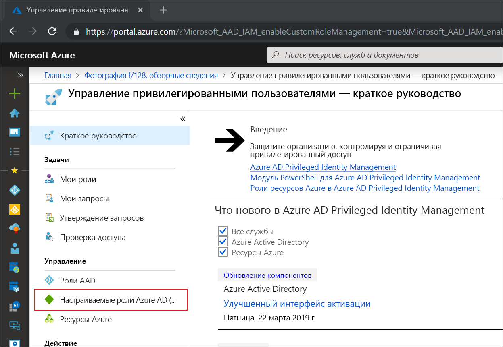
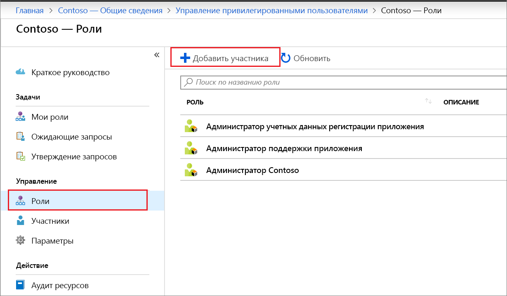
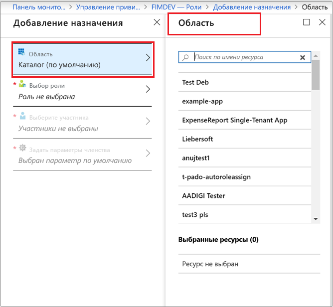
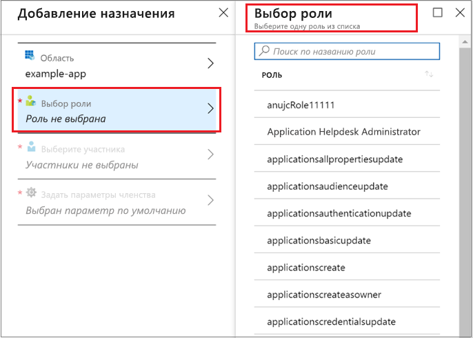
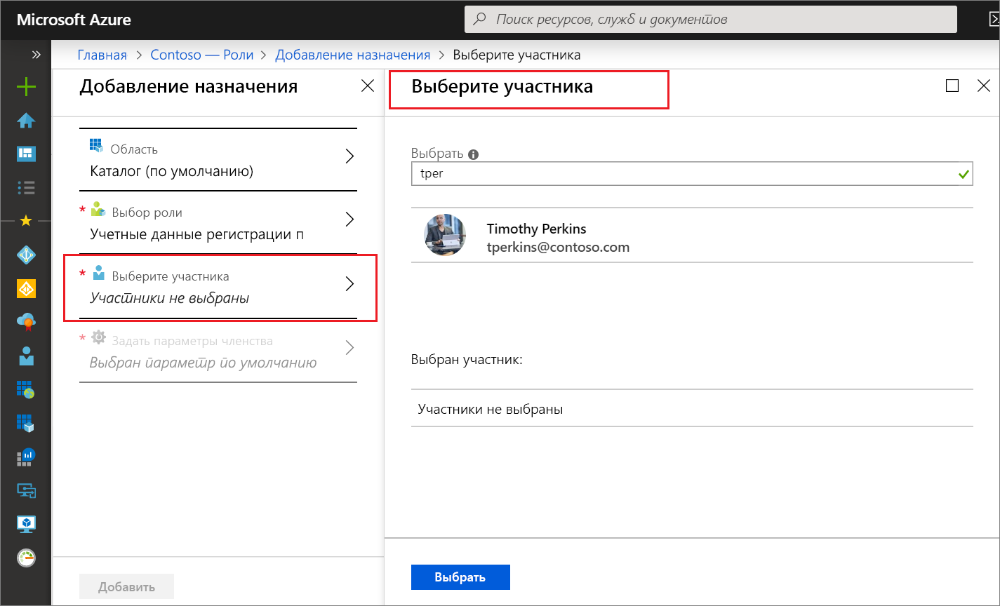
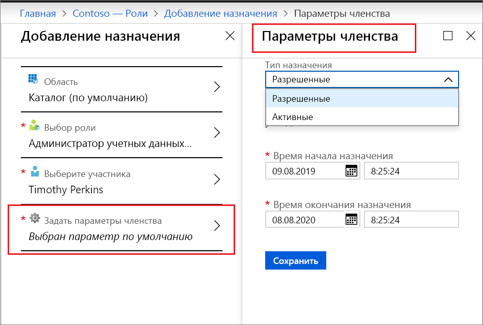
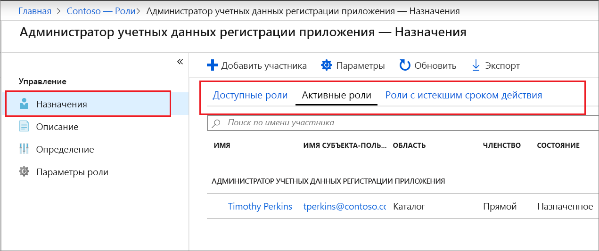

# Присвоение настраиваемой роли AAD через Privileged Identity Management (PIM)

В этой статье объясняется, как с помощью Privileged Identity Management (PIM) создать привязанные к задачам и ограниченные по времени назначения настраиваемых ролей, созданных для управления приложениями в административном интерфейсе Azure Active Directory (AAD).

- Дополнительные сведения о создании настраиваемых ролей для делегирования управления приложениями в AAD см. в статье [о настраиваемых ролях администратора в Azure Active Directory (предварительная версия)](../roles/custom-overview.md).
- Если вы еще не использовали управление привилегированными пользователями, получите дополнительные сведения в статье [Начало работы с управлением привилегированными пользователями](pim-getting-started.md).
- Сведения о том, как предоставить другим администраторам доступ к управлению управление привилегированными пользователями, см. [в разделе Предоставление доступа другим администраторам для управления Управление привилегированными пользователями](pim-how-to-give-access-to-pim.md).

> [!NOTE]
> Настраиваемые роли AAD в период предварительной версии не интегрируются со встроенными ролями каталога. Как только эта возможность станет общедоступной, управление всеми ролями будет выполняться в интерфейсе для встроенных ролей. Если вы видите следующий баннер, эти роли должны управляться [во встроенной функции ролей](pim-how-to-activate-role.md) , и эта статья не применяется.
>
> 

## Назначение роли

Управление привилегированными пользователями позволяет управлять настраиваемыми ролями, которые вы создаете в интерфейсе управления приложениями в Azure Active Directory (AAD).  Следующие шаги создают допустимое назначение для настраиваемой роли каталога.

1. Войдите в раздел [Privileged Identity Management](https://portal.azure.com/?Microsoft_AAD_IAM_enableCustomRoleManagement=true&Microsoft_AAD_IAM_enableCustomRoleAssignment=true&feature.rbacv2roles=true&feature.rbacv2=true&Microsoft_AAD_RegisteredApps=demo#blade/Microsoft_Azure_PIMCommon/CommonMenuBlade/quickStart) на портале Azure с учетной записью пользователя, которому назначена роль "Администратор привилегированных ролей".
1. Щелкните **Настраиваемые роли Azure AD (предварительная версия)**.

    

1. Выберите **Роли**, чтобы просмотреть список настраиваемых ролей для приложений AAD.

    

1. Щелкните **Добавить участника**, чтобы открыть страницу назначения.
1. Чтобы ограничить область назначения роли отдельным приложением, выберите область приложения в разделе **Область**.

    

1. Щелкните **Выбрать роль**, чтобы открыть список **Выбор роли**.

    

1. Выберите роль, которую вы намерены назначить, и щелкните **Выбрать**. Откроется список **Выберите участника**.

    

1. Щелкните пользователя, которому вы намерены назначить роль, а затем щелкните **Выбрать**. Откроется список **Параметры членства**.

    

1. На странице **Параметры членства** выберите значение **Допустимое** или **Активное**.

    - Назначение **допустимой** роли означает, что пользователь должен выполнить некоторое действие для использования этой роли. Это могут быть такие действия, как прохождение многофакторной проверки подлинности, предоставление коммерческого обоснования или запрос утверждения от назначенных утверждающих.
    - Назначение **активной** роли не требует дополнительных действий для использования роли. Члены с активным назначением роли постоянно имеют все полномочия, присвоенные этой роли.

1. Если флажок **Постоянный** доступен для просмотра и изменения (в зависимости от параметров роли), вы можете сделать назначение постоянным. Если назначение должно быть постоянно активным или постоянно допустимым, установите этот флажок. Снимите флажок, чтобы ограничить длительность назначения.
1. Чтобы создать новое назначение роли, последовательно щелкните **Сохранить** и **Добавить**. Отображается уведомление о состоянии процесса назначения.

Чтобы проверить назначение ролей, в открытой роли выберите **назначения**  >  **назначение** и убедитесь, что назначение роли правильно определено как допустимое или активное.

 

## Дальнейшие шаги

- [Активация настраиваемой роли Azure AD](azure-ad-custom-roles-assign.md)
- [Update or remove an assigned Azure AD custom role in Privileged Identity Management](azure-ad-custom-roles-update-remove.md) (Обновление или удаление назначенной настраиваемой роли AAD в Privileged Identity Management)
- [Настройка назначения настраиваемой роли Azure AD](azure-ad-custom-roles-configure.md)
- [Administrator role permissions in Azure Active Directory](../roles/permissions-reference.md) (Разрешения роли администратора в Azure Active Directory)
