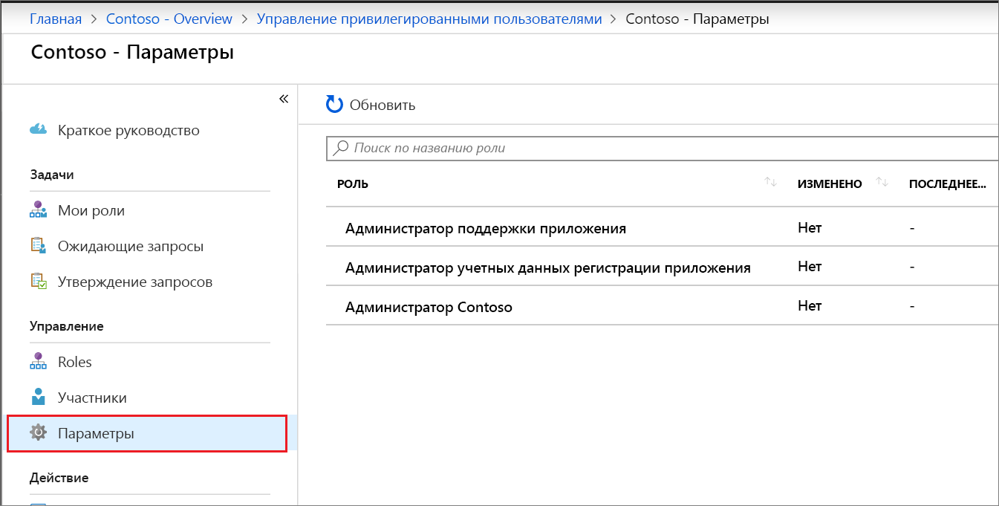
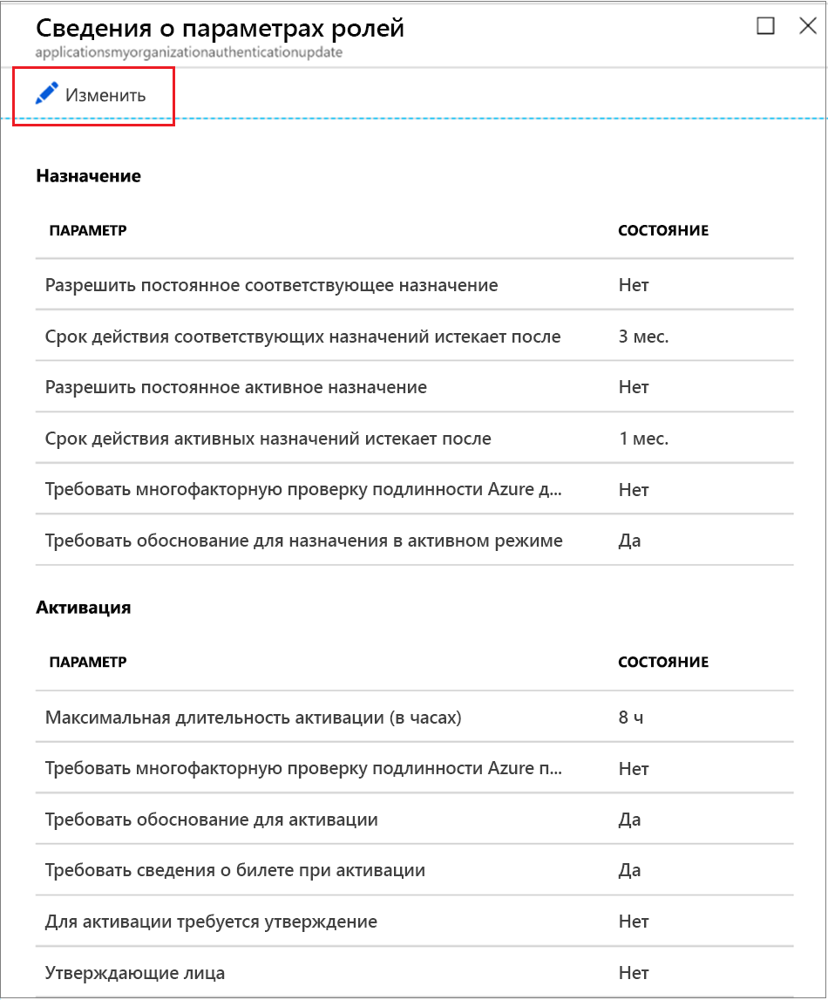
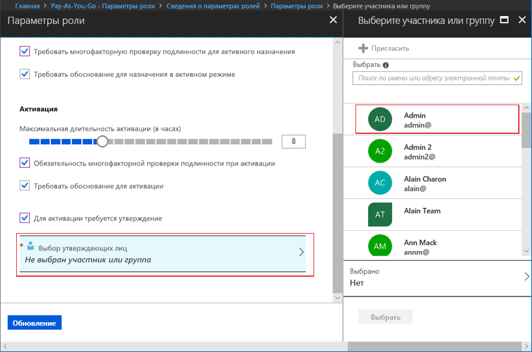

# Настройка настраиваемой роли AAD через Privileged Identity Management

Администратор привилегированных ролей может изменить параметры роли, применяемые к пользователю при активации назначения настраиваемой роли, и параметры для других администраторов приложений, которые назначают настраиваемые роли.

> [!NOTE]
> Настраиваемые роли AAD в период предварительной версии не интегрируются со встроенными ролями каталога. Как только эта возможность станет общедоступной, управление всеми ролями будет выполняться в интерфейсе для встроенных ролей. Если вы видите следующий баннер, эти роли должны управляться [во встроенной функции ролей](pim-how-to-activate-role.md) , и эта статья не применяется.
>
> 

## Открытие параметров роли

Чтобы открыть параметры роли AAD, выполните следующие шаги.

1. Войдите в раздел [Privileged Identity Management](https://portal.azure.com/?Microsoft_AAD_IAM_enableCustomRoleManagement=true&Microsoft_AAD_IAM_enableCustomRoleAssignment=true&feature.rbacv2roles=true&feature.rbacv2=true&Microsoft_AAD_RegisteredApps=demo#blade/Microsoft_Azure_PIMCommon/CommonMenuBlade/quickStart) на портале Azure с учетной записью пользователя, которому назначена роль "Администратор привилегированных ролей".
1. Щелкните **Настраиваемые роли Azure AD (предварительная версия)**.

    

1. Щелкните **Параметры**, чтобы открыть страницу **Параметры**. Выберите роль, параметры которой вы хотите настроить.
1. Щелкните **Изменить**, чтобы открыть страницу **Параметры роли**.

    

## Параметры роли

Есть несколько параметров, которые вы можете настроить.

### Длительность назначений

При настройке параметров роли можно выбрать один из двух вариантов продолжительности назначения для каждого типа назначения (допустимые и активные). Эти параметры определяют максимальную длительность по умолчанию для членов, которым назначается эта роль в управлении привилегированными пользователями.

Вы можете выбрать один из следующих вариантов продолжительности для *допустимых* назначений.

- **Разрешить постоянное правое назначение**: Администраторы могут назначать постоянное правое членство.
- **Срок действия допустимого назначения после**: Администраторы могут потребовать, чтобы все допустимые назначения имели указанную дату начала и окончания.

Вы также можете выбрать один из следующих вариантов продолжительности для *активных* назначений.

- **Разрешить постоянное активное назначение**: Администраторы могут назначать постоянное активное членство.
- **Срок действия активного назначения после**: Администраторы могут требовать, чтобы все активные назначения имели указанную дату начала и окончания.

### Требование многофакторной идентификации Azure

Управление привилегированными пользователями поддерживает принудительное применение Многофакторной идентификации Azure (MFA) для двух разных сценариев.

- **Требовать Многофакторную идентификацию для активного назначения**

  Если вам нужно назначить роль некоторому члену только на короткий период времени (например, на один день), процесс настройки обязательной активации для назначенных членов может оказаться слишком долгим. В таком режиме управление привилегированными пользователями не может применять Многофакторную идентификацию при активации пользователем назначения роли, так как этот участник является активным с момента назначения. Чтобы проверить личность администратора, выполняющего такое назначение, установите флажок **Требовать Многофакторную идентификацию для активного назначения**.

- **Требовать для активации Многофакторную идентификацию**

  Вы можете потребовать, чтобы участники роли проходили Многофакторную идентификацию Azure для активации роли. Так они смогут гарантировать, что активацию запрашивают только допустимые пользователи. Этот параметр защитит критически важные роли даже при компрометации учетной записи пользователя. Чтобы действительный член был обязан пройти Многофакторную идентификацию Microsoft Azure до активации, установите флажок **Require Multi-Factor Authentication on activation** (Требовать многофакторную проверку подлинности при активации).

Дополнительные сведения см. в статье [о многофакторной проверке подлинности и управлении привилегированными пользователями](pim-how-to-require-mfa.md).

### Максимальная длительность активации

С помощью ползунка **Максимальная длительность активации (в часах)** установите максимальное время в часах, когда роль остается активной до истечения срока ее действия. Этот параметр может принимать значения в диапазоне от 1 до 24 (часов).

### Требование обоснования

Вы можете потребовать, чтобы участники вводили обоснование при активном назначении или при активации. Чтобы требовать обоснование, установите флажки **Require justification on active assignment** (Требовать обоснование для активного назначения) или **Require justification on activation** (Требовать обоснование для активации).

### Настройка требования утверждения для активации

Если необходимо требовать утверждения для активации роли, выполните следующие действия.

1. Установите флажок **Require approval to activate** (Требование утверждения для активации).
1. Щелкните **Выбор утверждающих лиц**, чтобы открыть список **Выбор участника или группы**.

    

1. Выберите по крайней мере одного участника или группу и нажмите кнопку **Выбрать**. Нужно выбрать по меньшей мере одно утверждающее лицо. Утверждающих по умолчанию нет. Выбранные вами элементы отобразятся в списке выбранных утверждающих лиц.
1. После указания всех параметров роли щелкните **Обновить**, чтобы сохранить изменения.

## Дальнейшие действия

- [Активация настраиваемой роли Azure AD](azure-ad-custom-roles-activate.md)
- [Назначение настраиваемой роли Azure AD](azure-ad-custom-roles-assign.md)
- [Update or remove an assigned Azure AD custom role in Privileged Identity Management](azure-ad-custom-roles-update-remove.md) (Обновление или удаление назначенной настраиваемой роли AAD в Privileged Identity Management)
- [Administrator role permissions in Azure Active Directory](../users-groups-roles/directory-assign-admin-roles.md) (Разрешения роли администратора в Azure Active Directory)
