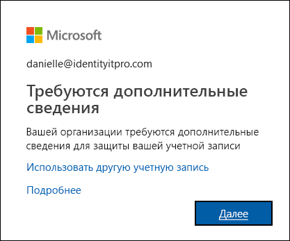

# Что такое страница дополнительной проверки?

Вы получили сообщение электронной почты от сотрудника ИТ-отдела или даже от самого начальника о том, что для вашей учетной записи будет действовать дополнительная проверка безопасности. Что это значит? Это значит, что ваша организация принимает дополнительные меры, чтобы исключить вероятность того, что кто-то другой может выполнить вход от вашего имени. Эта дополнительная проверка, также известная как двухфакторная проверка подлинности, выполняется с использованием имени пользователя, пароля, мобильного устройства или телефона.

Она обеспечивает лучший уровень защиты чем просто пароль, так как опирается на две формы проверки подлинности: на то, что вы знаете, и то, что у вас есть. Первая — это пароль. Вторая — это телефон или устройство, которое обычно у вас имеется. Двухфакторная проверка помогает не допустить выполнение злоумышленником входа от вашего имени, так как даже если у него есть ваш пароль, вероятнее всего, у него нет вашего мобильного устройства.

>[!Important]
>Эта статья предназначена для пользователей, пытающихся использовать двухфакторную проверку подлинности с рабочей или учебной учетной записью (например, alain@contoso.com). Если вы являетесь администратором, который ищет сведения о том, как включить двухфакторную проверку подлинности для ваших сотрудников или других пользователей см. [Документация по аутентификации Azure Active Directory](https://docs.microsoft.com/azure/active-directory/authentication/).

## Кто решает, будете ли вы использовать эту функцию

В зависимости от типа учетной записи решение о необходимости использования двухфакторной проверки подлинности может принять организация или вы сами.

- **Рабочую или учебную учетную запись.** Если вы используете рабочую или учебную учетную запись (например, alain@contoso.com), организация должна решить, нужно ли вам проходить двухфакторную проверку подлинности наряду с конкретными методами проверки. Если решение об использовании этой функции принято на уровне организации, у вас нет возможности индивидуально отключить ее.

- **Личная учетная запись Майкрософт.** Вы можете настроить двухфакторную проверку подлинности для личных учетных записей Майкрософт (например, alain@outlook.com). Если у вас возникли проблемы с двухфакторной проверкой подлинности и личной учетной записью Майкрософт, воспользуйтесь статьей [Включение или отключение двухфакторной проверки для учетной записи Майкрософт](https://support.microsoft.com/help/4028586/microsoft-account-turning-two-step-verification-on-or-off). В этом сценарии вы сами решили использовать эту функцию, и можете включать и выключать ее в любой момент.

    >[!Note]
    >Если у вас возникли проблемы с двухфакторной проверкой подлинности и одной из личных учетных записей Майкрософт (например, danielle@outlook.com), вы можете ознакомиться с предложениями в статье [Использование двухфакторной проверки подлинности в учетной записи Майкрософт](https://support.microsoft.com/help/12408/microsoft-account-how-to-use-two-step-verification).

## Доступ к странице "Дополнительная проверка безопасности"

Когда организация включит и настроит двухфакторную проверку подлинности, вы получите извещение о необходимости предоставить дополнительную информацию для защиты учетной записи.

### Доступ к странице "Дополнительная проверка безопасности"

1. Щелкните **Далее** в приглашении **Требуются дополнительные сведения**

    Откроется страница **Дополнительная проверка безопасности**.

2. На странице **Дополнительная проверка безопасности** нужно выбрать метод двухфакторной проверки подлинности, который вы будете использовать для подтверждения своей личности при входе в рабочую или учебную учетную запись. Можно выбрать:

    | Способ связи | Описание |
    | --- | --- |
    | Мобильное приложение | <ul><li>**Получение уведомлений для проверки подлинности.** При выборе этого способа в приложение для проверки подлинности на смартфоне или планшете будет отправляться push-уведомление. Нужно просмотреть уведомление и подтвердить намерение войти в свою учетную запись, нажав в приложении кнопку **Проверить подлинность**. В вашей организации или учебном заведении может быть предусмотрен ввод ПИН-кода для проверки подлинности.</li><li>**Использование кода проверки.** В этом режиме приложение для проверки подлинности создает код проверки, который обновляется каждые 30 секунд. Введите самый свежий код проверки в интерфейсе входа. Приложение Microsoft Authenticator доступно для [Android](https://go.microsoft.com/fwlink/?linkid=866594) и [iOS](https://go.microsoft.com/fwlink/?linkid=866594).</li></ul> |
    | Телефон для аутентификации. | <ul><li>При выборе способа **Звонок по телефону** будет выполняться автоматический голосовой вызов по указанному номеру телефона. Для прохождения аутентификации нужно ответить на вызов и нажать кнопку "решетка" (#) на клавиатуре телефона.</li><li>При выборе способа **SMS-сообщение** на телефон будет отправляться текстовое сообщение с кодом проверки. Следуя указаниям в SMS-сообщении, нужно отправить ответ на это SMS-сообщение или ввести указанный код проверки в интерфейсе входа.</li></ul> |
    | Рабочий телефон | По указанному номеру телефона осуществляется автоматический голосовой вызов. Для прохождения аутентификации нужно ответить на вызов и нажать кнопку "решетка" (#) на клавиатуре телефона. |

## Дальнейшие действия

Открыв страницу **Дополнительная проверка безопасности**, выберите и настройте метод двухфакторной проверки подлинности.

- [Set up a mobile device as your two-factor verification method](multi-factor-authentication-setup-phone-number.md) (Настройка мобильного устройства в качестве метода проверки)

- [Set up an office phone as your two-factor verification method](multi-factor-authentication-setup-office-phone.md) (Настройка офисного телефона в качестве метода проверки)

- [Set up an authenticator app as your two-factor verification method](multi-factor-authentication-setup-auth-app.md) (Настройка приложения Authenticator в качестве метода проверки)

## Связанные ресурсы

- [Управление параметрами метода двухфакторной проверки подлинности](multi-factor-authentication-end-user-manage-settings.md)

- [Управление паролями приложений](multi-factor-authentication-end-user-app-passwords.md)

- [Варианты входа с помощью Многофакторной идентификации Azure](multi-factor-authentication-end-user-signin.md)

- [Устранение распространенных проблем с двухфакторной проверкой подлинности](multi-factor-authentication-end-user-troubleshoot.md) 
