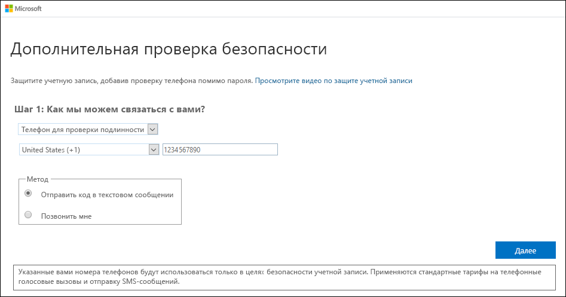
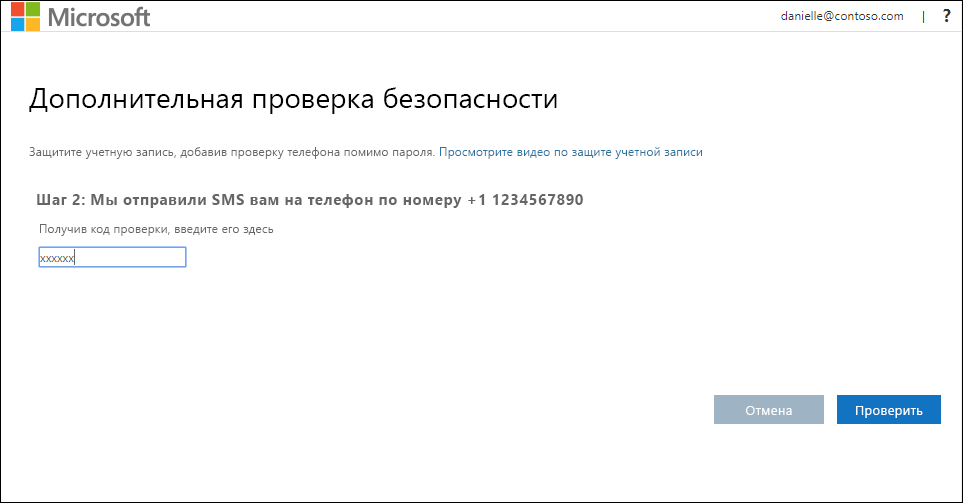
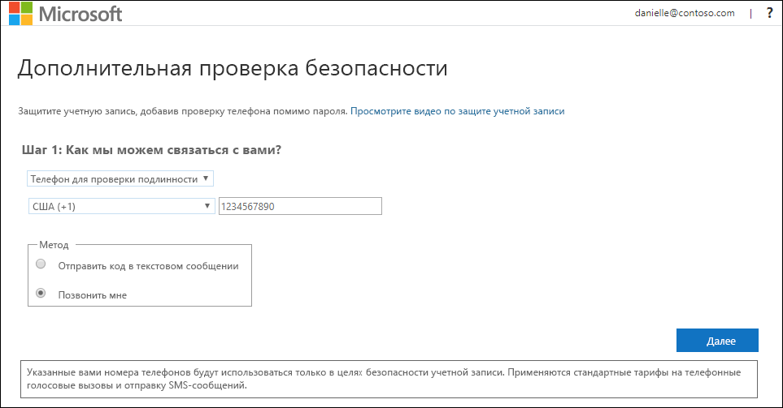
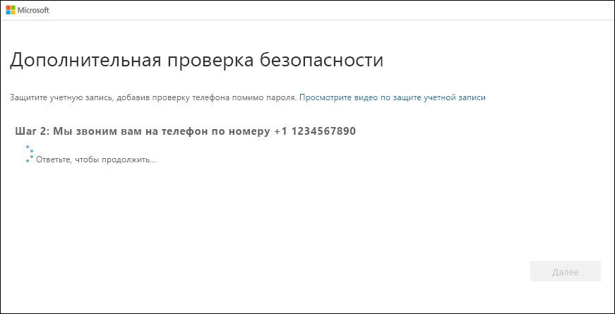

# Настройка мобильного устройства в качестве метода двухфакторной проверки подлинности

Вы можете настроить мобильное устройство для использования в качестве метода двухфакторной проверки подлинности. На ваш мобильный телефон может поступить текстовое сообщение с кодом проверки или звонок.

>[!Note]
> Если параметр "Телефон для проверки подлинности" неактивен, возможно, ваша организация не позволяет использовать номер телефона или текстовое сообщение для проверки. Если это так, вам нужно выбрать другой метод или обратиться за помощью к администратору.

## Настройка мобильного устройства для использования текстового сообщения в качестве метода проверки

1. На странице **Дополнительная проверка безопасности** выберите **Телефон для проверки подлинности** в области **Шаг 1. Как с вами связаться?** , выберите свою страну или регион в раскрывающемся списке, а затем введите номер мобильного телефона.

2. Выберите **Отправить код в текстовом сообщении** в области **Метод**, а затем нажмите кнопку **Далее**.

    

3. Введите код проверки из текстового сообщения, отправленного корпорацией Майкрософт, в область **Шаг 2. Мы отправили SMS вам на телефон по номеру**, а затем нажмите кнопку **Подтвердить**.

    

4. В области **Шаг 3. Продолжайте использовать имеющиеся приложения** скопируйте предоставленный пароль приложения и сохраните его в безопасном месте.

    

    >[!Note]
    >Сведения о том, как использовать пароль приложения с более старыми приложениями, см. в статье [Управление паролями приложения для двухфакторной проверки подлинности](multi-factor-authentication-end-user-app-passwords.md). Пароли приложений требуются только в том случае, если вы продолжаете использовать старые приложения, которые не поддерживают двухфакторную проверку подлинности.

5. Нажмите кнопку **Готово**.

## Настройка мобильного устройства для получения телефонного звонка

1. На странице **Дополнительная проверка безопасности** выберите **Телефон для проверки подлинности** в области **Шаг 1. Как с вами связаться?** , выберите свою страну или регион в раскрывающемся списке, а затем введите номер мобильного телефона.

2. Выберите пункт **Позвонить мне** в области **Метод**, а затем нажмите кнопку **Далее**.

    

3. Вы получите телефонный звонок от корпорации Майкрософт. Вам нужно будет подтвердить свою личность с помощью знака решетки (#) на мобильном устройстве.

    

4. В области **Шаг 3. Продолжайте использовать имеющиеся приложения** скопируйте предоставленный пароль приложения и сохраните его в безопасном месте.

    

    >[!Note]
    >Сведения о том, как использовать пароль приложения с более старыми приложениями, см. в статье [Управление паролями приложения для двухфакторной проверки подлинности](multi-factor-authentication-end-user-app-passwords.md). Пароли приложений требуются только в том случае, если вы продолжаете использовать старые приложения, которые не поддерживают двухфакторную проверку подлинности.

5. Нажмите кнопку **Готово**.

## Дальнейшие действия

После настройки метода двухфакторной проверки подлинности можно добавить дополнительные методы, управлять параметрами и паролями приложений, входить в систему или получить справку по некоторым распространенным проблемам, связанным с двухфакторной проверкой подлинности.

- [Управление параметрами метода двухфакторной проверки подлинности](multi-factor-authentication-end-user-manage-settings.md)

- [Управление паролями приложений](multi-factor-authentication-end-user-app-passwords.md)

- [Варианты входа с помощью Многофакторной идентификации Azure](multi-factor-authentication-end-user-signin.md)

- [Устранение распространенных проблем с двухфакторной проверкой подлинности](multi-factor-authentication-end-user-troubleshoot.md)
