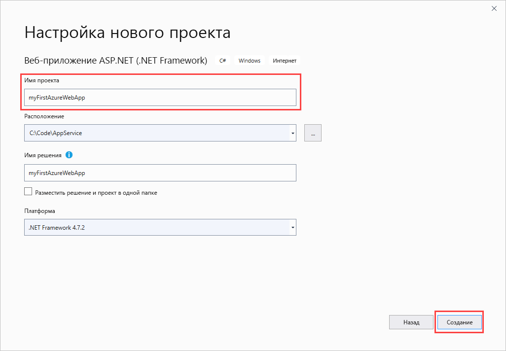
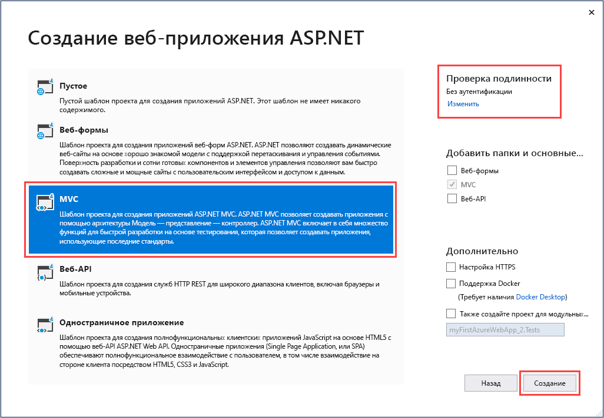
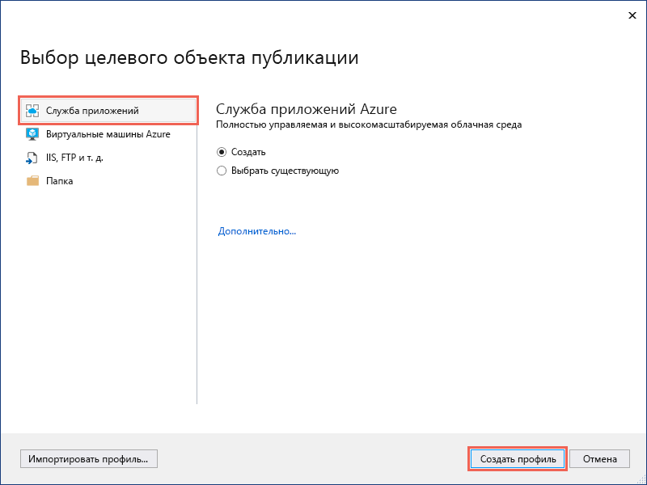
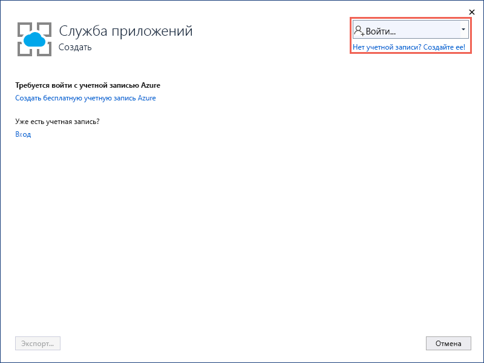
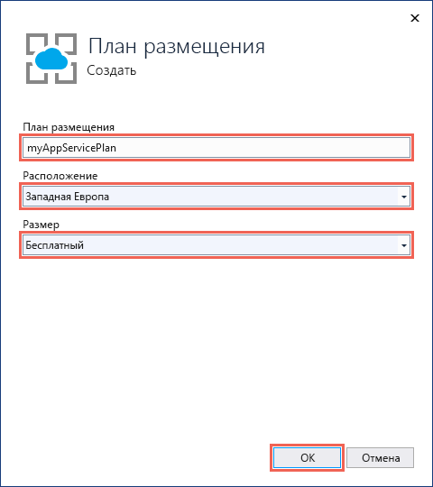
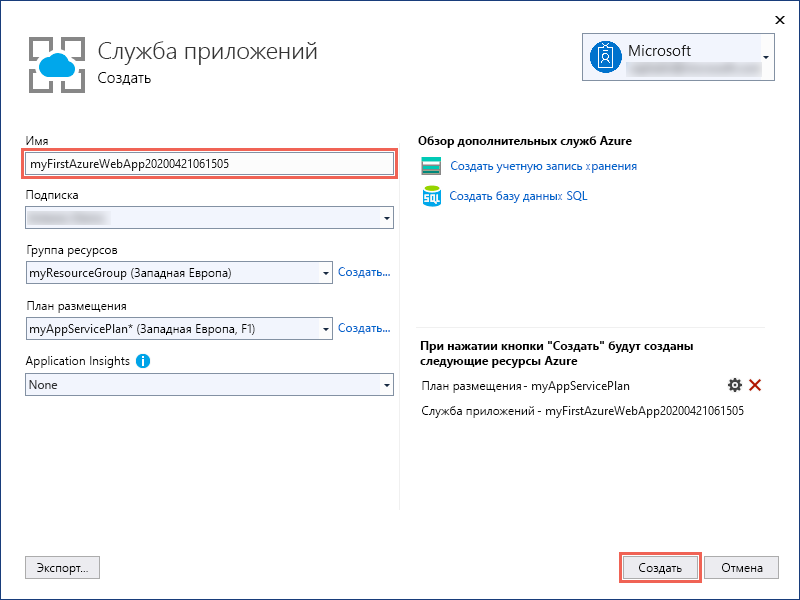
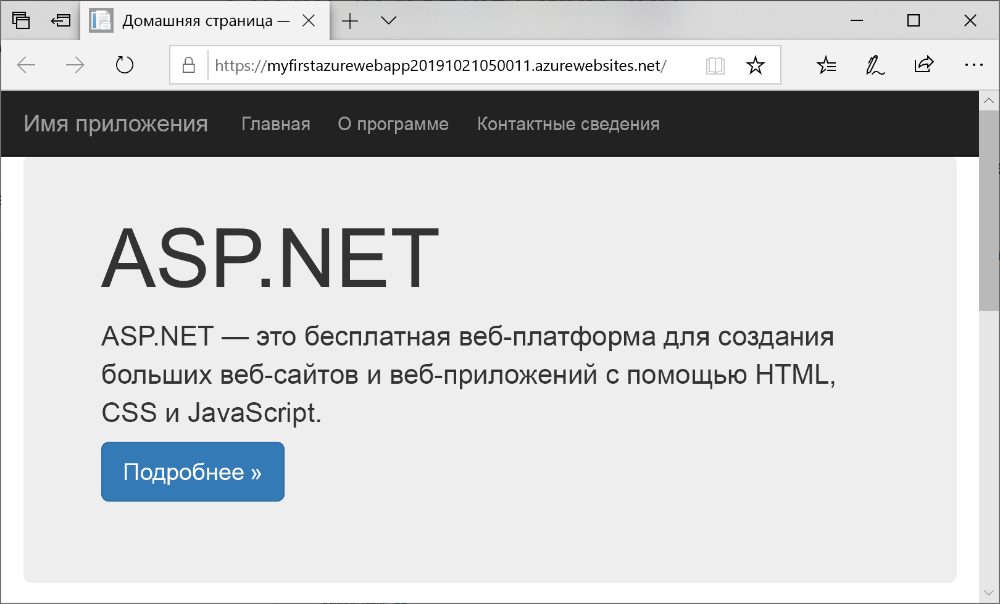
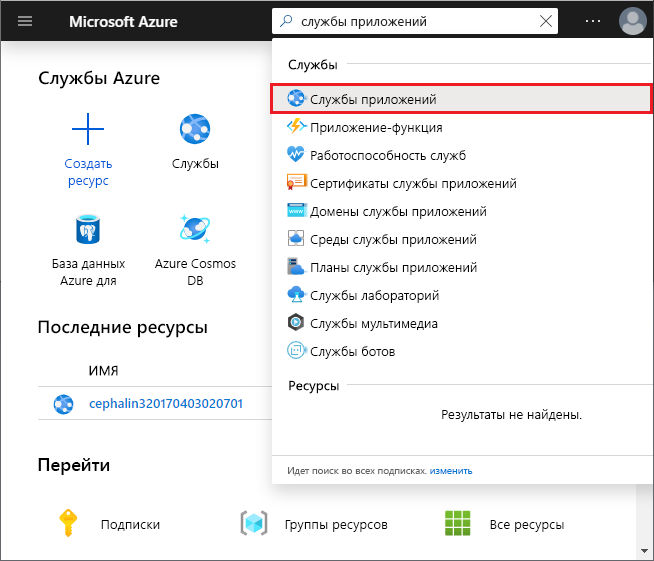
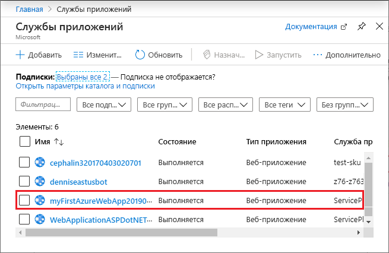
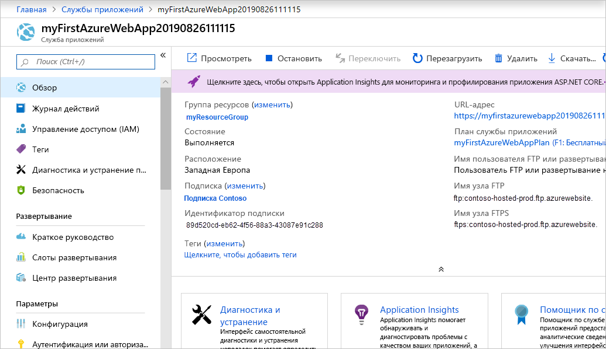

# <a name="create-an-aspnet-framework-web-app-in-azure"></a>Создание веб-приложения ASP.NET Framework в Azure

[Служба приложений Azure](overview.md) — это служба веб-размещения с самостоятельной установкой исправлений и высоким уровнем масштабируемости.

В этом кратком руководстве рассматривается развертывание первого веб-приложения ASP.NET в Службе приложений Azure. По завершении вы получите план службы приложений. У вас также будет приложение Службы приложений с развернутым веб-приложением.

[!INCLUDE [quickstarts-free-trial-note](../../includes/quickstarts-free-trial-note.md)]

## <a name="prerequisites"></a>Предварительные требования

Для работы с этим руководством установите <a href="https://www.visualstudio.com/downloads/" target="_blank">Visual Studio 2019</a> с рабочей нагрузкой **ASP.NET и разработка веб-приложений**.

Если у вас уже установлена версия Visual Studio 2019, сделайте следующее.

- Установите последние обновления для Visual Studio, выбрав **Справка** > **Проверить обновления**.
- Добавьте рабочую нагрузку, выбрав **Инструменты** > **Получить средства и компоненты**.

## Создание веб-приложения ASP.NET <a name="create-and-publish-the-web-app"></a>

Создайте веб-приложение ASP.NET, сделав следующее:

1. Откройте Visual Studio и выберите **Создать проект**.

2. В окне **Создание проекта** найдите и выберите **Веб-приложение ASP.NET (.NET Framework)** , а затем нажмите кнопку **Далее**.

3. В окне **Настройка проекта** присвойте приложению имя _myFirstAzureWebApp_ и щелкните **Создать**.

   

4. Вы можете развернуть любой тип веб-приложения ASP.NET в Azure. В рамках этого краткого руководства выберите шаблон **MVC**.

5. Обязательно выберите **Без проверки подлинности** в параметрах аутентификации. Выберите **Создать**.

   

6. В меню Visual Studio выберите **Отладка** > **Запустить без отладки**, чтобы запустить приложение локально.

   

## Публикация веб-приложения <a name="launch-the-publish-wizard"></a>

1. Щелкните правой кнопкой мыши проект **myFirstAzureWebApp** в **обозревателе решений** и выберите **Опубликовать**.

1. Выберите **Служба приложений**, а затем измените **Создать профиль** на **Опубликовать**.

   

1. Выбор параметров на странице **создания Службы приложений** зависит от того, вошли ли вы в Azure и есть ли у вас учетная запись Visual Studio, связанная с учетной записью Azure. Выберите **Добавить учетную запись** или **Войти**, чтобы войти в подписку Azure. Если вы уже вошли, выберите нужную учетную запись.

   > [!NOTE]
   > Если вы уже выполнили вход, пока не нажимайте кнопку **Создать**.
   >
   >

   

   [!INCLUDE [resource group intro text](../../includes/resource-group.md)]

1. В разделе **Группа ресурсов** выберите **Создать**.

1. В разделе **Новое имя группы ресурсов** введите *myResourceGroup* и щелкните **ОК**.

   [!INCLUDE [app-service-plan](../../includes/app-service-plan.md)]

1. В разделе **План размещения** щелкните **Создать**.

1. В разделе **Настройка плана размещения** введите значения из следующей таблицы и щелкните **ОК**.

   | Параметр | Рекомендуемое значение | Описание |
   |-|-|-|
   |План обслуживания приложения| myAppServicePlan | Имя плана службы приложений. |
   | Расположение | Западная Европа | Центр обработки данных, где размещается веб-приложение. |
   | Размер | Free | [Ценовая категория](https://azure.microsoft.com/pricing/details/app-service/?ref=microsoft.com&utm_source=microsoft.com&utm_medium=docs&utm_campaign=visualstudio) определяет возможности размещения. |

   

1. В поле **Имя** введите уникальное имя приложения, включающее только допустимые символы: `a-z`, `A-Z`, `0-9` и `-`. Вы можете использовать автоматически созданное уникальное имя. URL-адрес веб-приложения: `http://<app_name>.azurewebsites.net`, где `<app_name>` — имя приложения.

2. Нажмите кнопку **Создать**, чтобы начать создавать ресурсы Azure.

   

По завершении работы мастера веб-приложение ASP.NET будет опубликовано в Azure и запущено в браузере по умолчанию.



Имя приложения, указанное на странице **создания приложения в Службе приложений**, используется как префикс URL-адреса в формате `http://<app_name>.azurewebsites.net`.

**Поздравляем!** Ваше веб-приложение ASP.NET работает в Службе приложений Azure в режиме реального времени.

## <a name="update-the-app-and-redeploy"></a>Обновление и повторное развертывание приложения

1. В **обозревателе решений** в вашем проекте откройте **Представления** > **Главная страница** > **Index.cshtml**.

1. Найдите тег HTML `<div class="jumbotron">` в верхней области и замените его следующим кодом:

   ```HTML
   <div class="jumbotron">
       <h1>ASP.NET in Azure!</h1>
       <p class="lead">This is a simple app that we’ve built that demonstrates how to deploy a .NET app to Azure App Service.</p>
   </div>
   ```

1. Чтобы выполнить повторное развертывание в Azure, щелкните правой кнопкой мыши проект **myFirstAzureWebApp** в **обозревателе решений**, а затем выберите **Опубликовать**. Затем щелкните **Опубликовать**.

По завершении публикации Visual Studio открывает в браузере страницу с URL-адресом веб-приложения.


## <a name="manage-the-azure-app"></a>Управление приложением Azure

1. Чтобы управлять веб-приложением, перейдите на [портал Azure](https://portal.azure.com), найдите в поиске и выберите **Службы приложений**.

   

2. На странице **Службы приложений** выберите имя веб-приложения.

   

   Отобразится страница обзора вашего веб-приложения. Здесь вы можете выполнять базовые задачи управления: просмотр, завершение, запуск, перезагрузку и удаление.

   

   В меню слева доступно несколько страниц для настройки приложения.

## <a name="next-steps"></a>Следующие шаги

> [!div class="nextstepaction"]
> [Создание приложения ASP.NET в Azure с подключением к базе данных SQL](app-service-web-tutorial-dotnet-sqldatabase.md)
