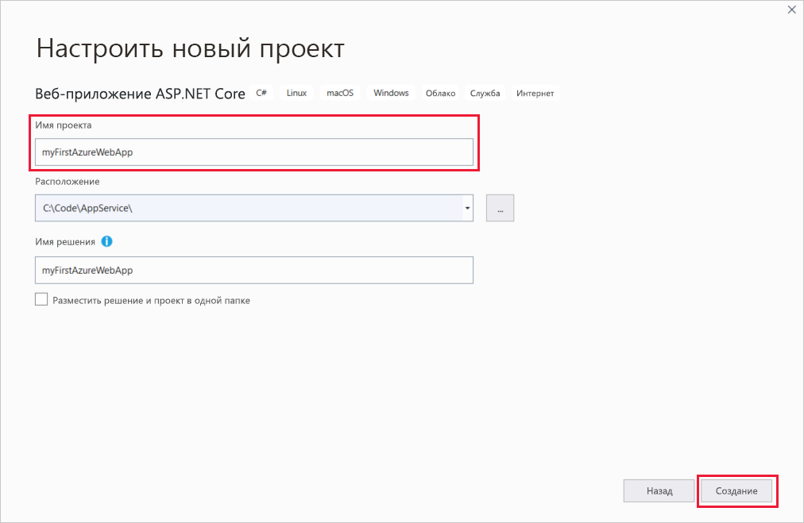
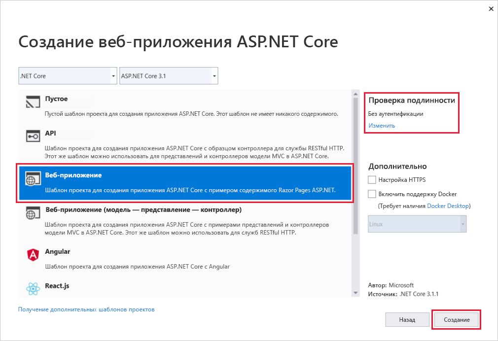
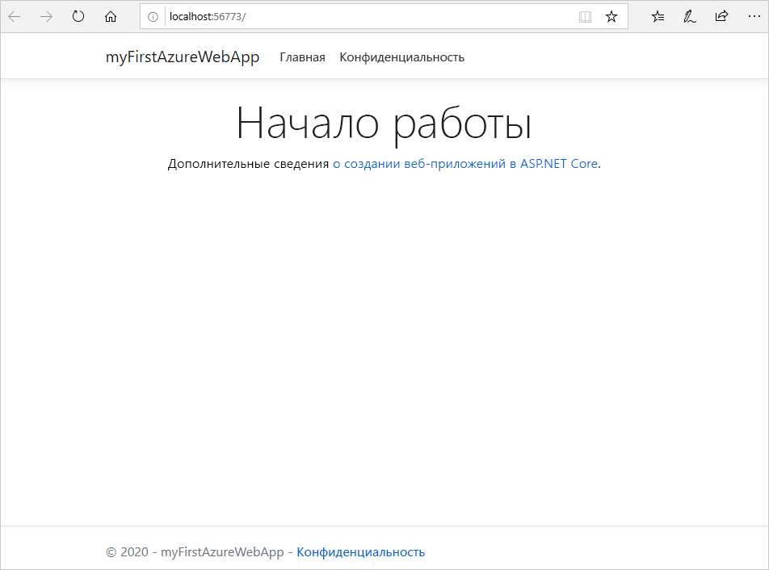
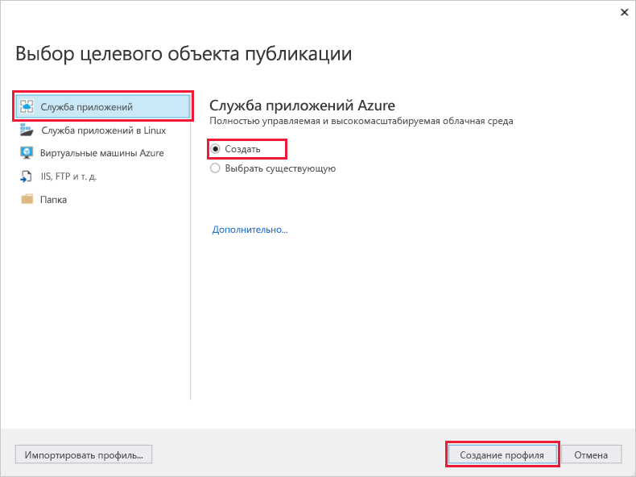
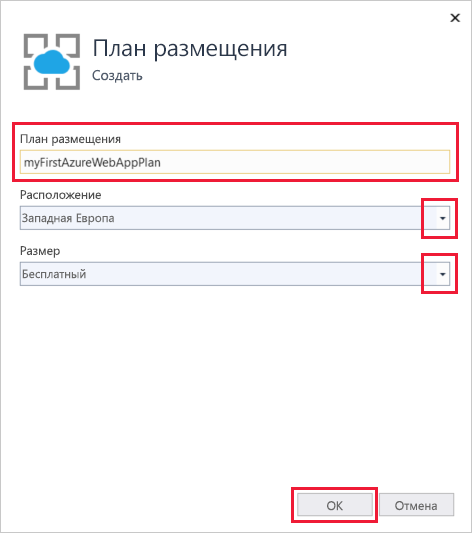
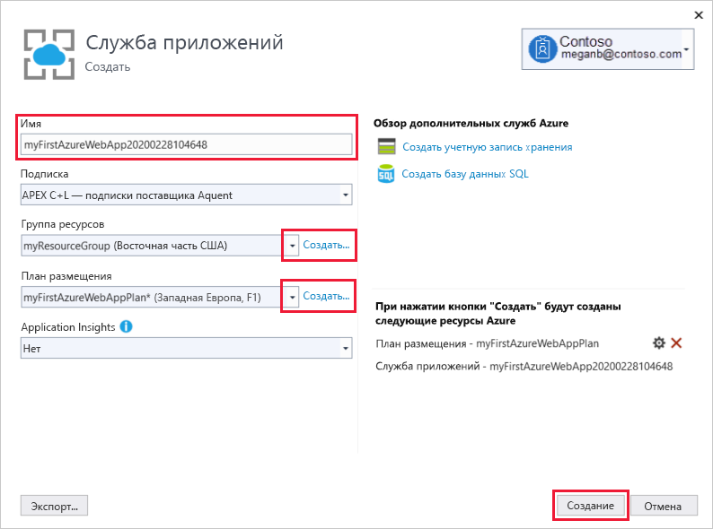
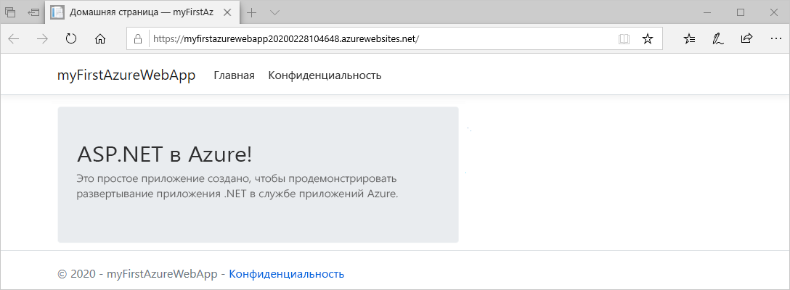
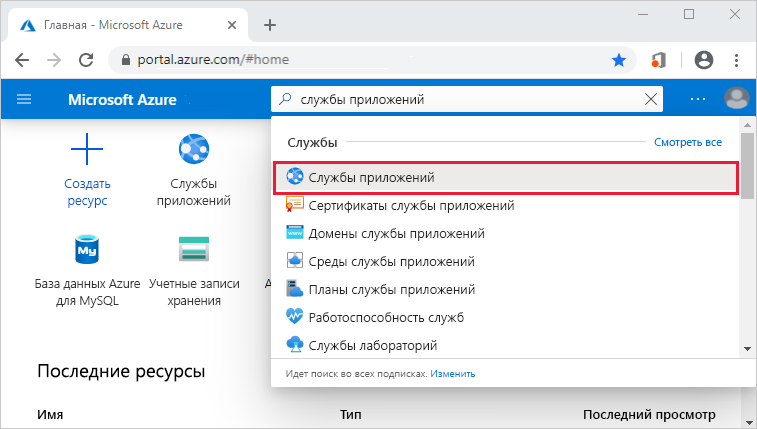
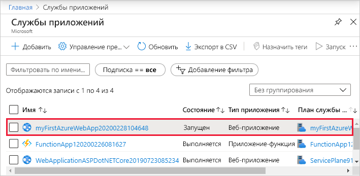
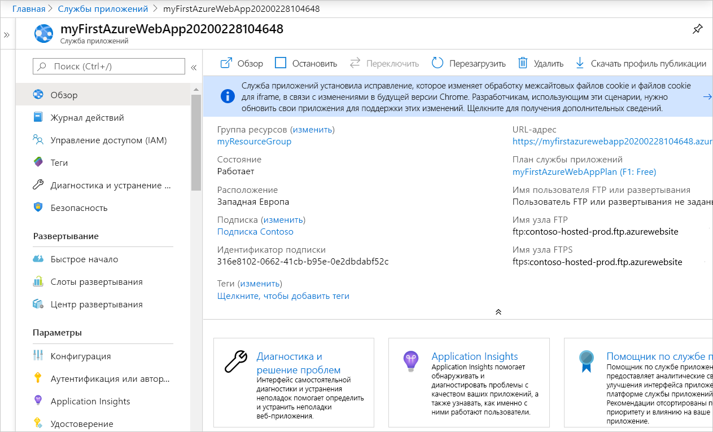

# <a name="quickstart-create-an-aspnet-core-web-app-in-azure"></a>Краткое руководство. Создание веб-приложения ASP.NET Core в Azure

Из этого краткого руководства вы узнаете, как создать и развернуть первое веб-приложение ASP.NET Core в [Службе приложений Azure](overview.md). 

Когда вы закончите работу с ним, у вас будет создана группа ресурсов Azure с планом размещения Службы приложений и Службой приложений, где развернуто веб-приложение.

## <a name="prerequisites"></a>Предварительные требования

- Учетная запись Azure с активной подпиской. [Создайте учетную запись](https://azure.microsoft.com/free/dotnet/) бесплатно.
- В этом кратком руководстве описывается, как развернуть приложение в Службе приложений на платформе Windows. Чтобы развернуть приложение .NET Core в службе приложений на платформе _Linux_, см. статью [Создание веб-приложения .NET Core в службе приложений на платформе Linux](./containers/quickstart-dotnetcore.md).
- Установите <a href="https://www.visualstudio.com/downloads/" target="_blank">Visual Studio 2019</a> с рабочей нагрузкой **ASP.NET и веб-разработка**.

  Если у вас уже установлена версия Visual Studio 2019, сделайте следующее.

  - Установите последние обновления для Visual Studio, выбрав **Справка** > **Проверить обновления**.
  - Добавьте рабочую нагрузку, выбрав **Инструменты** > **Получить средства и компоненты**.


## <a name="create-an-aspnet-core-web-app"></a>Создание веб-приложения ASP.NET Core

Создайте веб-приложение ASP.NET Core в Visual Studio, выполнив следующие действия:

1. Откройте Visual Studio и выберите **Создать проект**.

1. В разделе **Создание нового проекта** выберите **Веб-приложение ASP.NET Core** и убедитесь, что в списке для этого варианта указан язык **C#** , а затем щелкните **Далее**.

1. В окне **Настройка нового проекта** присвойте проекту веб-приложения имя *myFirstAzureWebApp* и щелкните **Создать**.

   

1. Вы можете развернуть в Azure веб-приложение ASP.NET Core любого типа, но для этого краткого руководства нам нужен шаблон **Веб-приложение**. В разделе **Проверка подлинности** выберите вариант **Без проверки подлинности** и убедитесь, что остальные варианты не выбраны. Затем выберите **Создать**.

    
   
1. В меню Visual Studio выберите **Отладка** > **Запустить без отладки**, чтобы запустить веб-приложение локально.

   

## <a name="publish-your-web-app"></a>Публикация веб-приложения

Прежде чем опубликовать веб-приложение, следует создать и настроить новую Службу приложений, в которой вы сможете опубликовать это приложение. 

В процессе настройки Службы приложений вы создадите следующее:

- Новая [группа ресурсов](https://docs.microsoft.com/azure/azure-resource-manager/management/overview#terminology) для всех ресурсов Azure, которые потребуются для этой службы.
- Новый [план размещения](https://docs.microsoft.com/azure/app-service/overview-hosting-plans), который позволяет определить расположение, размер и функции фермы веб-серверов для размещения приложения.

Выполните следующие действия, чтобы создать Службу приложений и опубликовать веб-приложение:

1. Щелкните правой кнопкой мыши проект **myFirstAzureWebApp** в **обозревателе решений** и выберите **Опубликовать**. Если вы еще не вошли в учетную запись Azure из Visual Studio, выберите **Добавление учетной записи** или **Вход**. Вы также можете создать бесплатную учетную запись Azure.

1. В диалоговом окне **Выберите целевого объекта публикации** выберите вариант **Служба приложений**, затем щелкните **Создать** и **Создать профиль**.

   

1. В диалоговом окне **Служба приложение Azure: Создать новое** укажите для приложения глобально уникальное имя в поле **Имя**, подтвердив вариант по умолчанию или введя новое имя. Допустимые символы: `a-z`, `A-Z`, `0-9` и `-`. Это **имя** используется в качестве префикса URL-адреса для веб-приложения в формате `http://<app_name>.azurewebsites.net`.

1. Для параметра **Подписка** подтвердите предложенный вариант или выберите другой из раскрывающегося списка.

1. Для параметра **Группа ресурсов** выберите **Создать**. В разделе **Новое имя группы ресурсов** введите *myResourceGroup* и щелкните **ОК**. 

1. В разделе **План размещения** щелкните **Создать**. 

1. В диалоговом окне **План размещения. Создать новый** введите значения, указанные в следующей таблице.

   | Параметр  | Рекомендуемое значение | Описание |
   | -------- | --------------- | ----------- |
   | **План размещения**  | *myFirstAzureWebAppPlan* | Имя плана службы приложений. |
   | **Расположение**      | *Западная Европа* | Центр обработки данных, где размещается веб-приложение. |
   | **Размер**          | *Бесплатный* | [Ценовая категория](https://azure.microsoft.com/pricing/details/app-service/?ref=microsoft.com&utm_source=microsoft.com&utm_medium=docs&utm_campaign=visualstudio) определяет возможности размещения. |
   
   

1. Для параметра **Application Insights** укажите значение *Нет*.

1. В диалоговом окне **Служба приложение Azure: Создать новую** щелкните **Создать**, чтобы начать создание ресурсов Azure.

   

1. Когда мастер завершит работу, щелкните **Опубликовать**.

   

   Visual Studio опубликует веб-приложение ASP.NET Core в Azure и запустит это приложение в браузере по умолчанию. 

   

**Поздравляем!** Ваше веб-приложение ASP.NET Core работает в Службе приложений Azure в реальном времени.

## <a name="update-the-app-and-redeploy"></a>Обновление и повторное развертывание приложения

Чтобы обновить и повторно развернуть веб-приложение, сделайте следующее:

1. В **обозревателе решений** в проекте откройте **Страницы** > **Index.cshtml**.

1. Замените весь тег `<div>` следующим кодом:

   ```html
   <div class="jumbotron">
       <h1>ASP.NET in Azure!</h1>
       <p class="lead">This is a simple app that we've built that demonstrates how to deploy a .NET app to Azure App Service.</p>
   </div>
   ```

1. Чтобы выполнить повторное развертывание в Azure, щелкните правой кнопкой мыши проект **myFirstAzureWebApp** в **обозревателе решений**, а затем выберите **Опубликовать**.

1. На странице **Публикация** со сводными сведениями щелкните **Опубликовать**.

   

По завершении публикации Visual Studio открывает в браузере страницу с URL-адресом веб-приложения.



## <a name="manage-the-azure-app"></a>Управление приложением Azure

Чтобы управлять веб-приложением, перейдите на [портал Azure](https://portal.azure.com), найдите и выберите **Службы приложений**.



На странице **Службы приложений** выберите имя веб-приложения.



На странице **Обзор** для веб-приложения вы можете выполнять базовые задачи управления: просмотр, завершение, запуск, перезагрузку и удаление. В меню слева есть дополнительные страницы для настройки приложения.



[!INCLUDE [Clean-up section](../../includes/clean-up-section-portal.md)]

## <a name="next-steps"></a>Дальнейшие действия

В этом кратком руководстве вы применили Visual Studio, чтобы создать и развернуть веб-приложение ASP.NET Core в Службе приложений Azure.

Переходите к следующей статье, чтобы узнать, как создать приложение .NET Core и подключить его к Базе данных SQL.

> [!div class="nextstepaction"]
> [Использование ASP.NET Core с базой данных SQL](app-service-web-tutorial-dotnetcore-sqldb.md)

> [!div class="nextstepaction"]
> [Настройка приложения ASP.NET Core](configure-language-dotnetcore.md)
