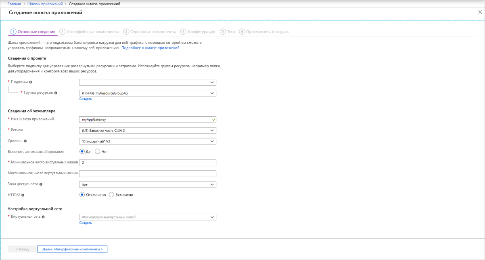
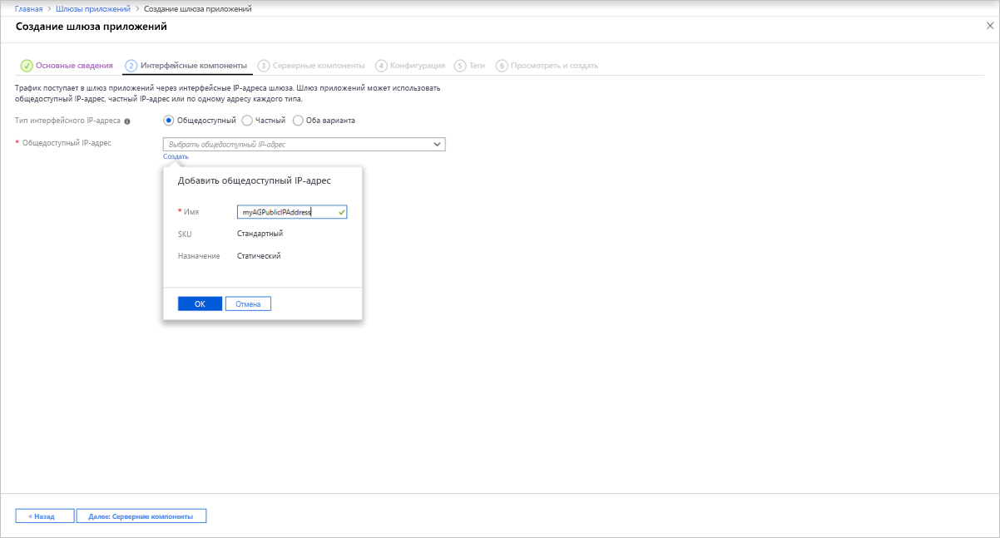

# <a name="tutorial-create-an-application-gateway-with-path-based-routing-rules-using-the-azure-portal"></a>Руководство по Создание шлюза приложений с правилами маршрутизации на основе URL-пути при помощи портала Azure | Документация Майкрософт

Для настройки [правил маршрутизации на основе URL-пути](url-route-overview.md) при создании [шлюза приложений](overview.md) можно использовать портал Azure. В этом руководстве мы создадим серверные пулы с использованием виртуальных машин. Затем мы создадим правила маршрутизации, которые обеспечивают поступление веб-трафика на соответствующие серверы в пуле.

Из этого руководства вы узнаете, как выполнять следующие задачи:

> [!div class="checklist"]
> * Создание шлюза приложений
> * создание виртуальных машин для внутренних серверов;
> * создание серверных пулов с внутренними серверами;
> * создание серверного прослушивателя;
> * создание правила маршрутизации на основе пути.


При необходимости инструкции из этого руководства можно выполнить с помощью [Azure CLI](tutorial-url-route-cli.md) или [Azure PowerShell](tutorial-url-route-powershell.md).

Если у вас еще нет подписки Azure, [создайте бесплатную учетную запись Azure](https://azure.microsoft.com/free/?WT.mc_id=A261C142F), прежде чем начинать работу.

## <a name="sign-in-to-azure"></a>Вход в Azure

Войдите на портал Azure по адресу [https://portal.azure.com](https://portal.azure.com).

## <a name="create-an-application-gateway"></a>Создание шлюза приложений

1. Выберите **Создать ресурс** в верхнем левом меню портала Azure. Появится окно **Создать**.

2. Выберите **Сети**, а затем в списке **Рекомендованные** выберите **Шлюз приложений**.

### <a name="basics-tab"></a>Вкладка "Основные сведения"

1. На вкладке **Основные сведения** введите значения для следующих параметров шлюза приложений.

   - **Группа ресурсов.** Выберите **myResourceGroupAG** для группы ресурсов. Выберите **Создать** для создания группы ресурсов, если она еще не существует.
   - **Имя шлюза приложений**. Введите *myAppGateway* для имени шлюза приложений.

     

2.  В Azure для обмена между создаваемыми ресурсами необходима виртуальная сеть. Вы можете создать новую виртуальную сеть или использовать существующую. В этом примере вы можете создать виртуальную сеть одновременно со шлюзом приложений. Экземпляры Шлюза приложений создаются в отдельных подсетях. В этом примере создаются две подсети: одна — для шлюза приложений, а вторая — для внутренних серверов.

    В разделе **Настройка виртуальной сети** создайте виртуальную сеть, выбрав команду **Создать**. В открывшемся окне **Создание виртуальной сети** введите следующие значения, которые будут использоваться для создания виртуальной сети и двух подсетей.

    - **Имя.** Введите *myVNet* для имени виртуальной сети.

    - **Имя подсети** (Подсеть шлюза приложений). В сетке **Подсети** будет показана подсеть с именем *По умолчанию*. Измените имя этой подсети на *myAGSubnet*.

      Подсеть шлюза приложений может содержать только шлюзы приложений. Другие ресурсы запрещены.

    - **Имя подсети** (подсеть внутреннего сервера). Во второй строке таблицы **Подсети** введите *myBackendSubnet* в столбце **Имя подсети**.

    - **Диапазон адресов** (подсеть внутреннего сервера). Во второй строке таблицы **Подсети** введите диапазон адресов, которые не пересекаются с диапазоном адресов *myAGSubnet*. Например, если диапазон адресов *myAGSubnet* равен 10.0.0.0/24, введите *10.0.1.0/24* для диапазона адресов *myBackendSubnet*.

    Выберите **ОК**, чтобы закрыть окно **Создание виртуальной сети** и сохранить настройки виртуальной сети.

     
    
3. На вкладке **Основные сведения** примите значения по умолчанию для других параметров и выберите **Далее: интерфейсные серверы**.

### <a name="frontends-tab"></a>Вкладка "Интерфейсные серверы"

1. На вкладке **Интерфейсные серверы** убедитесь, что для параметра **Тип IP-адреса интерфейсных серверов** установлено значение **Общедоступный**. <br>Вы можете настроить общедоступный интерфейсный или частный IP-адрес, согласно вашему варианту использования. В этом примере мы будем использовать общедоступный интерфейсный IP-адрес.
   > [!NOTE]
   > Для этого номера SKU Шлюза приложений версии 2 можно выбрать только **общедоступную** интерфейсную IP-конфигурацию. Частная интерфейсная IP-конфигурация сейчас не поддерживается для номера SKU версии 2.

2. Выберите команду **Создать** для **Общедоступного IP-адреса** и введите *myAGPublicIPAddress* в качестве имени общедоступного IP-адреса, а затем щелкните **ОК**. 

     

3. По завершении выберите **Next: серверные компоненты**.

### <a name="backends-tab"></a>Вкладка "Серверные компоненты"

Серверный пул используется для перенаправления запросов на внутренние серверы, на которых обслуживается запрос. Серверные пулы могут содержать сетевые адаптеры, масштабируемые наборы виртуальных машин, общедоступные IP-адреса, внутренние IP-адреса, полные доменные имена и такие мультитенантные серверные части, как Служба приложений Azure. В этом примере вы создадите пустой серверный пул со своим шлюзом приложений, а затем добавите в этот серверный пул целевые объекты.

1. На вкладке **Серверные компоненты** выберите **Добавить внутренний пул**.

2. В открывшемся окне **Добавить внутренний пул** введите следующие значения для создания пустого внутреннего пула.

    - **Имя.** Введите *appGatewayBackendPool* в качестве имени серверного пула.
    - **Добавление внутреннего пула без целей**. Чтобы создать серверный пул без целевых объектов, выберите **Да**. После создания шлюза приложения вы добавите серверные целевые объекты.

3. В окне **Добавление внутреннего пула** выберите **Добавить**, чтобы сохранить конфигурацию внутреннего пула и вернуться на вкладку **Серверные компоненты**.
4. Теперь добавьте еще два серверных пула с именами *imagesBackendPool* и *videoBackendPool*.

     

4. На вкладке **Серверные компоненты** выберите **Далее: конфигурация**.

### <a name="configuration-tab"></a>Вкладка "Конфигурация"

На вкладке **Конфигурация** вы подключите созданные вами интерфейсный и серверный пулы с помощью правил маршрутизации.

1. Выберите **Добавить правило** в столбце **Правила маршрутизации**.
2. В открывшемся окне **Добавление правила маршрутизации** введите *Rule1* в поле **Имя правила**.
3. Для правила маршрутизации требуется прослушиватель. На вкладке **Прослушиватель** в окне **Добавление правила маршрутизации** введите следующие значения для прослушивателя.

    - **Имя прослушивателя**. Введите *DefaultListener* в качестве имени прослушивателя.
    - **Интерфейсный IP-адрес**. Выберите **Общедоступные**, чтобы выбрать общедоступный IP-адрес, который вы создали для интерфейсных серверов.

   Примите значения по умолчанию для других параметров на вкладке **Прослушиватель**, а затем выберите вкладку **Серверные целевые объекты**, чтобы настроить остальную часть правила маршрутизации.
4. На вкладке **Серверные целевые объекты** выберите значение **appGatewayBackendPool** для параметра **Серверный целевой объект**.

5. Для **Параметр HTTP** выберите **Создать**, чтобы создать новый параметр HTTP. Параметр HTTP будет определять поведение правила маршрутизации. В открывшемся окне **Добавление параметра HTTP** введите *myHTTPSetting* в поле **Имя параметра HTTP**. Примите значения по умолчанию для других параметров в окне **Добавление параметра HTTP**, затем выберите **Добавить**, чтобы вернуться к окну **Добавление правила маршрутизации**. 

6. В окне **Добавление правила маршрутизации** выберите **Добавить**, чтобы сохранить правило маршрутизации и вернуться на вкладку **Конфигурация**.


1. Выберите **Добавить правило** в столбце **Правила маршрутизации**.

2. В открывшемся окне **Добавление правила маршрутизации** введите *Rule2* в поле **Имя правила**.

3. Для правила маршрутизации требуется прослушиватель. На вкладке **Прослушиватель** в окне **Добавление правила маршрутизации** введите следующие значения для прослушивателя.

    - **Имя прослушивателя**. Введите *myBackendListener* в качестве имени прослушивателя.
    - **Интерфейсный IP-адрес**. Выберите **Общедоступные**, чтобы выбрать общедоступный IP-адрес, который вы создали для интерфейсных серверов.
    - **Порт**: 8080

   В разделе **Дополнительные параметры** укажите следующие значения.
   - **Тип прослушивателя**: базовая;

   Примите значения по умолчанию для других параметров на вкладке **Прослушиватель**, а затем выберите вкладку **Серверные целевые объекты**, чтобы настроить остальную часть правила маршрутизации.

4. На вкладке **Серверные целевые объекты** выберите значение **appGatewayBackendPool** для параметра **Серверный целевой объект**.

5. Для **параметра HTTP** выберите *myHTTPSetting*. Примите значения по умолчанию для других параметров в окне **Добавление параметра HTTP**, затем выберите **Добавить**, чтобы вернуться к окну **Добавление правила маршрутизации**. 

1. В разделе **Маршрутизация на основе пути** выберите **Добавить несколько целевых объектов, чтобы создать правило на основе пути**.
2. В окне **Добавить правило для пути** введите следующие значения для правила пути:

   - **Путь**: */images/\** .
   - **Имя правила для пути**: *Образы*
   - **Параметр HTTP**: выберите *myHTTPSetting*.
   - **Серверный целевой объект**: *imagesBackendPool*.
9. Выберите **Добавить**.
10. Добавьте еще одно правило с именем *Video*, путем */video/\** и серверным целевым объектом *videoBackendPool*.
11. Выберите **Сохранение изменений и возврат к правилам маршрутизации**.

    

12. Выберите **Добавить**.

7. По завершении выберите **Next: Теги** , а затем **Далее: Отзыв и создание**.

### <a name="review--create-tab"></a>Вкладка "Просмотр и создание"

Просмотрите параметры на вкладке **Просмотр и создание**, а затем выберите **Создать**, чтобы создать виртуальную сеть, общедоступный IP-адрес и шлюз приложения. Создание шлюза приложений в Azure может занять несколько минут.

Дождитесь успешного завершения развертывания перед переходом к следующему разделу.


## <a name="create-virtual-machines"></a>Создание виртуальных машин

В этом примере создаются три виртуальные машины, используемые в качестве внутренних серверов для шлюза приложений. Вы также установите службы IIS на виртуальных машинах, чтобы убедиться, что шлюз приложений успешно создан.

1. На портале Azure выберите **Создать ресурс**. Появится окно **Создать**.
2. Выберите **Вычислить**, а затем в списке **Популярное** выберите **Windows Server 2016 Datacenter**. Появится страница **Создание виртуальной машины**.

   Шлюз приложений может осуществлять маршрутизацию трафика для любого типа виртуальной машины, используемой в этом внутреннем пуле. В этом примере используется Windows Server 2016 Datacenter.
1. На вкладке **Основы** введите для следующих параметров виртуальной машины такие значения:

    - **Группа ресурсов.** Выберите **myResourceGroupAG** для имени группы ресурсов.
    - **Имя виртуальной машины**. Укажите *myVM1* в качестве имени виртуальной машины.
    - **Имя пользователя**. Введите *azureuser* для имени администратора.
    - **Пароль**. Введите *Azure123456!* для пароля администратора.
4. Примите остальные значения по умолчанию и щелкните **Далее: Диски**.  
5. Примите значения по умолчанию на вкладке **Диски**, а затем выберите **Далее: Сети**.
6. На вкладке **Сети** убедитесь, что для параметра **Виртуальная сеть** выбрано значение **myVNet**, а для параметра **Подсеть** — значение **myBackendSubnet**. Примите остальные значения по умолчанию и щелкните **Далее: управление**.

   Шлюз приложений может взаимодействовать с экземплярами за пределами виртуальной сети, к которой он относится, при наличии подключения по IP-адресу.
1. На вкладке **Управление** для параметра **Диагностика загрузки** задайте значение **Выкл**. Примите другие значения по умолчанию и выберите **Review + create** (Просмотр и создание).
2. На вкладке **Review + create** (Просмотр и создание) проверьте параметры, устраните ошибки проверки, а затем выберите **Создать**.
3. Прежде чем продолжить, дождитесь завершения создания виртуальной машины.

### <a name="install-iis"></a>Установка служб IIS

[!INCLUDE [updated-for-az](../../includes/updated-for-az.md)]

1. Откройте интерактивную оболочку и убедитесь, что выбрана оболочка **PowerShell**.

    

2. Чтобы установить службы IIS, выполните на виртуальной машине следующие команды: 

    ```azurepowershell-interactive
    $publicSettings = @{ "fileUris" = (,"https://raw.githubusercontent.com/Azure/azure-docs-powershell-samples/master/application-gateway/iis/appgatewayurl.ps1");  "commandToExecute" = "powershell -ExecutionPolicy Unrestricted -File appgatewayurl.ps1" }
    Set-AzVMExtension `
      -ResourceGroupName myResourceGroupAG `
      -Location eastus `
      -ExtensionName IIS `
      -VMName myVM1 `
      -Publisher Microsoft.Compute `
      -ExtensionType CustomScriptExtension `
      -TypeHandlerVersion 1.4 `
      -Settings $publicSettings
    ```

3. Создайте еще две виртуальные машины и установите службы IIS, используя только что выполненные указания. Введите *myVM2* и *myVM3* в качестве имен виртуальных машин и значений **VMName** в Set-AzVMExtension.

## <a name="add-backend-servers-to-backend-pools"></a>Добавление серверов в серверные пулы

1. Выберите **Все ресурсы**, а затем — **myAppGateway**.

2. Выберите **Серверные пулы** в меню слева.

3. Выберите **appGatewayBackendPool**.

4. В разделе **Цели** выберите **Виртуальная машина** из раскрывающегося списка.

5. В разделе **Виртуальные машины** и **Сетевые интерфейсы** выберите виртуальную машину **myVM1** , а также связанный с ней сетевой интерфейс из раскрывающихся списков.

    

6. Щелкните **Сохранить**.
7. Повторите те же шаги, чтобы добавить *myVM2* и интерфейс в *imagesBackendPool*, а затем *myVM3* и интерфейс — в *videoBackendPool*.

Прежде чем переходить к следующему шагу, дождитесь завершения развертывания.

## <a name="test-the-application-gateway"></a>Тестирование шлюза приложений

1. Выберите **Все ресурсы**, а затем щелкните **myAGPublicIPAddress**.

    

2. Скопируйте общедоступный IP-адрес и вставьте его в адресную строку браузера. Например, http://40.121.222.19.

    

3. Измените URL-адрес на http://&lt;ip-address&gt;:8080/images/test.htm и замените &lt;ip-address&gt; своим IP-адресом. Результат должен быть примерно таким:

    

4. Измените URL-адрес на http://&lt;ip-address&gt;:8080/video/test.htm и замените &lt;ip-address&gt; своим IP-адресом. Результат должен быть примерно таким:

    

## <a name="clean-up-resources"></a>Очистка ресурсов

Если вам уже не нужны ресурсы, созданные с помощью шлюза приложений, удалите группу ресурсов. Удалив ее, вы также удалите шлюз приложений и все связанные с ним ресурсы. 

Чтобы удалить группу ресурсов:

1. На портале Azure в меню слева выберите **Группы ресурсов**.
2. На странице **Группы ресурсов** выполните поиск группы **myResourceGroupAG** в списке и выберите ее.
3. На странице **группы ресурсов** выберите **Удалить группу ресурсов**.
4. Введите *myResourceGroupAG* в поле **Введите имя группы ресурсов**, а затем выберите **Удалить**.

## <a name="next-steps"></a>Дополнительная информация

> [!div class="nextstepaction"]
> [Дополнительные сведения о возможностях Шлюза приложений Azure](application-gateway-introduction.md)
