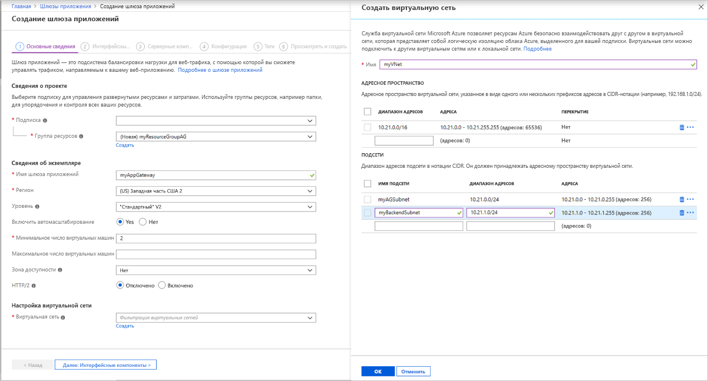
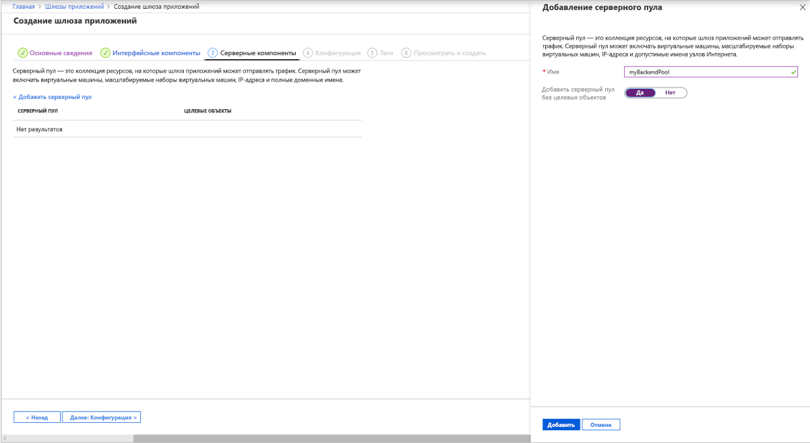
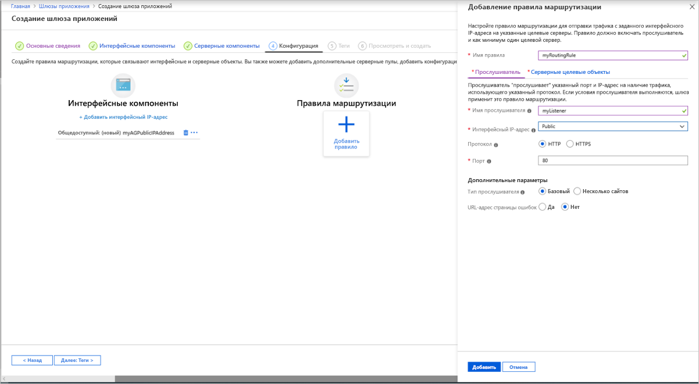
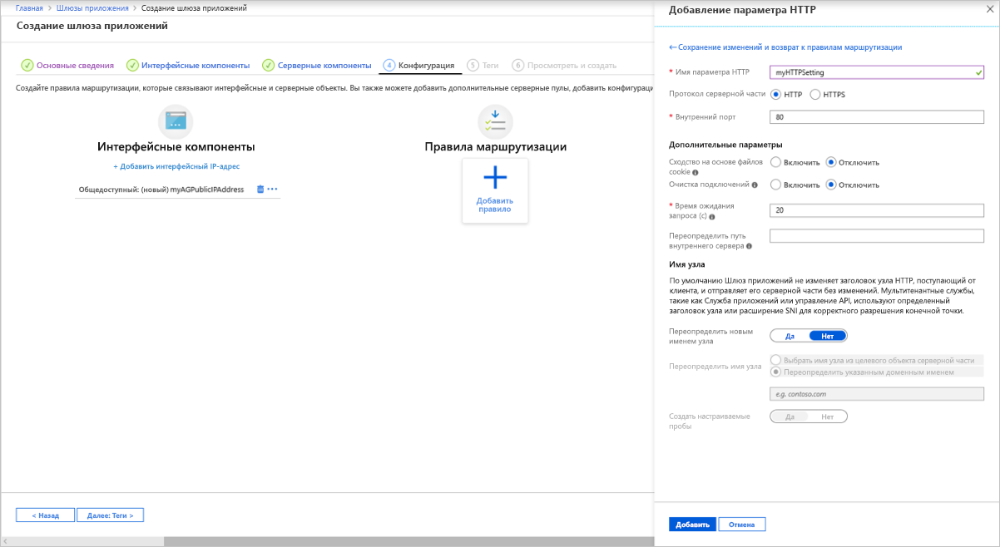
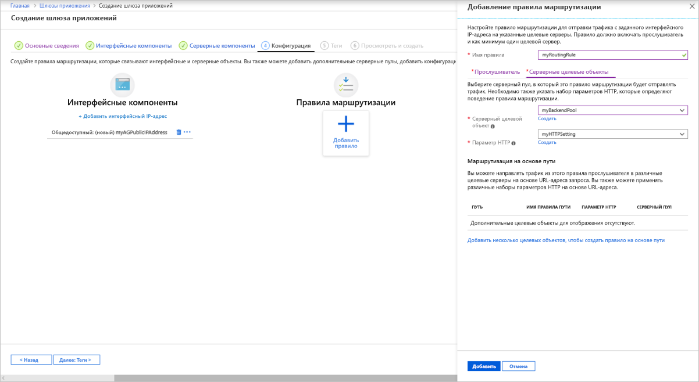

# <a name="quickstart-direct-web-traffic-with-azure-application-gateway---azure-portal"></a>Краткое руководство. Направление веб-трафика с помощью Шлюза приложений Azure на портале Azure

В этом кратком руководстве рассказывается о том, как создать шлюз приложений с помощью портала Azure, а затем протестировать его, чтобы убедиться в его правильной работе. 

Шлюз приложений направляет веб-трафик приложений на определенные ресурсы в серверном пуле. Вы назначаете прослушиватели портам, создаете правила и добавляете ресурсы в серверный пул. Для простоты в этой статье используется простая настройка с открытым интерфейсным IP-адресом, базовый прослушиватель для размещения одного сайта на шлюзе приложений, базовое правило маршрутизации запросов и две виртуальные машины, используемые для серверного пула.

Инструкции в этом кратком руководстве можно также выполнить с помощью [Azure PowerShell](quick-create-powershell.md) или [Azure CLI](quick-create-cli.md).

[!INCLUDE [updated-for-az](../../includes/updated-for-az.md)]

## <a name="prerequisites"></a>Предварительные требования

- Учетная запись Azure с активной подпиской. [Создайте учетную запись](https://azure.microsoft.com/free/?WT.mc_id=A261C142F) бесплатно.

## <a name="sign-in-to-the-azure-portal"></a>Вход на портал Azure

Войдите на [портал Azure](https://portal.azure.com) с помощью своей учетной записи Azure.

## <a name="create-an-application-gateway"></a>Создание шлюза приложений

Вы создадите шлюз приложений с помощью вкладок на странице **Создание шлюза приложений**.

1. На **домашней странице** или в меню портала Azure выберите **Создать ресурс**. Появится окно **Создать**.

2. Выберите **Сети**, а затем в списке **Рекомендованные** выберите **Шлюз приложений**.

### <a name="basics-tab"></a>Вкладка "Основные сведения"

1. На вкладке **Основные сведения** введите значения для следующих параметров шлюза приложений.

   - **Группа ресурсов.** Выберите **myResourceGroupAG** для группы ресурсов. Выберите **Создать** для создания группы ресурсов, если она еще не существует.
   - **Имя шлюза приложений**. Введите *myAppGateway* для имени шлюза приложений.

     

2. В Azure для обмена между создаваемыми ресурсами необходима виртуальная сеть. Вы можете создать новую виртуальную сеть или использовать существующую. В этом примере вы можете создать виртуальную сеть одновременно со шлюзом приложений. Экземпляры Шлюза приложений создаются в отдельных подсетях. В этом примере создаются две подсети: одна — для шлюза приложений, а вторая — для внутренних серверов.

    > [!NOTE]
    > [Политики конечных точек служб для виртуальной сети](../virtual-network/virtual-network-service-endpoint-policies-overview.md) в настоящее время не поддерживаются в подсети Шлюза приложений.

    В разделе **Настройка виртуальной сети** создайте новую виртуальную сеть, выбрав команду **Создать**. В открывшемся окне **Создание виртуальной сети** введите следующие значения, которые будут использоваться для создания виртуальной сети и двух подсетей.

    - **Name** (Имя). Введите *myVNet* для имени виртуальной сети.

    - **Имя подсети** (Подсеть шлюза приложений). В сетке **Подсети** будет показана подсеть с именем *По умолчанию*. Измените имя этой подсети на *myAGSubnet*.<br>Подсеть шлюза приложений может содержать только шлюзы приложений. Другие ресурсы запрещены.

    - **Имя подсети** (подсеть внутреннего сервера). Во второй строке таблицы **Подсети** введите *myBackendSubnet* в столбце **Имя подсети**.

    - **Диапазон адресов** (подсеть внутреннего сервера). Во второй строке таблицы **Подсети** введите диапазон адресов, которые не пересекаются с диапазоном адресов *myAGSubnet*. Например, если диапазон адресов *myAGSubnet* равен 10.0.0.0/24, введите *10.0.1.0/24* для диапазона адресов *myBackendSubnet*.

    Выберите **ОК**, чтобы закрыть окно **Создание виртуальной сети** и сохранить настройки виртуальной сети.

     
    
3. На вкладке **Основные сведения** примите значения по умолчанию для других параметров и выберите **Далее: интерфейсные серверы**.

### <a name="frontends-tab"></a>Вкладка "Интерфейсные серверы"

1. На вкладке **Интерфейсные серверы** убедитесь, что для параметра **Тип IP-адреса интерфейсных серверов** установлено значение **Общедоступный**. <br>Вы можете настроить общедоступный интерфейсный или частный IP-адрес, согласно вашему варианту использования. В этом примере мы будем использовать общедоступный интерфейсный IP-адрес.
   > [!NOTE]
   > Для этого номера SKU Шлюза приложений версии 2 нужно предоставить только **общедоступную** интерфейсную IP-конфигурацию. Вы по-прежнему можете использовать общедоступную и частную IP-конфигурацию, но частная IP-конфигурация (только в режиме ILB) сейчас отключена для SKU версии 2. 

2. Выберите команду **Создать** для **Общедоступного IP-адреса** и введите *myAGPublicIPAddress* в качестве имени общедоступного IP-адреса, а затем щелкните **ОК**. 

     

3. По завершении выберите **Next: серверные компоненты**.

### <a name="backends-tab"></a>Вкладка "Серверные компоненты"

Серверный пул используется для перенаправления запросов на внутренние серверы, на которых обслуживается запрос. Внутренние пулы могут состоять из сетевых адаптеров, масштабируемых наборов виртуальных машин, общедоступных IP-адресов, внутренних IP-адресов, полных доменных имен и таких мультитенантых серверных частей, как служба приложений Azure. В этом примере вы создадите пустой серверный пул со своим шлюзом приложений, а затем добавите в этот серверный пул целевые объекты.

1. На вкладке **Серверные компоненты** выберите **Добавить внутренний пул**.

2. В открывшемся окне **Добавить внутренний пул** введите следующие значения для создания пустого внутреннего пула.

    - **Name** (Имя). Введите *myBackendPool* в качестве имени внутреннего пула.
    - **Добавление внутреннего пула без целей**. Чтобы создать серверный пул без целевых объектов, выберите **Да**. После создания шлюза приложения вы добавите серверные целевые объекты.

3. В окне **Добавление внутреннего пула** выберите **Добавить**, чтобы сохранить конфигурацию внутреннего пула и вернуться на вкладку **Серверные компоненты**.

     

4. На вкладке **Серверные компоненты** выберите **Далее: конфигурация**.

### <a name="configuration-tab"></a>Вкладка "Конфигурация"

На вкладке **Конфигурация** созданный интерфейсный и внутренний пул подключается с помощью правила маршрутизации.

1. Выберите **Добавить правило** в столбце **Правила маршрутизации**.

2. В открывшемся окне **Добавление правила маршрутизации** введите *myRoutingRule* в поле **Имя правила**.

3. Для правила маршрутизации требуется прослушиватель. На вкладке **Прослушиватель** в окне **Добавление правила маршрутизации** введите следующие значения для прослушивателя.

    - **Имя прослушивателя**. Введите *myListener* в качестве имени прослушивателя.
    - **Интерфейсный IP-адрес**. Выберите **Общедоступные**, чтобы выбрать общедоступный IP-адрес, который вы создали для интерфейсных серверов.
  
      Примите значения по умолчанию для других параметров на вкладке **Прослушиватель**, а затем выберите вкладку **Серверные целевые объекты**, чтобы настроить остальную часть правила маршрутизации.

   

4. На вкладке **Серверные целевые объекты** выберите значение **myBackendPool** для параметра **Серверный целевой объект**.

5. Для **Параметр HTTP** выберите **Создать**, чтобы создать новый параметр HTTP. Параметр HTTP будет определять поведение правила маршрутизации. В открывшемся окне **Добавление параметра HTTP** введите *myHTTPSetting* в поле **Имя параметра HTTP** и *80* в поле **Внутренний порт**. Примите значения по умолчанию для других параметров в окне **Добавление параметра HTTP**, затем выберите **Добавить**, чтобы вернуться к окну **Добавление правила маршрутизации**. 

     

6. В окне **Добавление правила маршрутизации** выберите **Добавить**, чтобы сохранить правило маршрутизации и вернуться на вкладку **Конфигурация**.

     

7. По завершении выберите **Next: Теги** , а затем **Далее: Отзыв и создание**.

### <a name="review--create-tab"></a>Вкладка "Просмотр и создание"

Просмотрите параметры на вкладке **Просмотр и создание**, а затем выберите **Создать**, чтобы создать виртуальную сеть, общедоступный IP-адрес и шлюз приложения. Создание шлюза приложений в Azure может занять несколько минут. Дождитесь успешного завершения развертывания перед переходом к следующему разделу.

## <a name="add-backend-targets"></a>Добавление серверных целевых объектов

В этом примере мы будем использовать виртуальные машины в качестве целевых объектов серверной части. Вы можете использовать существующие виртуальные машины или создать новые. Вы создадите две виртуальные машины, которые будут использоваться как внутренние серверы для шлюза приложений.

Для этого сделайте следующее:

1. Создайте две виртуальные машины (*myVM* и *myVM2*), которые будут использоваться в качестве внутренних серверов.
2. Установить службы IIS на виртуальных машинах, чтобы убедиться, что шлюз приложений успешно создан.
3. Добавить внутренние серверы к внутренним пулам.

### <a name="create-a-virtual-machine"></a>Создание виртуальной машины

1. На **домашней странице** или в меню портала Azure выберите **Создать ресурс**. Появится окно **Создать**.
2. Выберите **Windows Server 2016 Datacenter** в списке **Популярные**. Появится страница **Создание виртуальной машины**.<br>Шлюз приложений может осуществлять маршрутизацию трафика для любого типа виртуальной машины, используемой в этом внутреннем пуле. В этом примере используется Windows Server 2016 Datacenter.
3. На вкладке **Основы** введите для следующих параметров виртуальной машины такие значения:

    - **Группа ресурсов.** Выберите **myResourceGroupAG** для имени группы ресурсов.
    - **Имя виртуальной машины**. Введите *myVM* для имени виртуальной машины.
    - **Регион**. Выберите тот же регион, в котором вы создали шлюз приложений.
    - **Имя пользователя**. Введите имя пользователя с правами администратора.
    - **Пароль**. Введите пароль.
    - **Общедоступные входящие порты**. Нет.
4. Примите остальные значения по умолчанию и щелкните **Далее: Диски**.  
5. Примите значения по умолчанию на вкладке **Диски**, а затем выберите **Далее: Сети**.
6. На вкладке **Сети** убедитесь, что для параметра **Виртуальная сеть** выбрано значение **myVNet**, а для параметра **Подсеть** — значение **myBackendSubnet**. Примите остальные значения по умолчанию и щелкните **Далее: управление**.<br>Шлюз приложений может взаимодействовать с экземплярами за пределами виртуальной сети, к которой он относится, при наличии подключения по IP-адресу.
7. На вкладке **Управление** для параметра **Диагностика загрузки** задайте значение **Отключить**. Примите другие значения по умолчанию и выберите **Review + create** (Просмотр и создание).
8. На вкладке **Review + create** (Просмотр и создание) проверьте параметры, устраните ошибки проверки, а затем выберите **Создать**.
9. Прежде чем продолжить, дождитесь завершения создания виртуальной машины.

### <a name="install-iis-for-testing"></a>Установка служб IIS для тестирования

В этом примере службы IIS устанавливаются на виртуальные машины, чтобы проверить, создан ли шлюз приложений в Azure.

1. Откройте Azure PowerShell. Выберите **Cloud Shell** на верхней панели навигации портала Azure, а затем выберите **PowerShell** из раскрывающегося списка. 

    

2. Чтобы установить службы IIS, выполните на виртуальной машине приведенные ниже команды. При необходимости измените значение параметра *Расположение*. 

    ```azurepowershell
    Set-AzVMExtension `
      -ResourceGroupName myResourceGroupAG `
      -ExtensionName IIS `
      -VMName myVM `
      -Publisher Microsoft.Compute `
      -ExtensionType CustomScriptExtension `
      -TypeHandlerVersion 1.4 `
      -SettingString '{"commandToExecute":"powershell Add-WindowsFeature Web-Server; powershell Add-Content -Path \"C:\\inetpub\\wwwroot\\Default.htm\" -Value $($env:computername)"}' `
      -Location EastUS
    ```

3. Создайте вторую виртуальную машину и установите IIS, следуя только что выполненным инструкциям. Используйте *myVM2* в качестве имени виртуальной машины и параметр **VMName** для командлета **Set-AzVMExtension**.

### <a name="add-backend-servers-to-backend-pool"></a>Добавление серверов во внутренние пулы

1. В меню портала Azure выберите **Все ресурсы** или выполните поиск и выберите *Все ресурсы*. Затем выберите **myAppGateway**.

2. Выберите **Серверные пулы** в меню слева.

3. Выберите **myBackendPool**.

4. В разделе **Серверные целевые объекты**, **Тип целевого объекта** выберите **Виртуальная машина** из раскрывающегося списка.

5. В столбце **Целевой объект** выберите виртуальные машины **myVM** и **myVM2**, а также связанные с ними сетевые интерфейсы из раскрывающихся списков.

   > [!div class="mx-imgBorder"]
   > 

6. Щелкните **Сохранить**.

7. Прежде чем переходить к следующему шагу, дождитесь завершения развертывания.

## <a name="test-the-application-gateway"></a>Тестирование шлюза приложений

Для создания шлюза приложений не требуется устанавливать службы IIS. Но в рамках этого руководства они устанавливаются, чтобы проверить, создан ли он. Используйте IIS для тестирования шлюза приложений.

1. На странице **Обзор** найдите общедоступный IP-адрес для шлюза приложений. . В качестве альтернативы вы можете выбрать **Все ресурсы** и ввести в поисковое поле *myAGPublicIPAddress*, а затем выбрать этот адрес из результатов поиска. Общедоступный IP-адрес отобразится в Azure на странице **Обзор**.
2. Чтобы перейти по общедоступному IP-адресу, скопируйте и вставьте его в адресную строку браузера.
3. Проверьте ответ. Допустимый ответ подтверждает, что шлюз приложений создан и может успешно подключиться к серверу.

   

   Обновите браузер несколько раз, чтобы отобразились сведения о подключениях к myVM и myVM2.

## <a name="clean-up-resources"></a>Очистка ресурсов

Если вам уже не нужны ресурсы, созданные с помощью шлюза приложений, удалите группу ресурсов. При этом будут удалены шлюз приложений и все связанные с ним ресурсы.

Чтобы удалить группу ресурсов, сделайте следующее:

1. В меню портала Azure выберите **Группы ресурсов** или выполните поиск по запросу *Группы ресурсов* и выберите этот пункт.
2. На странице **Группы ресурсов** выполните поиск группы **myResourceGroupAG** в списке и выберите ее.
3. На странице **группы ресурсов** выберите **Удалить группу ресурсов**.
4. Введите *myResourceGroupAG* в поле **Введите имя группы ресурсов**, а затем выберите **Удалить**.

## <a name="next-steps"></a>Дальнейшие действия

> [!div class="nextstepaction"]
> [Руководство. Настройка шлюза приложений с завершением TSL-запросов с помощью портала Azure](create-ssl-portal.md)
