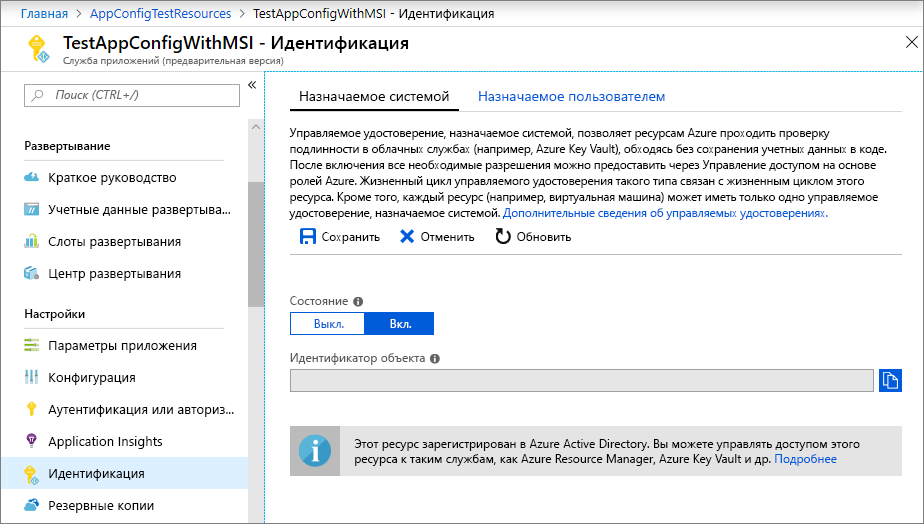
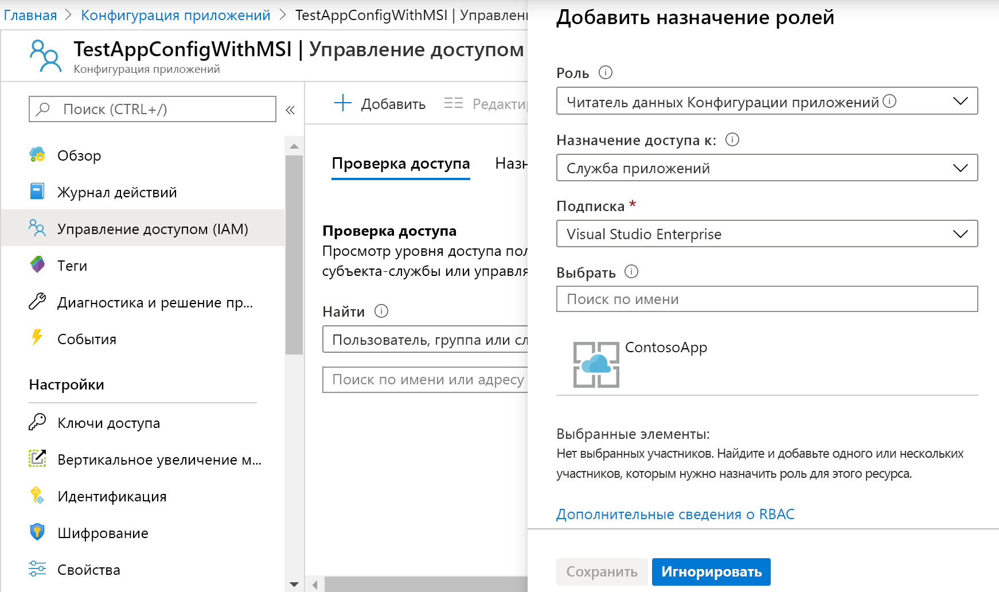

# <a name="integrate-with-azure-managed-identities"></a>Интеграция с управляемыми удостоверениями Azure

[Управляемые идентификаторами](../active-directory/managed-identities-azure-resources/overview.md) Azure Active Directory упрощают управление секретами для облачного приложения. С управляемым итеворным код может использовать основной службы, созданный для службы Azure, на которой он работает. Вы используете управляемое удостоверение, а не отдельные учетные данные, хранящиеся в Azure Key Vault, или локальную строку подключения. 

Конфигурация приложений Azure и его ядро .NET, .NET Framework и клиентские библиотеки Java Spring создали встроенную в них идентификационную поддержку. Хотя вы не обязаны использовать его, управляемый интилита устраняет необходимость в маркере доступа, который содержит секреты. Ваш код может получить доступ к магазину Конфигурации Приложений, используя только конечную точку службы. Вы можете вставлять этот URL-адрес в свой код непосредственно, не раскрывая секрета.

В этой статье показано, как можно воспользоваться управляемой идентификацией для доступа к конфигурации приложений. При этом в качестве основы используется код веб-приложения, представленный в кратких руководствах. Прежде чем продолжить работу, сначала [создайте ASP.NET приложение Core с конфигурацией приложений.](./quickstart-aspnet-core-app.md)

В этой статье также показано, как можно использовать управляемую идентификацию в сочетании со ссылками На ключевое убежище конфигурации Приложения. С помощью одного управляемого удостоверения вы можете беспрепятственно получить доступ к как секретам из Key Vault, так и значениям конфигурации из конфигурации приложений. Если вы хотите изучить эту возможность, сначала закончите использовать ссылки на [key Vault с ASP.NET Core.](./use-key-vault-references-dotnet-core.md)

Вы можете выполнять шаги в этом учебнике с помощью любого редактора кода. [Visual Studio Code](https://code.visualstudio.com/) является отличным вариантом, который доступен на платформах Windows, macOS и Linux.

Вы узнаете, как выполнять следующие задачи:

> [!div class="checklist"]
> * предоставление доступа к службе "Конфигурация приложений" с помощью управляемого удостоверения;
> * настройка приложения на использование управляемого удостоверения при подключении к службе "Конфигурация приложений".
> * Дополнительно назначьте приложение, чтобы использовать управляемую идентификацию при подключении к Key Vault через ссылку App Configuration Key Vault.

## <a name="prerequisites"></a>Предварительные требования

Для работы с этим руководством требуется:

* [.NET Core SDK](https://www.microsoft.com/net/download/windows).
* [настроенный Azure Cloud Shell](https://docs.microsoft.com/azure/cloud-shell/quickstart).

[!INCLUDE [quickstarts-free-trial-note](../../includes/quickstarts-free-trial-note.md)]

## <a name="add-a-managed-identity"></a>Добавление управляемого удостоверения

Чтобы настроить управляемую идентификацию на портале, вы сначала создаете приложение, а затем включите функцию.

1. Создайте экземпляр службы приложений на [портале Azure,](https://portal.azure.com) как это обычно делается. Перейдите к нему на портале.

1. Прокрутите вниз до группы **параметров** в левой панели и выберите **Удостоверение**.

1. На вкладке **Назначено системой** для параметра **Состояние** установите значение **Вкл.** и выберите **Сохранить**.

1. ОтветЬте **Да,** когда побуждено включить систему, назначенную управляемой иденносной.

    

## <a name="grant-access-to-app-configuration"></a>Предоставление доступа к службе "Конфигурация приложений"

1. На [портале Azure](https://portal.azure.com)выберите **все ресурсы** и выберите магазин конфигурации приложений, созданный в quickstart.

1. Выберите **элемент управления доступом (IAM)**.

1. На вкладке **Проверить доступ** щелкните **Добавить** в пользовательском интерфейсе карточки **Добавить назначение роли**.

1. Под **ролью**, выберите **App Configuration Data Reader**. В поле **Назначение доступа к** задайте значение **Служба приложений** (в разделе **Управляемое удостоверение, назначаемое системой**).

1. В поле **Подписка** выберите подписку Azure. Выберите ресурс Службы приложений для своего приложения.

1. Нажмите кнопку **Сохранить**.

    

1. Дополнительно: Если вы хотите предоставить доступ к Key Vault, а также, следуйте указаниям в [Provide Key Vault аутентификации с управляемой идентификации.](https://docs.microsoft.com/azure/key-vault/managed-identity)

## <a name="use-a-managed-identity"></a>Использование управляемого удостоверения

1. Добавьте ссылку на пакет *Azure.Identity:*

    ```cli
    dotnet add package Azure.Identity
    ```

1. Найдите конечную точку в магазине конфигурации приложений. Этот URL-адрес указан на вкладке **ключей доступа** для магазина на портале Azure.

1. Откройте *appsettings.json* и добавьте следующий скрипт. Замените service_endpoint * \<>, *включая скобки, URL-адрес в магазине конфигурации приложений. 

    ```json
    "AppConfig": {
        "Endpoint": "<service_endpoint>"
    }
    ```

1. Откройте *Program.cs*и добавьте `Azure.Identity` `Microsoft.Azure.Services.AppAuthentication` ссылку на области имен:

    ```csharp-interactive
    using Azure.Identity;
    ```

1. Если вы хотите получить доступ только к значениям, хранящимся непосредственно в конфигурации приложения, обновите `CreateWebHostBuilder` метод, заменив `config.AddAzureAppConfiguration()` метод.

    > [!IMPORTANT]
    > `CreateHostBuilder` заменяет `CreateWebHostBuilder` в .NET Core 3.0.  Выберите правильный синтаксис в зависимости от среды.

    ### <a name="net-core-2x"></a>[.NET Core 2.x](#tab/core2x)

    ```csharp
        public static IWebHostBuilder CreateWebHostBuilder(string[] args) =>
            WebHost.CreateDefaultBuilder(args)
                .ConfigureAppConfiguration((hostingContext, config) =>
                {
                    var settings = config.Build();
                    config.AddAzureAppConfiguration(options =>
                        options.Connect(new Uri(settings["AppConfig:Endpoint"]), new ManagedIdentityCredential()));
                })
                .UseStartup<Startup>();
    ```

    ### <a name="net-core-3x"></a>[.NET Core 3.x](#tab/core3x)

    ```csharp
        public static IHostBuilder CreateHostBuilder(string[] args) =>
            Host.CreateDefaultBuilder(args)
            .ConfigureWebHostDefaults(webBuilder =>
            webBuilder.ConfigureAppConfiguration((hostingContext, config) =>
            {
                var settings = config.Build();
                    config.AddAzureAppConfiguration(options =>
                        options.Connect(new Uri(settings["AppConfig:Endpoint"]), new ManagedIdentityCredential()));
                })
                .UseStartup<Startup>());
    ```
    ---

1. Чтобы использовать как значения конфигурации приложений, так и ссылки Key Vault, обновите *Program.cs,* как показано ниже. Этот код создает `KeyVaultClient` новый с помощью `AzureServiceTokenProvider` и `UseAzureKeyVault` передает эту ссылку на вызов метода.

    ### <a name="net-core-2x"></a>[.NET Core 2.x](#tab/core2x)

    ```csharp
            public static IWebHostBuilder CreateWebHostBuilder(string[] args) =>
                WebHost.CreateDefaultBuilder(args)
                    .ConfigureAppConfiguration((hostingContext, config) =>
                    {
                        var settings = config.Build();
                        var credentials = new ManagedIdentityCredential();

                        config.AddAzureAppConfiguration(options =>
                        {
                            options.Connect(new Uri(settings["AppConfig:Endpoint"]), credentials)
                                    .ConfigureKeyVault(kv =>
                                    {
                                        kv.SetCredential(credentials);
                                    });
                        });
                    })
                    .UseStartup<Startup>();
    ```

    ### <a name="net-core-3x"></a>[.NET Core 3.x](#tab/core3x)

    ```csharp
        public static IHostBuilder CreateHostBuilder(string[] args) =>
            Host.CreateDefaultBuilder(args)
            .ConfigureWebHostDefaults(webBuilder =>
            webBuilder.ConfigureAppConfiguration((hostingContext, config) =>
                    {
                        var settings = config.Build();
                        var credentials = new ManagedIdentityCredential();

                        config.AddAzureAppConfiguration(options =>
                        {
                            options.Connect(new Uri(settings["AppConfig:Endpoint"]), credentials)
                                    .ConfigureKeyVault(kv =>
                                    {
                                        kv.SetCredential(credentials);
                                    });
                        });
                    })
                    .UseStartup<Startup>());
    ```
    ---

    Теперь вы можете получить доступ к ссылкам Key Vault, как и к любому другому ключу конфигурации приложений. Поставщик конфигураций будет `KeyVaultClient` использовать настроенное для проверки подлинности в Key Vault и получения значения.

[!INCLUDE [Prepare repository](../../includes/app-service-deploy-prepare-repo.md)]

## <a name="deploy-from-local-git"></a>Развертывание из локального репозитория Git

Самый простой способ локального развертывания Git для вашего приложения с сервером сборки Kudu — использовать [Azure Cloud Shell.](https://shell.azure.com)

### <a name="configure-a-deployment-user"></a>Настойка пользователя развертывания

[!INCLUDE [Configure a deployment user](../../includes/configure-deployment-user-no-h.md)]

### <a name="enable-local-git-with-kudu"></a>Включить локальный Git с помощью Kudu
Если у вас нет локального репозитория git для вашего приложения, вам нужно его инициализировать. Чтобы инициализировать локальный репозиторий git, запустите следующие команды из каталога проектов приложения:

```cmd
git init
git add .
git commit -m "Initial version"
```

Чтобы включить локальное развертывание Git для вашего [`az webapp deployment source config-local-git`](/cli/azure/webapp/deployment/source?view=azure-cli-latest#az-webapp-deployment-source-config-local-git) приложения с сервером сборки Kudu, запустите в Облачной оболочке.

```azurecli-interactive
az webapp deployment source config-local-git --name <app_name> --resource-group <group_name>
```

Эта команда дает вам что-то похожее на следующий вывод:

```json
{
  "url": "https://<username>@<app_name>.scm.azurewebsites.net/<app_name>.git"
}
```

### <a name="deploy-your-project"></a>Развертывание проекта

В _окне локального терминала_добавьте пульт дистанционного управления Azure в локальное хранилище Git. Заменить _ \<URL->_ URL-адресом пульта дистанционного управления Git, который вы получили от [Включить локальный Git с Kudu.](#enable-local-git-with-kudu)

```bash
git remote add azure <url>
```

Отправьте код в удаленное приложение Azure, чтобы развернуть приложение. Когда появится запрос на ввод пароля, введите пароль, созданный в разделе [Настройка пользователя развертывания](#configure-a-deployment-user). Не используйте пароль, который вы используете для входа на портал Azure.

```bash
git push azure master
```

В выходных данных могут отображаться автоматизированные операции среды выполнения, например MSBuild для ASP.NET, `npm install` для Node.js и `pip install` для Python.

### <a name="browse-to-the-azure-web-app"></a>Переход к веб-приложению Azure

Перейдите к своему веб-приложению с помощью браузера, чтобы убедиться, что содержимое развернуто.

```bash
http://<app_name>.azurewebsites.net
```

## <a name="use-managed-identity-in-other-languages"></a>Использование управляемого удостоверения с другими языками

Поставщики службы "Конфигурация приложений" для платформы .NET Framework и Java Spring также имеют встроенную поддержку управляемых удостоверений. При настройке одного из этих поставщиков можно использовать конечную точку URL-адреса магазина вместо строки полного подключения. 

Например, можно обновить консоль .NET, созданное в быстром запуске, чтобы указать следующие настройки в файле *App.config:*

```xml
    <configSections>
        <section name="configBuilders" type="System.Configuration.ConfigurationBuildersSection, System.Configuration, Version=4.0.0.0, Culture=neutral, PublicKeyToken=b03f5f7f11d50a3a" restartOnExternalChanges="false" requirePermission="false" />
    </configSections>

    <configBuilders>
        <builders>
            <add name="MyConfigStore" mode="Greedy" endpoint="${Endpoint}" type="Microsoft.Configuration.ConfigurationBuilders.AzureAppConfigurationBuilder, Microsoft.Configuration.ConfigurationBuilders.AzureAppConfiguration" />
            <add name="Environment" mode="Greedy" type="Microsoft.Configuration.ConfigurationBuilders.EnvironmentConfigBuilder, Microsoft.Configuration.ConfigurationBuilders.Environment" />
        </builders>
    </configBuilders>

    <appSettings configBuilders="Environment,MyConfigStore">
        <add key="AppName" value="Console App Demo" />
        <add key="Endpoint" value ="Set via an environment variable - for example, dev, test, staging, or production endpoint." />
    </appSettings>
```

## <a name="clean-up-resources"></a>Очистка ресурсов

[!INCLUDE [azure-app-configuration-cleanup](../../includes/azure-app-configuration-cleanup.md)]

## <a name="next-steps"></a>Дальнейшие действия
В этом уроке вы добавили управляемое идентификатором Azure, чтобы упорядочить доступ к конфигурации приложений и улучшить управление учетными данными для вашего приложения. Чтобы узнать больше об использовании службы "Конфигурация приложений", перейдите к примерам скриптов Azure CLI.

> [!div class="nextstepaction"]
> [Примеры интерфейса командной строки](./cli-samples.md)
