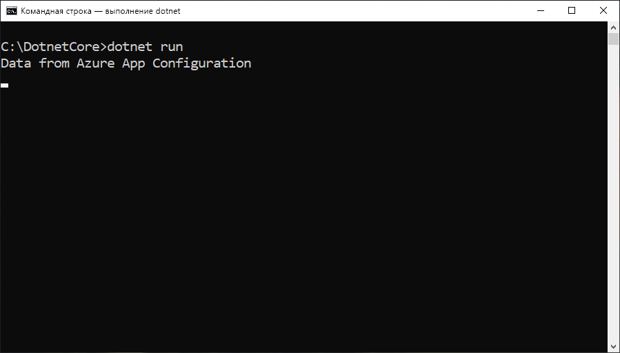

# <a name="quickstart-create-a-net-core-app-with-app-configuration"></a>Краткое руководство. Создание приложения .NET Core с помощью службы "Конфигурация приложений"

Конфигурация приложений Azure — это служба для управления конфигурациями в Azure. С ее помощью вы можете централизовано хранить и администрировать все параметры приложения отдельно от кода. В этом кратком руководстве показано, как интегрировать службу с консольным приложением .NET Core.

Шаги из этого краткого руководства можно выполнять в любом редакторе кода. [Visual Studio Code](https://code.visualstudio.com/) является отличным вариантом, который доступен на платформах Windows, macOS и Linux.



## <a name="prerequisites"></a>Предварительные требования

Для работы с этим кратким руководством установите [пакет SDK для .NET Core](https://dotnet.microsoft.com/download).

[!INCLUDE [quickstarts-free-trial-note](../../includes/quickstarts-free-trial-note.md)]

## <a name="create-an-app-configuration-store"></a>Создание хранилища конфигураций приложений

[!INCLUDE [azure-app-configuration-create](../../includes/azure-app-configuration-create.md)]

6. Выберите **Обозреватель ключей и значений** > **+ Создать**, чтобы добавить следующие пары "ключ-значение":

    | Ключ | Значение |
    |---|---|
    | TestApp:Settings:FontSize | Данные из конфигурации приложения Azure |

    Поля **Метка** и **Тип контента** пока заполнять не нужно.

## <a name="create-a-net-core-console-app"></a>Создание консольного приложения .NET Core

Чтобы создать проект консольного приложения .NET Core, вы будете использовать [интерфейс командной строки .NET Core](https://docs.microsoft.com/dotnet/core/tools/). Преимущество использования .NET Core CLI по сравнению с Visual Studio заключается в том, что он доступен на платформах Windows, macOS и Linux.

1. Создайте новый каталог для своего проекта

2. В новой папке выполните следующую команду, чтобы создать проект веб-приложения MVC для ASP.NET Core:

        dotnet new console

## <a name="connect-to-an-app-configuration-store"></a>Подключение к хранилищу конфигураций приложений

1. Добавьте ссылку на пакет NuGet `Microsoft.Extensions.Configuration.AzureAppConfiguration`, выполнив следующую команду:

        dotnet add package Microsoft.Extensions.Configuration.AzureAppConfiguration --version 1.0.0-preview-007830001

2. Выполните следующую команду, чтобы восстановить пакеты проекта:

        dotnet restore

3. Откройте файл *Program.cs* и добавьте ссылку на поставщик конфигурации .NET Core для службы "Конфигурация приложений".

    ```csharp
    using Microsoft.Extensions.Configuration;
    using Microsoft.Extensions.Configuration.AzureAppConfiguration;
    ```

4. Обновите метод `Main`, чтобы использовать службу "Конфигурация приложений", путем вызова метода `builder.AddAzureAppConfiguration()`.

    ```csharp
    static void Main(string[] args)
    {
        var builder = new ConfigurationBuilder();
        builder.AddAzureAppConfiguration(Environment.GetEnvironmentVariable("ConnectionString"));

        var config = builder.Build();
        Console.WriteLine(config["TestApp:Settings:Message"] ?? "Hello world!");
    }
    ```

## <a name="build-and-run-the-app-locally"></a>Создание и запуск приложения локально

1. Задайте переменную среды с именем **ConnectionString** и укажите для нее ключ доступа к хранилищу конфигураций приложений. Если вы используете командную строку Windows, выполните следующую команду и перезапустите командную строку, чтобы изменения вступили в силу:

        setx ConnectionString "connection-string-of-your-app-configuration-store"

    Если вы используете Windows PowerShell, выполните следующую команду:

        $Env:ConnectionString = "connection-string-of-your-app-configuration-store"

    Если вы используете macOS или Linux, выполните следующую команду:

        export ConnectionString='connection-string-of-your-app-configuration-store'

2. Чтобы создать консольное приложение, выполните следующую команду:

        dotnet build

3. Когда создание завершится, запустите приложение локально с помощью следующей команды:

        dotnet run

## <a name="clean-up-resources"></a>Очистка ресурсов

[!INCLUDE [azure-app-configuration-cleanup](../../includes/azure-app-configuration-cleanup.md)]

## <a name="next-steps"></a>Дополнительная информация

В этом кратком руководстве вы создали хранилище конфигураций приложения и использовали его с консольным приложением .NET Core с помощью [поставщика Конфигурации приложений](https://go.microsoft.com/fwlink/?linkid=2074664). Ознакомьтесь с дополнительными сведениями об использовании службы "Конфигурация приложений" в следующем учебнике, посвященном проверке подлинности.

> [!div class="nextstepaction"]
> [Руководство по интеграции с управляемыми удостоверениями Azure](./howto-integrate-azure-managed-service-identity.md)
