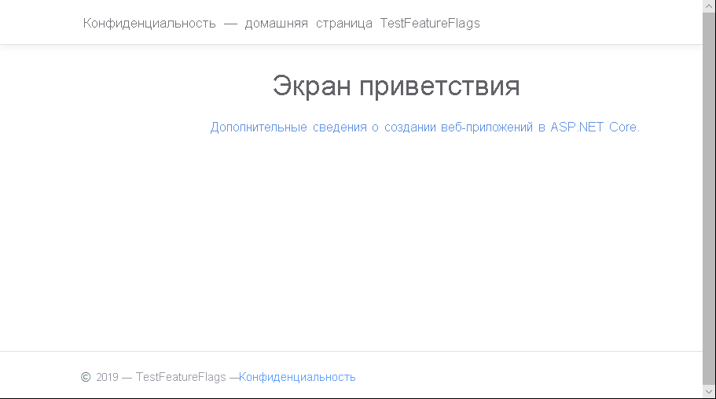
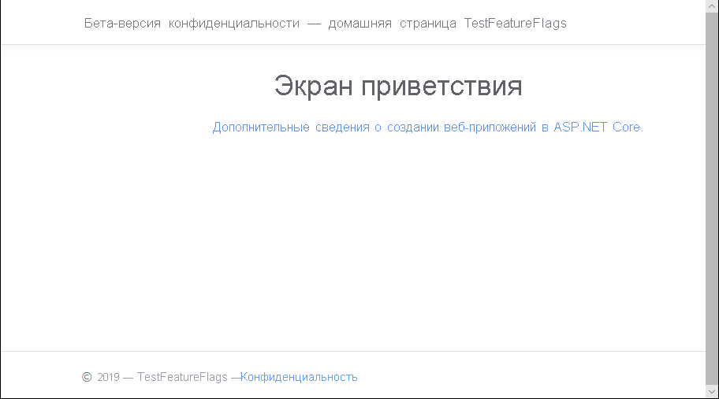

# <a name="quickstart-add-feature-flags-to-an-aspnet-core-app"></a>Краткое руководство. Добавление флагов функций в приложение ASP.NET Core

Чтобы управлять функциями в ASP.NET Core, можно подключить свое приложение к Конфигурации приложений Azure. С помощью этой управляемой службы можно централизованно хранить все флаги функций и управлять их состояниями. В этом кратком руководстве показано, как внедрить данную службу в веб-приложение ASP.NET Core, чтобы реализовать комплексное управление функциями.

Библиотеки управления функциями .NET Core расширяют возможности платформы за счет всесторонней поддержки флагов функций. Они создаются на основе системы конфигурации .NET Core. Они легко интегрируются с Конфигурацией приложений посредством поставщика конфигураций .NET Core.

Шаги из этого краткого руководства можно выполнять в любом редакторе кода. [Visual Studio Code](https://code.visualstudio.com/) является отличным вариантом, который доступен на платформах Windows, macOS и Linux.

## <a name="prerequisites"></a>Предварительные требования

Для работы с этим кратким руководством установите [пакет SDK для .NET Core](https://dotnet.microsoft.com/download).

[!INCLUDE [quickstarts-free-trial-note](../../includes/quickstarts-free-trial-note.md)]

## <a name="create-an-app-configuration-store"></a>Создание хранилища конфигураций приложений

[!INCLUDE [azure-app-configuration-create](../../includes/azure-app-configuration-create.md)]

6. Выберите **Feature Manager** (Диспетчер функций)  > **+ Создать**, чтобы добавить следующие флаги функций.

    | Ключ | Состояние |
    |---|---|
    | Beta | Отключить |

## <a name="create-an-aspnet-core-web-app"></a>Создание веб-приложения ASP.NET Core

Используйте [интерфейс командной строки .NET Core](https://docs.microsoft.com/dotnet/core/tools/) для создания проекта веб-приложения MVC для ASP.NET Core. Преимущество использования .NET Core CLI по сравнению с Visual Studio заключается в том, что он доступен на платформах Windows, macOS и Linux.

1. Создайте новый каталог для своего проекта В этом кратком руководстве назовите его *TestFeatureFlags*.

2. В новой папке выполните следующую команду, чтобы создать проект веб-приложения MVC для ASP.NET Core:

        dotnet new mvc

## <a name="add-secret-manager"></a>Добавление диспетчера секретов

Добавьте в проект [инструмент "Диспетчер секретов"](https://docs.microsoft.com/aspnet/core/security/app-secrets). Инструмент "Диспетчер секретов" хранит конфиденциальные данные для разработки вне вашего дерева проектов. Этот подход помогает предотвратить случайный обмен секретами приложений в исходном коде.

- Откройте *CSPROJ*-файл. Добавьте элемент `UserSecretsId`, как показано здесь, и замените его своим значением, которое обычно является идентификатором GUID. Сохраните файл.

    ```xml
    <Project Sdk="Microsoft.NET.Sdk.Web">

    <PropertyGroup>
        <TargetFramework>netcoreapp2.1</TargetFramework>
        <UserSecretsId>79a3edd0-2092-40a2-a04d-dcb46d5ca9ed</UserSecretsId>
    </PropertyGroup>

    <ItemGroup>
        <PackageReference Include="Microsoft.AspNetCore.App" />
        <PackageReference Include="Microsoft.AspNetCore.Razor.Design" Version="2.1.2" PrivateAssets="All" />
    </ItemGroup>

    </Project>
    ```

## <a name="connect-to-an-app-configuration-store"></a>Подключение к хранилищу конфигураций приложений

1. Добавьте ссылки на пакеты NuGet `Microsoft.Extensions.Configuration.AzureAppConfiguration` и `Microsoft.FeatureManagement`, выполнив следующие команды.

        dotnet add package Microsoft.Extensions.Configuration.AzureAppConfiguration --version 1.0.0-preview-008520001

        dotnet add package Microsoft.FeatureManagement.AspNetCore --version 1.0.0-preview-008560001-910

2. Выполните следующую команду, чтобы восстановить пакеты проекта:

        dotnet restore

3. Добавьте секрет с именем *ConnectionStrings:AppConfig* в диспетчер секретов.

    Этот секрет содержит строку подключения для получения доступа к хранилищу конфигураций приложений. Замените значение в следующей команде строкой подключения для вашего хранилища конфигураций приложений.

    Эта команда должна выполняться в том же каталоге, что и файл *CSPROJ*.

        dotnet user-secrets set ConnectionStrings:AppConfig <your_connection_string>

    Диспетчер секретов используется только для локальной проверки веб-приложения. При развертывании приложения, например в [Службе приложений Azure](https://azure.microsoft.com/services/app-service/web), вы будете использовать параметр приложения **Строки подключения** в Службе приложений, а не хранить строку подключения с помощью диспетчера секретов.

    Доступ к этому секрету осуществляется с помощью API конфигурации. Двоеточие (:) используется в имени конфигурации с API конфигурации на всех поддерживаемых платформах. Дополнительные сведения см. в статье [Конфигурация в .NET Core](https://docs.microsoft.com/aspnet/core/fundamentals/configuration/index?tabs=basicconfiguration&view=aspnetcore-2.0).

4. Откройте файл *Program.cs* и добавьте ссылку на поставщик конфигурации приложений .NET Core.

    ```csharp
    using Microsoft.Extensions.Configuration.AzureAppConfiguration;
    ```

5. Обновите метод `CreateWebHostBuilder`, чтобы использовать службу "Конфигурация приложений", путем вызова метода `config.AddAzureAppConfiguration()`.

    ```csharp
    public static IWebHostBuilder CreateWebHostBuilder(string[] args) =>
        WebHost.CreateDefaultBuilder(args)
            .ConfigureAppConfiguration((hostingContext, config) =>
            {
                var settings = config.Build();
                config.AddAzureAppConfiguration(options => {
                    options.Connect(settings["ConnectionStrings:AppConfig"])
                           .UseFeatureFlags();
                });
            })
            .UseStartup<Startup>();
    ```

6. Откройте файл *Startup.cs* и добавьте в него ссылки на диспетчер функций .NET Core.

    ```csharp
    using Microsoft.FeatureManagement.AspNetCore;
    ```

7. Измените метод `ConfigureServices`, чтобы добавить поддержку флагов функций посредством вызова метода `services.AddFeatureManagement()`. Дополнительно можно указать какой-либо фильтр для флагов функций с помощью вызова `services.AddFeatureFilter<FilterType>()`.

    ```csharp
    public void ConfigureServices(IServiceCollection services)
    {
        services.AddFeatureManagement();
    }
    ```

8. Добавьте файл *MyFeatureFlags.cs*.

    ```csharp
    namespace TestFeatureFlags
    {
        public enum MyFeatureFlags
        {
            Beta
        }
    }
    ```

9. Добавьте файл *BetaController.cs* в каталог "Контроллеры".

    ```csharp
    using Microsoft.AspNetCore.Mvc;
    using Microsoft.FeatureManagement.AspNetCore;

    namespace TestFeatureFlags.Controllers
    {
        public class BetaController: Controller
        {
            private readonly IFeatureManager _featureManager;

            public BetaController(IFeatureManagerSnapshot featureManager)
            {
                _featureManager = featureManager;
            }

            [Feature(MyFeatureFlags.Beta)]
            public IActionResult Index()
            {
                return View();
            }
        }
    }
    ```

10. Откройте файл *_ViewImports.cshtml* в каталоге "Представления" и добавьте вспомогательную функцию тега диспетчера функций.

    ```html
    @addTagHelper *, Microsoft.FeatureManagement.AspNetCore
    ```

11. Откройте файл *_Layout.cshtml* в каталоге "Представления > Общие" и замените его блок `<nav>` под строкой `<body>` > `<header>` следующим кодом.

    ```html
    <nav class="navbar navbar-expand-sm navbar-toggleable-sm navbar-light bg-white border-bottom box-shadow mb-3">
        <div class="container">
            <a class="navbar-brand" asp-area="" asp-controller="Home" asp-action="Index">TestFeatureFlags</a>
            <button class="navbar-toggler" type="button" data-toggle="collapse" data-target=".navbar-collapse" aria-controls="navbarSupportedContent"
            aria-expanded="false" aria-label="Toggle navigation">
            <span class="navbar-toggler-icon"></span>
            </button>
            <div class="navbar-collapse collapse d-sm-inline-flex flex-sm-row-reverse">
                <ul class="navbar-nav flex-grow-1">
                    <li class="nav-item">
                        <a class="nav-link text-dark" asp-area="" asp-controller="Home" asp-action="Index">Home</a>
                    </li>
                    <feature name="Beta">
                    <li class="nav-item">
                        <a class="nav-link text-dark" asp-area="" asp-controller="Beta" asp-action="Index">Beta</a>
                    </li>
                    </feature>
                    <li class="nav-item">
                        <a class="nav-link text-dark" asp-area="" asp-controller="Home" asp-action="Privacy">Privacy</a>
                    </li>
                </ul>
            </div>
        </div>
    </nav>
    ```

12. Создайте каталог "Бета-версия" в каталоге "Представления" и добавьте в него файл *Index.cshtml*.

    ```html
    @{
        ViewData["Title"] = "Beta Home Page";
    }

    <h1>
        This is the beta website.
    </h1>
    ```

## <a name="build-and-run-the-app-locally"></a>Создание и запуск приложения локально

1. Чтобы создать приложение с помощью .NET Core CLI, выполните следующую команду в оболочке командной строки:

        dotnet build

2. Когда создание завершится, запустите веб-приложение локально с помощью следующей команды:

        dotnet run

3. Откройте окно браузера и перейдите по адресу `https://localhost:5001`, который является URL-адресом по умолчанию для веб-приложения, размещенного локально.

    

4. Войдите на [портале Azure](https://aka.ms/azconfig/portal). Щелкните **Все ресурсы** и выберите экземпляр хранилища конфигураций приложений, который вы создали по инструкциям из краткого руководства.

5. Выберите **Feature Manager** (Диспетчер функций) и измените значение флага *Beta* на *Включен*.

    | Ключ | Состояние |
    |---|---|
    | Beta | С |

6. Обновите страницу браузера, чтобы просмотреть новые параметры конфигурации.

    

## <a name="clean-up-resources"></a>Очистка ресурсов

[!INCLUDE [azure-app-configuration-cleanup](../../includes/azure-app-configuration-cleanup.md)]

## <a name="next-steps"></a>Дополнительная информация

В этом кратком руководстве вы создали хранилище конфигураций приложения и использовали его для управления функциями веб-приложения ASP.NET Core с помощью [библиотек управления функциями](https://go.microsoft.com/fwlink/?linkid=2074664).

* Узнайте больше об [управлении функциями](./concept-feature-management.md).
* [Руководство по управлению флагами функций](./manage-feature-flags.md)
* [Использование флагов компонентов в приложении ASP.NET Core](./use-feature-flags-dotnet-core.md)
