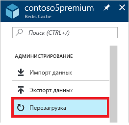
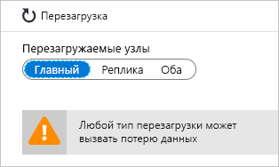
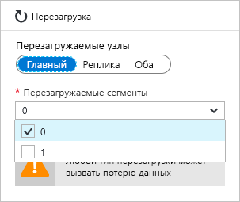
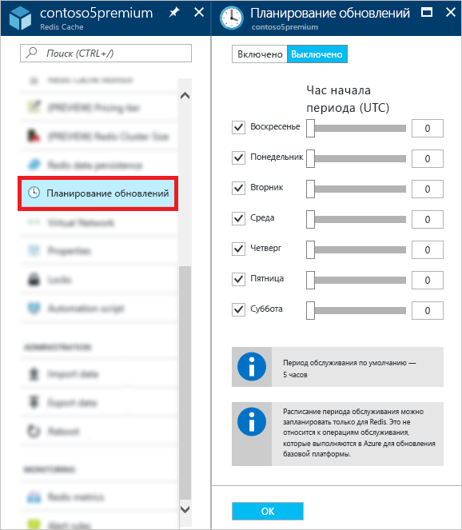

# Администрирование кэша Redis для Azure
В этом разделе описывается выполнение задач администрирования, таких как [перезагрузка](#reboot) и [планирование обновлений](#schedule-updates) для экземпляров кэша Redis для Azure.

[!INCLUDE [updated-for-az](../../includes/updated-for-az.md)]

## Перезагрузить
Колонка **Перезагрузка** позволяет перезагрузить один или несколько узлов кэша. Функция перезагрузки дает возможность протестировать приложение на устойчивость в случае сбоя узла кэша.

Выберите узлы, которые нужно перезагрузить, и щелкните **Перезагрузить**.

Если у вас кэш уровня "Премиум" с включенной кластеризацией, то вы можете выбрать сегменты кэша для перезагрузки.

Чтобы перезагрузить один или несколько узлов кэша, выберите необходимые узлы и нажмите кнопку **Перезагрузить**. Если у вас кэш уровня "Премиум" с включенной кластеризацией, то выберите сегменты, требующие перезагрузки, и нажмите кнопку **Перезагрузить**. Через несколько минут выбранные узлы перезагружаются, а еще через несколько минут — возобновляют работу.

Воздействие на клиентские приложения зависит от того, какие узлы перезагружаются.

* **Главный**: при перезагрузке главного узла кэш Redis для Azure выполняет отработку отказа на узел реплики, а затем повышает его уровень до главного узла. Во время этой отработки отказа может возникать короткий интервал, когда попытки подключения к кэшу заканчиваются сбоем.
* **Подчиненный** : перезагрузка подчиненного узла обычно не оказывает никакого воздействия на клиенты кэша.
* **Главный и подчиненный**: при перезагрузке обоих узлов кэша все данные в нем теряются. Подключения к кэшу завершаются сбоем, пока первичный узел снова не станет доступным. Если вы настроили [сохраняемость данных](cache-how-to-premium-persistence.md), то последняя резервная копия восстанавливается, когда кэш снова становится доступным. Но все записи в кэше, выполненные после последней архивации, будут утеряны.
* **Узлы кэша уровня "Премиум" с включенной кластеризацией.** При перезагрузке одного или нескольких узлов кэша уровня "Премиум" с включенной кластеризацией процедура восстановления выбранных узлов такая же, как при перезагрузке соответствующих узлов некластеризованного кэша.

> [!IMPORTANT]
> Перезагрузка теперь доступна для всех ценовых категорий.
> 
> 

## Часто задаваемые вопросы о перезагрузке
* [Какой узел следует перезагрузить, чтобы протестировать приложение?](#which-node-should-i-reboot-to-test-my-application)
* [Можно ли перезагрузить кэш, чтобы очистить подключения клиентов?](#can-i-reboot-the-cache-to-clear-client-connections)
* [Сохранятся ли данные кэша после перезагрузки?](#will-i-lose-data-from-my-cache-if-i-do-a-reboot)
* [Можно ли перезагрузить кэш с помощью PowerShell, интерфейса командной строки или других средств управления?](#can-i-reboot-my-cache-using-powershell-cli-or-other-management-tools)
* [Для каких ценовых категорий доступна функция перезагрузки?](#what-pricing-tiers-can-use-the-reboot-functionality)

### Какой узел следует перезагрузить, чтобы протестировать приложение?
Чтобы протестировать приложение на устойчивость в случае сбоя основного узла кэша, перезагрузите **главный** узел. Чтобы протестировать приложение на устойчивость в случае сбоя вторичного узла, перезагрузите **подчиненный** узел. Чтобы протестировать приложение на устойчивость в случае общего сбоя кэша, перезагрузите **оба** узла.

### Можно ли перезагрузить кэш, чтобы очистить подключения клиентов?
Да, при перезагрузке кэша все клиентские подключения очищаются. Перезагрузка может оказаться полезной, когда все подключения клиентов уже использованы из-за логической ошибки или ошибки в клиентском приложении. В каждой ценовой категории существуют [ограничения на подключение клиентов](cache-configure.md#default-redis-server-configuration) для различных размеров, и когда эти ограничения достигаются, последующие подключения не принимаются. Перезагрузка кэша позволяет очистить все подключения клиентов.

> [!IMPORTANT]
> Если перезагрузить кэш, чтобы очистить подключения клиентов, то StackExchange.Redis переподключается автоматически, когда узел Redis снова становится доступным. Если основную проблему не устранить, то подключения клиентов по-прежнему могут отсутствовать.
> 
> 

### Сохранятся ли данные кэша после перезагрузки?
Если вы перезагрузите **главный** и **подчиненный** узлы, то все данные в кэше (или в этом сегменте, если используется кэш уровня "Премиум" с включенной кластеризацией) могут быть потеряны, но это не гарантируется. Если вы настроили [сохраняемость данных](cache-how-to-premium-persistence.md), то последняя резервная копия будет восстановлена, когда кэш снова станет доступным. Но все записи в кэше, выполненные после архивации, будут утеряны.

Если перезагрузить только один из узлов, то, как правило, данные не теряются, но это все же может произойти. Например, если перезагрузить главный узел в то время, когда выполняется запись в кэш, то данные кэша будут потеряны. Данные также могут быть утеряны, если вы перезагрузите один узел, а другой узел случайно выйдет из строя в то же время. Дополнительные сведения о возможных причинах потери данных см. в статье [What happened to my data in Redis?](https://gist.github.com/JonCole/b6354d92a2d51c141490f10142884ea4#file-whathappenedtomydatainredis-md) (Что произошло с моими данными в Redis?).

### Можно ли перезагрузить кэш с помощью PowerShell, интерфейса командной строки или других средств управления?
Да, инструкции по использованию PowerShell см. в разделе, посвященном [перезагрузке кэша Redis для Azure](cache-howto-manage-redis-cache-powershell.md#to-reboot-an-azure-cache-for-redis).

### Для каких ценовых категорий доступна функция перезагрузки?
Перезагрузка доступна для всех ценовых категорий.

## Запланировать обновления
Колонка **обновления в расписании** позволяет указать период обслуживания для экземпляра кэша. Если задан период обслуживания, то любые обновления сервера Redis выполняются в этот период. 

> [!NOTE] 
> Данный период обслуживания относится только к обновлениям сервера Redis, а не ко всем обновлениям Azure или операционной системы виртуальных машин, на которых размещен кэш.
> 
> 

Чтобы задать период обслуживания, отметьте необходимые дни и укажите, когда будет начинаться период обслуживания в каждый из дней, а затем нажмите кнопку **ОК**. Обратите внимание, что время периода обслуживания указывается в формате UTC. 

Минимальный период обслуживания по умолчанию для обновлений — пять часов. Это значение нельзя настроить на портале Azure, но вы можете сделать это в PowerShell с помощью параметра `MaintenanceWindow` командлета [New-AzRedisCacheScheduleEntry](/powershell/module/az.rediscache/new-azrediscachescheduleentry). Дополнительные сведения см. в разделе "Можно ли управлять запланированными обновлениями с помощью PowerShell, интерфейса командной строки или других инструментов управления?"

## Часто задаваемые вопросы о планировании обновлений
* [Когда происходят обновления, если функция планирования обновлений не используется?](#when-do-updates-occur-if-i-dont-use-the-schedule-updates-feature)
* [Какие типы обновлений выполняются в запланированный период обслуживания?](#what-type-of-updates-are-made-during-the-scheduled-maintenance-window)
* [Можно ли управлять запланированными обновлениями с помощью PowerShell, интерфейса командной строки или других средств управления?](#can-i-managed-scheduled-updates-using-powershell-cli-or-other-management-tools)

### Когда происходят обновления, если функция планирования обновлений не используется?
Если период обслуживания не указан, то обновления могут выполняться в любое время.

### Какие типы обновлений выполняются в запланированный период обслуживания?
В запланированный период обслуживания выполняются только обновления сервера Redis. Этот период обслуживания не распространяется на обновления Azure или обновления операционной системы виртуальной машины.

### Можно ли управлять запланированными обновлениями с помощью PowerShell, интерфейса командной строки или других средств управления?
Да, управлять запланированными обновлениями можно с помощью следующих командлетов PowerShell:

* [Get-AzRedisCachePatchSchedule](/powershell/module/az.rediscache/get-azrediscachepatchschedule);
* [New-AzRedisCachePatchSchedule](/powershell/module/az.rediscache/new-azrediscachepatchschedule);
* [New-AzRedisCacheScheduleEntry](/powershell/module/az.rediscache/new-azrediscachescheduleentry);
* [Remove-AzRedisCachePatchSchedule](/powershell/module/az.rediscache/remove-azrediscachepatchschedule).

## Следующие шаги
* Узнайте больше о возможностях [кэша Redis для Azure ценовой категории "Премиум"](cache-premium-tier-intro.md).

