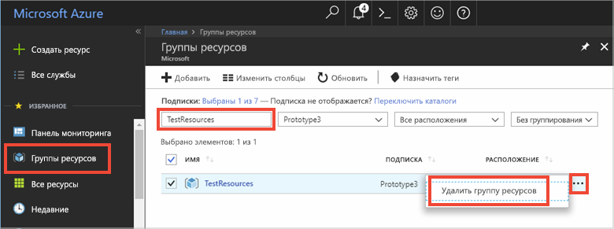

# <a name="quickstart-use-azure-cache-for-redis-with-nodejs"></a>Краткое руководство. Использование кэша Azure для Redis с Node.js

Из этого краткого руководства вы узнаете, как реализовать кэш Azure для Redis в приложении Node.js для обеспечения доступа к защищенному выделенному кэшу, к которому может обращаться любое приложение в Azure.

## <a name="prerequisites"></a>Предварительные требования

- Подписка Azure — [создайте бесплатную учетную запись](https://azure.microsoft.com/free/).
- [node_redis](https://github.com/mranney/node_redis), который вы можете установить с помощью команды `npm install redis`. 

Примеры использования других клиентов Node.js см. в отдельных документах по [клиентам Node.js для Redis](https://redis.io/clients#nodejs).

## <a name="create-a-cache"></a>Создание кэша
[!INCLUDE [redis-cache-create](../../includes/redis-cache-create.md)]

[!INCLUDE [redis-cache-access-keys](../../includes/redis-cache-access-keys.md)]


Добавление переменных среды для **ИМЯ_УЗЛА** и **Основного** ключа доступа. Вместо включения конфиденциальных данных непосредственно в код использоваться будут эти переменные из вашего кода.

```
set REDISCACHEHOSTNAME=contosoCache.redis.cache.windows.net
set REDISCACHEKEY=XXXXXXXXXXXXXXXXXXXXXXXXXXXXXXXXXXXXXXXXXXXX
```

## <a name="connect-to-the-cache"></a>Подключение к кэшу

Новейшие сборки [node_redis](https://github.com/mranney/node_redis) обеспечивают поддержку подключения к Кэшу Azure для Redis по протоколу TLS. В приведенном ниже примере показано, как подключиться к Кэшу Azure для Redis с помощью конечной точки TLS на порту 6380. 

```js
var redis = require("redis");

// Add your cache name and access key.
var client = redis.createClient(6380, process.env.REDISCACHEHOSTNAME,
    {auth_pass: process.env.REDISCACHEKEY, tls: {servername: process.env.REDISCACHEHOSTNAME}});
```

Нельзя создавать новые подключения для каждой операции в коде. Вместо этого повторно используйте как можно больше подключений. 

## <a name="create-a-new-nodejs-app"></a>Создание нового приложения Node.js

Создайте новый файл сценария с именем *redistest.js*. С помощью команды `npm install redis bluebird` установите необходимые пакеты.

Добавьте следующий пример JavaScript в файл. Этот код показывает, как подключиться к экземпляру кэша Redis для Azure, используя имя узла кэша и переменные среды ключа. Код также хранит строковое значение в кэше и извлекает его. Также выполняются команды `PING` и `CLIENT LIST`. Дополнительные примеры использования Redis с клиентом [node_redis](https://github.com/mranney/node_redis) см. в [https://redis.js.org/](https://redis.js.org/).

```js
var redis = require("redis");
var bluebird = require("bluebird");

// Convert Redis client API to use promises, to make it usable with async/await syntax
bluebird.promisifyAll(redis.RedisClient.prototype);
bluebird.promisifyAll(redis.Multi.prototype);

async function testCache() {

    // Connect to the Azure Cache for Redis over the TLS port using the key.
    var cacheConnection = redis.createClient(6380, process.env.REDISCACHEHOSTNAME, 
        {auth_pass: process.env.REDISCACHEKEY, tls: {servername: process.env.REDISCACHEHOSTNAME}});
        
    // Perform cache operations using the cache connection object...

    // Simple PING command
    console.log("\nCache command: PING");
    console.log("Cache response : " + await cacheConnection.pingAsync());

    // Simple get and put of integral data types into the cache
    console.log("\nCache command: GET Message");
    console.log("Cache response : " + await cacheConnection.getAsync("Message"));    

    console.log("\nCache command: SET Message");
    console.log("Cache response : " + await cacheConnection.setAsync("Message",
        "Hello! The cache is working from Node.js!"));    

    // Demonstrate "SET Message" executed as expected...
    console.log("\nCache command: GET Message");
    console.log("Cache response : " + await cacheConnection.getAsync("Message"));    

    // Get the client list, useful to see if connection list is growing...
    console.log("\nCache command: CLIENT LIST");
    console.log("Cache response : " + await cacheConnection.clientAsync("LIST"));    
}

testCache();
```

Выполните сценарий с помощью Node.js.

```
node redistest.js
```

В приведенном ниже примере видно, что ключ `Message` ранее содержал кэшированное значение, установленное через консоль Redis на портале Azure. Приложение обновило кэшированное значение. Кроме того, оно выполнило команды `PING` и `CLIENT LIST`.


## <a name="clean-up-resources"></a>Очистка ресурсов

При переходе к следующему руководству в нем можно использовать ресурсы, созданные в этом руководстве.

В противном случае, если вы закончите работу с примером приложения из краткого руководства, вы можете удалить ресурсы Azure, созданные в текущем руководстве, чтобы избежать ненужных расходов. 

> [!IMPORTANT]
> Удаление группы ресурсов — необратимая операция, и все соответствующие ресурсы удаляются окончательно. Будьте внимательны, чтобы случайно не удалить не ту группу ресурсов или не те ресурсы. Если ресурсы для размещения этого примера созданы в имеющейся группе ресурсов, содержащей ресурсы, которые следует сохранить, можно удалить каждый ресурс отдельно в соответствующих колонках вместо удаления группы ресурсов.
>

Войдите в портал [Azure](https://portal.azure.com) и выберите**Группы ресурсов**.

Введите имя группы ресурсов в текстовое поле **Фильтровать по имени**. В инструкциях в этой статье использовалась группа ресурсов с именем *TestResources*. В своей группе ресурсов в списке результатов выберите **...** , а затем **Удалить группу ресурсов**.



Подтвердите операцию удаления группы ресурсов. Введите имя группы ресурсов, которую необходимо удалить, и нажмите **Удалить**.

Через некоторое время группа ресурсов и все ее ресурсы будут удалены.

## <a name="next-steps"></a>Дальнейшие действия

Из этого краткого руководства вы узнали, как использовать кэш Redis для Azure в приложениях Node.js. Переходите к следующему краткому руководству по использованию кэша Azure для Redis в веб-приложениях ASP.NET.

> [!div class="nextstepaction"]
> [Создание веб-приложения ASP.NET, в котором используется кэш Azure для Redis](./cache-web-app-howto.md)
