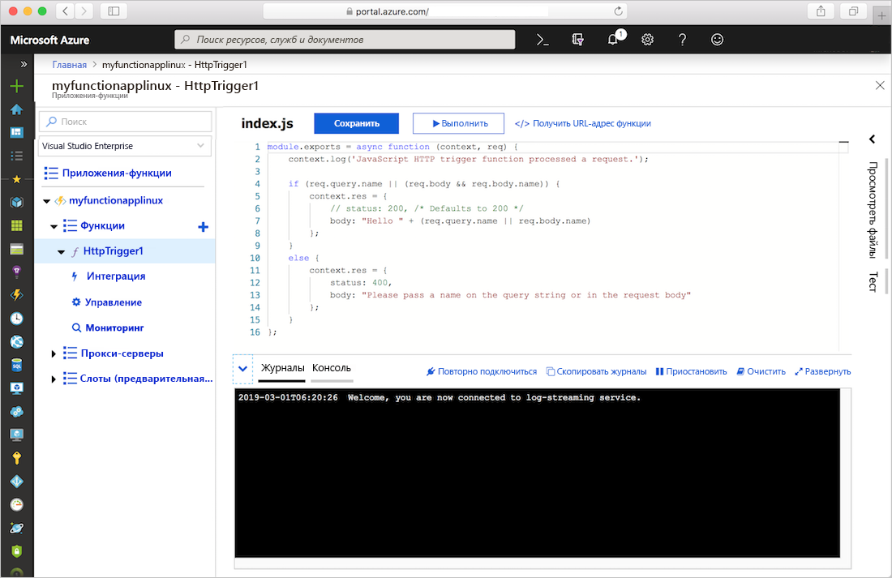

# Создание приложения-функции на платформе Linux в плане службы приложений Azure

Функции Azure позволяют размещать в Linux собственные функции в контейнере службы приложения Azure по умолчанию. В этой статье вы узнаете, как использовать [портал Azure](https://portal.azure.com) для создания приложения-функции, размещенного на Linux, которая выполняется в [плане службы приложений](functions-scale.md#app-service-plan). Также можно [использовать собственный настраиваемый контейнер](functions-create-function-linux-custom-image.md).

[!INCLUDE [quickstarts-free-trial-note](../../includes/quickstarts-free-trial-note.md)]

## Вход в Azure

Войдите на портал Azure по адресу <https://portal.azure.com> с помощью своей учетной записи Azure.

## Создание приложения-функции

Для выполнения функций в Linux вам понадобится приложение-функция, предоставляющее среду для выполнения кода функции. Это позволяет группировать функции в логические единицы, чтобы упростить управление, развертывание, масштабирование и совместное использование ресурсов. В этой статье вы создадите план службы приложения при создании приложения-функции.

1. На **домашней странице** или в меню портала Azure выберите **Создать ресурс**.

1. На странице **Создать** щелкните **Вычислительные ресурсы** > **Приложение-функция**.

    :::image type="content" source="./media/create-function-app-linux-app-service-plan/function-app-create-flow.png" alt-text="Создание приложения-функции на портале Azure":::

1. На странице **Основные сведения** используйте параметры приложения-функции как указано в таблице ниже.

    | Параметр      | Рекомендуемое значение  | Описание |
    | ------------ | ---------------- | ----------- |
    | **Подписка** | Ваша подписка | Подписка, в которой создано приложение-функция. |
    | **[Группа ресурсов](../azure-resource-manager/management/overview.md)** |  *myResourceGroup* | Имя новой группы ресурсов, в которой создается приложение-функция. |
    | **Имя приложения-функции** | Глобально уникальное имя | Имя, которое идентифицирует ваше новое приложение-функцию. Допустимые символы: `a-z` (без учета регистра), `0-9`и `-`.  |
    |**Опубликовать**| **Код** (по умолчанию) | Параметр для публикации файлов кода или контейнера Docker. |
    | **Стек среды выполнения** | Предпочитаемый язык | Выберите среду выполнения, которая поддерживает нужный функциональный язык программирования. Выберите **.NET Core** для функций C# и F#. |
    |**Версия**| номер версии; | Выберите версию установленной среды выполнения.  |
    |**Регион**| Предпочтительный регион | Выберите ближайший [регион](https://azure.microsoft.com/regions/) или регион рядом с другими службами, к которому получают доступ ваши функции. |

    :::image type="content" source="./media/create-function-app-linux-app-service-plan/function-app-create-basics-linux.png" alt-text="Страница "Основные"":::

1. Выберите **Далее: Размещение**. Введите следующие параметры на странице **Размещение**.

    | Параметр      | Рекомендуемое значение  | Описание |
    | ------------ | ---------------- | ----------- |
    | **[Учетная запись хранения](../storage/common/storage-account-create.md)** |  Глобально уникальное имя |  Создайте учетную запись хранения для использования приложением-функцией. Имя учетной записи хранения должно содержать от 3 до 24 символов и состоять только из цифр и строчных букв. Можно также использовать существующую учетную запись при условии, что она соответствует [требованиям учетной записи хранилища](../azure-functions/functions-scale.md#storage-account-requirements). |
    |**Операционная система**| **Linux** | Операционная система предварительно выбирается с учетом выбранного стека среды выполнения, но при необходимости ее можно изменить. |
    | **[План](../azure-functions/functions-scale.md)** | **Потребление (бессерверное)** | План размещения, который определяет выделение ресурсов в приложении-функции. В плане **Потребление** по умолчанию ресурсы добавляются динамически в соответствии с потребностями функций. При таком [бессерверном](https://azure.microsoft.com/overview/serverless-computing/) размещении вы платите только за время выполнения функций. Когда выполняется план службы приложений необходимо управлять [масштабированием приложения-функции](../azure-functions/functions-scale.md).  |

    :::image type="content" source="./media/create-function-app-linux-app-service-plan/function-app-create-hosting-linux.png" alt-text="Страница размещения":::

1. Выберите **Далее: Мониторинг**. Введите следующие параметры на странице **Мониторинг**.

    | Параметр      | Рекомендуемое значение  | Описание |
    | ------------ | ---------------- | ----------- |
    | **[Application Insights](../azure-functions/functions-monitoring.md)** | **Да** (по умолчанию) | Создает ресурс Application Insights с таким же *именем приложения* в ближайшем поддерживаемом регионе. Развернув этот параметр или выбрав **Создать новый**, можно изменить имя Application Insights или выбрать другое расположение в [географическом регионе Azure](https://azure.microsoft.com/global-infrastructure/geographies/), где будут хранится данные. |

   :::image type="content" source="./media/create-function-app-linux-app-service-plan/function-app-create-monitoring-linux.png" alt-text="Страница "Мониторинг"":::

1. Выберите **Просмотр и создание** , чтобы просмотреть выбранные параметры конфигурации приложения.

1. Проверьте параметры на странице **Просмотр и создание**, после чего выберите **Создать** для подготовки и развертывания приложения-функции.

1. Выберите значок **Уведомления** в правом верхнем углу портала. Вы должны увидеть сообщение **Развертывание выполнено**.

1. Выберите **Перейти к ресурсу** для просмотра нового приложения-функции. Можно также установить флажок **Закрепить на панели мониторинга**. Это упростит возвращение к этому ресурсу приложения-функции из панели мониторинга.

    

    Даже в том случае, если ваше приложение-функция доступно,полная инициализация может занять несколько минут.

Затем создайте функцию в новом приложении-функции.

## Создание функции, активируемой HTTP

В этом разделе показано, как создать функцию в новом приложении-функции на портале.

> [!NOTE]
> Интерфейс разработки портала можно использовать для ознакомления с Функциями Azure. Для большинства сценариев рассмотрите возможность локальной разработки своих функций и публикации проекта в приложение-функцию с помощью [Visual Studio Code](functions-create-first-function-vs-code.md#create-an-azure-functions-project) или [Azure Functions Core Tools](functions-run-local.md#create-a-local-functions-project).  

1. В меню слева окна **Функции** выберите **Функции**, а затем в верхнем меню выберите **Добавить**. 
 
1. В окне **Новая функция** выберите **Триггер HTTP**.

    

1. В окне **Новая функция** для пункта **Новая функция** оставьте имя по умолчанию или введите новое имя. 

1. Из раскрывающегося списка **Уровень авторизации** выберите **Анонимный**, а затем выберите **Создать функцию**.

    Azure создает функцию, активируемую HTTP. Теперь вы можете запустить новую функцию, отправив HTTP-запрос.

## Проверка функции

1. В новой функции, активируемой HTTP, выберите **Code + Test** (Код + Тест) в меню слева, а затем в верхнем меню выберите **Получить URL-адрес функции**.

    

1. В диалоговом окне **Получить URL-адрес функции** в раскрывающемся списке выберите вариант **по умолчанию**, а затем выберите значок **Копировать в буфер обмена**. 

    

1. Вставьте URL-адрес функции в адресную строку браузера. Добавьте значение строки запроса `?name=<your_name>` в конец этого URL-адреса и нажмите клавишу Enter, чтобы выполнить этот запрос. 

    Следующий пример демонстрирует ответ в браузере:

    

    URL-адрес запроса включает ключ, который по умолчанию необходим для доступа к функции по протоколу HTTP.

1. При выполнении функции сведения о трассировке записываются в журналы. Чтобы просмотреть выходные данные трассировки, вернитесь на страницу **Code + Test** (Код + Тест) на портале и разверните список **Журналы** в нижней части страницы.

   

## Очистка ресурсов

[!INCLUDE [Clean-up resources](../../includes/functions-quickstart-cleanup.md)]

## Дальнейшие действия

Вы создали приложение-функцию с простой функцией, активируемой HTTP.  

[!INCLUDE [Next steps note](../../includes/functions-quickstart-next-steps.md)]

Дополнительные сведения см. в статье [Привязки HTTP функций Azure](functions-bindings-http-webhook.md).
