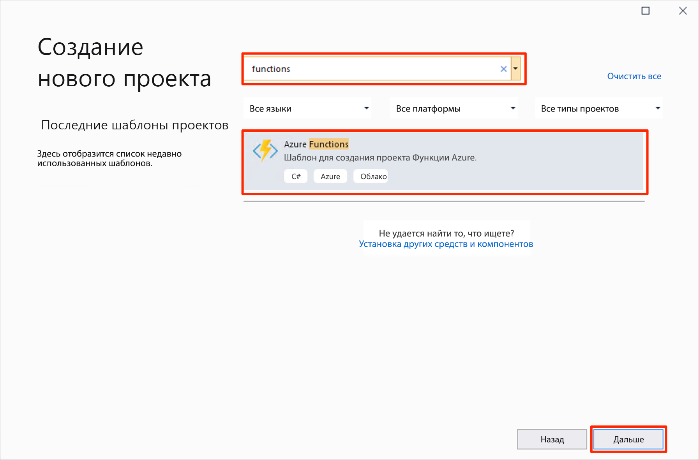
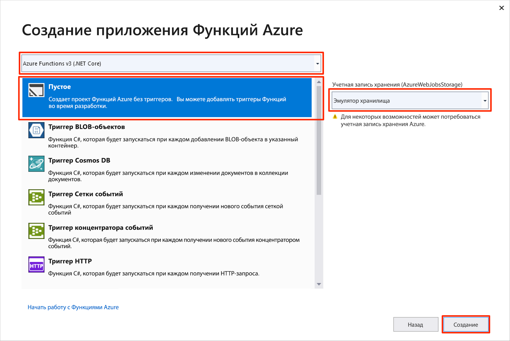
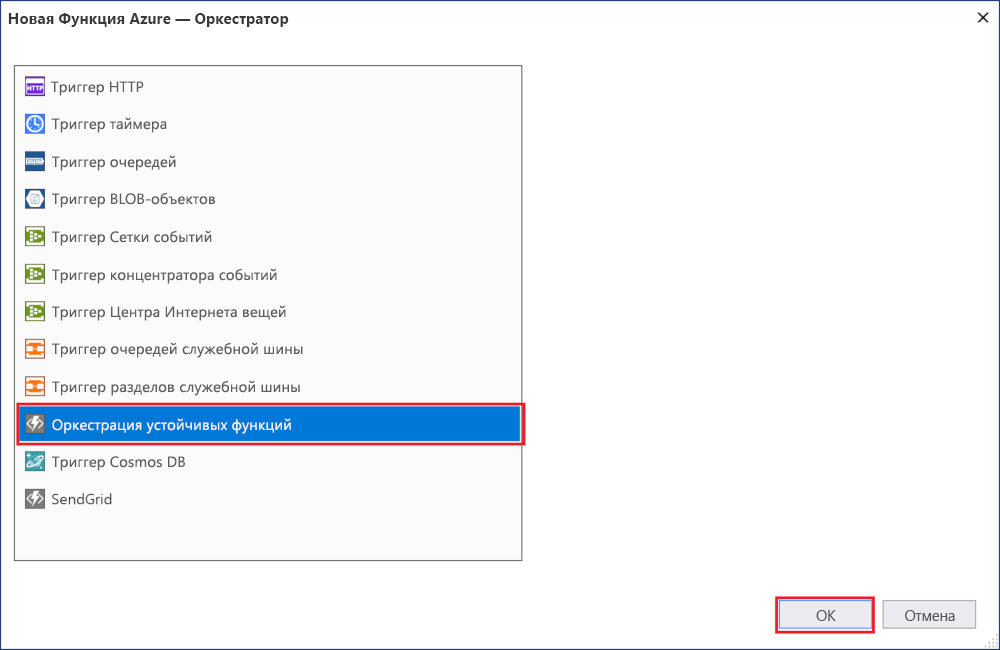

# <a name="create-your-first-durable-function-in-c"></a>Создание устойчивой функции в C\#

*Устойчивые функции* — это расширение [Функций Azure](../functions-overview.md), которое позволяет писать функции с отслеживанием состояния в беcсерверной среде. Расширение автоматически управляет состоянием, создает контрольные точки и перезагружается.

[!INCLUDE [v1-note](../../../includes/functions-durable-v1-tutorial-note.md)]

Из этой статьи вы узнаете, как использовать Visual Studio 2019 для локального создания и тестирования устойчивой функции hello world.  Эта функция организовывает и объединяет в цепочку вызовы других функций. Затем вы опубликуете код функции в Azure. Эти инструменты доступны как часть рабочей нагрузки Azure для разработки в Visual Studio 2019.


## <a name="prerequisites"></a>предварительные требования

Для работы с этим руководством:

* Установите [Visual Studio 2019](https://visualstudio.microsoft.com/vs/). Убедитесь, что рабочая нагрузка **Разработка для Azure** также установлена. Visual Studio 2017 также поддерживает разработку Устойчивых функций, но пользовательский интерфейс и выполняемые шаги при этом отличаются.

* Убедитесь, что [эмулятор службы хранилища Azure](../../storage/common/storage-use-emulator.md) установлен и запускается.

[!INCLUDE [quickstarts-free-trial-note](../../../includes/quickstarts-free-trial-note.md)]

## <a name="create-a-function-app-project"></a>Создание проекта приложения-функции

Шаблон Функций Azure создает проект, который затем можно опубликовать в приложении-функции в Azure. позволяющее группировать функции в логические единицы и упростить развертывание, масштабирование и совместное использование ресурсов, а также управление ими.

1. В Visual Studio в меню **Файл** выберите **Создать** > **Проект**.

1. В диалоговом окне **Add a new project** (Добавление нового проекта) выполните поиск по строке `functions`, выберите шаблон **Azure Functions** (Функции Azure) и нажмите кнопку **Далее**. 

    

1. Введите **имя проекта** и нажмите кнопку **OK**. Имя проекта должно быть допустимым в качестве пространства имен C#, поэтому не используйте символы подчеркивания, дефисы и другие символы, не являющиеся буквенно-цифровыми.

1. В окне **Создание нового приложения Функций Azure** укажите параметр, приведенный в таблице после рисунка.

    

    | Параметр      | Рекомендуемое значение  | Description                      |
    | ------------ |  ------- |----------------------------------------- |
    | **Версия** | Функции Azure 2.0 <br />(.NET Core) | Создает проект функции, использующий среду выполнения Функций Azure версии 2.0, которая поддерживает .NET Core. Функции Azure 1.0 поддерживают платформу .NET Framework. Дополнительные сведения см. в статье [Выбор целевых версий среды выполнения Функций Azure](../functions-versions.md).   |
    | **Шаблон** | Empty | Создает пустое приложение-функцию. |
    | **Учетная запись хранения**  | Эмулятор хранения | Учетная запись хранения необходима для управления состоянием устойчивой функции. |

4. Нажмите кнопку **Создать**, чтобы создать проект пустой функции. Этот проект содержит файлы базовой конфигурации, необходимые для выполнения функций.

## <a name="add-functions-to-the-app"></a>Добавление функций в приложение

В следующих действиях используется шаблон для создания устойчивого кода функции в проекте.

1. Щелкните правой кнопкой мыши проект в Visual Studio и выберите **Добавить** > **Новая функция Azure**.

    

1. Убедитесь, что в меню добавления выбрано **Функция Azure**, введите имя своего файла C# и нажмите кнопку **Добавить**.

1. Выберите шаблон **Оркестрация Устойчивых функций** и нажмите кнопку **ОК**.

      

> [!NOTE]
> В настоящее время этот шаблон создает устойчивую функцию, используя более раннюю версию 1.x расширения. Сведения о том, как обновить Устойчивые функции до версии 2.x, см. в статье [Версии расширения "Устойчивые функции"](durable-functions-versions.md).

Новая устойчивая функция добавлена в приложение.  Откройте новый файл .cs, чтобы просмотреть содержимое. Эта устойчивая функция является простым примером цепочки функции со следующими методами.  

| Метод | FunctionName | Description |
| -----  | ------------ | ----------- |
| **`RunOrchestrator`** | `<file-name>` | Управляет устойчивой оркестрацией. В этом случае оркестрация запускается, создает список и добавляет в него результат трех вызовов функций.  Список возвращается после завершения вызовов трех функций. |
| **`SayHello`** | `<file-name>_Hello` | Функция возвращает hello. Это функция, которая содержит управляемую бизнес-логику. |
| **`HttpStart`** | `<file-name>_HttpStart` | [Функция, активируемая HTTP-запросом](../functions-bindings-http-webhook.md), которая запускает пример оркестрации и возвращает ответ состояния проверки. |

Созданный проект функции и устойчивую функцию можно протестировать на локальном компьютере.

## <a name="test-the-function-locally"></a>Локальное тестирование функции

Основные инструменты службы "Функции Azure" позволяют запускать проекты функций Azure на локальном компьютере разработчика. Вам будет предложено установить эти инструменты при первом запуске функции из Visual Studio.

1. Чтобы проверить работу функции, нажмите клавишу F5. Если будет предложено, примите запрос от Visual Studio на скачивание и установку основных инструментов службы Функции Azure (CLI). Кроме того, вам может понадобиться включить исключение брандмауэра, чтобы инструменты могли обрабатывать HTTP-запросы.

2. Скопируйте URL-адрес функции из выходных данных среды выполнения функций Azure.

    

3. Вставьте URL-адрес HTTP-запроса в адресную строку браузера и выполните запрос. Ниже показан ответ в браузере на локальный запрос GET, возвращаемый функцией:

    

    Полученный ответ является начальным результатом функции HTTP, что сообщает об успешном начале работы устойчивой оркестрации.  Он еще не конечный результат оркестрации.  Ответ включает несколько полезных URL-адреса.  Теперь запросите состояние оркестрации.

4. Скопируйте значение URL-адреса для `statusQueryGetUri` и, вставив его в адресную строку панели браузера, выполните запрос.

    Запрос будет запрашивать экземпляр оркестрации для состояния. Необходимо получить возможный ответ, который выглядит следующим образом.  Этот результат показывает, что экземпляр выполнен и содержит выходные данные или результаты устойчивой функции.

    ```json
    {
        "instanceId": "d495cb0ac10d4e13b22729c37e335190",
        "runtimeStatus": "Completed",
        "input": null,
        "customStatus": null,
        "output": [
            "Hello Tokyo!",
            "Hello Seattle!",
            "Hello London!"
        ],
        "createdTime": "2019-11-02T07:07:40Z",
        "lastUpdatedTime": "2019-11-02T07:07:52Z"
    }
    ```

5. Нажмите клавиши **SHIFT+F5**, чтобы остановить отладку.

Убедитесь, что функция правильно работает на локальном компьютере. Затем опубликуйте проект в Azure.

## <a name="publish-the-project-to-azure"></a>Публикация проекта в Azure

Перед публикацией проекта убедитесь, что в вашей подписке Azure есть приложения-функция. Можно создать приложение-функцию непосредственно в Visual Studio.

[!INCLUDE [Publish the project to Azure](../../../includes/functions-vstools-publish.md)]

## <a name="test-your-function-in-azure"></a>Тестирование функции в Azure

1. Скопируйте базовый URL-адрес приложения-функции на странице профиля публикации. Замените часть `localhost:port` URL-адреса, который использовался при локальной проверке функции новым базовым URL-адресом.

    URL-адрес для вызова триггера HTTP устойчивой функции должен быть в следующем формате.

        http://<APP_NAME>.azurewebsites.net/api/<FUNCTION_NAME>_HttpStart

2. Вставьте этот URL-адрес HTTP-запроса в адресную строку браузера. При использовании опубликованного приложения ответ состояния должен быть таким же, как и ранее.

## <a name="next-steps"></a>Дальнейшие действия

Visual Studio использовалась для создания и публикации устойчивого приложения-функции C#.

> [!div class="nextstepaction"]
> [Дополнительные сведения о распространенных шаблонах устойчивых функций](durable-functions-overview.md#application-patterns)