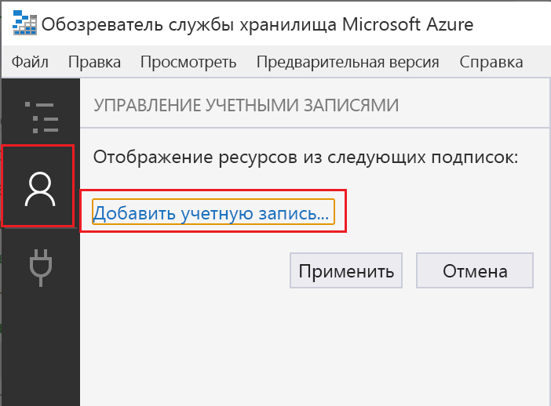
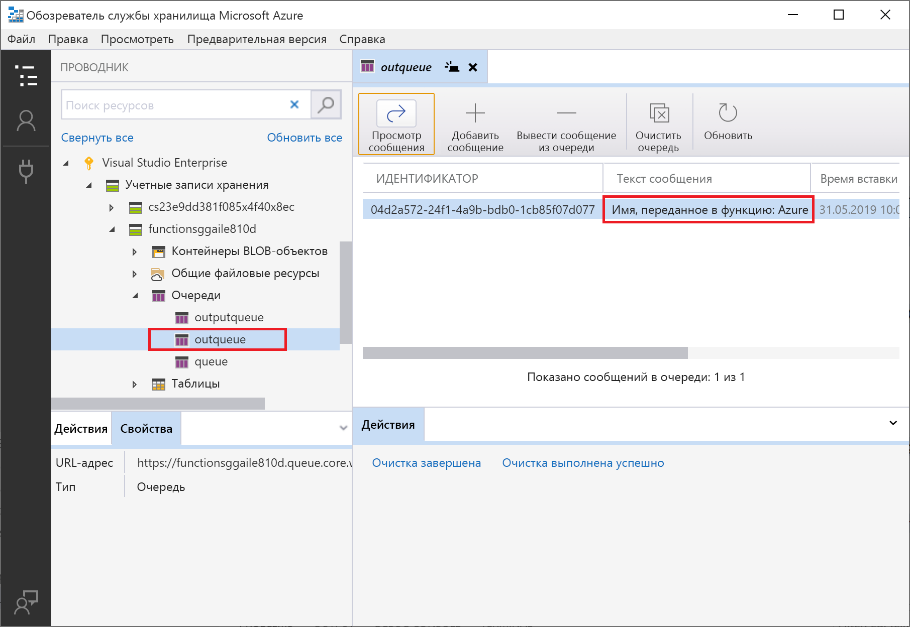

# <a name="connect-functions-to-azure-storage-using-visual-studio-code"></a>Подключение функций к службе хранилища Azure с помощью Visual Studio Code

Функции Azure позволяют выполнять подключение функций к службам Azure и другим ресурсам без необходимости написания кода для интеграции. Эти *привязки*, которые представляют как входные, так и выходные данные, объявляются в определении функции. Данные привязок предоставляются функции в качестве параметров. Триггер является специальным типом входных привязок. В то время как функция обладает только одним триггером, она может состоять из нескольких входных и выходных привязок. Дополнительные сведения см. в статье [Основные понятия триггеров и привязок в Функциях Azure](functions-triggers-bindings.md).

В этой статье приведены сведения об использовании Visual Studio Code для подключения функции, которая была создана в рамках [предыдущей статьи](functions-create-first-function-vs-code.md), к службе хранилища Azure. Выходная привязка, которая была добавлена в эту функцию, записывает данные HTTP-запроса в сообщение очереди Хранилища очередей Azure. 

Большинство привязок требуют сохраненную строку подключения, которая будет использоваться Функциями Azure для доступа к привязанным службам. Чтобы упростить процесс, вам следует использовать учетную запись хранения, созданную в приложении-функции. Подключение к этой учетной записи уже хранится в параметрах приложения под названием `AzureWebJobsStorage`.  

## <a name="prerequisites"></a>Предварительные требования

Перед началом работы с этой статьей необходимо выполнить следующие требования:

* Установите [расширение службы хранилища Azure для Visual Studio Code](https://marketplace.visualstudio.com/items?itemName=ms-azuretools.vscode-azurestorage).
* Установите [Обозреватель службы хранилища Azure](https://storageexplorer.com/). Обозреватель службы хранилища — это инструмент, который вы будете использовать для проверки сообщений очереди, создаваемых с помощью выходной привязки. Он поддерживается в операционных системах macOS, Windows и Linux.
* Установите [средства интерфейса командной строки .NET Core](https://docs.microsoft.com/dotnet/core/tools/?tabs=netcore2x) (только для проектов C#).
* Выполните инструкции, приведенные в статье [Создание функции в Azure с помощью Visual Studio Code](functions-create-first-function-vs-code.md). 

В этой статье предполагается, что вы уже выполнили вход в подписку Azure из Visual Studio Code. Вы можете войти в систему, выполнив команду `Azure: Sign In` в палитре команд. 

## <a name="download-the-function-app-settings"></a>Загрузка параметров приложения-функции

В [предыдущей статье](functions-create-first-function-vs-code.md) вы создавали приложение-функцию и соответствующую учетную запись хранения в Azure. Строка подключения данной учетной записи надежно хранится в параметрах приложения в Azure. В этой статье вы напишете сообщения в очередь хранилища в пределах одной учетной записи. Чтобы подключить учетную запись хранения при локальном выполнение функции, необходимо загрузить параметры приложения в файл local.settings.json. 

1. Нажмите клавишу F1, чтобы открыть палитру команд, а затем найдите и выполните команду `Azure Functions: Download Remote Settings....`. 

1. Выберите созданное в рамках предыдущей статьи приложение-функцию. Выберите **Да, для всех**, чтобы перезаписать имеющиеся локальные параметры. 

    > [!IMPORTANT]  
    > Из-за того, что содержимое local.settings.json является секретом, этот файл никогда не будет опубликован — он будет исключен из системы управления версиями.

1. Скопируйте значение `AzureWebJobsStorage`, которое является ключом для значения строки подключения к учетной записи хранения. Это подключение используется для проверки работы привязки для вывода.

## <a name="register-binding-extensions"></a>Регистрация расширений привязки

Так как вы используете выходную привязку Хранилища очередей, перед запуском проекта необходимо установить расширение привязок службы хранилища. 

### <a name="javascript"></a>JavaScript

[!INCLUDE [functions-extension-bundles](../../includes/functions-extension-bundles.md)]

### <a name="c-class-library"></a>Библиотека классов C\#

За исключением триггеров HTTP и таймера, привязки реализованы в виде пакетов расширений. Выполните следующую команду [dotnet add package](/dotnet/core/tools/dotnet-add-package) в окне терминала, чтобы добавить пакет расширений службы хранилища в свой проект.

```bash
dotnet add package Microsoft.Azure.WebJobs.Extensions.Storage --version 3.0.4
```

Теперь вы можете добавить выходную привязку службы хранилища к проекту.

## <a name="add-an-output-binding"></a>Добавление выходной привязки

В службе "Функции" для каждого типа привязок требуется `direction`, `type` и уникальное `name`, которое определяется в файле function.json. Способ определения этих атрибутов зависит от языка приложения-функции.

### <a name="javascript"></a>JavaScript

Атрибуты привязки определяются непосредственно в файле function.json. В зависимости от типа привязки могут потребоваться дополнительные свойства. [Параметр выходных данных очереди](functions-bindings-storage-queue.md#output---configuration) описывает поля, требуемые для привязки очереди службы хранилища Azure. Расширение позволяет легко добавлять привязки в файл function.json. 

Чтобы создать привязку, щелкните правой кнопкой мыши (CTRL+щелчок в macOS) файл `function.json` в папке HttpTrigger и выберите **Add binding...** (Добавить привязку...). Выполните инструкции, указанные на экране, чтобы определить следующие свойства для новой привязки:

| prompt | Значение | ОПИСАНИЕ |
| -------- | ----- | ----------- |
| **Select binding direction** (Выберите направление привязки) | `out` | Привязка является выходной привязкой. |
| **Select binding with direction...** (Выберите привязку с направлением...) | `Azure Queue Storage` | Привязка является привязкой очереди службы хранилища Azure. |
| **The name used to identify this binding in your code** (Имя, используемое для идентификации этой привязки в коде) | `msg` | Имя, которое используется для идентификации параметров привязки, указанных в коде. |
| **The queue to which the message will be sent** (Очередь, в которую будет отправляться сообщение) | `outqueue` | Имя очереди, в которой записывается привязка. Если *queueName* не существует, то при первом использовании этот параметр будет создан привязкой. |
| **Select setting from "local.setting.json"** (Выберите параметр из файла local.setting.json) | `AzureWebJobsStorage` | Имя параметра приложения, который содержит строку подключения к учетной записи хранения. Параметр `AzureWebJobsStorage` содержит строку подключения учетной записи хранения, созданной в приложении-функции. |

Привязка добавляется к массиву `bindings` в файле function.json, который теперь должен выглядеть следующим образом:

```json
{
   ...

  "bindings": [
    {
      "authLevel": "function",
      "type": "httpTrigger",
      "direction": "in",
      "name": "req",
      "methods": [
        "get",
        "post"
      ]
    },
    {
      "type": "http",
      "direction": "out",
      "name": "$return"
    },
    {
      "type": "queue",
      "direction": "out",
      "name": "msg",
      "queueName": "outqueue",
      "connection": "AzureWebJobsStorage"
    }
  ]
}
```

### <a name="c-class-library"></a>Библиотека классов C\#

В проекте библиотеки классов C# привязки определяются как атрибуты привязки в методе функции. Затем на основе этих атрибутов автоматически создается файл function.json.

Откройте файл проекта HttpTrigger.cs и добавьте следующий оператор `using`:

```cs
using Microsoft.Azure.WebJobs.Extensions.Storage;
```

Добавьте следующий параметр в определение метода `Run`:

```cs
[Queue("outqueue"),StorageAccount("AzureWebJobsStorage")] ICollector<string> msg
```

Параметр `msg` относится к типу `ICollector<T>`, который представляет собой коллекцию сообщений, записываемых в выходную привязку после завершения функции. В этом случае выходные данные представляют собой очередь хранилища с именем `outqueue`. Строка подключения к учетной записи хранения задана атрибутом `StorageAccountAttribute`. Он указывает параметр, который содержит строку подключения к учетной записи хранения и может применяться на уровне класса, метода или параметра. В этом случае вы можете опустить `StorageAccountAttribute`, так как уже используете учетную запись хранения по умолчанию.

Определение метода Run должно выглядеть следующим образом:  

```cs
[FunctionName("HttpTrigger")]
public static async Task<IActionResult> Run(
    [HttpTrigger(AuthorizationLevel.Function, "get", "post", Route = null)] HttpRequest req, 
    [Queue("outqueue"),StorageAccount("AzureWebJobsStorage")] ICollector<string> msg, ILogger log)
```

## <a name="add-code-that-uses-the-output-binding"></a>Добавление кода, который использует выходную привязку

После определения привязки можно использовать `name` привязки для доступа к ней как к атрибуту в сигнатуре функции. После использования выходной привязки вам для проверки подлинности, получения ссылки на очередь или записи данных больше не потребуется код пакета SDK службы хранилища Azure. Вместо вас эти задачи будут выполнены выходной привязкой очереди и средой выполнения функции.

### <a name="javascript"></a>JavaScript

Добавьте код, который использует объект выходной привязки `msg` в `context.bindings` для создания сообщения очереди. Добавьте этот код перед инструкцией `context.res`.

```javascript
// Add a message to the Storage queue.
context.bindings.msg = "Name passed to the function: " + 
(req.query.name || req.body.name);
```

На этом этапе ваша функция должна выглядеть следующим образом:

```javascript
module.exports = async function (context, req) {
    context.log('JavaScript HTTP trigger function processed a request.');

    if (req.query.name || (req.body && req.body.name)) {
        // Add a message to the Storage queue.
        context.bindings.msg = "Name passed to the function: " + 
        (req.query.name || req.body.name);
        context.res = {
            // status: 200, /* Defaults to 200 */
            body: "Hello " + (req.query.name || req.body.name)
        };
    }
    else {
        context.res = {
            status: 400,
            body: "Please pass a name on the query string or in the request body"
        };
    }
};
```

### <a name="c"></a>C\#

Добавьте код, который использует объект выходной привязки `msg` для создания сообщения очереди. Сделайте это перед возвращением метода.

```cs
if (!string.IsNullOrEmpty(name))
{
    // Add a message to the output collection.
    msg.Add(string.Format("Name passed to the function: {0}", name));
}
```

На этом этапе ваша функция должна выглядеть следующим образом:

```cs
[FunctionName("HttpTrigger")]
public static async Task<IActionResult> Run(
    [HttpTrigger(AuthorizationLevel.Function, "get", "post", Route = null)] HttpRequest req, 
    [Queue("outqueue"),StorageAccount("AzureWebJobsStorage")] ICollector<string> msg, ILogger log)
{
    log.LogInformation("C# HTTP trigger function processed a request.");

    string name = req.Query["name"];

    string requestBody = await new StreamReader(req.Body).ReadToEndAsync();
    dynamic data = JsonConvert.DeserializeObject(requestBody);
    name = name ?? data?.name;

    if (!string.IsNullOrEmpty(name))
    {
        // Add a message to the output collection.
        msg.Add(string.Format("Name passed to the function: {0}", name));
    }
    return name != null
        ? (ActionResult)new OkObjectResult($"Hello, {name}")
        : new BadRequestObjectResult("Please pass a name on the query string or in the request body");
}
```

[!INCLUDE [functions-run-function-test-local-vs-code](../../includes/functions-run-function-test-local-vs-code.md)]

Новая очередь с именем **outqueue** создается в вашей учетной записи хранения средой выполнения Функции при первом использовании выходной привязки. Чтобы убедиться, что очередь и сообщение в ней были созданы, вам нужно будет использовать Обозреватель службы хранилища.

### <a name="connect-storage-explorer-to-your-account"></a>Подключение Обозревателя службы хранилища к учетной записи

Пропустите этот раздел, если вы уже установили Обозреватель службы хранилища Azure и подключили его к своей учетной записи Azure.

1. Запустите [Azure Storage Explorer;], щелкните значок подключения слева и выберите **Добавить учетную запись**.

    

1. В диалоговом окне **Подключение** щелкните **Add an Azure account** (Добавить учетную запись Azure), выберите свою **среду Azure** и щелкните **Sign in...** (Войти...). 

    

После успешного входа вы увидите все подписки Azure, связанные с этой учетной записью.

### <a name="examine-the-output-queue"></a>Проверка выходной очереди

1. В Visual Studio Code нажмите клавишу F1, чтобы открыть палитру команд, а затем найдите и выполните команду `Azure Storage: Open in Storage Explorer`, указав имя своей учетной записи хранения. Ваша учетная запись хранения откроется в Обозревателе службы хранилища Azure.  

1. Разверните узел **Очереди**, а затем выберите очередь с именем **outqueue**. 

   В ней содержится сообщение о том, что выходная привязка очереди создана при запуске функции, активируемой HTTP. Если вы вызывали функцию со значением по умолчанию `name` *Azure*, в сообщении очереди будет указано *Имя переданной функции: Azure*.

    

1. Запустите функцию еще раз, отправьте другой запрос, и в очереди появится новое сообщение.  

Теперь пора выполнить повторную публикацию обновленного приложения-функции в Azure.

## <a name="redeploy-and-test-the-updated-app"></a>Повторное развертывание и тестирование обновленного приложения

1. В Visual Studio Code нажмите клавишу F1, чтобы открыть палитру команд. В палитре команд найдите и щелкните `Azure Functions: Deploy to function app...`.

1. Выберите созданное в рамках первой статьи приложение-функцию. Так как вы повторно развертываете свой проект в том же приложении, выберите **Развернуть**, чтобы закрыть предупреждение о перезаписи файлов.

1. По завершении развертывания вы можете снова использовать cURL или браузер для проверки повторно развернутой функции. Как прежде, добавьте строку запроса `&name=<yourname>` URL-адресу, как показано в следующем примере.

    ```bash
    curl https://myfunctionapp.azurewebsites.net/api/httptrigger?code=cCr8sAxfBiow548FBDLS1....&name=<yourname>
    ```

1. Еще раз [просмотрите сообщение в очереди хранилища](#examine-the-output-queue), чтобы убедиться, что выходная привязка снова создает новое сообщение в очереди.

## <a name="clean-up-resources"></a>Очистка ресурсов

Под *ресурсами* в Azure подразумеваются приложения-функции, функции, учетные записи хранения и т. д. Они объединяются в *группы ресурсов*, при удалении которых удаляются и все данные в них.

Вы создали ресурсы для завершения этих кратких руководств. Вам могут быть выставлены счета за эти ресурсы в зависимости от [состояния учетной записи](https://azure.microsoft.com/account/) и [цен на службы](https://azure.microsoft.com/pricing/). Если вам больше не нужны ресурсы, их можно удалить следующим образом:

1. В Visual Studio Code нажмите клавишу F1, чтобы открыть палитру команд. В палитре команд найдите и щелкните `Azure Functions: Open in portal`.

1. Выберите приложение-функцию и нажмите клавишу ВВОД. Страница приложения функции откроется на [портале Azure](https://portal.azure.com).

1. На вкладке **Обзор** выберите именованную ссылку в разделе **Группа ресурсов**.

    

1. На странице **Resource group** (Группа ресурсов) просмотрите список включенных ресурсов и убедитесь, что именно их требуется удалить.
 
1. Выберите **Удалить группу ресурсов** и следуйте инструкциям.

   Удаление может занять несколько минут. После этого на несколько секунд появится уведомление. Кроме того, можно выбрать значок колокольчика в верхней части страницы, чтобы просмотреть уведомление.

## <a name="next-steps"></a>Дополнительная информация

Вы обновили функцию, активируемую HTTP, которую теперь можно использовать для записи данных в очередь хранилища. Дополнительные сведения см. в статье [Разработка функций Azure с помощью Visual Studio Code](functions-develop-vs-code.md).

Затем для мониторинга приложения-функции следует включить Application Insights.

> [!div class="nextstepaction"]
> [Включение интеграции с Application Insights](functions-monitoring.md#manually-connect-an-app-insights-resource)

[Azure Storage Explorer;]: https://storageexplorer.com/
