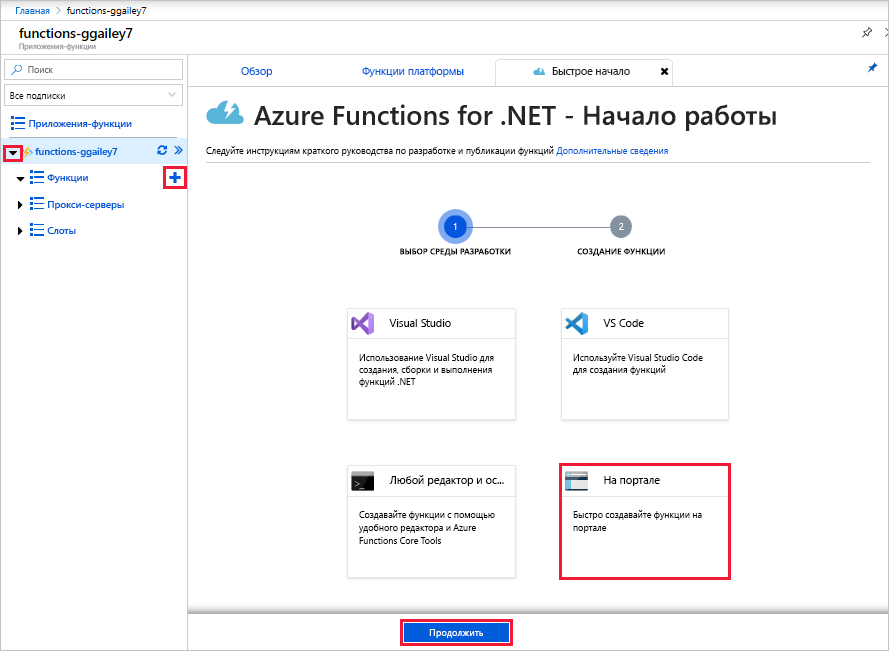
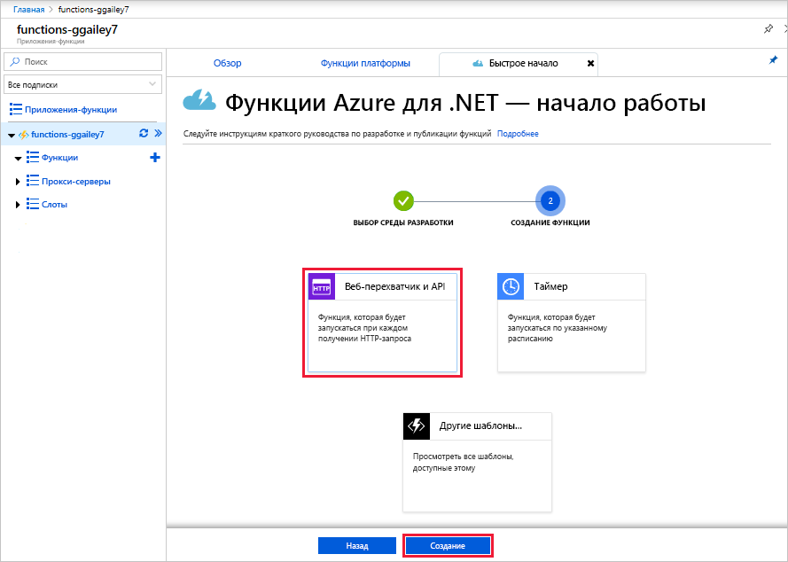
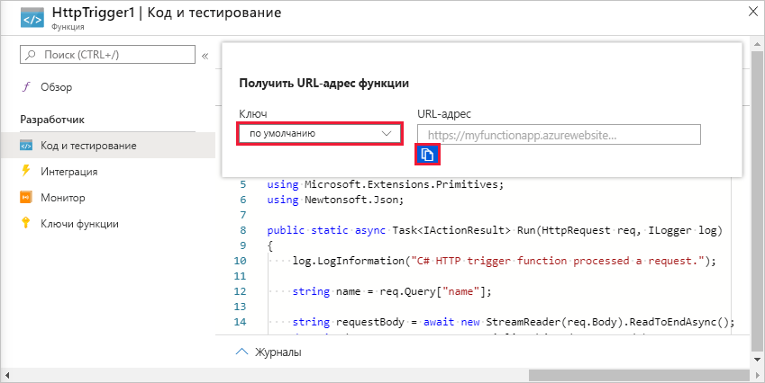

# Создание первой функции на портале Azure

Решение "Функции Azure" позволяет выполнять код в бессерверной среде без необходимости сначала создавать виртуальную машину или публиковать веб-приложение. В этой статье описано, как создать функцию Hello World для триггеров HTTP на портале Azure с помощью Функций Azure.

[!INCLUDE [quickstarts-free-trial-note](../../includes/quickstarts-free-trial-note.md)]

Разработчики C# могут [создать функцию в Visual Studio 2019](functions-create-your-first-function-visual-studio.md), а не на портале. 

## Вход в Azure

Войдите на [портал Azure](https://portal.azure.com) с помощью своей учетной записи Azure.

## Создание приложения-функции

Для выполнения функций вам понадобится приложение-функция, позволяющее группировать функции в логические единицы и упростить развертывание, масштабирование и совместное использование ресурсов, а также управление ими.

[!INCLUDE [Create function app Azure portal](../../includes/functions-create-function-app-portal.md)]

Затем создайте функцию в новом приложении-функции.

## Создание функции, активируемой HTTP

1. Разверните свое приложение-функцию и нажмите кнопку **+** рядом с **Функции**. Затем последовательно выберите элементы **На портале** и **Продолжить**.

    

1. Выберите элемент **Веб-перехватчик + API**, а затем нажмите кнопку **Создать**.

    

   Будет создана функция на основе шаблона функции с активацией по HTTP для конкретного языка.

Теперь вы можете запустить новую функцию, отправив HTTP-запрос.

## Проверка функции

1. В новой функции выберите команду **</> Получить URL-адрес функции** справа в верхнем углу. 

1. В диалоговом окне **Получить URL-адрес функции** в раскрывающемся списке выберите вариант **по умолчанию (функциональная клавиша)** , а затем выберите команду **Копировать**. 

    

1. Вставьте URL-адрес функции в адресную строку браузера. Добавьте значение строки запроса `&name=<your_name>` в конец этого URL-адреса и нажмите клавишу Enter, чтобы выполнить этот запрос. 

    Следующий пример демонстрирует ответ в браузере:

    

    URL-адрес запроса включает ключ, который по умолчанию необходим для доступа к функции по протоколу HTTP.

1. При выполнении функции сведения о трассировке записываются в журналы. Для просмотра выходных данных трассировки из предыдущего выполнения вернитесь к своей функции на портале и нажмите стрелку в нижней части экрана, чтобы развернуть раздел **Журналы**.

   

## Очистка ресурсов

[!INCLUDE [Clean-up resources](../../includes/functions-quickstart-cleanup.md)]

## Дальнейшие действия

[!INCLUDE [Next steps note](../../includes/functions-quickstart-next-steps.md)]

