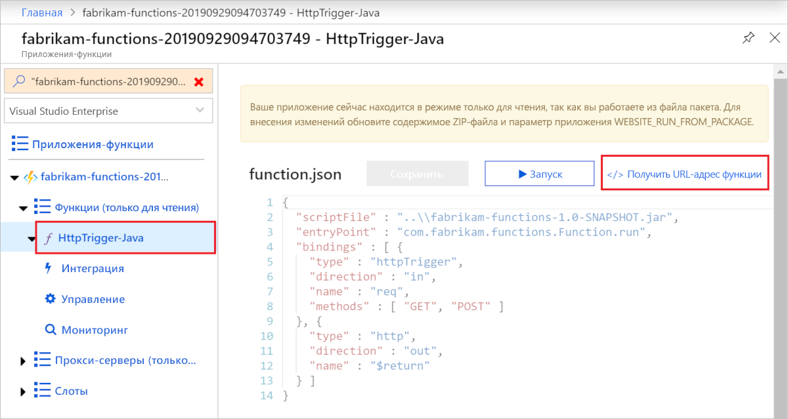

# <a name="use-java-and-gradle-to-create-and-publish-a-function-to-azure"></a>Используйте Java и Gradle для создания и публикации функции в Azure

В этой статье показано, как построить и опубликовать проект функции Java для функций Azure с помощью инструмента командной строки Gradle. После завершения этого руководства код функции будет выполняться в Azure в [бессерверном плане потребления](functions-scale.md#consumption-plan) с активацией по HTTP-запросу. 

> [!NOTE]
> Если Gradle не является предпочтительной вами инструментом разработки, ознакомьтесь с нашими аналогичными учебниками для Java devlopers с использованием [Maven,](/azure/azure-functions/functions-create-first-azure-function-azure-cli?pivots=programming-language-java) [IntelliJ IDEA](/azure/java/intellij/azure-toolkit-for-intellij-quickstart-functions) и [VS Code.](/azure/azure-functions/functions-create-first-function-vs-code?pivots=programming-language-java)

## <a name="prerequisites"></a>Предварительные требования

Для разработки функций с помощью Java, должны быть установлены следующие компоненты:

- [Набор Java-разработчика,](https://aka.ms/azure-jdks)версия 8
- [Azure CLI]
- [Azure Functions Core Tools](./functions-run-local.md#v2) 2.6.666 или более поздней версии.
- [Gradle](https://gradle.org/), версия 4.10 и выше

Вам также потребуется действующая подписка Azure. [!INCLUDE [quickstarts-free-trial-note](../../includes/quickstarts-free-trial-note.md)]

> [!IMPORTANT]
> Переменной среде JAVA_HOME необходимо присвоить расположение установки JDK, чтобы завершить выполнение заданий этого краткого руководства.

## <a name="prepare-a-functions-project"></a>Подготовка проекта «Функции»

Используйте следующую команду, чтобы клонировать образец проекта:

```bash
git clone https://github.com/Azure-Samples/azure-functions-samples-java.git
cd azure-functions-samples-java/
```

Откройте `build.gradle` и `appName` измените в следующем разделе на уникальное имя, чтобы избежать конфликта доменных имен при развертывании в Azure. 

```gradle
azurefunctions {
    resourceGroup = 'java-functions-group'
    appName = 'azure-functions-sample-demo'
    pricingTier = 'Consumption'
    region = 'westus'
    runtime {
      os = 'windows'
    }
    localDebug = "transport=dt_socket,server=y,suspend=n,address=5005"
}
```

Откройте в текстовом редакторе новый файл Function.java из папки *src/main/java* и изучите созданный код. Этот код содержит [активируемую по HTTP-запросу](functions-bindings-http-webhook.md) функцию, которая возвращает текст запроса. 

> [!div class="nextstepaction"]
> [У меня есть проблема](https://www.research.net/r/javae2e?tutorial=functions-maven-quickstart&step=generate-project)

## <a name="run-the-function-locally"></a>Локальное выполнение функции

Запустите следующую команду для создания, а затем запустите функциональный проект:

```bash
gradle jar --info
gradle azureFunctionsRun
```
При локальном выполнении проекта вы увидите следующие выходные данные Azure Functions Core Tools:

<pre>
...

Now listening on: http://0.0.0.0:7071
Application started. Press Ctrl+C to shut down.

Http Functions:

    HttpExample: [GET,POST] http://localhost:7071/api/HttpExample
...
</pre>

Триггер функции из командной строки, используя следующую команду cURL в новом окне терминала:

```bash
curl -w "\n" http://localhost:7071/api/HttpExample --data AzureFunctions
```

Ожидаемый выход следующий:

<pre>
Hello AzureFunctions!
</pre>

[Ключ функции](functions-bindings-http-webhook-trigger.md#authorization-keys) при локальном выполнении не требуется.  
Используйте `Ctrl+C` в терминале, чтобы остановить код функции.

> [!div class="nextstepaction"]
> [У меня есть проблема](https://www.research.net/r/javae2e?tutorial=functions-maven-quickstart&step=local-run)

## <a name="deploy-the-function-to-azure"></a>Развертывание функции для Azure

Приложение-функция и связанные ресурсы создаются в Azure при первом развертывании приложения-функции. Перед развертыванием выполните команду [az login](/cli/azure/authenticate-azure-cli) в Azure CLI, чтобы войти в подписку Azure. 

```azurecli
az login
```

> [!TIP]
> Если ваша учетная запись имеет доступ к нескольким подпискам, задайте подписку по умолчанию для текущего сеанса с помощью команды [az account set](/cli/azure/account#az-account-set). 

Используйте следующую команду для развертывания проекта в новом приложении функции. 

```bash
gradle azureFunctionsDeploy
```

Это создает следующие ресурсы в Azure, основанные на значениях в файле build.gradle:

+ группа ресурсов; Ей присваивается имя, которое вы указали в параметре _resourceGroup_.
+ учетная запись хранения; Требуется для Функций Azure. Это имя создается случайным образом на основе требований к именованию учетных записей хранения.
+ План службы приложений. Хостинг плана бессерверного потребления для приложения функции в указанном _приложенииРегион._ Это имя создается случайным образом.
+ Приложение-функция. Приложение-функция представляет собой минимальную единицу развертывания и выполнения для ваших функций. Ему присваивается имя из параметра _appName_, к которому добавляется случайное число. 

Развертывание также упаковывает файлы проекта и развертывает их в новом приложении-функции [из ZIP-файла](functions-deployment-technologies.md#zip-deploy) с включенным режимом выполнения из пакета.

Так как опубликованный нами триггер HTTP использует `authLevel = AuthorizationLevel.FUNCTION`, вам нужно получить ключ функции для вызова конечной точки функции по протоколу HTTP. Ключ функции проще всего получить на [портале Azure].

> [!div class="nextstepaction"]
> [У меня есть проблема](https://www.research.net/r/javae2e?tutorial=functions-maven-quickstart&step=deploy)

## <a name="get-the-http-trigger-url"></a>Получение URL-адреса триггера HTTP

Вы можете получить URL-адрес для активации функции (вместе с ключом функции) на портале Azure. 

1. Перейдите на [портал Azure], войдите в систему, введите _имя приложения-функции_ в поле **Поиск** в верхней части страницы и нажмите клавишу ВВОД.
 
1. В приложении-функции разверните **Функции (только для чтения)**, выберите созданную функцию и нажмите ** </> Получить URL-адрес функции** в правом верхнем углу. 

    

1. Выберите вариант **по умолчанию (функциональная клавиша)** и нажмите **Копировать**. 

Теперь скопированный URL-адрес можно использовать для доступа к функции.

## <a name="verify-the-function-in-azure"></a>Проверка функции в Azure

Чтобы проверить работу приложения-функции в Azure с помощью `cURL`, замените URL из приведенного ниже примера реальным URL-адресом, который вы скопировали с портала.

```console
curl -w "\n" https://fabrikam-functions-20190929094703749.azurewebsites.net/api/HttpExample?code=zYRohsTwBlZ68YF.... --data AzureFunctions
```

Это действие отправляет запрос POST в конечную точку функции с добавлением `AzureFunctions` в текст запроса. Вы увидите следующий ответ:

<pre>
Hello AzureFunctions!
</pre>

> [!div class="nextstepaction"]
> [У меня есть проблема](https://www.research.net/r/javae2e?tutorial=functions-maven-quickstart&step=verify-deployment)

## <a name="next-steps"></a>Дальнейшие действия

Итак, вы создали проект с функцией Java, активируемой по HTTP-запросу, запустили ее на своем локальном компьютере и развернули в Azure. Теперь расширьте свою функцию путем...

> [!div class="nextstepaction"]
> [Добавления выходной привязки очереди службы хранилища Azure](functions-add-output-binding-storage-queue-java.md)


[Azure CLI]: /cli/azure
[Портал Azure]: https://portal.azure.com
