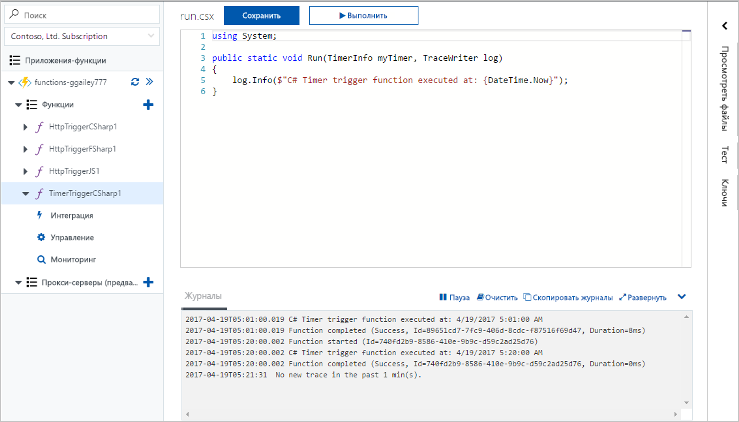
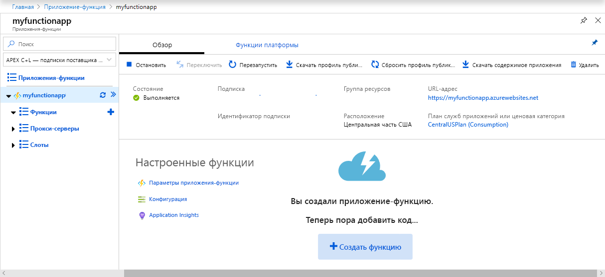
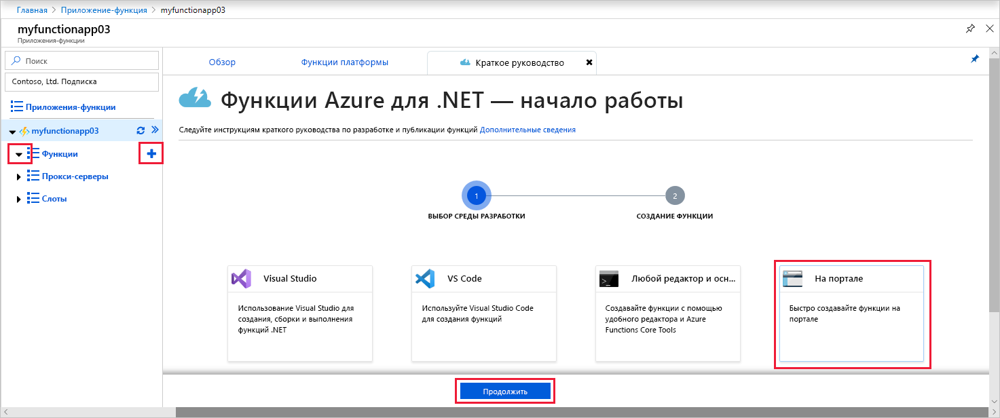
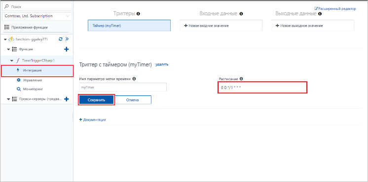

# Создание в Azure функции, активируемой по таймеру

Узнайте, как создать [независимую от сервера](https://azure.microsoft.com/solutions/serverless/) функцию, которая выполняется на основе определенного расписания с помощью Функций Azure.

## Предварительные требования

Для работы с этим руководством:

+ Если у вас еще нет подписки Azure, [создайте бесплатную учетную запись Azure](https://azure.microsoft.com/free/?WT.mc_id=A261C142F), прежде чем начинать работу.

## Создание приложения-функции Azure

[!INCLUDE [Create function app Azure portal](../../includes/functions-create-function-app-portal.md)]

Затем создайте функцию в новом приложении-функции.

## Создание функции, активируемой по таймеру

1. Разверните приложение-функцию и нажмите кнопку **+** рядом с элементом **Функции**. Если это первая функция в приложении-функции, последовательно выберите **На портале** и **Продолжить**. Если нет, перейдите к шагу 3.

   

2. Последовательно выберите **Дополнительные шаблоны** и **Finish and view templates** (Закончить и просмотреть шаблоны).

    

3. В поле поиска введите `timer` и настройте новый триггер с параметрами, как указано в таблице под изображением.

    

    | Параметр | Рекомендуемое значение | Описание |
    |---|---|---|
    | **Имя** | значение по умолчанию | Определяет имя функции, активируемой по таймеру. |
    | **Расписание** | 0 \*/1 \* \* \* \* | [Выражение CRON](functions-bindings-timer.md#ncrontab-expressions) с шестью полями, в котором запланировано ежеминутное выполнение функции. |

4. Нажмите кнопку **Создать**. Будет создана функция на выбранном вами языке, которая будет выполняться каждую минуту.

5. Проверьте выполнение, просмотрев записанные в журналах сведения трассировки.

    

Теперь потребуется изменить расписание функции, чтобы она выполнялась раз в час, а не раз в минуту.

## Обновление расписания таймера

1. Разверните вашу функцию и щелкните **Интеграция**. Здесь вы определяете входные и выходные привязки для вашей функции, а также задаете расписание. 

2. Введите в поле **Расписание** новое часовое значение `0 0 */1 * * *`, а затем щелкните **Сохранить**.  

Теперь функция будет выполняться раз в час. 

## Очистка ресурсов

[!INCLUDE [Next steps note](../../includes/functions-quickstart-cleanup.md)]

## Дополнительная информация

Вы создали функцию, которая выполняется на основе расписания. Дополнительные сведения о триггерах см.в статье [Триггеры таймера для службы "Функции Azure"](functions-bindings-timer.md).

[!INCLUDE [Next steps note](../../includes/functions-quickstart-next-steps.md)]
