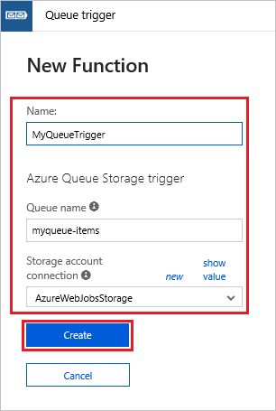
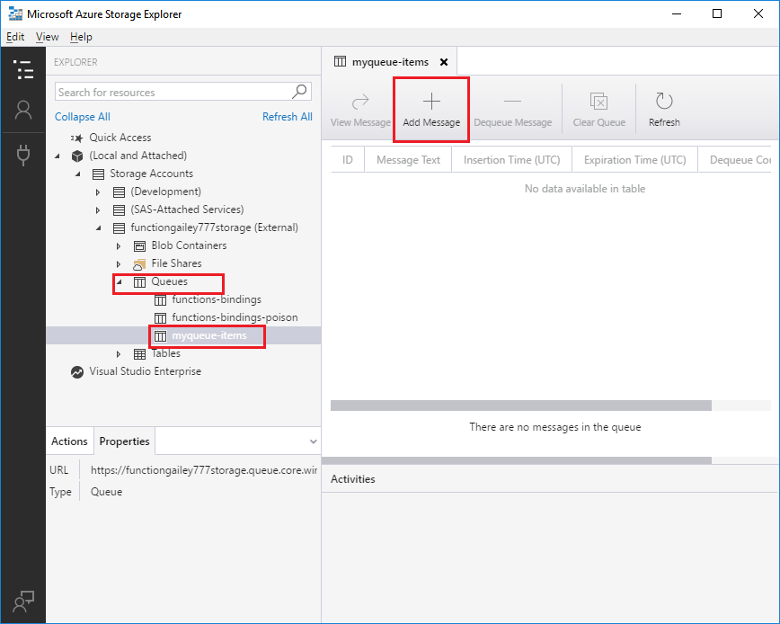

# Создание функции, активируемой хранилищем очередей Azure

Узнайте, как создать функцию, которая активируется при отправке сообщений в очередь Службы хранилища Azure.

## предварительные требования

- Скачайте и установите [обозреватель хранилищ Microsoft Azure](https://storageexplorer.com/).

- Подписка Azure. Если у вас еще нет подписки Azure, создайте [бесплатную учетную запись](https://azure.microsoft.com/free/?WT.mc_id=A261C142F), прежде чем начать работу.

## Создание приложения-функции Azure

[!INCLUDE [Create function app Azure portal](../../includes/functions-create-function-app-portal.md)]

Затем создайте функцию в новом приложении-функции.

## Создание функции, активируемой очередью

1. Разверните приложение-функцию и нажмите кнопку **+** рядом с элементом **Функции**. Если это первая функция в приложении-функции, последовательно выберите **На портале** и **Продолжить**. Если нет, перейдите к шагу 3.

   

1. Последовательно выберите **Дополнительные шаблоны** и **Finish and view templates** (Закончить и просмотреть шаблоны).

    

1. В поле поиска введите `queue` и выберите шаблон **Триггер очереди**.

1. Если появится соответствующий запрос, щелкните **Установить**, чтобы установить в приложение-функцию расширение Службы хранилища Azure и другие необходимые зависимости. По завершении установки щелкните **Продолжить**.

    

1. Затем используйте настройки, указанные в таблице под изображением.

    

    | Параметр | Рекомендуемое значение | Description |
    |---|---|---|
    | **Название** | Уникальное для вашего приложения-функции | Имя функции, активируемой очередью. |
    | **Имя очереди**   | myqueue-items    | Имя очереди для подключения к вашей учетной записи хранения. |
    | **Подключение к учетной записи хранения** | AzureWebJobsStorage | Вы можете использовать подключение к учетной записи хранения, которое уже используется вашим приложением-функцией, или создать его.  |    

1. Щелкните **Создать**, чтобы создать функцию.

Затем необходимо подключиться к своей учетной записи хранения Azure и создать очередь службы хранилища **myqueue-items**.

## Создание очереди

1. Щелкните **Интегрировать** в своей функции, затем разверните узел **Документация** и скопируйте **имя учетной записи** и **ключ учетной записи**. Эти учетные данные используются для подключения к учетной записи хранения в Обозревателе службы хранилища Azure. Если вы уже подключились к учетной записи хранения, перейдите к шагу 4.

    

1. Запустите инструмент [Обозреватель службы хранилища Microsoft Azure](https://storageexplorer.com/), щелкните значок подключения слева, выберите **Use a storage account name and key** (Использовать имя и ключ учетной записи хранения), а затем щелкните **Далее**.

    

1. Введите **имя учетной записи** и **ключ учетной записи** из шага 1, щелкните **Далее**, а затем — **Подключить**.

    

1. Разверните подключенную учетную запись хранения, щелкните правой кнопкой мыши **Очереди**, а затем щелкните **Создать очередь**, введите `myqueue-items` и нажмите клавишу ВВОД.

    

Теперь, когда вы создали очередь хранилища, испытайте функцию, добавив сообщение в очередь.

## Проверка функции

1. На портале Azure перейдите к вашей функции, в нижней части страницы разверните **Журналы** и убедитесь, что потоковая передача журналов не остановлена.

1. Разверните свою учетную запись в Обозреватель службы хранилища, узел **Очереди** и **myqueue-items**, а затем щелкните **Добавить сообщение**.

    

1. Введите сообщение Hello World в поле **Текст сообщения** и щелкните **ОК**.

1. Подождите несколько секунд, а затем вернитесь в журналы функции и убедитесь, что новое сообщение было считано из очереди.

    

1. Вернитесь в обозреватель хранилища, щелкните **Обновить** и убедитесь, что сообщение было обработано и больше не находится в очереди.

## Очистка ресурсов

[!INCLUDE [Next steps note](../../includes/functions-quickstart-cleanup.md)]

## Дальнейшие действия

Вы создали функцию, которая выполняется при добавлении сообщения в очередь хранилища. Дополнительные сведения о триггерах хранилища очередей см. в статье [Привязки очередей службы хранилища для Функций Azure](functions-bindings-storage-queue.md).

Теперь, когда вы создали первую функцию, давайте добавим к ней выходную привязку, которая позволяет записывать сообщения в другую очередь.

> [!div class="nextstepaction"]
> [Добавление сообщений в очередь службы хранилища Azure с помощью Функций](functions-integrate-storage-queue-output-binding.md)
