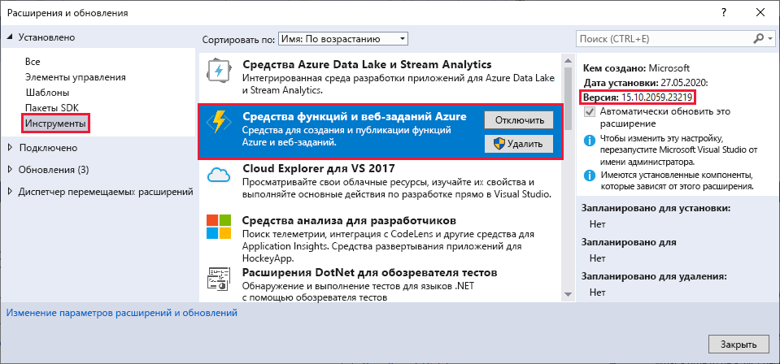
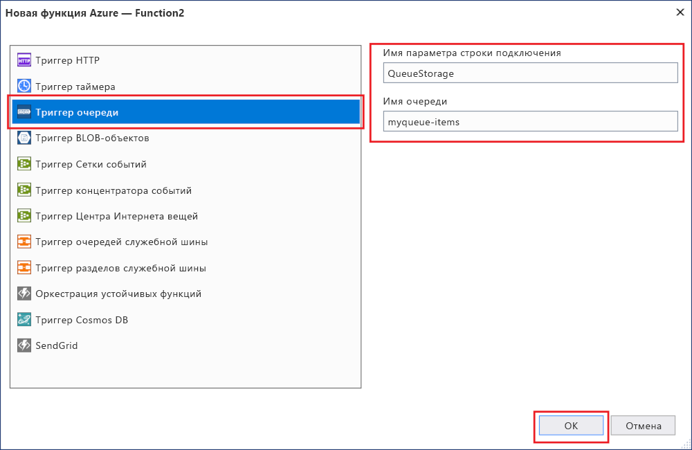
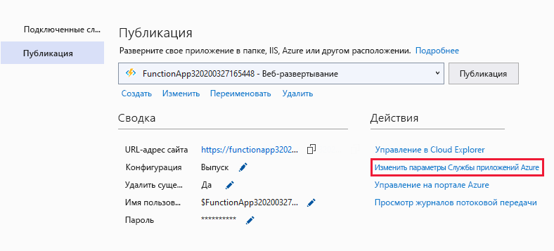

# <a name="develop-azure-functions-using-visual-studio"></a>Разработка Функций Azure с помощью Visual Studio  

Visual Studio позволяет разрабатывать, тестировать и развертывать C# функции библиотеки классов в Azure. Если вы впервые сталкиваетесь с функциями Azure, дополнительные сведения см. в статье [Общие сведения о Функциях Azure](functions-overview.md).

Visual Studio предоставляет следующие преимущества при разработке функций: 

* Создание, редактирование и выполнение функций на локальном компьютере для разработки. 
* Опубликуйте проект функций Azure непосредственно в Azure и при необходимости создайте ресурсы Azure. 
* Используйте C# атрибуты для объявления привязок функций непосредственно в C# коде.
* Разработка и развертывание предварительно скомпилированных функций C#. Предварительно скомпилированные функции обеспечивают более высокую производительность при холодном запуске, чем функции C# на основе сценариев. 
* Программирование функций в C#, сохраняя при этом все преимущества разработки в Visual Studio. 

В этой статье содержатся сведения об использовании Visual Studio для разработки C# функций библиотеки классов и их публикации в Azure. Перед прочтением этой статьи необходимо выполнить действия из статьи [Создание первой функции с помощью Visual Studio](functions-create-your-first-function-visual-studio.md). 

Если не указано иное, процедуры и примеры приведены для Visual Studio 2019. 

## <a name="prerequisites"></a>Технические условия

Средства функций Azure входят в рабочую нагрузку разработки Azure Visual Studio, начиная с Visual Studio 2017. Убедитесь, что в установку Visual Studio включена рабочая нагрузка **разработки Azure** .

[!INCLUDE [quickstarts-free-trial-note](../../includes/quickstarts-free-trial-note.md)]

Другие необходимые ресурсы, например учетная запись хранения Azure, создаются в подписке во время процесса публикации.

> [!NOTE]
> В Visual Studio 2017 Рабочая нагрузка разработки Azure устанавливает инструменты функций Azure как отдельное расширение. При обновлении Visual Studio 2017 также убедитесь, что вы используете [самую последнюю версию](#check-your-tools-version) средств функций Azure. В следующих разделах показано, как проверить и (при необходимости) обновить расширение средств работы с функциями Azure в Visual Studio 2017. 
>
> Если вы используете Visual Studio 2019, пропустите этот раздел.

### <a name="check-your-tools-version"></a>Проверка версии инструментов в Visual Studio 2017

1. В меню **Сервис** выберите пункт **Расширения и обновления**. Разверните **Установленные** > **Инструменты** и выберите **Azure Functions and Web Jobs Tools** (Инструменты для решения "Функции Azure" и веб-заданий).

    

1. Запишите номер установленной **версии**. Вы можете сравнить эту версию с последней версией, указанной [в заметках о выпуске](https://github.com/Azure/Azure-Functions/blob/master/VS-AzureTools-ReleaseNotes.md). 

1. Если вы используете более раннюю версию, обновите инструменты в Visual Studio, как показано в следующем разделе.

### <a name="update-your-tools-in-visual-studio-2017"></a>Обновление средств в Visual Studio 2017

1. В диалоговом окне **Расширения и обновления** последовательно выберите **Обновления** > **Visual Studio Marketplace**, **Azure Functions and Web Jobs Tools** (Инструменты для решения "Функции Azure" и веб-заданий) и нажмите кнопку **Обновить**.

       

1. Скачав обновления для инструментов, закройте Visual Studio, чтобы активировать обновления с помощью установщика VSIX.

1. В установщике нажмите кнопку **ОК**, чтобы начать запуск, и выберите **Изменить** для обновления инструментов. 

1. Когда обновление завершится, нажмите кнопку **Закрыть** и перезапустите Visual Studio.

> [!NOTE]  
> В Visual Studio 2019 и более поздних версиях расширение "средства функций Azure" обновляется как часть Visual Studio.  

## <a name="create-an-azure-functions-project"></a>Создание проекта Функций Azure

[!INCLUDE [Create a project using the Azure Functions](../../includes/functions-vstools-create.md)]

Шаблон проекта создает проект на C#, устанавливает пакет NuGet `Microsoft.NET.Sdk.Functions` и задает требуемую версию .NET Framework. Новый проект содержит следующие файлы:

* **host.json**: позволяет настроить узел Функций. Эти параметры применяются как в локальном режиме, так и в Azure. Дополнительные сведения см. в [справочной статье о host.json](functions-host-json.md).

* **local.settings.json**: содержит параметры, используемые при выполнении функций локально. Эти параметры не используются при работе в Azure. Дополнительные сведения см. в разделе [локальный файл параметров](#local-settings-file).

    >[!IMPORTANT]
    >Так как файл local.settings.json может содержать секреты, вы должны исключить его из системы управления версиями проекта. Параметр **Копировать в выходной каталог** для этого файла должен всегда иметь значение **Копировать, если новее**. 

Для получения дополнительных сведений см. [Проект библиотеки классов функций](functions-dotnet-class-library.md#functions-class-library-project).

[!INCLUDE [functions-local-settings-file](../../includes/functions-local-settings-file.md)]

Параметры в local. Settings. JSON не передаются автоматически при публикации проекта. Чтобы убедиться, что эти параметры также существуют в приложении функции в Azure, их необходимо отправить после публикации проекта. Дополнительные сведения см. в разделе [Параметры приложения функции](#function-app-settings).

Значения **ConnectionStrings** никогда не публикуются.

Эти значения параметров приложения-функции также могут считываться в коде как переменные среды. Дополнительные сведения см. в разделе [переменные среды](functions-dotnet-class-library.md#environment-variables).

## <a name="configure-the-project-for-local-development"></a>Настройка проекта для локальной разработки

Среде выполнения Функций Azure необходима учетная запись хранения Azure для внутреннего использования. Для всех типов триггеров, кроме HTTP и веб-перехватчиков, необходимо задать в качестве ключа **Values.AzureWebJobsStorage** допустимую строку подключения к учетной записи хранения Azure. Приложение-функция может также использовать [эмулятор службы хранилища Azure](../storage/common/storage-use-emulator.md) для параметра подключения **AzureWebJobsStorage**, который необходим для проекта. Чтобы использовать эмулятор, установите значение **AzureWebJobsStorage** для `UseDevelopmentStorage=true`. Измените этот параметр на действительную строку подключения учетной записи хранения перед развертыванием.

Чтобы задать строку подключения к учетной записи хранения, выполните следующие действия:

1. В Visual Studio откройте **Cloud Explorer**, разверните **учетную запись хранения** > **учетной записи хранения**, а затем на вкладке **Свойства** скопируйте **основное значение строки подключения** .

2. В своем проекте откройте файл local.settings.json и задайте в качестве значения ключа **AzureWebJobsStorage** скопированную вами строку подключения.

3. Повторите предыдущий шаг, чтобы добавить уникальные ключи в массив **Values** для всех других подключений, которые необходимы для функций. 

## <a name="add-a-function-to-your-project"></a>Добавление функции в проект

В C# функциях библиотеки классов привязки, используемые функцией, определяются путем применения атрибутов в коде. При создании триггеров функций из предоставленных шаблонов применяются атрибуты триггера. 

1. Щелкните правой кнопкой мыши узел проекта в **обозревателе решений** и выберите **Добавить** > **Новый элемент**. Выберите **Функция Azure**, введите **Имя** класса и нажмите кнопку **Добавить**.

2. Выберите триггер, задайте свойства привязки и нажмите кнопку **Создать**. В следующем примере показаны параметры при создании функции, активируемой хранилищем очередей. 

    

    В этом примере триггера используется строка подключения с ключом **QueueStorage**. Этот параметр строки подключения должен быть определен в файле [local.settings.json](functions-run-local.md#local-settings-file).

3. Проверьте добавленный класс. Вы видите статический метод **Run**, который имеет атрибут **FunctionName**. Этот атрибут указывает, что метод является точкой входа для функции.

    Например, следующий класс C# представляет собой простую функцию, активируемую хранилищем очередей:

    ```csharp
    using System;
    using Microsoft.Azure.WebJobs;
    using Microsoft.Azure.WebJobs.Host;
    using Microsoft.Extensions.Logging;

    namespace FunctionApp1
    {
        public static class Function1
        {
            [FunctionName("QueueTriggerCSharp")]
            public static void Run([QueueTrigger("myqueue-items", 
                Connection = "QueueStorage")]string myQueueItem, ILogger log)
            {
                log.LogInformation($"C# Queue trigger function processed: {myQueueItem}");
            }
        }
    }
    ```

    Определяемый привязкой атрибут применяется к каждому параметру привязки, передаваемому в метод точки входа. Атрибут принимает сведения о привязке в качестве параметров. В предыдущем примере к первому параметру применен атрибут **QueueTrigger**, указывающий на то, что функция активируется очередью. Имя очереди и строки подключения передаются в качестве параметров в атрибут **QueueTrigger**. Дополнительные сведения см. в статье [Привязки хранилища очередей Azure для службы "Функции Azure"](functions-bindings-storage-queue.md#trigger---c-example).

С помощью описанной выше процедуры вы можете добавить больше функций в проект приложения-функции. Триггеры для функций могут быть разными, но каждая функция в проекте может иметь только один триггер. Дополнительные сведения см. в статье [Основные понятия триггеров и привязок в Функциях Azure](functions-triggers-bindings.md).

## <a name="add-bindings"></a>Добавление привязок

Как и триггеры, входные и выходные привязки добавляются к функции в виде атрибутов. Добавьте привязки к функции следующим образом:

1. Убедитесь, что [проект настроен для локальной разработки](#configure-the-project-for-local-development).

2. Добавьте соответствующий пакет расширений NuGet для конкретной привязки. Дополнительные сведения см. в разделе [Локальная разработка на C# с помощью Visual Studio или VS Code](./functions-bindings-register.md#local-csharp). Требования к пакету NuGet для определенной привязки можно найти в соответствующей справочной статье. Например, требования к пакету для триггера Центров событий см. в [справочной статье о привязках Центров событий](functions-bindings-event-hubs.md).

3. Если для привязки требуются параметры приложения, добавьте их в коллекцию **Values** в [файле с локальными параметрами](functions-run-local.md#local-settings-file). Эти значения используются, если функция выполняется локально. Если же функция выполняется в приложении-функции в Azure, используются [параметры приложения-функции](#function-app-settings).

4. Добавьте соответствующий атрибут привязки в сигнатуру метода. В примере ниже сообщение очереди активирует функцию, а с помощью выходной привязки создается новое сообщение с таким же текстом, но в другой очереди.

    ```csharp
    public static class SimpleExampleWithOutput
    {
        [FunctionName("CopyQueueMessage")]
        public static void Run(
            [QueueTrigger("myqueue-items-source", Connection = "AzureWebJobsStorage")] string myQueueItem, 
            [Queue("myqueue-items-destination", Connection = "AzureWebJobsStorage")] out string myQueueItemCopy,
            ILogger log)
        {
            log.LogInformation($"CopyQueueMessage function processed: {myQueueItem}");
            myQueueItemCopy = myQueueItem;
        }
    }
    ```
   Подключение к хранилищу очередей устанавливается с помощью параметра `AzureWebJobsStorage`. Дополнительные сведения см. в справочной статье по определенной привязке. 

[!INCLUDE [Supported triggers and bindings](../../includes/functions-bindings.md)]

## <a name="testing-functions"></a>Функции тестирования

Основные инструменты службы Функции Azure позволяют запускать проекты функций Azure на локальном компьютере разработчика. Вам будет предложено установить эти инструменты при первом запуске функции из Visual Studio.

Чтобы проверить работу функции, нажмите клавишу F5. Если будет предложено, примите запрос от Visual Studio на скачивание и установку основных инструментов службы Функции Azure (CLI). Кроме того, вам может понадобиться включить исключение брандмауэра, чтобы инструменты могли обрабатывать HTTP-запросы.

Когда проект запущен, можно протестировать код, как тестируется развернутая функция. Дополнительные сведения см. в статье [Методика тестирования кода с помощью Функций Azure](functions-test-a-function.md). При работе в режиме отладки точки останова срабатывают в Visual Studio должным образом. 

<!---
For an example of how to test a queue triggered function, see the [queue triggered function quickstart tutorial](functions-create-storage-queue-triggered-function.md#test-the-function).  
-->

Дополнительные сведения об использовании основных инструментов Функций Azure см. в статье [Как программировать и тестировать функции Azure в локальной среде](functions-run-local.md).

## <a name="publish-to-azure"></a>Публикация в Azure

При публикации из Visual Studio используется один из двух методов развертывания:

* [Веб-развертывание](functions-deployment-technologies.md#web-deploy-msdeploy): пакеты и развертывает приложения Windows на любом сервере IIS.
* [ZIP-развертывание с включенным запуском из пакета](functions-deployment-technologies.md#zip-deploy): рекомендуется для развертываний функций Azure.

Выполните следующие действия, чтобы опубликовать проект в приложении-функции в Azure.

[!INCLUDE [Publish the project to Azure](../../includes/functions-vstools-publish.md)]

## <a name="function-app-settings"></a>Параметры приложения-функции

Все параметры, которые вы добавили в файл local.settings.json, необходимо также добавить в приложение-функцию в Azure. Эти параметры не передаются автоматически при публикации проекта.

Проще всего передать необходимые параметры в приложение-функцию в Azure с помощью ссылки **Управление параметрами приложения…** , которая появляется после успешной публикации проекта.



Для приложения-функции отобразится диалоговое окно **Параметры приложения**, в котором можно добавить новые параметры приложения или изменить имеющиеся.


**Локальный** — значение параметра в файле local.settings.json, а **Удаленный** — текущий параметр в приложении-функции в Azure.  Выберите **Добавить параметр** , чтобы создать новый параметр приложения. Используйте ссылку **Вставка локального значения**, чтобы скопировать значение параметра в поле **Удаленный**. Когда вы нажмете кнопку **ОК**, ожидающие изменения запишутся в файл с локальными параметрами и приложение-функцию.

> [!NOTE]
> По умолчанию файл Local. Settings. JSON не возвращается в систему управления версиями. Это означает, что при клонировании проекта локальных функций из системы управления версиями проект не содержит файл Local. Settings. JSON. В этом случае необходимо вручную создать файл Local. Settings. JSON в корневом каталоге проекта, чтобы диалоговое окно **параметров приложения** работала правильно. 

Управление параметрами приложения также можно осуществлять с помощью одного из способов ниже.

* [С помощью портала Azure](functions-how-to-use-azure-function-app-settings.md#settings).
* [С помощью параметра публикации `--publish-local-settings` в основных инструментах Функций Azure](functions-run-local.md#publish).
* [С помощью Azure CLI](/cli/azure/functionapp/config/appsettings#az-functionapp-config-appsettings-set).

## <a name="monitoring-functions"></a>Мониторинг функций

Рекомендуемый способ наблюдения за выполнением этой функции — интеграция приложения-функции в Azure Application Insights. При создании приложения-функции на портале Azure эта интеграция выполняется по умолчанию. Тем не менее при создании приложения-функции во время публикации в Visual Studio интеграция в приложении-функции в Azure не происходит.

Чтобы настроить Application Insights для приложения-функции, сделайте следующее:

[!INCLUDE [functions-connect-new-app-insights.md](../../includes/functions-connect-new-app-insights.md)]

Дополнительные сведения см. в статье [Мониторинг Функций Azure](functions-monitoring.md).

## <a name="next-steps"></a>Дальнейшие действия

Дополнительные сведения об основных инструментах Функций Azure см. в статье [Как программировать и тестировать функции Azure в локальной среде](functions-run-local.md).

Дополнительные сведения о разработке функций, таких как библиотеки класса .NET, см. в статье [Справочник разработчика C# по функциям Azure](functions-dotnet-class-library.md). Здесь также приведены примеры того, как использовать атрибуты для объявления разных типов привязок, поддерживаемых в службе "Функции Azure".    
