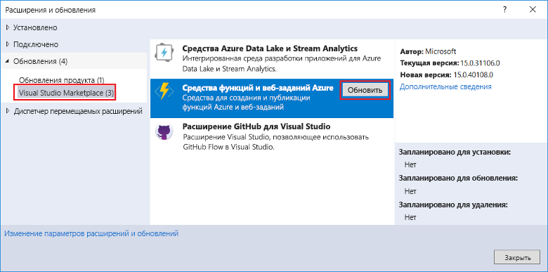
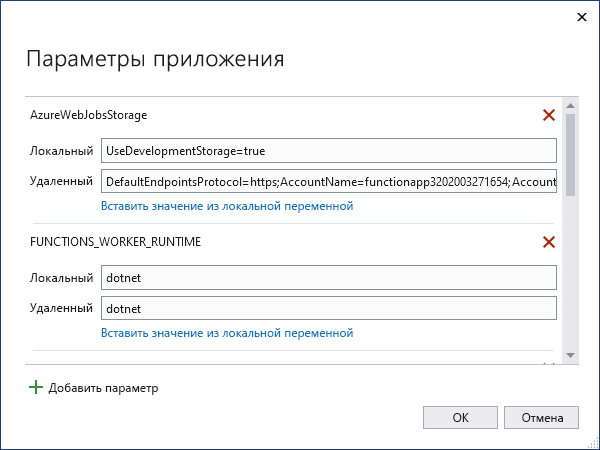

# <a name="develop-azure-functions-using-visual-studio"></a>Разработка Функций Azure с помощью Visual Studio  

Visual Studio позволяет разрабатывать, тестировать и развертывать функции библиотеки классов C# в Azure. Если вы впервые поработаете с функциями Azure, см. статью [Общие сведения о функциях Azure](functions-overview.md).

Visual Studio предоставляет следующие преимущества при разработке функций: 

* Создание, редактирование и выполнение функций на локальном компьютере для разработки. 
* Опубликуйте проект функций Azure непосредственно в Azure и при необходимости создайте ресурсы Azure. 
* Используйте атрибуты C# для объявления привязок функций непосредственно в коде C#.
* Разработка и развертывание предварительно скомпилированных функций C#. Предварительно скомпилированные функции обеспечивают более высокую производительность при холодном запуске, чем функции C# на основе сценариев. 
* Программирование функций в C#, сохраняя при этом все преимущества разработки в Visual Studio. 

В этой статье содержатся сведения об использовании Visual Studio для разработки функций библиотеки классов C# и их публикации в Azure. Прежде чем приступить к ознакомлению с этой статьей, ознакомьтесь с [кратким руководством по функциям Visual Studio](functions-create-your-first-function-visual-studio.md). 

Если не указано иное, процедуры и примеры приведены для Visual Studio 2019. 

## <a name="prerequisites"></a>Предварительные требования

- Средства функций Azure. Чтобы добавить инструменты функций Azure, включите рабочую нагрузку **разработки Azure** в установку Visual Studio. Средства функций Azure доступны в рабочей нагрузке разработка Azure, начиная с Visual Studio 2017.

- Другие необходимые ресурсы, например учетная запись хранения Azure, создаются в подписке во время процесса публикации.

- [!INCLUDE [quickstarts-free-trial-note](../../includes/quickstarts-free-trial-note.md)]

> [!NOTE]
> В Visual Studio 2017 Рабочая нагрузка разработки Azure устанавливает инструменты функций Azure как отдельное расширение. При обновлении установки Visual Studio 2017 убедитесь, что вы используете [самую последнюю версию](#check-your-tools-version) средств функций Azure. В следующих разделах показано, как проверить и (при необходимости) обновить расширение средств работы с функциями Azure в Visual Studio 2017. 
>
> Пропустите эти разделы, если используете Visual Studio 2019.

### <a name="check-your-tools-version-in-visual-studio-2017"></a><a name="check-your-tools-version"></a>Проверка версии инструментов в Visual Studio 2017

1. В меню **Сервис** выберите пункт **Расширения и обновления**. Разверните узел **установленные**  >  **инструменты**, а затем выберите **функции Azure и веб-задания**.

    

1. Обратите внимание на установленную **версию** и Сравните эту версию с последней версией, указанной в [заметках о выпуске](https://github.com/Azure/Azure-Functions/blob/master/VS-AzureTools-ReleaseNotes.md). 

1. Если вы используете более раннюю версию, обновите инструменты в Visual Studio, как показано в следующем разделе.

### <a name="update-your-tools-in-visual-studio-2017"></a>Обновление средств в Visual Studio 2017

1. В диалоговом окне **Расширения и обновления** последовательно выберите **Обновления** > **Visual Studio Marketplace**, **Azure Functions and Web Jobs Tools** (Инструменты для решения "Функции Azure" и веб-заданий) и нажмите кнопку **Обновить**.

       

1. После скачивания обновления инструментов нажмите кнопку **Закрыть**, а затем закройте Visual Studio, чтобы активировать обновление средств с помощью установщика VSIX.

1. В установщике VSIX выберите **изменить** , чтобы обновить средства. 

1. После завершения обновления нажмите кнопку **Закрыть**, а затем перезапустите Visual Studio.

> [!NOTE]  
> В Visual Studio 2019 и более поздних версиях расширение "средства функций Azure" обновляется как часть Visual Studio.  

## <a name="create-an-azure-functions-project"></a>Создание проекта Функций Azure

[!INCLUDE [Create a project using the Azure Functions](../../includes/functions-vstools-create.md)]

После создания проекта функций Azure шаблон проекта создает проект C#, устанавливает `Microsoft.NET.Sdk.Functions` пакет NuGet и задает целевую платформу. Новый проект содержит следующие файлы:

* **host.json**: позволяет настроить узел Функций. Эти параметры применяются как в локальном режиме, так и в Azure. Дополнительные сведения см. в [справочной статье о host.json](functions-host-json.md).

* **local.settings.json**: содержит параметры, используемые при выполнении функций локально. Эти параметры не используются при работе в Azure. Дополнительные сведения см. в разделе [локальный файл параметров](#local-settings-file).

    >[!IMPORTANT]
    >Поскольку local.settings.jsв файле могут содержать секреты, необходимо исключить его из системы управления версиями проекта. Убедитесь, что параметр **Копировать в выходной каталог** для этого файла имеет значение **Копировать, если новее**. 

Для получения дополнительных сведений см. [Проект библиотеки классов функций](functions-dotnet-class-library.md#functions-class-library-project).

[!INCLUDE [functions-local-settings-file](../../includes/functions-local-settings-file.md)]

Visual Studio не будет автоматически отправлять параметры в local.settings.jsпри публикации проекта. Чтобы убедиться, что эти параметры также существуют в приложении функции в Azure, отправьте их после публикации проекта. Дополнительные сведения см. в разделе [Параметры приложения функции](#function-app-settings). Значения в `ConnectionStrings` коллекции никогда не публикуются.

Код также может считывать значения параметров приложения функции в виде переменных среды. Дополнительную информацию см. в разделе [Переменные среды](functions-dotnet-class-library.md#environment-variables).

## <a name="configure-the-project-for-local-development"></a>Настройка проекта для локальной разработки

Среде выполнения Функций Azure необходима учетная запись хранения Azure для внутреннего использования. Для всех типов триггеров, отличных от HTTP и веб-перехватчиков, задайте `Values.AzureWebJobsStorage` для ключа допустимую строку подключения к учетной записи хранения Azure. Приложение функции также может использовать [эмулятор хранения Azure](../storage/common/storage-use-emulator.md) для `AzureWebJobsStorage` параметра подключения, который требуется для проекта. Чтобы использовать эмулятор, присвойте свойству значение `AzureWebJobsStorage` `UseDevelopmentStorage=true` . Измените этот параметр на действительную строку подключения учетной записи хранения перед развертыванием.

Чтобы задать строку подключения к учетной записи хранения, выполните следующие действия:

1. В Visual Studio выберите **Просмотреть**  >  **Cloud Explorer**.

2. В **Cloud Explorer**разверните **учетные записи хранения**, а затем выберите свою учетную запись хранения. На вкладке **Свойства** скопируйте **основное значение строки подключения** .

2. В проекте откройте local.settings.jsв файле и задайте в качестве значения `AzureWebJobsStorage` ключа скопированную строку подключения.

3. Повторите предыдущий шаг, чтобы добавить уникальные ключи в `Values` массив для любых других подключений, необходимых для ваших функций. 

## <a name="add-a-function-to-your-project"></a>Добавление функции в проект

В функциях библиотеки классов C# привязки, используемые функцией, определяются путем применения атрибутов в коде. При создании триггеров функций из предоставленных шаблонов применяются атрибуты триггера. 

1. В **Обозреватель решений**щелкните правой кнопкой мыши узел проекта и выберите **Добавить**  >  **новый элемент**. 

2. Выберите **функция Azure**, введите **имя** класса и нажмите кнопку **добавить**.

3. Выберите триггер, задайте свойства привязки, а затем нажмите кнопку **ОК**. В следующем примере показаны параметры для создания функции триггера хранилища очередей. 

    

    В этом примере триггера используется строка подключения с ключом `QueueStorage` . Определите этот параметр строки подключения в [local.settings.jsфайла](functions-run-local.md#local-settings-file).

4. Проверьте добавленный класс. Вы увидите статический `Run()` метод с атрибутом `FunctionName` . Этот атрибут указывает, что метод является точкой входа для функции.

    Например, следующий класс C# представляет базовую функцию триггера хранилища очередей:

    ```csharp
    using System;
    using Microsoft.Azure.WebJobs;
    using Microsoft.Azure.WebJobs.Host;
    using Microsoft.Extensions.Logging;

    namespace FunctionApp1
    {
        public static class Function1
        {
            [FunctionName("QueueTriggerCSharp")]
            public static void Run([QueueTrigger("myqueue-items", 
                Connection = "QueueStorage")]string myQueueItem, ILogger log)
            {
                log.LogInformation($"C# Queue trigger function processed: {myQueueItem}");
            }
        }
    }
    ```

Определяемый привязкой атрибут применяется к каждому параметру привязки, передаваемому в метод точки входа. Атрибут принимает сведения о привязке в качестве параметров. В предыдущем примере к первому параметру `QueueTrigger` применен атрибут, указывающий на функцию триггера хранилища очередей. Имя очереди и имя параметра строки подключения передаются в качестве параметров в `QueueTrigger` атрибут. Дополнительные сведения см. в статье [Привязки хранилища очередей Azure для службы "Функции Azure"](functions-bindings-storage-queue-trigger.md).

Используйте описанную выше процедуру, чтобы добавить дополнительные функции в проект приложения функции. У всех функций в проекте могут быть разные триггеры, однако у каждой должно быть не больше и не меньше одного триггера. Дополнительные сведения см. в разделе [Основные понятия триггеров и привязок в Функциях Azure](functions-triggers-bindings.md).

## <a name="add-bindings"></a>Добавление привязок

Как и триггеры, входные и выходные привязки добавляются к функции в виде атрибутов. Добавьте привязки к функции следующим образом:

1. Убедитесь, что [проект настроен для локальной разработки](#configure-the-project-for-local-development).

2. Добавьте соответствующий пакет расширений NuGet для конкретной привязки. 

   Дополнительные сведения см. [в разделе Библиотека классов C# с Visual Studio](./functions-bindings-register.md#local-csharp). Требования к пакету NuGet, зависящие от привязки, приведены в справочной статье по привязке. Например, требования к пакету для триггера Центров событий см. в [справочной статье о привязках Центров событий](functions-bindings-event-hubs.md).

3. Если имеются параметры приложения, необходимые для привязки, добавьте их в `Values` коллекцию в [файле локального параметра](functions-run-local.md#local-settings-file). 

   Функция использует эти значения при локальном запуске. Когда функция выполняется в приложении функции в Azure, она использует [Параметры приложения функции](#function-app-settings).

4. Добавьте соответствующий атрибут привязки в сигнатуру метода. В примере ниже сообщение очереди активирует функцию, а с помощью выходной привязки создается новое сообщение с таким же текстом, но в другой очереди.

    ```csharp
    public static class SimpleExampleWithOutput
    {
        [FunctionName("CopyQueueMessage")]
        public static void Run(
            [QueueTrigger("myqueue-items-source", Connection = "AzureWebJobsStorage")] string myQueueItem, 
            [Queue("myqueue-items-destination", Connection = "AzureWebJobsStorage")] out string myQueueItemCopy,
            ILogger log)
        {
            log.LogInformation($"CopyQueueMessage function processed: {myQueueItem}");
            myQueueItemCopy = myQueueItem;
        }
    }
    ```
   Подключение к хранилищу очередей устанавливается с помощью параметра `AzureWebJobsStorage`. Дополнительные сведения см. в справочной статье по определенной привязке. 

[!INCLUDE [Supported triggers and bindings](../../includes/functions-bindings.md)]

## <a name="testing-functions"></a>Функции тестирования

Основные инструменты службы Функции Azure позволяют запускать проекты функций Azure на локальном компьютере разработчика. Дополнительные сведения см. [в разделе Работа с Azure functions Core Tools](functions-run-local.md). Вам будет предложено установить эти средства при первом запуске функции из Visual Studio. 

Чтобы протестировать функцию в Visual Studio, выполните следующие действия.

1. Нажмите клавишу F5. Если будет предложено, примите запрос от Visual Studio на скачивание и установку основных инструментов службы Функции Azure (CLI). Кроме того, возможно, вам понадобиться включить исключение брандмауэра, чтобы инструменты могли обрабатывать HTTP-запросы.

2. При выполнении проекта Протестируйте код так же, как вы протестируете развернутую функцию. 

   Дополнительные сведения см. в статье [Методика тестирования кода с помощью Функций Azure](functions-test-a-function.md). При запуске Visual Studio в режиме отладки выполняются ожидаемые точки останова.

<!---
For an example of how to test a queue triggered function, see the [queue triggered function quickstart tutorial](functions-create-storage-queue-triggered-function.md#test-the-function).  
-->


## <a name="publish-to-azure"></a>Публикация в Azure

При публикации из Visual Studio используется один из двух методов развертывания:

* [Веб-развертывание](functions-deployment-technologies.md#web-deploy-msdeploy): пакеты и развертывает приложения Windows на любом сервере IIS.
* [ZIP-развертывание с включенным запуском из пакета](functions-deployment-technologies.md#zip-deploy): рекомендуется для развертываний функций Azure.

Выполните следующие действия, чтобы опубликовать проект в приложении-функции в Azure.

[!INCLUDE [Publish the project to Azure](../../includes/functions-vstools-publish.md)]

## <a name="function-app-settings"></a>Параметры приложения-функции

Так как Visual Studio не передает эти параметры автоматически при публикации проекта, все параметры, добавляемые в local.settings.js, необходимо также добавить в приложение-функцию в Azure.

Самый простой способ отправить необходимые параметры в приложение-функцию в Azure — выбрать ссылку **Управление параметрами службы приложений Azure** , которая появится после успешной публикации проекта.

:::image type="content" source="./media/functions-develop-vs/functions-vstools-app-settings.png" alt-text="Параметры в окне публикации":::

При выборе этой ссылки открывается диалоговое окно **Параметры приложения** для приложения функции, в котором можно добавлять новые параметры приложения или изменять существующие.



**Локально** отображает значение параметра в local.settings.jsдля файла, а **Удаленное** отображение текущего значения параметра в приложении-функции в Azure. Чтобы создать параметр приложения, выберите **Добавьте параметр**. Используйте ссылку **Вставка локального значения**, чтобы скопировать значение параметра в поле **Удаленный**. Когда вы нажмете кнопку **ОК**, ожидающие изменения запишутся в файл с локальными параметрами и приложение-функцию.

> [!NOTE]
> По умолчанию local.settings.jsдля файла не возвращается в систему управления версиями. Это означает, что при клонировании проекта локальных функций из системы управления версиями проект не будет иметь local.settings.jsв файле. В этом случае необходимо вручную создать local.settings.jsдля файла в корневом каталоге проекта, чтобы диалоговое окно **параметров приложения** работала правильно. 

Управление параметрами приложения также можно осуществлять с помощью одного из способов ниже.

* [воспользуйтесь порталом Azure](functions-how-to-use-azure-function-app-settings.md#settings).
* [Используйте `--publish-local-settings` параметр опубликовать в Azure functions Core Tools](functions-run-local.md#publish).
* [Используйте Azure CLI](/cli/azure/functionapp/config/appsettings#az-functionapp-config-appsettings-set).

## <a name="monitoring-functions"></a>Мониторинг функций

Рекомендуемый способ наблюдения за выполнением этой функции — интеграция приложения-функции в Azure Application Insights. При создании приложения-функции на портале Azure эта интеграция выполняется по умолчанию. Тем не менее при создании приложения-функции во время публикации в Visual Studio интеграция в приложении-функции в Azure не происходит. Сведения о подключении Application Insights к приложению функции см. в разделе [Включение интеграции Application Insights](configure-monitoring.md#enable-application-insights-integration).

Дополнительные сведения о мониторинге с помощью Application Insights см. в статье [мониторинг функций Azure](functions-monitoring.md).

## <a name="next-steps"></a>Дальнейшие действия

Дополнительные сведения о Azure Functions Core Tools см. в разделе [Работа с Azure functions Core Tools](functions-run-local.md).

Дополнительные сведения о разработке функций в виде библиотек классов .NET см. в статье [Справочник разработчика C# по функциям Azure](functions-dotnet-class-library.md). Здесь также приведены примеры того, как использовать атрибуты для объявления разных типов привязок, поддерживаемых в службе "Функции Azure".    
