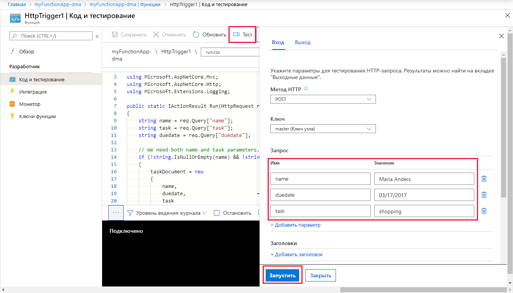
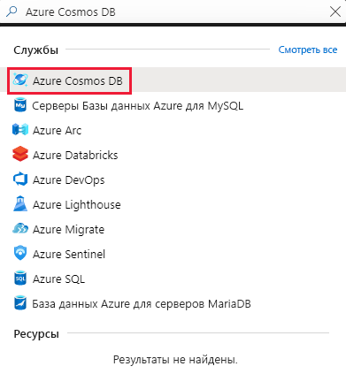

# <a name="store-unstructured-data-using-azure-functions-and-azure-cosmos-db"></a>Хранение неструктурированных данных с помощью Azure Cosmos DB и службы "Функции Azure"

[Azure Cosmos DB](https://azure.microsoft.com/services/cosmos-db/) — это отличный способ хранения неструктурированных данных и данных в формате JSON. В сочетании с функциями Azure Cosmos DB позволяет быстро и просто сохранять данные, используя код гораздо меньшего объема, чем требуется для хранения данных в реляционной базе данных.

> [!NOTE]
> Сейчас триггер, входные и выходные привязки Azure Cosmos DB работают только с учетными записями API SQL и API Graph.

В Функциях Azure входные и выходные привязки предоставляют декларативный способ подключения данных внешних служб к функции. В этой статье вы узнаете, как обновить имеющуюся функцию, чтобы добавить выходную привязку, которая сохраняет неструктурированные данные в документе Azure Cosmos DB.


## <a name="prerequisites"></a>предварительные требования

Для работы с этим руководством:

[!INCLUDE [Previous quickstart note](../../includes/functions-quickstart-previous-topics.md)]

## <a name="create-an-azure-cosmos-db-account"></a>создание учетной записи Azure Cosmos DB;

Перед созданием выходной привязки необходимо получить учетную запись Azure Cosmos DB с API SQL.

[!INCLUDE [cosmos-db-create-dbaccount](../../includes/cosmos-db-create-dbaccount.md)]

## <a name="add-an-output-binding"></a>Добавление выходной привязки

1. На портале перейдите к созданному ранее приложению-функции, а затем разверните и его, и функцию.

1. Выберите элементы **Интегрировать** и **Новые выходные данные**, которые находятся в верхней правой части страницы. Выберите **Azure Cosmos DB** и щелкните **Выбрать**.

    

1. Если вы получите сообщение **Расширения не установлены**, выберите **Установить**, чтобы установить расширение привязки Azure Cosmos DB в приложении-функции. Это может занять несколько минут.

    

1. Используйте параметры **Azure Cosmos DB output** (Выходные данные Azure Cosmos DB) как указано в таблице:

    

    | Параметр      | Рекомендуемое значение  | Description                                |
    | ------------ | ---------------- | ------------------------------------------ |
    | **Имя параметра документа** | taskDocument | Имя, которое ссылается на объект Cosmos DB в коде. |
    | **Имя базы данных** | taskDatabase | Имя базы данных для сохранения документов. |
    | **Имя коллекции** | TaskCollection | Имя коллекции базы данных. |
    | **If true, creates the Cosmos DB database and collection** (Если значение равно true, создается база данных Cosmos DB и коллекция) | Флажок установлен | Коллекция не существует, создайте ее. |
    | **Подключение учетной записи Azure Cosmos DB** | Новый параметр | Щелкните **Создать**, выберите **подписку** и созданную ранее **учетную запись базы данных**, а затем нажмите кнопку **Выбрать**. Создает параметр приложения для подключения к учетной записи. Этот параметр используется в привязке для подключения к базе данных. |
    | **Collection throughput** (Пропускная способность коллекции) |400 ЕЗ| Чтобы сократить задержку, позже вы можете увеличить масштаб пропускной способности. |

1. Нажмите кнопку **Сохранить**, чтобы создать привязку.

## <a name="update-the-function-code"></a>Обновление кода функции

Замените имеющийся код функции следующим кодом для выбранного языка:

# <a name="c"></a>[C#](#tab/csharp)

Замените имеющуюся функцию C# следующим кодом:

```csharp
#r "Newtonsoft.Json"

using Microsoft.AspNetCore.Mvc;
using Microsoft.AspNetCore.Http;
using Microsoft.Extensions.Logging;

public static IActionResult Run(HttpRequest req, out object taskDocument, ILogger log)
{
    string name = req.Query["name"];
    string task = req.Query["task"];
    string duedate = req.Query["duedate"];

    // We need both name and task parameters.
    if (!string.IsNullOrEmpty(name) && !string.IsNullOrEmpty(task))
    {
        taskDocument = new
        {
            name,
            duedate,
            task
        };

        return (ActionResult)new OkResult();
    }
    else
    {
        taskDocument = null;
        return (ActionResult)new BadRequestResult();
    }
}
```

# <a name="javascript"></a>[JavaScript](#tab/javascript)

Замените имеющуюся функцию JavaScript следующим кодом:

```js
module.exports = async function (context, req) {

    // We need both name and task parameters.
    if (req.query.name && req.query.task) {

        // Set the output binding data from the query object.
        context.bindings.taskDocument = req.query;

        // Success.
        context.res = {
            status: 200
        };
    }
    else {
        context.res = {
            status: 400,
            body: "The query options 'name' and 'task' are required."
        };
    }
};
```
---

Этот пример кода считывает строки HTTP-запроса и назначает их в качестве полей объекта `taskDocument`. Привязка `taskDocument` отправляет данные объекта из этого параметра привязки для их сохранения в связанной базе данных документов. База данных создается при первом запуске функции.

## <a name="test-the-function-and-database"></a>Тестирование функции и базы данных

1. Разверните окно справа и выберите **Тест**. В разделе **Запрос** щелкните **Добавить параметр**, чтобы добавить следующие параметры в строку запроса:

    + `name`
    + `task`
    + `duedate`

1. Щелкните **Выполнить**. Должно быть возвращено состояние 200.

    

1. В левой части портала Azure разверните панель значков, введите `cosmos` в поле поиска и выберите **Azure Cosmos DB**.

    

1. Выберите учетную запись Azure Cosmos DB, а затем выберите **обозреватель данных**.

1. Разверните узлы **Коллекции**, выберите новый документ и убедитесь, что документ содержит ваши значения строки запроса, а также некоторые дополнительные метаданные.

    

Вы успешно добавили привязку к триггеру HTTP, которая сохраняет неструктурированные данные в Azure Cosmos DB.

[!INCLUDE [Clean-up section](../../includes/clean-up-section-portal.md)]

## <a name="next-steps"></a>Дальнейшие действия

Дополнительные сведения о привязке к базе данных Cosmos DB см. в статье [Привязки Cosmos DB в Функциях Azure](functions-bindings-cosmosdb.md).

[!INCLUDE [functions-quickstart-next-steps](../../includes/functions-quickstart-next-steps-2.md)]
