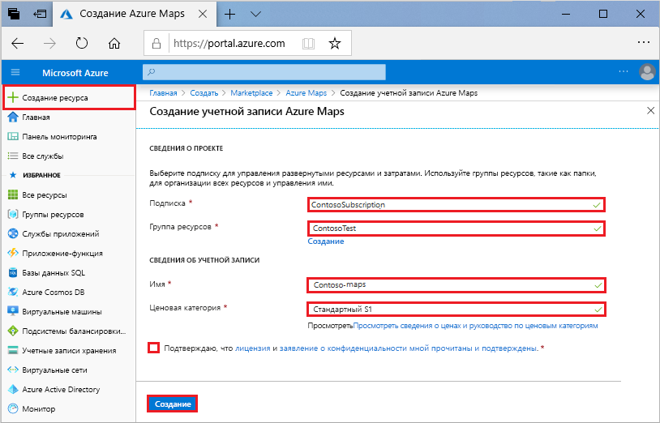
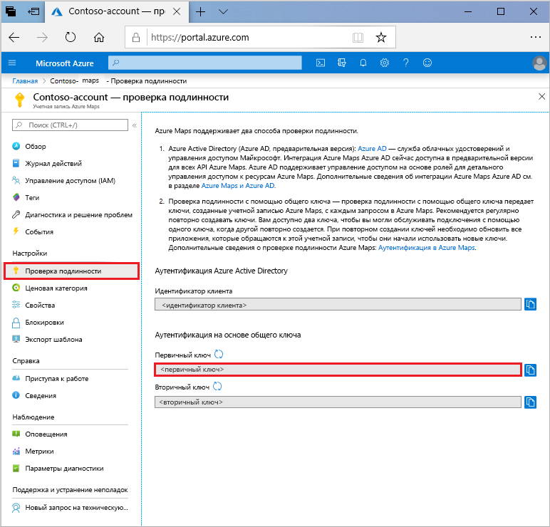

# Краткое руководство. Создание карты с интерактивным поиском с помощью службы Azure Maps

В этой статье демонстрируются возможности службы "Карты Azure" для создания карты, которая предоставляет пользователям функции интерактивного поиска. В этом руководстве описывается:

* создание учетной записи службы Azure Maps;
* получение первичного ключа для демоверсии веб-приложения.

Если у вас еще нет подписки Azure, [создайте бесплатную учетную запись](https://azure.microsoft.com/free/?WT.mc_id=A261C142F), прежде чем начинать работу.

## Вход на портал Azure

Войдите на [портал Azure](https://portal.azure.com).

## Создание учетной записи службы "Карты Azure"

Создайте учетную запись службы "Карты Azure" с помощью следующих действий:

1. В верхнем левом углу [портала Azure](https://portal.azure.com) щелкните **Создать ресурс**.
2. В поле *Поиск по Marketplace* введите **Карты**.
3. Выберите *Результаты*, а затем — **Карты**. Нажмите кнопку **Создать**, расположенную под картой.
4. На странице **Создание учетной записи Azure Maps** введите следующие значения:
    * *Подписку*, которую необходимо использовать для этой учетной записи.
    * Имя *группы ресурсов* для этой учетной записи. Вы *создать новую* или *использовать существующую* группу ресурсов.
    * *Имя* новой учетной записи.
    * *Ценовая категория* этой учетной записи.
    * Ознакомьтесь с *лицензией* и *заявлением о конфиденциальности*, а затем установите флажок, чтобы принять условия соглашения.
    * Нажмите кнопку **Создать** .

## Получение первичного ключа для учетной записи

После успешного создания учетной записи службы Azure Maps извлеките первичный ключ, позволяющий запрашивать API службы Azure Maps.

1. Откройте учетную запись службы "Карты Azure" на портале.
2. В разделе "Параметры" выберите **Проверка подлинности**.
3. Скопируйте **первичный ключ** в буфер обмена. Сохраните его локально для использования в этом руководстве позже.

>[!NOTE]
> Если вместо первичного ключа используется ключ подписки, сопоставление будет отображаться неправильно. Кроме того, в целях безопасности рекомендуется чередовать первичный и вторичный ключи. Для этого обновите приложение, чтобы использовать вторичный ключ, разверните его, а затем нажмите кнопку цикла/обновления рядом с первичным ключом, чтобы создать первичный ключ. Старый первичный ключ будет отключен. Дополнительные сведения о чередовании ключей см. в статье [Настройка смены ключей и аудита в Azure Key Vault](https://docs.microsoft.com/azure/key-vault/secrets/key-rotation-log-monitoring).

## Скачивание приложения

1. Перейдите в [interactiveSearch.html](https://github.com/Azure-Samples/AzureMapsCodeSamples/blob/master/AzureMapsCodeSamples/Tutorials/interactiveSearch.html). Скопируйте содержимое файла.
2. Сохраните его локально как файл **AzureMapDemo.html**. Откройте в текстовом редакторе.
3. Найдите строку `<Your Azure Maps Key>`. Замените ее значением **Первичный ключ**, полученным в предыдущем разделе.

## Запуск приложения

1. Откройте файл **AzureMapDemo.html** в браузере на свой выбор.
2. Просмотрите карту Лос-Анджелеса. Измените масштаб карты, чтобы посмотреть, как автоматически отрисовывается карта, отображая больше или меньше информации в зависимости от масштаба.
3. Измените центр карты по умолчанию. В файле **AzureMapDemo.html** найдите переменную **center**. Замените пару значений longitute и latitude для этой переменной новыми значениями: **[-74.0060, 40.7128]** . Сохраните файл и обновите страницу в браузере.
4. Проверьте, как работает интерактивный поиск. В поле поиска в левом верхнем углу демоверсии веб-приложения найдите **restaurants**.
5. Наведите указатель мыши на список адресов и расположений под полем поиска. Обратите внимание на то, как над соответствующим маркером на карте всплывают сведения об этом расположении. Для обеспечения конфиденциальности частных компаний отображаются вымышленные названия и адреса.

    

## Очистка ресурсов

В последующих руководствах подробно описывается использование и настройка службы Azure Maps с помощью учетной записи. Если вы намерены перейти к их изучению, не удаляйте ресурсы, созданные при работе с этим кратким руководством. Если вы не намерены продолжать изучение, выполните следующие действия, чтобы удалить ресурсы.

1. Закройте браузер, в котором выполняется веб-приложение **AzureMapDemo.html**.
2. На портале Azure в меню слева щелкните **Все ресурсы**. Затем выберите свою учетную запись службы Azure Maps. В верхней части области **Все ресурсы** выберите **Удалить**.

## Дальнейшие действия

В этом кратком руководстве вы создали учетную запись службы Azure Maps и запустили демоверсию приложения. Сведения об Azure Maps см. в этих руководствах:

> [!div class="nextstepaction"]
> [Поиск ближайшей точки интереса с помощью службы Azure Maps](tutorial-search-location.md)

Дополнительные примеры кода и сведения о возможностях интерактивного программирования см. в следующих практических руководствах:

> [!div class="nextstepaction"]
> [Поиск адреса с помощью службы поиска Azure Maps](how-to-search-for-address.md)

> [!div class="nextstepaction"]
> [Использование библиотеки Map Control в службе Azure Maps](how-to-use-map-control.md)
