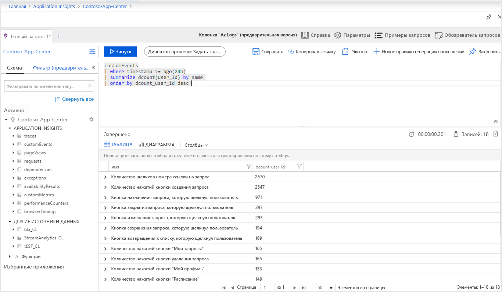
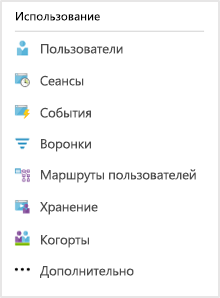
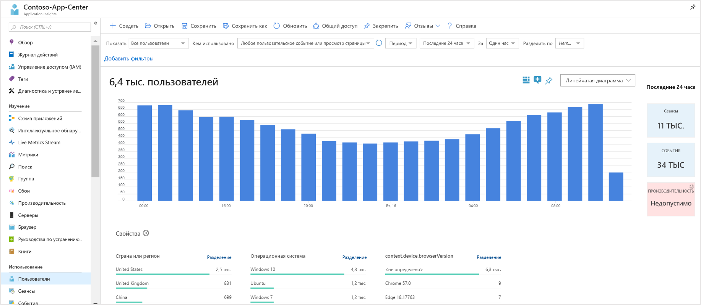
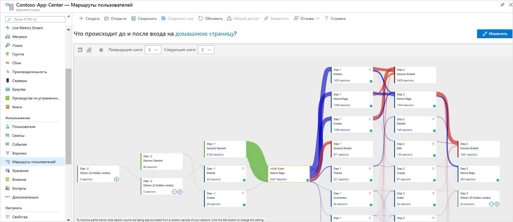

# <a name="start-analyzing-your-mobile-app-with-app-center-and-application-insights"></a>Анализ мобильного приложения с помощью App Center и Application Insights

Это краткое руководство поможет подключить экземпляр App Center вашего приложения к Application Insights. Используя Application Insights, можно выполнять запросы, сегментирование, фильтрацию и анализ данных телеметрии с помощью средств, которые более эффективны, чем средства, доступные в службе [аналитики](/mobile-center/analytics/) App Center.

## <a name="prerequisites"></a>Предварительные требования

Для работы с этим кратким руководством вам понадобится:

- Подписка Azure.
- Приложение под управлением iOS, Android, Xamarin, универсальное приложение для Windows или приложение React Native.
 
Если у вас еще нет подписки Azure, создайте [бесплатную](https://azure.microsoft.com/free/) учетную запись Azure, прежде чем начинать работу.

## <a name="sign-up-with-app-center"></a>Зарегистрироваться в Центре приложений
Для начала создайте учетную запись и [зарегистрируйтесь в Центре приложений](https://appcenter.ms/signup?utm_source=ApplicationInsights&utm_medium=Azure&utm_campaign=docs).

## <a name="onboard-to-app-center"></a>Знакомство с App Center

Прежде чем использовать службу Application Insights в мобильном приложении, ее необходимо подключить к [App Center](/mobile-center/). Application Insights не получает данные телеметрии из мобильного приложения напрямую. Вместо этого приложение отправляет данные телеметрии пользовательских событий в App Center. После этого App Center экспортирует копии этих пользовательских событий в Application Insights по мере их получения. (Это не относится к [пакету SDK Application Insights для JS](https://github.com/Microsoft/ApplicationInsights-JS) или [подключаемому модулю React Native](https://github.com/Microsoft/ApplicationInsights-JS/tree/master/extensions/applicationinsights-react-native), которые отправляют данные телеметрии непосредственно в Application Insights.)

Чтобы подключить приложение, выполните действия из краткого руководства по App Center для каждой платформы, которую поддерживает ваше приложение. Создайте отдельные экземпляры App Center для каждой платформы:

* [iOS](/mobile-center/sdk/getting-started/ios);
* [Android](/mobile-center/sdk/getting-started/android);
* [Xamarin](/mobile-center/sdk/getting-started/xamarin);
* [универсальная платформа Windows](/mobile-center/sdk/getting-started/uwp);
* [React Native](/mobile-center/sdk/getting-started/react-native).

## <a name="track-events-in-your-app"></a>Отслеживание событий в приложении

После подключения к App Center приложение необходимо изменить, чтобы отправлять данные телеметрии пользовательских событий с помощью пакета SDK для App Center. Пользовательские события — это единственный тип данных телеметрии App Center, экспортируемых в Application Insights.

Чтобы отправить пользовательские события из приложений iOS, используйте методы `trackEvent` или `trackEvent:withProperties` в пакете SDK для App Center. [Дополнительные сведения об отслеживании событий из приложений iOS.](/mobile-center/sdk/analytics/ios)

```Swift
MSAnalytics.trackEvent("Video clicked")
```

Чтобы отправить пользовательские события из приложений Android, используйте метод `trackEvent` в пакете SDK для App Center. [Дополнительные сведения об отслеживании событий из приложений Android.](/mobile-center/sdk/analytics/android)

```Java
Analytics.trackEvent("Video clicked")
```

Чтобы отправлять пользовательские события из других платформ приложений, используйте методы `trackEvent` в соответствующих пакетах SDK для App Center.

Чтобы убедиться в том, что пользовательские события принимаются, перейдите на вкладку **События** в разделе **Аналитика** в App Center. Прежде чем отправленные из приложения события отобразятся, может пройти несколько минут.

## <a name="create-an-application-insights-resource"></a>Создание ресурса Application Insights

После того как приложение начнет отправлять пользовательские события в App Center и они будут получены, на портале Azure необходимо создать ресурс Application Insights, подходящий для App Center:

1. Войдите на [портал Azure](https://portal.azure.com/).
2. Последовательно выберите **Создать ресурс** > **Средства разработчика** > **Application Insights**.

    > [!NOTE]
    > Если вы создаете ресурс Application Insights впервые, ознакомьтесь с дополнительными сведениями в статье [Create an Application Insights resource](../app/create-new-resource.md) (Создание ресурса Application Insights).

    Появится окно настроек. Используйте таблицу ниже для заполнения полей ввода.

    | Настройки        |  Значение           | Описание  |
   | ------------- |:-------------|:-----|
   | **имя**;      | Глобальное уникальное значение, например "myApp-iOS" | Имя, идентифицирующее отслеживаемое приложение |
     | **Группа ресурсов**     | Новая группа ресурсов или имеющаяся в меню | Группа ресурсов, в которой требуется создать ресурс Application Insights |
   | **Расположение** | Расположение в меню | Выберите ближайшее расположение или расположение вблизи места размещения приложения |

3. Нажмите кнопку **Создать**.

Если приложение поддерживает несколько платформ (iOS, Android и т. д.), рекомендуется создать отдельные ресурсы Application Insights, по одной для каждой платформы.

## <a name="export-to-application-insights"></a>Экспорт в Application Insights

В своем новом ресурсе Application Insights перейдите на страницу **Обзор**. Скопируйте в ресурсе ключ инструментирования.

В экземпляре [App Center](https://appcenter.ms/) для приложения сделайте следующее:

1. На странице **Параметры** щелкните **Экспорт**.
2. Выберите **New Export** (Создать операцию экспорта), щелкните **Application Insights**, а затем — **Настроить**.
3. Вставьте ключ инструментирования Application Insights в поле.
4. Разрешите увеличение использования подписки Azure, в которой содержится ресурс Application Insights. Каждый ресурс Application Insights предоставляется бесплатно для первого 1 ГБ данных, полученных за месяц. [Дополнительные сведения о ценах на Application Insights](https://azure.microsoft.com/pricing/details/application-insights/)

Не забудьте повторить этот процесс для каждой платформы, поддерживаемой вашим приложением.

Как только [экспорт](/mobile-center/analytics/export) будет настроен, каждое пользовательское событие, полученное App Center, будет скопировано в Application Insights. События могут поступать в Application Insights с задержкой в несколько минут, поэтому если они не отображаются сразу, подождите немного, прежде чем выполнять дальнейшую диагностику.

Чтобы предоставить вам дополнительные данные при первом подключении, сведения о пользовательских событиях в App Center за последние 48 часов автоматически экспортируются в Application Insights.

## <a name="start-monitoring-your-app"></a>Запуск мониторинга приложения

Application Insights может выполнять запросы, сегментирование, фильтрацию и анализ данных телеметрии пользовательских событий из ваших приложений, помимо других средств аналитики, предоставляемых в App Center.

1. **Запрос данных телеметрии пользовательских событий.** На странице **Обзор** Application Insights выберите **Журналы (аналитика)** .

   Откроется портал журналов аналитики Application Insights, связанный с вашим ресурсом Application Insights. На портале журналов аналитики можно напрямую запрашивать данные на языке запросов Log Analytics, поэтому вы можете задавать вопросы любого уровня сложности о приложении и его пользователях.
   
   Откройте новую вкладку на портале журналов аналитики, а затем вставьте следующий запрос. Он возвращает количество уникальных пользователей, которые отправили каждое пользовательское событие из вашего приложения за последние 24 часа, отсортированное по этим различным счетчикам.

   ```AIQL
   customEvents
   | where timestamp >= ago(24h)
   | summarize dcount(user_Id) by name 
   | order by dcount_user_Id desc 
   ```

   

   1. Выберите запрос, щелкнув в любом месте запроса в текстовом редакторе.
   2. Затем щелкните **Начать**, чтобы выполнить запрос. 

   Узнайте больше об [аналитике Application Insights](../log-query/log-query-overview.md) и [языке запросов Log Analytics](https://aka.ms/LogAnalyticsLanguageReference).


2. **Сегментирование и фильтрация данных телеметрии пользовательских событий.** На странице **Обзор** Application Insights выберите **Пользователи** в оглавлении.

   

   Средство "Пользователи" показывает, сколько пользователей приложения нажали определенные кнопки, посетили определенные окна или выполнили другие действия, отслеживаемые вами в качестве события с помощью пакета SDK для App Center. Если вы искали способ сегментирования и фильтрации событий App Center, средство "Пользователи" отлично вам подойдет.

    

   Например, сегментируйте данные об использовании по географическому расположению, выбрав **Страна или регион** в раскрывающемся меню **Разделение по**.

3. **Анализ шаблонов преобразований, периодов удержания и навигации в приложении.** На странице **Обзор** Application Insights выберите **Потоки пользователей** в оглавлении.

   

   Средство "Потоки пользователей" визуализирует, какие события пользователи отправляют после начала события. Это средство позволяет получить общее представление о том, как пользователи перемещаются приложением. Оно также показывает места, где множество пользователей покидают приложение или многократно повторяют одни и те же действия.

   Помимо средства "Маршруты пользователей" в Application Insights есть несколько других средств анализа поведения пользователя, которые помогают получить ответы на определенные вопросы:

   * **Воронки** для анализа и отслеживания частоты преобразований.
   * **Период удержания** для анализа того, насколько хорошо приложение сохраняет пользователей со временем.
   * **Книги** для объединения визуализаций и текста в общедоступный отчет.
   * **Когорты** для присвоения имен и сохранения конкретных групп пользователей или событий, чтобы на них можно было легко ссылаться из других средств аналитики.

## <a name="clean-up-resources"></a>Очистка ресурсов

Если вы больше не хотите использовать Application Insights с App Center, отключите экспорт в App Center и удалите ресурс Application Insights. В результате этого с вас больше не будет взиматься плата за этот ресурс в Application Insights.

Чтобы отключить экспорт в App Center, сделайте следующее:

1. В App Center перейдите на вкладку **Параметры** и выберите **Экспорт**.
2. Щелкните экспорт Application Insights, который необходимо удалить, а затем выберите **Удалить экспорт** внизу и подтвердите.

Чтобы удалить ресурс Application Insights:

1. В меню слева на портале Azure щелкните **Группы ресурсов** и выберите группу ресурсов, в которой был создан ресурс Application Insights.
2. Откройте ресурс Application Insights, который требуется удалить. Нажмите кнопку **Удалить** в верхнем меню ресурса и подтвердите. Это окончательно удалит копию данных, экспортированных в Application Insights.

## <a name="next-steps"></a>Дальнейшие действия

> [!div class="nextstepaction"]
> [Узнайте, как пользователи используют ваше приложение](../../azure-monitor/app/usage-overview.md)
