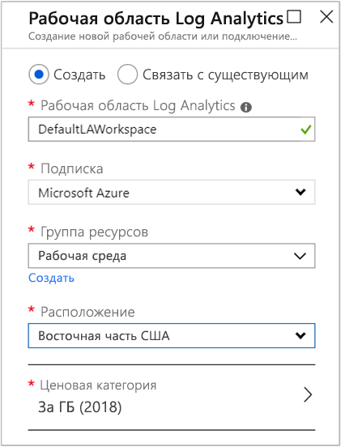
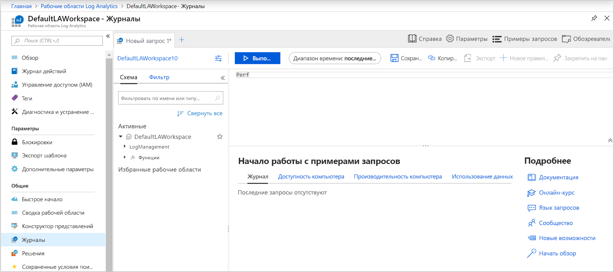
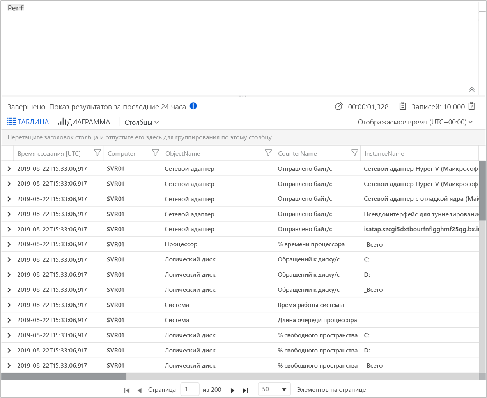

# Сбор данных с компьютера Windows в гибридной среде с помощью Azure Monitor

[Azure Monitor](../overview.md) может собирать данные напрямую c физических компьютеров или виртуальных машин Windows в вашей среде в рабочую область Log Analytics для подробного анализа и корреляции. [Агент Log Analytics](../platform/log-analytics-agent.md) позволяет Azure Monitor собирать данные из центра обработки данных или другой облачной среды. В этом кратком руководстве показано, как настроить и собирать данные c компьютера Windows с помощью нескольких простых действий. Сведения о виртуальных машинах Windows в Azure см. в статье [Сбор данных о виртуальных машинах Azure](./quick-collect-azurevm.md).  

Дополнительные сведения о поддерживаемой конфигурации см. в разделах о [поддерживаемых операционных системах](../platform/agents-overview.md#supported-operating-systems) и [конфигурации сетевых брандмауэров](../platform/log-analytics-agent.md#network-requirements).
 
Если у вас еще нет подписки Azure, [создайте бесплатную учетную запись](https://azure.microsoft.com/free/?WT.mc_id=A261C142F), прежде чем начинать работу.

## Вход на портал Azure

Войдите на портал Azure по адресу [https://portal.azure.com](https://portal.azure.com). 

## Создание рабочей области

1. На портале Azure щелкните **Все службы**. В списке ресурсов введите **Log Analytics**. Как только вы начнете вводить символы, список отфильтруется соответствующим образом. Выберите **Рабочие области Log Analytics**.

       

2. Выберите **Создать** и задайте следующие параметры:

   * Введите имя для новой **Рабочей области Log Analytics**, например *DefaultLAWorkspace*.  
   * Выберите в раскрывающемся списке **Подписку**, с которой нужно связать рабочую область, если выбранная по умолчанию не подходит.
   * В разделе **Группа ресурсов** выберите имеющуюся группу ресурсов, в которой содержится одна или несколько виртуальных машин Azure.  
   * Выберите **Расположение**, в котором развернуты виртуальные машины.  Дополнительные сведения о доступности службы Log Analytics в регионах см. в [этой статье](https://azure.microsoft.com/regions/services/).
   * При создании рабочей области в новой подписке, созданной после 2 апреля 2018 г., будет автоматически использоваться тарифный план *За ГБ*, и выбор ценовой категории будет недоступен.  При создании рабочей области в существующей подписке, созданной до 2 апреля, или в подписке, которая была привязана к существующей регистрации EA, выберите нужную ценовую категорию.  Дополнительные сведения о конкретной ценовой категории см. в статье [Цены на Log Analytics](https://azure.microsoft.com/pricing/details/log-analytics/).
  
         

3. Завершив ввод обязательных сведений на панели **Рабочая область Log Analytics**, щелкните **OK**.  

Пока проверяются данные, ход создания рабочей области можно проверить в разделе **Уведомления** в меню. 

## Получение идентификатора и ключа рабочей области

Перед установкой агента Log Analytics для Windows (также называется Microsoft Monitoring Agent (MMA)) следует получить идентификатор и ключ для рабочей области Log Analytics. Эта информация необходима мастеру настройки для правильной настройки агента и организации взаимодействия с Azure Monitor.  

1. Щелкните **Все службы** в левом верхнем углу на портале Azure. В поле поиска введите **Log Analytics**. По мере ввода символов список отфильтруется соответствующим образом. Выберите **Рабочие области Log Analytics**.

2. В списке рабочих областей Log Analytics выберите созданную ранее рабочую область. (Возможно, она называется **DefaultLAWorkspace**.)

3. Выберите **Дополнительные параметры**.

    
  
4. Выберите **Подключенные источники**, а затем выберите **Серверы с Windows**.

5. Скопируйте значения, которые указаны справа от меток **Идентификатор рабочей области** и **Первичный ключ**. Вставьте их в любом удобном для вас редакторе.

## Установка агента для Windows

Ниже приведены инструкции по установке и настройке агента для Log Analytics в Azure или облаке Azure для государственных организаций. Вы установите агент на компьютере с помощью программы установки Microsoft Monitoring Agent.

1. На открытой ранее странице **Серверы с Windows** выберите нужную версию **агента для Windows** для скачивания. Выбор версии зависит от архитектуры процессора в используемой операционной системе Windows.

2. Запустите программу установки, чтобы установить агент на компьютере.

3. На странице **приветствия** нажмите кнопку **Далее**.

4. На странице **Условия лицензии** прочтите лицензию и выберите **Принимаю**.

5. На странице **Конечная папка** измените или оставьте папку установки по умолчанию и нажмите кнопку **Далее**.

6. На странице **Параметры установки агента** подключите агент к Azure Log Analytics и щелкните **Далее**.

7. На странице **Azure Log Analytics** выполните следующие шаги.

   1. Вставьте скопированные ранее **идентификатор рабочей области** и **ключ рабочей области (первичный ключ)** . Если компьютер должен передавать данные в рабочую область Log Analytics, размещенную в облаке Azure для государственных организаций, выберите **Azure для US Gov организаций** в списке **Облако Azure**.  
   2. Если компьютер должен обмениваться данными со службой Log Analytics через прокси-сервер, выберите **Дополнительно** и укажите URL-адрес и номер порта прокси-сервера. Если для доступа к прокси-серверу требуется аутентификация, введите имя пользователя и пароль для входа на прокси-сервер и щелкните **Далее**.  

8. Добавьте все параметры конфигурации и снова щелкните **Далее**:

    

9. На странице **Все готово для установки** просмотрите выбранные параметры, а затем выберите **Установить**.

10. На странице **Настройка успешно завершена** щелкните **Готово**.

После завершения установки и настройки Microsoft Monitoring Agent появится на панели управления. Вы можете просмотреть конфигурацию и проверить, подключен ли агент к рабочей области Log Analytics. При подключении агент отображает на вкладке **Azure Log Analytics** такое сообщение: **Microsoft Monitoring Agent успешно подключен к службе Microsoft Log Analytics**.   

## Сбор данных событий и производительности

Azure Monitor может собирать события указанного вами типа из журналов событий и счетчиков производительности Windows для анализа и формирования отчетов за длительные периоды. Служба также может выполнять определенные действия при обнаружении указанного условия. Сначала выполните приведенные ниже действия для настройки сбора событий из журнала событий Windows, а также нескольких стандартных счетчиков производительности.  

1. Щелкните **Другие службы** в левом нижнем углу на портале Azure. В поле поиска введите **Log Analytics**. По мере ввода символов список отфильтруется соответствующим образом. Выберите **Рабочие области Log Analytics**.

2. Выберите **Дополнительные параметры**.

    
 
3. Выберите **Данные**, а затем — **Журналы событий Windows**.  

4. Чтобы добавить журнал событий, введите его имя. Введите **Система** и щелкните знак "плюс" ( **+** ).  

5. В таблице выберите степени серьезности **Ошибка** и **Предупреждение**.

6. Щелкните **Сохранить** в верхней части страницы.

7. Выберите **Счетчики производительности Windows**, чтобы включить сбор данных счетчиков производительности на компьютере Windows.

8. При первой настройке счетчиков производительности Windows для новой рабочей области Log Analytics вы можете быстро создать несколько распространенных счетчиков. Здесь перечислены все доступные варианты, и рядом с каждым есть флажок.

    .
    
    Щелкните **Добавить выбранные счетчики производительности**. Эти счетчики добавляются с десятисекундным интервалом сбора.

9. Щелкните **Сохранить** в верхней части страницы.

## Просмотр собранных данных

Теперь, когда сбор данных включен, можно запустить простой поиск по журналам, чтобы просмотреть некоторые данные с целевого компьютера.  

1. В выбранной рабочей области на панели слева выберите **Журналы**.

2. На странице запросов к журналам в редакторе запросов введите `Perf` и щелкните **Выполнить**.
 
    

    Так, запрос на этом рисунке вернул 10 000 записей о производительности. Ваши результаты будут значительно меньше.

    

## Очистка ресурсов

Когда агент и рабочая область Log Analytics больше не нужны, их можно удалить.  

Чтобы удалить агент, выполните следующие действия:

1. Откройте панель управления.

2. Откройте **Программы и компоненты**.

3. В окне **Программы и компоненты** выберите **Microsoft Monitoring Agent** и щелкните **Удалить**.

Чтобы удалить созданную ранее рабочую область Log Analytics, выберите ее и щелкните **Удалить** на странице ресурсов.

## Дальнейшие действия

Итак, вы настроили сбор данных о работе и производительности с локальных компьютеров Windows, и теперь готовы к изучению *бесплатных* возможностей по изучению и анализу собранных данных, а также по выполнению действий на их основе.  

Чтобы узнать, как просматривать и анализировать данные, перейдите к следующему руководству.

> [!div class="nextstepaction"]
> [Просмотр и анализ данных, собранных с помощью поиска по журналам Log Analytics](../log-query/get-started-portal.md)

