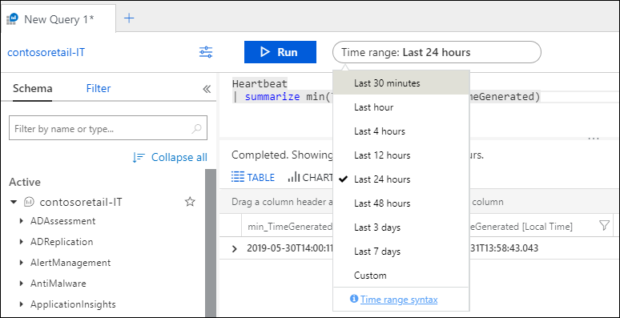
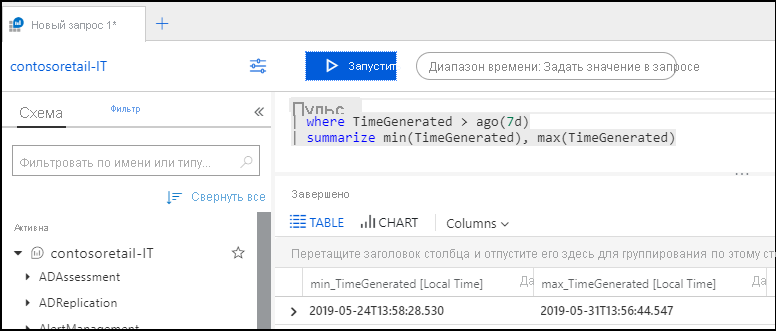
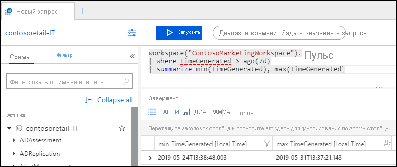

# Журнал запросов области действия и диапазон времени в Azure Monitor Log Analytics
При запуске [запроса журнала](log-query-overview.md) в [Log Analytics на портале Azure](get-started-portal.md), набор данных, вычисления в запросе зависит от области действия и диапазон времени, который выбран. В этой статье описывается область действия и диапазон времени и как можно задать каждый в зависимости от требований. Он также описывает поведение различных типов областей.

## Область запроса
Область запроса определяет записи, которые вычисляются по запросу. Обычно это будет включать все записи в одной рабочей области Log Analytics или в приложении Application Insights. Log Analytics также позволяет задать область для конкретного отслеживаемого ресурса Azure. Это позволяет владелец ресурса может сосредоточиться только на свои данные, даже если этот ресурс записывает к нескольким рабочим областям.

Области всегда отображается в верхней левой части окна Log Analytics. Значок указывает, является ли область рабочую область Log Analytics или Application Insights приложения. Отсутствие значков указывает на другой ресурс Azure.

Область определяется с помощью метода, используемой для запуска Log Analytics, а в некоторых случаях можно изменить область, щелкнув его. В следующей таблице перечислены различные типы область, используемую и различные детали для каждого.

| Область запроса | Записи в области видимости | Способ выбора | Изменение области действия |
|:---|:---|:---|:---|
| Рабочая область Log Analytics | Все записи в рабочей области Log Analytics. | Выберите **журналы** из **Azure Monitor** меню или **рабочих областей Log Analytics** меню.  | Область можно изменить в любой другой тип ресурса. |
| Приложение Application Insights | Все записи в приложении Application Insights. | Выберите **Analytics** из **Обзор** странице Application Insights. | Области можно изменить только в другое приложение Application Insights. |
| Группа ресурсов | Записи, созданные все ресурсы в группе ресурсов. Может включать данные из нескольких рабочих областей Log Analytics. | Выберите **журналы** из меню группы ресурсов. | Не удается изменить область.|
| Подписка | Записи, созданные все ресурсы в подписке. Может включать данные из нескольких рабочих областей Log Analytics. | Выберите **журналы** из меню «подписки».   | Не удается изменить область. |
| Другие ресурсы Azure | Записи, созданные для ресурса. Может включать данные из нескольких рабочих областей Log Analytics.  | Выберите **журналы** из меню ресурсов. Или Выберите **журналы** из **Azure Monitor** меню, а затем выберите новую область. | Области можно изменить только один тип ресурса. |

### Ограничения при области действия ресурса

Если область запроса рабочую область Log Analytics или Application Insights приложения, все параметры на портале и все команды запроса доступны. При области действия ресурса, однако, следующие параметры на портале недоступна, так как они связаны с одной рабочей области или приложения:

- Сохранить
- Обозреватель запросов
- Новое правило генерации оповещений

В запросе при области действия ресурса, так как область запроса уже включает все рабочие области с данными этого ресурса или набора ресурсов, нельзя использовать следующие команды:

- [app](app-expression.md)
- [workspace](workspace-expression.md)
 

## Диапазон времени
Диапазон времени указывает набор записей, которые оцениваются при создании записи на основе запроса. Это определяется стандартное свойство для каждой записи в рабочей области или приложения, как указано в следующей таблице.

| Расположение | Свойство |
|:---|:---|
| Рабочая область Log Analytics          | TimeGenerated |
| Приложение Application Insights | timestamp     |

Установите временной диапазон, выбрав его с помощью средства выбора времени, в верхней части окна Log Analytics.  Можно выбрать заранее определенного периода или выберите **Custom** чтобы указать конкретный временной диапазон.

Если в запросе, который использует свойство (зима), как показано в приведенной выше таблице, задать фильтр, средство выбора времени изменяется на **установлено в запросе**, и средство выбора времени отключен. В этом случае наиболее эффективным способом поместить фильтр в верхней части запроса, чтобы любой последующей обработки достаточно для работы с отфильтрованные записи.

Если вы используете [рабочей области](workspace-expression.md) или [приложения](app-expression.md) для получения данных из другой рабочей области или приложение, средство выбора времени может вести себя по-разному. Если область является рабочей областью Log Analytics и использовать **приложения**, или если область — это приложение Application Insights и используете **рабочей области**, затем Log Analytics могут не понимать, что свойство используется в Фильтр необходимо определить фильтр времени.

В следующем примере область устанавливается в рабочую область Log Analytics.  В запросе используется **рабочей области** для получения данных из другой рабочей области Log Analytics. Выбор времени изменяется на **установлено в запросе** так, как он видит фильтр, использующий ожидаемый **TimeGenerated** свойство.

Если запрос использует **приложения** для получения данных из приложения Application Insights, однако, не распознает Log Analytics **timestamp** свойством в фильтр, а также выбор времени остается неизменным. В этом случае оба фильтра применяются. В примере только записи, созданные за последние 24 часа, включаются в запрос, несмотря на то, что он указывает 7 дней в **где** предложение.

## Дальнейшие действия

- Разберем [руководство по использованию Log Analytics на портале Azure](get-started-portal.md).
- Разберем [руководство по написанию запросов](get-started-queries.md).