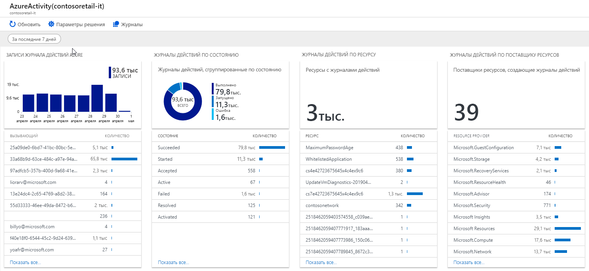

# Собирайте и анализируйте журналы действий Azure в Log Analytics рабочей области в Azure Monitor

> [!WARNING]
> Теперь можно выполнить сбор журнала действий в Log Analytics рабочую область, используя параметр диагностики, аналогичный сбору журналов ресурсов. См. статью [Получение и анализ журналов действий Azure в log Analytics рабочей области в Azure Monitor](diagnostic-settings-legacy.md).

[Журнал действий Azure](platform-logs-overview.md) позволяет получить представление о событиях уровня подписки, произошедших в подписке Azure. В этой статье описывается, как получить журнал действий в Log Analytics рабочей области и как использовать [решение для мониторинга](../insights/solutions.md)аналитика журнала действий, которое предоставляет запросы и представления журнала для анализа этих данных. 

Подключение журнала действий к рабочей области Log Analytics предоставляет следующие преимущества.

- Объедините журнал действий из нескольких подписок Azure в одно место для анализа.
- Храните записи журнала действий дольше 90 дней.
- Сопоставьте данные журнала действий с другими данными мониторинга, собранными Azure Monitor.
- Используйте [запросы журналов](../log-query/log-query-overview.md) для выполнения сложного анализа и получения подробных сведений о записях журнала действий.

## Подключение к рабочей области Log Analytics
Одну рабочую область можно подключить к журналу действий для нескольких подписок в одном клиенте Azure. Сведения о сборе в нескольких клиентах см. в статье [Сбор журналов действий Azure в log Analytics рабочей области между подписками в разных клиентах Azure Active Directory](activity-log-collect-tenants.md).

> [!IMPORTANT]
> Если поставщики ресурсов Microsoft. OperationalInsights и Microsoft. OperationsManagement не зарегистрированы для вашей подписки, может появиться сообщение об ошибке со следующей процедурой. Чтобы зарегистрировать эти поставщики, см. раздел [поставщики и типы ресурсов Azure](../../azure-resource-manager/management/resource-providers-and-types.md) .

Используйте следующую процедуру, чтобы подключить журнал действий к рабочей области Log Analytics:

1. В меню **log Analytics рабочие области** в портал Azure выберите рабочую область, чтобы получить журнал действий.
1. В разделе **Источники данных рабочей области** в меню рабочей области выберите **Журнал действий Azure**.
1. Щелкните подписку, которую нужно подключить.

    

1. Нажмите кнопку **подключить** , чтобы подключить журнал действий в подписке к выбранной рабочей области. Если подписка уже подключена к другой рабочей области, нажмите кнопку **Отключить** сначала, чтобы отключить ее.

    

## Анализ в Log Analytics рабочей области
При подключении журнала действий к рабочей области Log Analytics записи будут записываться в рабочую область в таблицу с именем **AzureActivity** , которую можно получить с помощью [запроса журнала](../log-query/log-query-overview.md). Структура этой таблицы зависит от [категории записи журнала](activity-log-view.md#categories-in-the-activity-log). Описание каждой категории см. в статье [схема событий журнала действий Azure](activity-log-schema.md) .

## Решение для мониторинга журналов действий
Решение для мониторинга Log Analytics Azure включает несколько запросов и представлений журнала для анализа записей журнала действий в рабочей области Log Analytics.

### Установка решения
Используйте процедуру, описанную в разделе [Установка решения для мониторинга](../insights/solutions.md#install-a-monitoring-solution) для установки **аналитика журнала действий** решения. Дополнительная настройка не требуется.

### Использование решения
Доступ к решениям мониторинга осуществляется из меню " **монитор** " в портал Azure. Выберите **больше** в разделе **Insights** , чтобы открыть страницу **обзора** с плитками решения. На плитке **журналы действий Azure** отображается количество записей **AzureActivity** в рабочей области.

Щелкните плитку **журналы действий Azure** , чтобы открыть представление **журналы действий Azure** . Представление включает в себя элементы визуализации, приведенные в следующей таблице. Каждая часть содержит до 10 элементов, соответствующих критериям этой части за указанный диапазон времени. Можно выполнить запрос журнала, возвращающий все совпадающие записи, щелкнув **Просмотреть все** в нижней части части.

| Визуализация, часть | Описание |
| --- | --- |
| Записи журнала действий Azure | Отображает линейчатую диаграмму с общими суммами записей журнала действий Azure для выбранного диапазона дат и показывает список 10 вызывающих элементов с максимальным числом вызовов. Щелкните линейчатую диаграмму, чтобы выполнить поиск `AzureActivity`. Щелкните вызывающий элемент, чтобы выполнить поиск по журналам, возвращающий все записи журнала действий для этого элемента. |
| Журналы действий по состоянию | Показывает кольцевую диаграмму состояния журнала действий Azure для выбранного диапазона дат и список первых десяти записей состояния. Щелкните диаграмму, чтобы выполнить запрос журнала для `AzureActivity | summarize AggregatedValue = count() by ActivityStatus`. Щелкните элемент состояния, чтобы выполнить поиск по журналам, возвращая все записи журнала действий для этой записи состояния. |
| Журналы действий по ресурсу | Показывает общее число ресурсов с журналами действий и список первых десяти ресурсов с количеством записей для каждого ресурса. Щелкните область итогов, чтобы запустить поиск `AzureActivity | summarize AggregatedValue = count() by Resource` по журналам, который возвратит все доступные для решения ресурсы Azure. Щелкните ресурс, чтобы выполнить запрос журнала, возвращающий все записи о действиях для этого ресурса. |
| Журналы действий по поставщику ресурсов | Показывает общее число поставщиков ресурсов, создающих журналы действий, и список первых десяти. Щелкните область итогов, чтобы выполнить запрос журнала для `AzureActivity | summarize AggregatedValue = count() by ResourceProvider`, в котором отображаются все поставщики ресурсов Azure. Щелкните поставщик ресурсов, чтобы выполнить запрос журнала, возвращающий все записи действий для поставщика. |

## Следующие шаги

- Дополнительные сведения о [журнале действий](platform-logs-overview.md).
- Дополнительные сведения о [платформе Azure Monitor Data Platform](data-platform.md).
- Используйте [запросы журналов](../log-query/log-query-overview.md) для просмотра подробных сведений из журнала действий.
