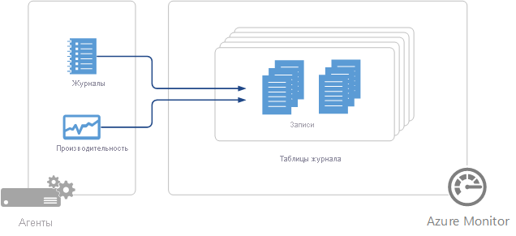

# Источники данных агента в Azure Monitor
Azure Monitor собирает данные от агентов, заданных источниками данных, которые вы настроили.  Данные от агентов хранятся в виде [данных журнала](data-platform-logs.md) с набором записей.  Каждый источник данных создает записи определенного типа, а каждый тип обладает собственным набором свойств.

## Сводка источников данных
В приведенной ниже таблице перечислены источники данных агента, доступные сейчас в Azure Monitor.  Для каждого дается ссылка на отдельную статью, содержащую сведения об этом источнике данных.   В ней также приведены сведения о методах и частоте сбора. 

| Источник данных | Платформа | Агент log Analytics | Агент Operations Manager | Хранилище Azure | Нужен ли Operations Manager? | Отправка данных агента Operations Manager через группу управления | Частота сбора |
| --- | --- | --- | --- | --- | --- | --- | --- |
| [Пользовательские журналы](data-sources-custom-logs.md) | Windows |&#8226; |  | |  |  | При получении |
| [Пользовательские журналы](data-sources-custom-logs.md) | Linux   |&#8226; |  | |  |  | При получении |
| [Журналы IIS](data-sources-iis-logs.md) | Windows |&#8226; |&#8226; |&#8226; |  |  |в зависимости от параметров смены файла журнала |
| [Счетчики производительности](data-sources-performance-counters.md) | Windows |&#8226; |&#8226; |  |  |  |по расписанию, не менее 10 секунд |
| [Счетчики производительности](data-sources-performance-counters.md) | Linux |&#8226; |  |  |  |  |по расписанию, не менее 10 секунд |
| [Syslog](data-sources-syslog.md) | Linux |&#8226; |  |  |  |  |Из хранилища Azure — 10 минут, из агента — при получении |
| [Журналы событий Windows](data-sources-windows-events.md) |Windows |&#8226; |&#8226; |&#8226; |  |&#8226; | При получении |

## Настройка источников данных
Источники данных можно настроить в меню **Данные** в разделе **Дополнительные параметры** для рабочей области.  Конфигурация передается на все подключенные источники в рабочей области.  В настоящее время исключать агенты из этой конфигурации нельзя.

1. На портале Azure щелкните **Рабочие области Log Analytics**, выберите свою рабочую область, а затем — **Дополнительные параметры**.
2. Выберите **данные**.
3. Щелкните источник данных, который нужно настроить.
4. Перейдите по ссылке на документацию для каждого источника данных в приведенной выше таблице и найдите сведения об их настройке.

## сбор данных
Конфигурации источников данных передаются в агенты, подключенные к Azure Monitor напрямую, в течение нескольких минут.  Указанные данные собираются из агента и передаются непосредственно в Azure Monitor с периодичностью, указанной для каждого источника данных.  Особенности каждого источника данных см. в соответствующей документации.

Для агентов System Center Operations Manager в подключенной группе управления конфигурации источников данных преобразуются в пакеты управления и по умолчанию передаются в группу управления через каждые 5 минут.  Агент загружает пакет управления обычным способом и собирает указанные данные. В зависимости от источника данных возможны два сценария: либо данные будут отправляться на сервер управления, который перенаправляет их в Azure Monitor, либо агент будет отправлять данные в Azure Monitor, минуя сервер управления. Дополнительные сведения см. в статье [Информация о сборе данных для решений по управлению в Azure](../monitor-reference.md).  Подробные сведения о подключении Operations Manager и Azure Monitor и изменении частоты доставки конфигурации см. в статье о [настройке интеграции с System Center Operations Manager](om-agents.md).

Если агенту не удается подключиться к Azure Monitor или Operations Manager, он будет продолжать собирать данные, чтобы передать их после успешного подключения.  Данные могут быть потеряны, если их объем достигнет максимального размера кэша для клиента или агент не сможет установить подключение в течение 24 часов.

## Записи журнала
Все данные журнала, собранные Azure Monitor, хранятся в рабочей области в виде записей.  Записи, собираемые различными источниками данных, получают собственный набор свойств и идентифицируются по свойству **Тип**.  Подробные сведения о каждом типе записей см. в документации по каждому типу источников и решению.

## Дальнейшие действия
* Узнайте больше о [решениях мониторинга](../insights/solutions.md), которые расширяют функции службы Azure Monitor и собирают данные в ее рабочей области.
* Узнайте больше о [запросах журнала](../log-query/log-query-overview.md), которые можно применять для анализа данных, собираемых из источников данных и решений для мониторинга.  
* Настройте [оповещения](alerts-overview.md) для получения заблаговременных уведомлений о получении критически важных данных из источников данных и решений для мониторинга.
