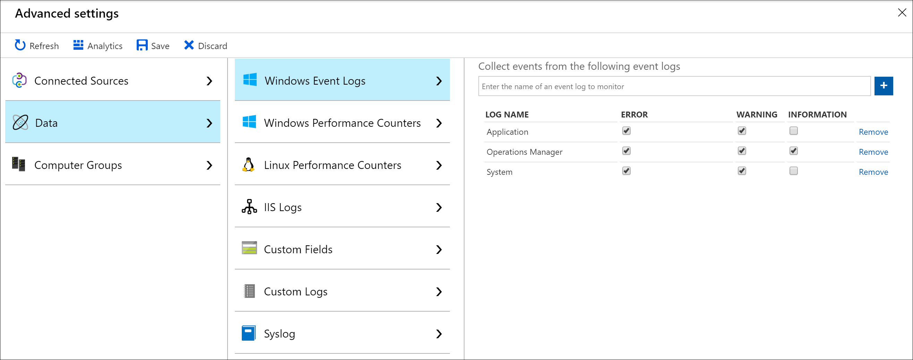

# Источники данных агента Log Analytics в Azure Monitor
Данные, Azure Monitor собираемые из виртуальных машин с помощью агента [log Analytics](log-analytics-agent.md) , определяются источниками данных, настроенными в [рабочей области log Analytics](data-platform-logs.md).   Каждый источник данных создает записи определенного типа, а каждый тип обладает собственным набором свойств.

> [!IMPORTANT]
> В этой статье рассматриваются источники данных для [агента log Analytics](log-analytics-agent.md) , который является одним из агентов, используемых Azure Monitor. Другие агенты собираются разные данные и настраиваются по-разному. Список доступных агентов и данных, которые они могут собираются, см. в разделе [Обзор агентов Azure Monitor](agents-overview.md) .

## Сводка источников данных
В следующей таблице перечислены источники данных агента, которые в настоящее время доступны в агенте Log Analytics.  Для каждого дается ссылка на отдельную статью, содержащую сведения об этом источнике данных.   В ней также приведены сведения о методах и частоте сбора. 

| Источник данных | Платформа | Агент log Analytics | Агент Operations Manager | Хранилище Azure | Нужен ли Operations Manager? | Отправка данных агента Operations Manager через группу управления | Частота сбора |
| --- | --- | --- | --- | --- | --- | --- | --- |
| [Пользовательские журналы](data-sources-custom-logs.md) | Windows |&#8226; |  | |  |  | При получении |
| [Пользовательские журналы](data-sources-custom-logs.md) | Linux   |&#8226; |  | |  |  | При получении |
| [Журналы IIS](data-sources-iis-logs.md) | Windows |&#8226; |&#8226; |&#8226; |  |  |в зависимости от параметров смены файла журнала |
| [Счетчики производительности](data-sources-performance-counters.md) | Windows |&#8226; |&#8226; |  |  |  |по расписанию, не менее 10 секунд |
| [Счетчики производительности](data-sources-performance-counters.md) | Linux |&#8226; |  |  |  |  |по расписанию, не менее 10 секунд |
| [Syslog](data-sources-syslog.md) | Linux |&#8226; |  |  |  |  |Из хранилища Azure — 10 минут, из агента — при получении |
| [Журналы событий Windows](data-sources-windows-events.md) |Windows |&#8226; |&#8226; |&#8226; |  |&#8226; | При получении |

## Настройка источников данных
Чтобы настроить источники данных для агентов Log Analytics, перейдите в меню **log Analytics рабочие области** в портал Azure и выберите рабочую область. Щелкните **Дополнительные параметры** , а затем — **данные**. Выберите источник данных, который необходимо настроить. Вы можете перейти по ссылкам в таблице выше, чтобы получить документацию по каждому источнику данных и сведения о его конфигурации.

Любая конфигурация доставляется всем агентам, подключенным к этой рабочей области.  Вы не можете исключить подключенные агенты из этой конфигурации.

## Сбор данных
Конфигурации источников данных передаются в агенты, подключенные к Azure Monitor напрямую, в течение нескольких минут.  Указанные данные собираются из агента и передаются непосредственно в Azure Monitor с периодичностью, указанной для каждого источника данных.  Особенности каждого источника данных см. в соответствующей документации.

Для агентов System Center Operations Manager в подключенной группе управления конфигурации источников данных преобразуются в пакеты управления и по умолчанию передаются в группу управления через каждые 5 минут.  Агент загружает пакет управления обычным способом и собирает указанные данные. В зависимости от источника данных возможны два сценария: либо данные будут отправляться на сервер управления, который перенаправляет их в Azure Monitor, либо агент будет отправлять данные в Azure Monitor, минуя сервер управления. Дополнительные сведения см. в статье [Информация о сборе данных для решений по управлению в Azure](../monitor-reference.md).  Подробные сведения о подключении Operations Manager и Azure Monitor и изменении частоты доставки конфигурации см. в статье о [настройке интеграции с System Center Operations Manager](om-agents.md).

Если агенту не удается подключиться к Azure Monitor или Operations Manager, он будет продолжать собирать данные, чтобы передать их после успешного подключения.  Данные могут быть потеряны, если их объем достигнет максимального размера кэша для клиента или агент не сможет установить подключение в течение 24 часов.

## Записи журнала
Все данные журнала, собранные Azure Monitor, хранятся в рабочей области в виде записей.  Записи, собираемые различными источниками данных, получают собственный набор свойств и идентифицируются по свойству **Тип**.  Подробные сведения о каждом типе записей см. в документации по каждому типу источников и решению.

## Дальнейшие шаги
* Узнайте больше о [решениях мониторинга](../insights/solutions.md), которые расширяют функции службы Azure Monitor и собирают данные в ее рабочей области.
* Узнайте больше о [запросах журнала](../log-query/log-query-overview.md), которые можно применять для анализа данных, собираемых из источников данных и решений для мониторинга.  
* Настройте [оповещения](alerts-overview.md) для получения заблаговременных уведомлений о получении критически важных данных из источников данных и решений для мониторинга.
