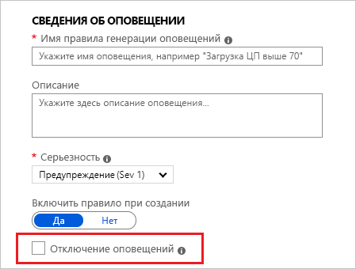
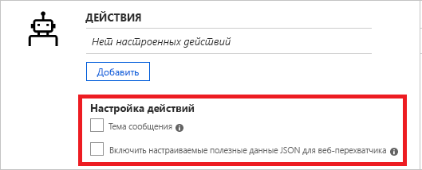
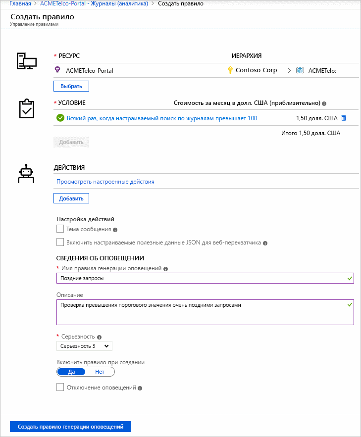

# <a name="create-view-and-manage-log-alerts-using-azure-monitor"></a>Создание и просмотр оповещений журнала, а также управление ими с помощью Azure Monitor

## <a name="overview"></a>Обзор
В этой статье показано, как создавать оповещения журнала и управлять ими с помощью интерфейса Alerts в портал Azure. Правила генерации оповещений определяются тремя компонентами:
- Цель: конкретный ресурс Azure для мониторинга.
- Критерий: условие или логика для вычисления истинности. Если задано значение true, предупреждение срабатывает.  
- Действие: конкретный вызов, отправленный получателю уведомления — электронное сообщение, текстовое сообщение, веб-перехватчик и т. д.

В термине " **оповещение журнала** " описываются предупреждения, в которых выполняется запрос журнала в [log Analytics рабочей области](../log-query/get-started-portal.md) или [Application Insights](../log-query/log-query-overview.md) , и предупреждение, которое срабатывает, если результат имеет значение true. Дополнительные сведения о функциях, терминологии и типах см. в статье [Оповещения журнала в Azure Monitor. Интерфейс оповещений](alerts-unified-log.md).

> [!NOTE]
> Данные журнала из [log Analytics рабочей области](../log-query/get-started-portal.md) также можно перенаправить в базу данных метрик Azure Monitor. Поведение оповещений метрик [отличается от поведения](alerts-metric-overview.md), которое может быть более желательным в зависимости от данных, с которыми вы работаете.   Сведения о том, что и как можно направить журналы в метрики, см. в разделе [метрики оповещений для журналов](alerts-metric-logs.md).

## <a name="create-a-log-alert-rule-with-the-azure-portal"></a>Создание правила генерации оповещений журнала с помощью портала Azure

1. На [портале](https://portal.azure.com/)выберите **монитор**. В этом разделе Выберите **оповещения**.

    

1. Щелкните **создать правило генерации оповещений**. 

    

1. Появится панель **Создание предупреждения** . Он состоит из четырех частей: 
    - Ресурс, к которому относится оповещение
    - Проверяемое условие
    - Действие, выполняемое, если условие истинно
    - Сведения для имени и описания оповещения. 

    

1. Определите условие оповещения, для этого используйте ссылку **Выбор ресурса** и укажите цель путем выбора ресурса. Отфильтруйте, выбрав *Подписку*, *Тип ресурса*, и нужный *Ресурс*. 

   

1. Убедитесь, что **тип ресурса** является источником аналитики, например *log Analytics* или *Application Insights* и типом сигнала в качестве *журнала*. Нажмите кнопку **Done**(Готово). Затем используйте кнопку **Добавить критерий** , чтобы просмотреть список параметров сигнала, доступных для ресурса. Найдите и выберите **Пользовательский поиск по журналам** для *log Analytics* или *Application Insights*в зависимости от того, где находятся данные для оповещений журнала.

   

   > [!NOTE]
   > 
   > Списки интерфейса оповещений могут импортировать запрос аналитических данных как тип сигнала — **Log (Saved Query)** (Журнал (сохраненный запрос)), как показано на приведенном выше изображении. Поэтому пользователи могут выполнить запрос в аналитике, а затем сохранить их для дальнейшего использования в оповещениях. Дополнительные сведения об использовании сохраненных запросов см. в разделе [Использование запроса журнала в Azure Monitor](../log-query/log-query-overview.md) и [общий запрос в Application Insights Analytics](../app/app-insights-overview.md).

1. После выбора создайте запрос на создание предупреждений в поле **поисковый запрос** . В случае неправильного синтаксиса запроса поле отображается красным цветом. 

1. Если синтаксис запроса правильный, то данные журнала для запроса отображаются в виде диаграммы с возможностью настройки временного окна за последние шесть часов до последней недели.

    

   Визуализация исторических данных отображается только в том случае, если результаты запроса содержат сведения о времени. Если в результате выполнения запроса выводятся сводные данные или значения конкретных столбцов, отображается одна диаграмма.
  
   Для измерений метрик с помощью Application Insights или [API log Analytics](/rest/api/monitor/scheduledqueryrules)можно указать конкретную переменную для группирования данных с помощью параметра **Aggregate on** . как показано ниже: 
  
   


1. Затем выберите условие **логики оповещения** , агрегирование и пороговое значение. 

1. Выберите период времени, за который следует оценить указанное условие с помощью параметра **period** . 

1. Выберите **частоту**запуска оповещений. 

    **Оповещения журналов** могут создаваться на основе таких данных.
    - [Число записей](./alerts-unified-log.md#number-of-results-alert-rules). Оповещение создается, если количество записей, возвращаемых запросом, больше или меньше указанного вами значения.
    - [Измерение метрик](./alerts-unified-log.md#metric-measurement-alert-rules). Оповещение создается, если каждое *статистическое значение* в результатах превышает указанное пороговое значение, которое *группируется* в соответствии с выбранным значением. Количество нарушений для оповещения — это количество превышений порогового значения в течение выбранного периода времени. Можно указать значение свойства Всего брешей, чтобы учитывать любое сочетание нарушений в наборе результатов, или значение свойства Последовательные бреши, чтобы учитывать только нарушения, следующие подряд.


1. Нажмите кнопку **Done**(Готово). 

1. Укажите имя оповещения в поле **имя правила генерации оповещений** , а также **Описание** подробных сведений о предупреждении и **степени серьезности** из предоставленных параметров. Эти сведения повторно используются во всех оповещениях по электронной почте, уведомлениях или отправках, выполненных Azure Monitor. Кроме того, можно немедленно активировать правило генерации оповещений при создании, щелкнув **включить правило при создании**.

1. Выберите, следует ли **подавлять оповещения** в течение определенного периода времени.  При включении подавления для правила генерации оповещений действия для этого правила отключаются на заданный промежуток времени после создания оповещения. Правило по-прежнему выполняется и создает записи оповещений, при условии соблюдения критериев. Этот параметр позволяет устранить проблему без выполнения повторяющихся действий.

   

    > [!TIP]
    > Укажите значение "подавлять предупреждение", превышающее частоту оповещения, чтобы обеспечить остановку уведомлений без перекрытия.

1. В качестве третьего и последнего шага укажите, должно ли правило генерации оповещений активировать одну или несколько **групп действий** при выполнении условия оповещения. Можно выбрать любую существующую группу действий или создать новую. С помощью групп действий можно отправлять различные действия, такие как отправка сообщений электронной почты, отправка SMS (s), вызов веб-перехватчиков, исправление с использованием модулей Runbook Azure, отправка в средство ITSM и многое другое. Дополнительные сведения о [группах действий](action-groups.md).

    > [!NOTE]
    > Ограничения на действия, которые можно выполнить, см. в разделе [ограничения службы подписки Azure](../../azure-resource-manager/management/azure-subscription-service-limits.md) .  

    Для переопределения действий по умолчанию доступны некоторые дополнительные функции:

    - **Уведомление по электронной почте**: переопределяет *тему сообщения электронной почты* в сообщении, отправленном через группу действий. Основной текст сообщения нельзя изменить, и в этом поле вы **не можете** указать адрес электронной почты.
    - **Включить пользовательские полезные данные JSON**: переопределяет JSON веб-перехватчика, используемый группами действий, предполагая, что Группа действий содержит тип веб-перехватчика. Дополнительные сведения о форматах веб-перехватчика см. в разделе [действие веб-перехватчика для оповещений журнала](./alerts-log-webhook.md). Параметр просмотр веб-перехватчика предоставляется для проверки формата с помощью примера данных JSON.

        


1. Если все поля действительны и выделены зеленым цветом, нажмите кнопку **Создать правило оповещения**, чтобы создать оповещение в Azure Monitor ("Оповещения "). Все оповещения можно просмотреть с помощью панели мониторинга службы "Оповещения".

     

     Через несколько минут оповещение включится и будет активироваться, как было описано выше.

Пользователи также могут завершить свой аналитический запрос в [log Analytics](../log-query/log-query-overview.md) , а затем отправить его, чтобы создать оповещение с помощью кнопки "задать оповещение". затем следуйте инструкциям, приведенным на шаге 6, в предыдущем руководстве.

 

### <a name="view--manage-log-alerts-in-azure-portal"></a>Просмотр оповещений журнала, и управление ими на портале Azure

1. На [портале](https://portal.azure.com/)выберите **мониторинг** и в разделе Мониторинг щелкните **оповещения**.

1. Отображается **панель мониторинга оповещения** , где все оповещения Azure (включая оповещения журнала) отображаются на плате единственного числа. Включение каждого экземпляра при срабатывании правила оповещения журнала. Дополнительные сведения см. в статье [Управление оповещениями](https://aka.ms/managealertinstances).
    > [!NOTE]
    > Правила генерации оповещений журнала включают пользовательскую логику на основе запросов, предоставляемых пользователями, и, как следствие, не имеют разрешенного состояния. Из-за чего каждый раз,когда выполняются условия, указанные в правиле генерации оповещений журнала, создается оповещение.

1. Нажмите кнопку **​​Управление правилами** на верхней панели, чтобы перейти к разделу управления правилами, в котором перечислены все созданные правила оповещений, включая отключенные оповещения.
    

## <a name="managing-log-alerts-using-azure-resource-template"></a>Управление оповещениями журнала с помощью шаблона ресурсов Azure

Оповещения журналов в Azure Monitor связаны с типом ресурса `Microsoft.Insights/scheduledQueryRules/`. Дополнительные сведения о данном типе ресурса приведены в разделе [Scheduled Query Rules](/rest/api/monitor/scheduledqueryrules/) (Правила запланированных запросов). Оповещения журналов для Application Insights или Log Analytics можно создать с помощью [API правил запланированных запросов](/rest/api/monitor/scheduledqueryrules/).

> [!NOTE]
> Управлять оповещениями журналов для Log Analytics также можно с помощью устаревшего [API оповещений Log Analytics](api-alerts.md), а также устаревших шаблонов [сохраненных поисковых запросов и оповещений Log Analytics](../insights/solutions.md). Дополнительные сведения об использовании нового API ScheduledQueryRules см. в статье [Switch to new API for Log Analytics Alerts](alerts-log-api-switch.md) (Переход на API для оповещений журнала).


### <a name="sample-log-alert-creation-using-azure-resource-template"></a>Создание примера оповещения журнала с помощью шаблона ресурсов Azure

Ниже приведена структура для шаблона ресурсов на основе [создания правил запланированных запросов](/rest/api/monitor/scheduledqueryrules/createorupdate) с использованием стандартного запроса поиска по журналам из [количества типов результатов оповещений журнала](alerts-unified-log.md#number-of-results-alert-rules), содержащего пример набора данных в качестве переменных.

```json
{
    "$schema": "https://schema.management.azure.com/schemas/2015-01-01/deploymentTemplate.json#",
    "contentVersion": "1.0.0.0",
    "parameters": {
    },
    "variables": {
        "alertLocation": "southcentralus",
        "alertName": "samplelogalert",
        "alertDescription": "Sample log search alert",
        "alertStatus": "true",
        "alertSource":{
            "Query":"requests",
            "SourceId": "/subscriptions/a123d7efg-123c-1234-5678-a12bc3defgh4/resourceGroups/myRG/providers/microsoft.insights/components/sampleAIapplication",
            "Type":"ResultCount"
        },
        "alertSchedule":{
            "Frequency": 15,
            "Time": 60
        },
        "alertActions":{
            "SeverityLevel": "4"
        },
        "alertTrigger":{
            "Operator":"GreaterThan",
            "Threshold":"1"
        },
        "actionGrp":{
            "ActionGroup": "/subscriptions/a123d7efg-123c-1234-5678-a12bc3defgh4/resourceGroups/myRG/providers/microsoft.insights/actiongroups/sampleAG",
            "Subject": "Customized Email Header",
            "Webhook": "{ \"alertname\":\"#alertrulename\", \"IncludeSearchResults\":true }"
        }
    },
    "resources":[ {
        "name":"[variables('alertName')]",
        "type":"Microsoft.Insights/scheduledQueryRules",
        "apiVersion": "2018-04-16",
        "location": "[variables('alertLocation')]",
        "properties":{
            "description": "[variables('alertDescription')]",
            "enabled": "[variables('alertStatus')]",
            "source": {
                "query": "[variables('alertSource').Query]",
                "dataSourceId": "[variables('alertSource').SourceId]",
                "queryType":"[variables('alertSource').Type]"
            },
            "schedule":{
                "frequencyInMinutes": "[variables('alertSchedule').Frequency]",
                "timeWindowInMinutes": "[variables('alertSchedule').Time]"
            },
            "action":{
                "odata.type": "Microsoft.WindowsAzure.Management.Monitoring.Alerts.Models.Microsoft.AppInsights.Nexus.DataContracts.Resources.ScheduledQueryRules.AlertingAction",
                "severity":"[variables('alertActions').SeverityLevel]",
                "aznsAction":{
                    "actionGroup":"[array(variables('actionGrp').ActionGroup)]",
                    "emailSubject":"[variables('actionGrp').Subject]",
                    "customWebhookPayload":"[variables('actionGrp').Webhook]"
                },
                "trigger":{
                    "thresholdOperator":"[variables('alertTrigger').Operator]",
                    "threshold":"[variables('alertTrigger').Threshold]"
                }
            }
        }
    } ]
}

```

В приведенном выше примере JSON можно сохранить как sampleScheduledQueryRule.json, чтобы использовать его в данном пошаговом руководстве. Его можно развернуть с помощью [Azure Resource Manager на портале Azure](../../azure-resource-manager/templates/deploy-portal.md#deploy-resources-from-custom-template).


### <a name="log-alert-with-cross-resource-query-using-azure-resource-template"></a>Запись в журнал оповещений с запросом между ресурсами с помощью шаблона ресурсов Azure

Ниже приведена структура шаблона ресурса для [создания правил запланированных запросов](/rest/api/monitor/scheduledqueryrules/createorupdate) с использованием [запроса поиска по журналам между ресурсами](../log-query/cross-workspace-query.md) из [оповещения журнала типа измерений метрик](./alerts-unified-log.md#metric-measurement-alert-rules), в котором пример набора данных используется в качестве переменных.

```json

{
    "$schema": "https://schema.management.azure.com/schemas/2015-01-01/deploymentTemplate.json#",
    "contentVersion": "1.0.0.0",
    "parameters": {
    },
    "variables": {
        "alertLocation": "Region Name for your Application Insights App or Log Analytics Workspace",
        "alertName": "sample log alert",
        "alertDescr": "Sample log search alert",
        "alertStatus": "true",
        "alertSource":{
            "Query":"union workspace(\"servicews\").Update, app('serviceapp').requests | summarize AggregatedValue = count() by bin(TimeGenerated,1h), Classification",
            "Resource1": "/subscriptions/a123d7efg-123c-1234-5678-a12bc3defgh4/resourceGroups/contosoRG/providers/microsoft.OperationalInsights/workspaces/servicews",
            "Resource2": "/subscriptions/a123d7efg-123c-1234-5678-a12bc3defgh4/resourceGroups/contosoRG/providers/microsoft.insights/components/serviceapp",
            "SourceId": "/subscriptions/a123d7efg-123c-1234-5678-a12bc3defgh4/resourceGroups/contosoRG/providers/microsoft.OperationalInsights/workspaces/servicews",
            "Type":"ResultCount"
        },
        "alertSchedule":{
            "Frequency": 15,
            "Time": 60
        },
        "alertActions":{
            "SeverityLevel": "4",
            "SuppressTimeinMin": 20
        },
        "alertTrigger":{
            "Operator":"GreaterThan",
            "Threshold":"1"
        },
        "metricMeasurement": {
            "thresholdOperator": "Equal",
            "threshold": "1",
            "metricTriggerType": "Consecutive",
            "metricColumn": "Classification"
        },
        "actionGrp":{
            "ActionGroup": "/subscriptions/a123d7efg-123c-1234-5678-a12bc3defgh4/resourceGroups/contosoRG/providers/microsoft.insights/actiongroups/sampleAG",
            "Subject": "Customized Email Header",
            "Webhook": "{ \"alertname\":\"#alertrulename\", \"IncludeSearchResults\":true }"
        }
    },
    "resources":[ {
        "name":"[variables('alertName')]",
        "type":"Microsoft.Insights/scheduledQueryRules",
        "apiVersion": "2018-04-16",
        "location": "[variables('alertLocation')]",
        "properties":{
            "description": "[variables('alertDescr')]",
            "enabled": "[variables('alertStatus')]",
            "source": {
                "query": "[variables('alertSource').Query]",
                "authorizedResources": "[concat(array(variables('alertSource').Resource1), array(variables('alertSource').Resource2))]",
                "dataSourceId": "[variables('alertSource').SourceId]",
                "queryType":"[variables('alertSource').Type]"
            },
            "schedule":{
                "frequencyInMinutes": "[variables('alertSchedule').Frequency]",
                "timeWindowInMinutes": "[variables('alertSchedule').Time]"
            },
            "action":{
                "odata.type": "Microsoft.WindowsAzure.Management.Monitoring.Alerts.Models.Microsoft.AppInsights.Nexus.DataContracts.Resources.ScheduledQueryRules.AlertingAction",
                "severity":"[variables('alertActions').SeverityLevel]",
                "throttlingInMin": "[variables('alertActions').SuppressTimeinMin]",
                "aznsAction":{
                    "actionGroup": "[array(variables('actionGrp').ActionGroup)]",
                    "emailSubject":"[variables('actionGrp').Subject]",
                    "customWebhookPayload":"[variables('actionGrp').Webhook]"
                },
                "trigger":{
                    "thresholdOperator":"[variables('alertTrigger').Operator]",
                    "threshold":"[variables('alertTrigger').Threshold]",
                    "metricTrigger":{
                        "thresholdOperator": "[variables('metricMeasurement').thresholdOperator]",
                        "threshold": "[variables('metricMeasurement').threshold]",
                        "metricColumn": "[variables('metricMeasurement').metricColumn]",
                        "metricTriggerType": "[variables('metricMeasurement').metricTriggerType]"
                    }
                }
            }
        }
    } ]
}

```

> [!IMPORTANT]
> При выполнении запроса между ресурсами в оповещениях журнала использование [authorizedResources](/rest/api/monitor/scheduledqueryrules/createorupdate#source) является обязательным и у пользователя должен быть доступ к списку заявленных ресурсов.

В приведенном выше примере JSON можно сохранить как sampleScheduledQueryRule.json, чтобы использовать его в данном пошаговом руководстве. Его можно развернуть с помощью [Azure Resource Manager на портале Azure](../../azure-resource-manager/templates/deploy-portal.md#deploy-resources-from-custom-template).

## <a name="managing-log-alerts-using-powershell"></a>Управление оповещениями журнала с помощью PowerShell

[!INCLUDE [updated-for-az](../../../includes/updated-for-az.md)]

Azure Monitor- [API правил запросов по расписанию](/rest/api/monitor/scheduledqueryrules/) — это REST API и полностью совместимый с Azure Resource Manager REST API. Ниже перечислены командлеты PowerShell, которые можно использовать для использования [API запланированных правил запросов](/rest/api/monitor/scheduledqueryrules/).

- [New-азсчедуледкуерируле](/powershell/module/az.monitor/new-azscheduledqueryrule) : командлет PowerShell для создания нового правила оповещения журнала.
- Командлет [Set-азсчедуледкуерируле](/powershell/module/az.monitor/set-azscheduledqueryrule) : PowerShell для обновления существующего правила оповещения журнала.
- [New-азсчедуледкуерирулесаурце](/powershell/module/az.monitor/new-azscheduledqueryrulesource) : командлет PowerShell для создания или обновления объекта, указывающего параметры источника для оповещения журнала. Используется в качестве входных данных командлетами [New-азсчедуледкуерируле](/powershell/module/az.monitor/new-azscheduledqueryrule) и [Set-азсчедуледкуерируле](/powershell/module/az.monitor/set-azscheduledqueryrule) .
- [New-азсчедуледкуерирулесчедуле](/powershell/module/az.monitor/new-azscheduledqueryruleschedule): командлет PowerShell для создания или обновления объекта, указывающего параметры расписания для оповещения журнала. Используется в качестве входных данных командлетами [New-азсчедуледкуерируле](/powershell/module/az.monitor/new-azscheduledqueryrule) и [Set-азсчедуледкуерируле](/powershell/module/az.monitor/set-azscheduledqueryrule) .
- [New-азсчедуледкуерирулеалертингактион](/powershell/module/az.monitor/new-azscheduledqueryrulealertingaction) : командлет PowerShell для создания или обновления объекта, указывающего параметры действия для оповещения журнала. Используется в качестве входных данных командлетами [New-азсчедуледкуерируле](/powershell/module/az.monitor/new-azscheduledqueryrule) и [Set-азсчедуледкуерируле](/powershell/module/az.monitor/set-azscheduledqueryrule) .
- [New-азсчедуледкуерирулеазнсактионграуп](/powershell/module/az.monitor/new-azscheduledqueryruleaznsactiongroup) : командлет PowerShell для создания или обновления объекта, указывающего параметры групп действий для оповещения журнала. Используется в качестве входных данных командлетом [New-азсчедуледкуерирулеалертингактион](/powershell/module/az.monitor/new-azscheduledqueryrulealertingaction) .
- [New-азсчедуледкуерирулетригжеркондитион](/powershell/module/az.monitor/new-azscheduledqueryruletriggercondition) : командлет PowerShell для создания или обновления объекта, указывающего параметры условия триггера для оповещения журнала. Используется в качестве входных данных командлетом [New-азсчедуледкуерирулеалертингактион](/powershell/module/az.monitor/new-azscheduledqueryrulealertingaction) .
- [New-азсчедуледкуерирулелогметриктригжер](/powershell/module/az.monitor/new-azscheduledqueryrulelogmetrictrigger) : командлет PowerShell для создания или обновления объекта, указывающего параметры условия триггера метрик для [оповещения журнала типа измерения "измерение](./alerts-unified-log.md#metric-measurement-alert-rules)". Используется в качестве входных данных командлетом [New-азсчедуледкуерирулетригжеркондитион](/powershell/module/az.monitor/new-azscheduledqueryruletriggercondition) .
- [Get-азсчедуледкуерируле](/powershell/module/az.monitor/get-azscheduledqueryrule) : командлет PowerShell для перечисления существующих правил генерации оповещений журнала или определенного правила оповещения журнала
- [Update-азсчедуледкуерируле](/powershell/module/az.monitor/update-azscheduledqueryrule) : командлет PowerShell для включения или отключения правила генерации оповещений журнала
- [Remove-азсчедуледкуерируле](/powershell/module/az.monitor/remove-azscheduledqueryrule): командлет PowerShell для удаления существующего правила оповещения журнала

> [!NOTE]
> Командлеты PowerShell для Счедуледкуерирулес могут управлять только самим командлетом или с помощью [API-интерфейса правил запросов, запланированных](/rest/api/monitor/scheduledqueryrules/)Azure Monitor. Правила генерации оповещений журнала, созданные с помощью устаревшего [log Analytics API предупреждений](api-alerts.md) и устаревшие шаблоны [log Analytics сохраненных поисковых запросов и предупреждений](../insights/solutions.md) , можно управлять с помощью командлетов счедуледкуерирулес PowerShell только после того, как пользователь [переключает параметры API log Analytics для оповещений](alerts-log-api-switch.md)

Ниже приведены шаги для создания образца правила генерации оповещений журнала с помощью командлетов PowerShell Счедуледкуерирулес.

```powershell
$source = New-AzScheduledQueryRuleSource -Query 'Heartbeat | summarize AggregatedValue = count() by bin(TimeGenerated, 5m), _ResourceId' -DataSourceId "/subscriptions/a123d7efg-123c-1234-5678-a12bc3defgh4/resourceGroups/contosoRG/providers/microsoft.OperationalInsights/workspaces/servicews"

$schedule = New-AzScheduledQueryRuleSchedule -FrequencyInMinutes 15 -TimeWindowInMinutes 30

$metricTrigger = New-AzScheduledQueryRuleLogMetricTrigger -ThresholdOperator "GreaterThan" -Threshold 2 -MetricTriggerType "Consecutive" -MetricColumn "_ResourceId"

$triggerCondition = New-AzScheduledQueryRuleTriggerCondition -ThresholdOperator "LessThan" -Threshold 5 -MetricTrigger $metricTrigger

$aznsActionGroup = New-AzScheduledQueryRuleAznsActionGroup -ActionGroup "/subscriptions/a123d7efg-123c-1234-5678-a12bc3defgh4/resourceGroups/contosoRG/providers/microsoft.insights/actiongroups/sampleAG" -EmailSubject "Custom email subject" -CustomWebhookPayload "{ `"alert`":`"#alertrulename`", `"IncludeSearchResults`":true }"

$alertingAction = New-AzScheduledQueryRuleAlertingAction -AznsAction $aznsActionGroup -Severity "3" -Trigger $triggerCondition

New-AzScheduledQueryRule -ResourceGroupName "contosoRG" -Location "Region Name for your Application Insights App or Log Analytics Workspace" -Action $alertingAction -Enabled $true -Description "Alert description" -Schedule $schedule -Source $source -Name "Alert Name"
```

## <a name="managing-log-alerts-using-cli-or-api"></a>Управление оповещениями журнала с помощью интерфейса командной строки или API

Azure Monitor- [API правил запросов по расписанию](/rest/api/monitor/scheduledqueryrules/) — это REST API и полностью совместимый с Azure Resource Manager REST API. Поэтому его можно использовать с помощью PowerShell, используя команды диспетчер ресурсов для Azure CLI.


> [!NOTE]
> Управлять оповещениями журналов для Log Analytics также можно с помощью устаревшего [API оповещений Log Analytics](api-alerts.md), а также устаревших шаблонов [сохраненных поисковых запросов и оповещений Log Analytics](../insights/solutions.md). Дополнительные сведения об использовании нового API ScheduledQueryRules см. в статье [Switch to new API for Log Analytics Alerts](alerts-log-api-switch.md) (Переход на API для оповещений журнала).

В настоящее время оповещения журнала не имеют выделенных команд CLI; но, как показано ниже, можно использовать команду интерфейса командной строки Azure Resource Manager для примера шаблона ресурса, показанного ранее (sampleScheduledQueryRule.json) в разделе шаблона ресурсов:

```azurecli
az group deployment create --resource-group contosoRG --template-file sampleScheduledQueryRule.json
```

После успешного выполнения возвращается код 201, который означает, что новое правило создано. Если было изменено существующее правило генерации оповещений, то возвращается код 200.

## <a name="next-steps"></a>Дальнейшие действия

* Сведения об [оповещениях журнала в оповещениях Azure](./alerts-unified-log.md)
* Общие сведения о [действиях веб-перехватчиков для оповещений журнала](./alerts-log-webhook.md)
* Дополнительные сведения о [Application Insights](../log-query/log-query-overview.md)
* Дополнительные сведения о [запросах журналов](../log-query/log-query-overview.md).

