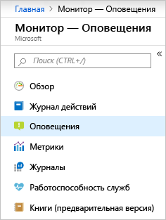
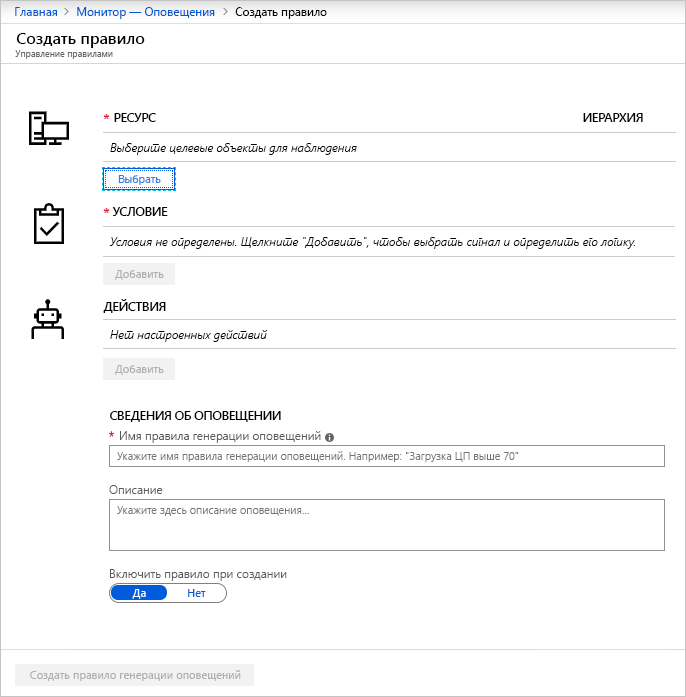
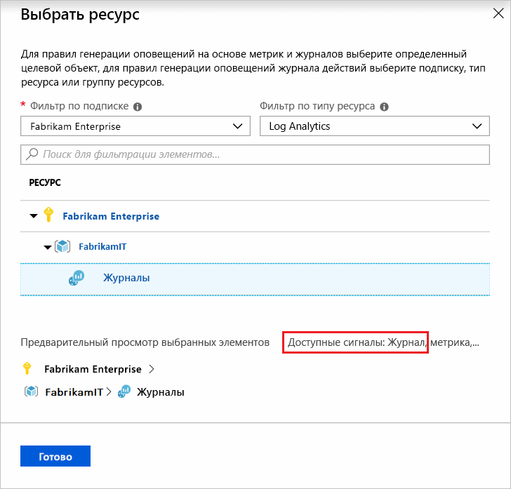
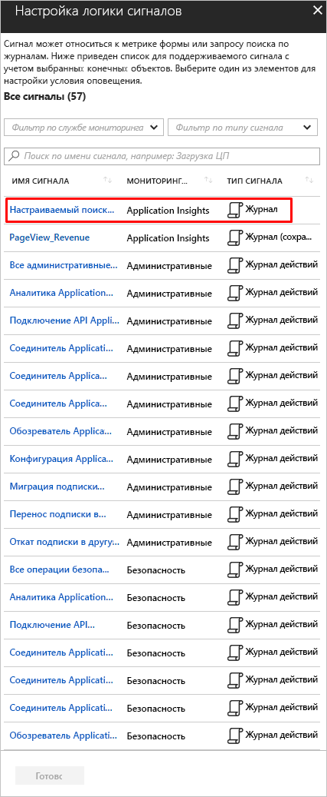
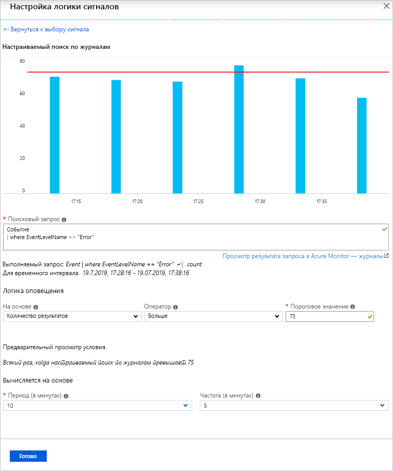
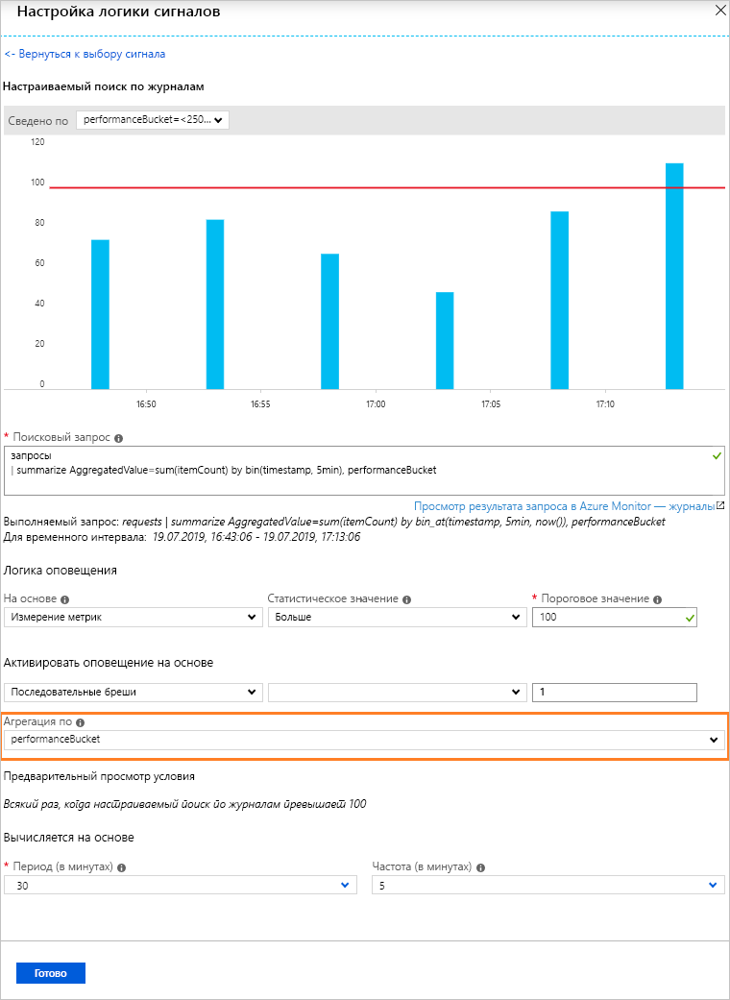

# <a name="create-view-and-manage-log-alerts-using-azure-monitor"></a>Создание и просмотр оповещений журнала, а также управление ими с помощью Azure Monitor

## <a name="overview"></a>Обзор
В этой статье показано, как настроить оповещения журнала с помощью интерфейса оповещений на портале Azure. Определение правила оповещений состоит из трех частей:
- Цель: определенный ресурс Azure, который следует отслеживать.
- Критерий: определенное условие или логика в сигнале, которые должны вызывать действие.
- Действие: конкретный вызов, отправленный получателю уведомления — электронное сообщение, текстовое сообщение, веб-перехватчик и т. д.

Термин **Log Alerts** для описания оповещений, где сигналом является запрос журнала в [рабочей области Log Analytics](../learn/tutorial-viewdata.md) или [Application Insights.](../app/analytics.md) Дополнительные сведения о функциях, терминологии и типах см. в статье [Оповещения журнала в Azure Monitor. Интерфейс оповещений](alerts-unified-log.md).

> [!NOTE]
> Популярные данные журнала из [рабочего пространства Log Analytics](../../azure-monitor/learn/tutorial-viewdata.md) теперь также доступны на метрической платформе в Azure Monitor. Более подробную информацию см. в статье [Create Metric Alerts for Logs in Azure Monitor](alerts-metric-logs.md) (Создание оповещений метрик для журналов в Azure Monitor).

## <a name="managing-log-alerts-from-the-azure-portal"></a>Управление оповещениями журнала на портале Azure

Ниже приводится пошаговое руководство по использованию оповещений журнала с помощью интерфейса портала Azure.

### <a name="create-a-log-alert-rule-with-the-azure-portal"></a>Создание правила генерации оповещений журнала с помощью портала Azure

1. На [портале](https://portal.azure.com/)выберите **Monitor** и под разделом MONITOR - выбирайте **оповещения.**

    

1. Нажмите кнопку **Новое правило генерации оповещений**, чтобы создать оповещение в Azure.

    

1. Появится раздел "Создать оповещение" с тремя элементами: *Define alert condition* (Определите условие оповещения), *Define alert details* (Определите сведения об оповещении) и *Define action group* (Определите группу действий).

    

1. Определите условие оповещения, для этого используйте ссылку **Выбор ресурса** и укажите цель путем выбора ресурса. Отфильтруйте, выбрав _Подписку_, _Тип ресурса_, и нужный _Ресурс_.

   > [!NOTE]
   > Прежде чем продолжить, убедитесь, что сигнал **журнала** доступен для выбранного ресурса, чтобы создать оповещения журнала.
   >  

1. *Оповещения журналов.* В качестве **типа ресурса** выберите источник данных аналитики, например *Log Analytics* или *Application Insights*, а в качестве типа сигнала — **Журнал**. Выбрав соответствующий **ресурс**, нажмите кнопку *Готово*. Затем нажмите кнопку **Добавить условие**, чтобы просмотреть список доступных параметров сигнала для ресурса. В списке сигналов выберите **Custom log search** (Пользовательский поиск по журналам) для выбранной службы мониторинга журналов, например *Log Analytics* или *Application Insights*.

   

   > [!NOTE]
   > 
   > Списки интерфейса оповещений могут импортировать запрос аналитических данных как тип сигнала — **Log (Saved Query)** (Журнал (сохраненный запрос)), как показано на приведенном выше изображении. Таким образом, пользователи могут совершенствовать ваш запрос в Analytics, а затем сохранить их для использования в будущем в оповещениях - более подробная информация об использовании сохранения запроса, доступного [при использовании запроса журнала в Azure Monitor](../log-query/log-query-overview.md) или [общий запрос в аналитике приложений.](../app/app-insights-overview.md)

1. *Оповещения журналов*. После выбора запрос для оповещения можно указать в поле **Search Query** (Поисковой запрос). Если синтаксис запроса неверен, в поле отображается ошибка, выделенная красным цветом. Если синтаксис запроса верен, появятся исторические данные указанного запроса для справки в виде графика с возможностью настройки временного интервала от последних шести часов до последней недели.

    

   > [!NOTE]
   > 
   > Визуализация исторических данных может отображаться, только если в результатах запроса есть данные о времени. Если при выполнении запроса появляются обобщенные данные или значения конкретных столбцов, то они отображаются как отдельный график.
   > Для оповещений журнала типа "Измерения метрик" с использованием Application Insights или [для перехода на новый API](alerts-log-api-switch.md) вы можете указать конкретную переменную для группирования данных, используя параметр **Агрегация по**, как показано ниже:
   > 
   > 

1. *Оповещения журналов*. После настройки визуализации можно выбрать **логику оповещений**из показанных параметров "Условие", "Агрегирование" и "Пороговое значение". В логике укажите время для оценки заданного условия с помощью параметра **Period** (Период). Кроме того, укажите частоту запуска оповещений, выбрав параметр **Frequency** (Частота). **Оповещения журналов** могут создаваться на основе таких данных.
    - [Число записей](../../azure-monitor/platform/alerts-unified-log.md#number-of-results-alert-rules). Оповещение создается, если количество записей, возвращаемых запросом, больше или меньше указанного вами значения.
    - [Измерение метрик](../../azure-monitor/platform/alerts-unified-log.md#metric-measurement-alert-rules). Оповещение создается, если каждое *статистическое значение* в результатах превышает указанное пороговое значение, которое *группируется* в соответствии с выбранным значением. Количество нарушений для оповещения — это количество превышений порогового значения в течение выбранного периода времени. Можно указать значение свойства Всего брешей, чтобы учитывать любое сочетание нарушений в наборе результатов, или значение свойства Последовательные бреши, чтобы учитывать только нарушения, следующие подряд.


1. В качестве второго шага в параметрах задайте имя оповещения в поле **Имя правила генерации оповещений**, а также введите подробные сведения в поле **Описание** и **Severity** (Серьезность). Эти данные повторно используются во всех оповещениях по электронной почте, уведомлениях или push-уведомлениях Azure Monitor. Кроме того, пользователь может сразу же активировать правило оповещения при создании, переключив параметр **Включить правило при создании**.

    Для параметра **Оповещения журналов** доступны только некоторые дополнительные функции в разделе "Детали оповещения":

    - **Отключить оповещения**. При включении подавления для правила генерации оповещений действия для этого правила отключаются на заданный промежуток времени после создания оповещения. Правило по прежнему выполняется и создает записи оповещений при соблюдении критериев. Это дает вам время устранить проблему без запуска повторяющихся действий.

        

        > [!TIP]
        > Укажите значение предупреждения, превышающее частоту предупреждения, чтобы гарантировать, что уведомления прекращаются без перекрытия

1. В качестве третьего и последнего шага укажите, нужно ли запускать **группу действий** для правила оповещения, если выполняется условие. Вы можете выбрать любую имеющуюся группу действий с оповещением или создать новую. Согласно выбранной группе действий при срабатывании оповещения Azure отправит электронное письмо, текстовое сообщение, вызовет веб-перехватчик, устранит проблему с помощью модуля Runbook Azure, отправит push-уведомление в инструмент ITSM и т. д. Узнайте больше о [группах действий](action-groups.md).

    > [!NOTE]
    > Дополнительные сведения об ограничениях на полезные данные модуля Runbook, запускаемые для оповещений журнала через группы действий Azure, см. в статье [Подписка Azure, границы, квоты и ограничения службы](../../azure-resource-manager/management/azure-subscription-service-limits.md).

    Для **оповещений журналов** доступны дополнительные функции для переопределения действий по умолчанию:

    - **Уведомление по электронной почте**: Переопределяет *тему в письме*, отправленном через группу действия, если в указанной группе существует одно или несколько действий электронного сообщения. Основной текст сообщения нельзя изменить, и в этом поле вы **не можете** указать адрес электронной почты.
    - **Включить настраиваемые полезные данные JSON.** Переопределяет JSON веб-перехватчика, используемый группами действий, если в указанной группе существует одно или несколько действий веб-перехватчика. Вы можете задать формат JSON, который будет использоваться для всех веб-перехватчиков в связанной группе действий. Дополнительные сведения о форматах веб-перехватчиков см. в статье [Действия веб-перехватчика для правил оповещений журнала](../../azure-monitor/platform/alerts-log-webhook.md). Параметр просмотр веб-перехватчика предоставляется для проверки формата с помощью примера данных JSON.

        


1. Если все поля действительны и выделены зеленым цветом, нажмите кнопку **Создать правило оповещения**, чтобы создать оповещение в Azure Monitor ("Оповещения "). Все оповещения можно просмотреть с помощью панели мониторинга службы "Оповещения".

     

     Через несколько минут оповещение включится и будет активироваться, как было описано выше.

Пользователи могут также завершить свой аналитический запрос в [журнале аналитики,](../log-query/portals.md) а затем нажать его на создание оповещения с помощью кнопки "Установить оповещения" - то следующие инструкции из шага 6 далее в приведенном выше учебнике.

 

### <a name="view--manage-log-alerts-in-azure-portal"></a>Просмотр оповещений журнала, и управление ими на портале Azure

1. На [портале](https://portal.azure.com/)выберите **Monitor** и под разделом MONITOR - выбирайте **оповещения.**

1. Отображается **панель оповещения,** в которой все оповещения Azure (включая оповещения о журнале) отображаются в единственной доске; включая каждый экземпляр, когда ваше правило оповещения журнала выстрелил. Дополнительные сведения см. в статье [Управление оповещениями](https://aka.ms/managealertinstances).
    > [!NOTE]
    > Правила генерации оповещений журнала включают пользовательскую логику на основе запросов, предоставляемых пользователями, и, как следствие, не имеют разрешенного состояния. Из-за чего каждый раз,когда выполняются условия, указанные в правиле генерации оповещений журнала, создается оповещение.

1. Нажмите кнопку **​​Управление правилами** на верхней панели, чтобы перейти к разделу управления правилами, в котором перечислены все созданные правила оповещений, включая отключенные оповещения.
    

## <a name="managing-log-alerts-using-azure-resource-template"></a>Управление оповещениями журнала с помощью шаблона ресурсов Azure

Оповещения журналов в Azure Monitor связаны с типом ресурса `Microsoft.Insights/scheduledQueryRules/`. Дополнительные сведения о данном типе ресурса приведены в разделе [Scheduled Query Rules](https://docs.microsoft.com/rest/api/monitor/scheduledqueryrules/) (Правила запланированных запросов). Оповещения журналов для Application Insights или Log Analytics можно создать с помощью [API правил запланированных запросов](https://docs.microsoft.com/rest/api/monitor/scheduledqueryrules/).

> [!NOTE]
> Управлять оповещениями журналов для Log Analytics также можно с помощью устаревшего [API оповещений Log Analytics](api-alerts.md), а также устаревших шаблонов [сохраненных поисковых запросов и оповещений Log Analytics](../insights/solutions-resources-searches-alerts.md). Дополнительные сведения об использовании нового API ScheduledQueryRules см. в статье [Switch to new API for Log Analytics Alerts](alerts-log-api-switch.md) (Переход на API для оповещений журнала).


### <a name="sample-log-alert-creation-using-azure-resource-template"></a>Создание примера оповещения журнала с помощью шаблона ресурсов Azure

Ниже приведена структура для шаблона ресурсов на основе [создания правил запланированных запросов](https://docs.microsoft.com/rest/api/monitor/scheduledqueryrules/createorupdate) с использованием стандартного запроса поиска по журналам из [количества типов результатов оповещений журнала](alerts-unified-log.md#number-of-results-alert-rules), содержащего пример набора данных в качестве переменных.

```json
{
    "$schema": "https://schema.management.azure.com/schemas/2015-01-01/deploymentTemplate.json#",
    "contentVersion": "1.0.0.0",
    "parameters": {
    },
    "variables": {
        "alertLocation": "southcentralus",
        "alertName": "samplelogalert",
        "alertDescription": "Sample log search alert",
        "alertStatus": "true",
        "alertSource":{
            "Query":"requests",
            "SourceId": "/subscriptions/a123d7efg-123c-1234-5678-a12bc3defgh4/resourceGroups/myRG/providers/microsoft.insights/components/sampleAIapplication",
            "Type":"ResultCount"
        },
        "alertSchedule":{
            "Frequency": 15,
            "Time": 60
        },
        "alertActions":{
            "SeverityLevel": "4"
        },
        "alertTrigger":{
            "Operator":"GreaterThan",
            "Threshold":"1"
        },
        "actionGrp":{
            "ActionGroup": "/subscriptions/a123d7efg-123c-1234-5678-a12bc3defgh4/resourceGroups/myRG/providers/microsoft.insights/actiongroups/sampleAG",
            "Subject": "Customized Email Header",
            "Webhook": "{ \"alertname\":\"#alertrulename\", \"IncludeSearchResults\":true }"
        }
    },
    "resources":[ {
        "name":"[variables('alertName')]",
        "type":"Microsoft.Insights/scheduledQueryRules",
        "apiVersion": "2018-04-16",
        "location": "[variables('alertLocation')]",
        "properties":{
            "description": "[variables('alertDescription')]",
            "enabled": "[variables('alertStatus')]",
            "source": {
                "query": "[variables('alertSource').Query]",
                "dataSourceId": "[variables('alertSource').SourceId]",
                "queryType":"[variables('alertSource').Type]"
            },
            "schedule":{
                "frequencyInMinutes": "[variables('alertSchedule').Frequency]",
                "timeWindowInMinutes": "[variables('alertSchedule').Time]"
            },
            "action":{
                "odata.type": "Microsoft.WindowsAzure.Management.Monitoring.Alerts.Models.Microsoft.AppInsights.Nexus.DataContracts.Resources.ScheduledQueryRules.AlertingAction",
                "severity":"[variables('alertActions').SeverityLevel]",
                "aznsAction":{
                    "actionGroup":"[array(variables('actionGrp').ActionGroup)]",
                    "emailSubject":"[variables('actionGrp').Subject]",
                    "customWebhookPayload":"[variables('actionGrp').Webhook]"
                },
                "trigger":{
                    "thresholdOperator":"[variables('alertTrigger').Operator]",
                    "threshold":"[variables('alertTrigger').Threshold]"
                }
            }
        }
    } ]
}

```

В приведенном выше примере JSON можно сохранить как sampleScheduledQueryRule.json, чтобы использовать его в данном пошаговом руководстве. Его можно развернуть с помощью [Azure Resource Manager на портале Azure](../../azure-resource-manager/templates/deploy-portal.md#deploy-resources-from-custom-template).


### <a name="log-alert-with-cross-resource-query-using-azure-resource-template"></a>Запись в журнал оповещений с запросом между ресурсами с помощью шаблона ресурсов Azure

Ниже приведена структура шаблона ресурса для [создания правил запланированных запросов](https://docs.microsoft.com/rest/api/monitor/scheduledqueryrules/createorupdate) с использованием [запроса поиска по журналам между ресурсами](../../azure-monitor/log-query/cross-workspace-query.md) из [оповещения журнала типа измерений метрик](../../azure-monitor/platform/alerts-unified-log.md#metric-measurement-alert-rules), в котором пример набора данных используется в качестве переменных.

```json

{
    "$schema": "https://schema.management.azure.com/schemas/2015-01-01/deploymentTemplate.json#",
    "contentVersion": "1.0.0.0",
    "parameters": {
    },
    "variables": {
        "alertLocation": "Region Name for your Application Insights App or Log Analytics Workspace",
        "alertName": "sample log alert",
        "alertDescr": "Sample log search alert",
        "alertStatus": "true",
        "alertSource":{
            "Query":"union workspace(\"servicews\").Update, app('serviceapp').requests | summarize AggregatedValue = count() by bin(TimeGenerated,1h), Classification",
            "Resource1": "/subscriptions/a123d7efg-123c-1234-5678-a12bc3defgh4/resourceGroups/contosoRG/providers/microsoft.OperationalInsights/workspaces/servicews",
            "Resource2": "/subscriptions/a123d7efg-123c-1234-5678-a12bc3defgh4/resourceGroups/contosoRG/providers/microsoft.insights/components/serviceapp",
            "SourceId": "/subscriptions/a123d7efg-123c-1234-5678-a12bc3defgh4/resourceGroups/contosoRG/providers/microsoft.OperationalInsights/workspaces/servicews",
            "Type":"ResultCount"
        },
        "alertSchedule":{
            "Frequency": 15,
            "Time": 60
        },
        "alertActions":{
            "SeverityLevel": "4",
            "SuppressTimeinMin": 20
        },
        "alertTrigger":{
            "Operator":"GreaterThan",
            "Threshold":"1"
        },
        "metricMeasurement": {
            "thresholdOperator": "Equal",
            "threshold": "1",
            "metricTriggerType": "Consecutive",
            "metricColumn": "Classification"
        },
        "actionGrp":{
            "ActionGroup": "/subscriptions/a123d7efg-123c-1234-5678-a12bc3defgh4/resourceGroups/contosoRG/providers/microsoft.insights/actiongroups/sampleAG",
            "Subject": "Customized Email Header",
            "Webhook": "{ \"alertname\":\"#alertrulename\", \"IncludeSearchResults\":true }"
        }
    },
    "resources":[ {
        "name":"[variables('alertName')]",
        "type":"Microsoft.Insights/scheduledQueryRules",
        "apiVersion": "2018-04-16",
        "location": "[variables('alertLocation')]",
        "properties":{
            "description": "[variables('alertDescr')]",
            "enabled": "[variables('alertStatus')]",
            "source": {
                "query": "[variables('alertSource').Query]",
                "authorizedResources": "[concat(array(variables('alertSource').Resource1), array(variables('alertSource').Resource2))]",
                "dataSourceId": "[variables('alertSource').SourceId]",
                "queryType":"[variables('alertSource').Type]"
            },
            "schedule":{
                "frequencyInMinutes": "[variables('alertSchedule').Frequency]",
                "timeWindowInMinutes": "[variables('alertSchedule').Time]"
            },
            "action":{
                "odata.type": "Microsoft.WindowsAzure.Management.Monitoring.Alerts.Models.Microsoft.AppInsights.Nexus.DataContracts.Resources.ScheduledQueryRules.AlertingAction",
                "severity":"[variables('alertActions').SeverityLevel]",
                "throttlingInMin": "[variables('alertActions').SuppressTimeinMin]",
                "aznsAction":{
                    "actionGroup": "[array(variables('actionGrp').ActionGroup)]",
                    "emailSubject":"[variables('actionGrp').Subject]",
                    "customWebhookPayload":"[variables('actionGrp').Webhook]"
                },
                "trigger":{
                    "thresholdOperator":"[variables('alertTrigger').Operator]",
                    "threshold":"[variables('alertTrigger').Threshold]",
                    "metricTrigger":{
                        "thresholdOperator": "[variables('metricMeasurement').thresholdOperator]",
                        "threshold": "[variables('metricMeasurement').threshold]",
                        "metricColumn": "[variables('metricMeasurement').metricColumn]",
                        "metricTriggerType": "[variables('metricMeasurement').metricTriggerType]"
                    }
                }
            }
        }
    } ]
}

```

> [!IMPORTANT]
> При выполнении запроса между ресурсами в оповещениях журнала использование [authorizedResources](https://docs.microsoft.com/rest/api/monitor/scheduledqueryrules/createorupdate#source) является обязательным и у пользователя должен быть доступ к списку заявленных ресурсов.

В приведенном выше примере JSON можно сохранить как sampleScheduledQueryRule.json, чтобы использовать его в данном пошаговом руководстве. Его можно развернуть с помощью [Azure Resource Manager на портале Azure](../../azure-resource-manager/templates/deploy-portal.md#deploy-resources-from-custom-template).

## <a name="managing-log-alerts-using-powershell"></a>Управление оповещениями о журналах с помощью PowerShell

[!INCLUDE [updated-for-az](../../../includes/updated-for-az.md)]

Azure Monitor - [API правил расписания](https://docs.microsoft.com/rest/api/monitor/scheduledqueryrules/) запроса является aPI REST и полностью совместим с API REST-менеджером ресурсов Azure. И PowerShell cmdlets, перечисленные ниже, доступны для использования [запланированных правил запроса API](https://docs.microsoft.com/rest/api/monitor/scheduledqueryrules/).

1. [New-AzScheduled'squeryRule](https://docs.microsoft.com/powershell/module/az.monitor/new-azscheduledqueryrule) : Powershell cmdlet для создания нового правила оповещения журнала.
1. [Set-AzScheduled's'ryRule](https://docs.microsoft.com/powershell/module/az.monitor/set-azscheduledqueryrule) : Powershell cmdlet для обновления существующего правила оповещения журнала.
1. [Новый-AzScheduled's'ryRuleSource](https://docs.microsoft.com/powershell/module/az.monitor/new-azscheduledqueryrulesource) : Powershell cmdlet для создания или обновления объекта, определяющего параметры источника для оповещения о журнале. Используется в качестве ввода [New-AzScheduled'sryRule](https://docs.microsoft.com/powershell/module/az.monitor/new-azscheduledqueryrule) и [Set-AzScheduled'sryRule](https://docs.microsoft.com/powershell/module/az.monitor/set-azscheduledqueryrule) cmdlet.
1. [Новый-AzScheduled's'ryRuleSchedule](https://docs.microsoft.com/powershell/module/az.monitor/New-AzScheduledQueryRuleSchedule): Powershell cmdlet для создания или обновления объекта, определяющего параметры расписания для оповещения журнала. Используется в качестве ввода [New-AzScheduled'sryRule](https://docs.microsoft.com/powershell/module/az.monitor/new-azscheduledqueryrule) и [Set-AzScheduled'sryRule](https://docs.microsoft.com/powershell/module/az.monitor/set-azscheduledqueryrule) cmdlet.
1. [New-AzScheduled's'ryRuleAlertingAction](https://docs.microsoft.com/powershell/module/az.monitor/New-AzScheduledQueryRuleAlertingAction) : Powershell cmdlet для создания или обновления объекта, определяющего параметры действия для оповещения журнала. Используется в качестве ввода [New-AzScheduled'sryRule](https://docs.microsoft.com/powershell/module/az.monitor/new-azscheduledqueryrule) и [Set-AzScheduled'sryRule](https://docs.microsoft.com/powershell/module/az.monitor/set-azscheduledqueryrule) cmdlet.
1. [New-AzScheduled'ruryRuleAznsActionGroup](https://docs.microsoft.com/powershell/module/az.monitor/new-azscheduledqueryruleaznsactiongroup) : Powershell cmdlet для создания или обновления объекта, определяющего параметры групп действий для оповещения журнала. Используется в качестве ввода [New-AzScheduled'sryRuleAlertingAction](https://docs.microsoft.com/powershell/module/az.monitor/New-AzScheduledQueryRuleAlertingAction) cmdlet.
1. [Новый-AzScheduled's'ryRuleTriggerCondition](https://docs.microsoft.com/powershell/module/az.monitor/new-azscheduledqueryruletriggercondition) : Powershell cmdlet для создания или обновления объекта, определяющего параметры состояния триггера для оповещения журнала. Используется в качестве ввода [New-AzScheduled'sryRuleAlertingAction](https://docs.microsoft.com/powershell/module/az.monitor/New-AzScheduledQueryRuleAlertingAction) cmdlet.
1. [New-AzScheduled's'ry'ryLogLogMetricTrigger](https://docs.microsoft.com/powershell/module/az.monitor/new-azscheduledqueryrulelogmetrictrigger) : Powershell cmdlet для создания или обновления объекта, определяющего параметры условий метрического триггера для [предупреждения о типе измерения метрики.](../../azure-monitor/platform/alerts-unified-log.md#metric-measurement-alert-rules) Используется в качестве ввода [New-AzScheduled'sryRuleTriggerCondition](https://docs.microsoft.com/powershell/module/az.monitor/new-azscheduledqueryruletriggercondition) cmdlet.
1. [Get-AzScheduled's'ryRule](https://docs.microsoft.com/powershell/module/az.monitor/get-azscheduledqueryrule) : Powershell cmdlet для списка существующих правил оповещения о журнале или конкретного правила оповещения журнала
1. [Обновление-AzScheduled's'ryRule](https://docs.microsoft.com/powershell/module/az.monitor/update-azscheduledqueryrule) : Powershell cmdlet для включения или отключить правило оповещения журнала
1. [Удалить-AzScheduled's'ryRule](https://docs.microsoft.com/powershell/module/az.monitor/remove-azscheduledqueryrule): Powershell cmdlet для удаления существующего правила оповещения журнала

> [!NOTE]
> Смдлеты По расписанию могут управлять только правилами, созданными cmdlet, или с помощью Azure Monitor - [API Правил расписания](https://docs.microsoft.com/rest/api/monitor/scheduledqueryrules/)запросов. Правила оповещения о журнале, созданные с использованием устаревших [Log Analytics Alert API](api-alerts.md) и устаревших шаблонов [log Analytics сохраненных поисков и оповещений,](../insights/solutions-resources-searches-alerts.md) которые можно управлять с помощью смдлетов Смдлетов Scheduled'ryryRules PowerShell только после того, как пользователь [переключит предпочтение API для оповещения о журнале Analytics.](alerts-log-api-switch.md)

Иллюстрированные следующие шаги для создания образца правила оповещения журнала с использованием запланированных смлетов PowerShell.
```powershell
$source = New-AzScheduledQueryRuleSource -Query 'Heartbeat | summarize AggregatedValue = count() by bin(TimeGenerated, 5m), _ResourceId' -DataSourceId "/subscriptions/a123d7efg-123c-1234-5678-a12bc3defgh4/resourceGroups/contosoRG/providers/microsoft.OperationalInsights/workspaces/servicews"

$schedule = New-AzScheduledQueryRuleSchedule -FrequencyInMinutes 15 -TimeWindowInMinutes 30

$metricTrigger = New-AzScheduledQueryRuleLogMetricTrigger -ThresholdOperator "GreaterThan" -Threshold 2 -MetricTriggerType "Consecutive" -MetricColumn "_ResourceId"

$triggerCondition = New-AzScheduledQueryRuleTriggerCondition -ThresholdOperator "LessThan" -Threshold 5 -MetricTrigger $metricTrigger

$aznsActionGroup = New-AzScheduledQueryRuleAznsActionGroup -ActionGroup "/subscriptions/a123d7efg-123c-1234-5678-a12bc3defgh4/resourceGroups/contosoRG/providers/microsoft.insights/actiongroups/sampleAG" -EmailSubject "Custom email subject" -CustomWebhookPayload "{ `"alert`":`"#alertrulename`", `"IncludeSearchResults`":true }"

$alertingAction = New-AzScheduledQueryRuleAlertingAction -AznsAction $aznsActionGroup -Severity "3" -Trigger $triggerCondition

New-AzScheduledQueryRule -ResourceGroupName "contosoRG" -Location "Region Name for your Application Insights App or Log Analytics Workspace" -Action $alertingAction -Enabled $true -Description "Alert description" -Schedule $schedule -Source $source -Name "Alert Name"
```

## <a name="managing-log-alerts-using-cli-or-api"></a>Управление оповещениями о журналах с помощью CLI или API

Azure Monitor - [API правил расписания](https://docs.microsoft.com/rest/api/monitor/scheduledqueryrules/) запроса является aPI REST и полностью совместим с API REST-менеджером ресурсов Azure. Таким образом, он может быть использован через Powershell с помощью команд управления ресурсами для Azure CLI.


> [!NOTE]
> Управлять оповещениями журналов для Log Analytics также можно с помощью устаревшего [API оповещений Log Analytics](api-alerts.md), а также устаревших шаблонов [сохраненных поисковых запросов и оповещений Log Analytics](../insights/solutions-resources-searches-alerts.md). Дополнительные сведения об использовании нового API ScheduledQueryRules см. в статье [Switch to new API for Log Analytics Alerts](alerts-log-api-switch.md) (Переход на API для оповещений журнала).

Оповещения о журнале в настоящее время не имеют специальных команд CLI в настоящее время; но, как показано ниже, можно использовать через команду менеджера ресурсов Azure CLI для образца шаблона ресурсов, показанного ранее (sampleScheduled'eryRule.json) в разделе Шаблон ресурсов:

```azurecli
az group deployment create --resource-group contosoRG --template-file sampleScheduledQueryRule.json
```

После успешного выполнения возвращается код 201, который означает, что новое правило создано. Если было изменено существующее правило генерации оповещений, то возвращается код 200.

## <a name="next-steps"></a>Дальнейшие действия

* Узнайте о [оповещениях о журналах в оповещениях Azure](../../azure-monitor/platform/alerts-unified-log.md)
* Общие сведения о [действиях веб-перехватчиков для оповещений журнала](../../azure-monitor/platform/alerts-log-webhook.md)
* Подробнее об информации о [приложениях](../../azure-monitor/app/analytics.md)
* Подробнее о [запросах журнала](../log-query/log-query-overview.md).
