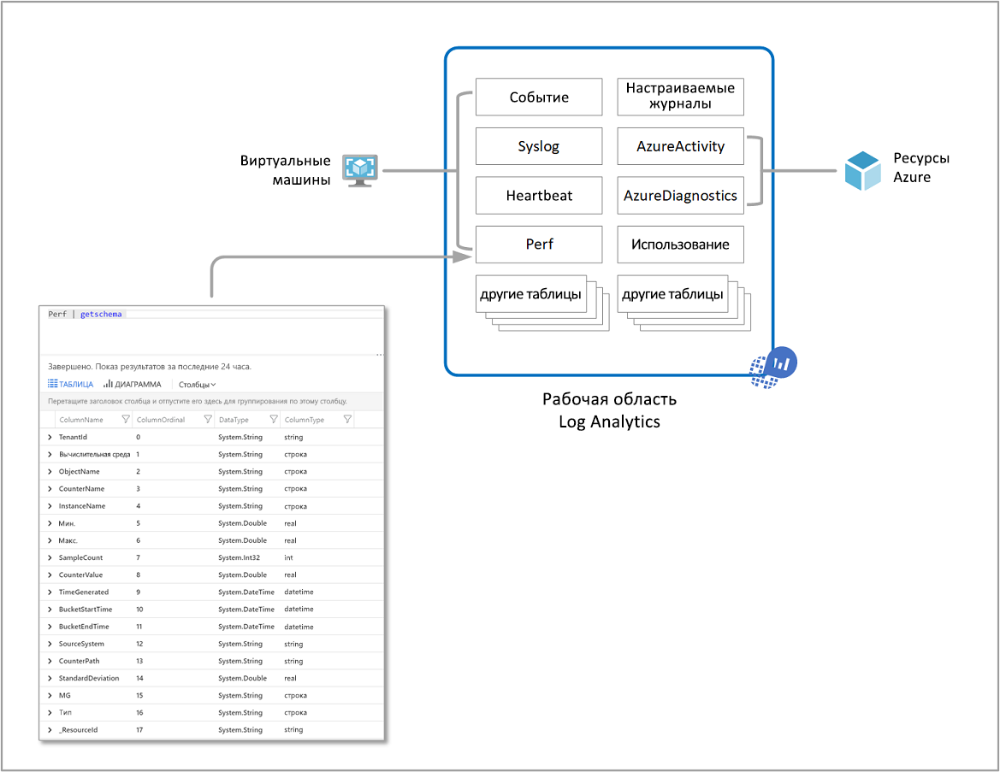
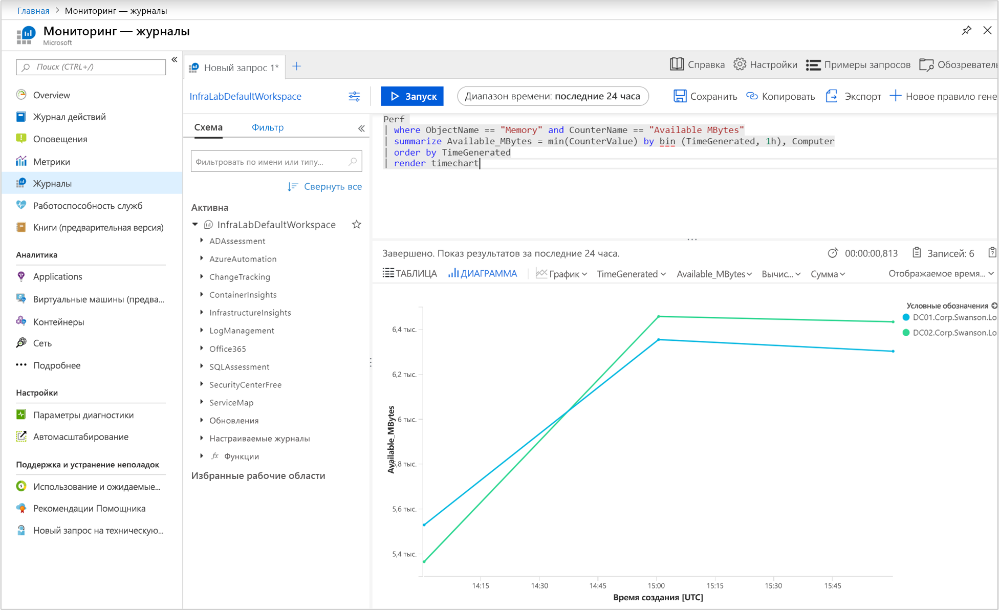
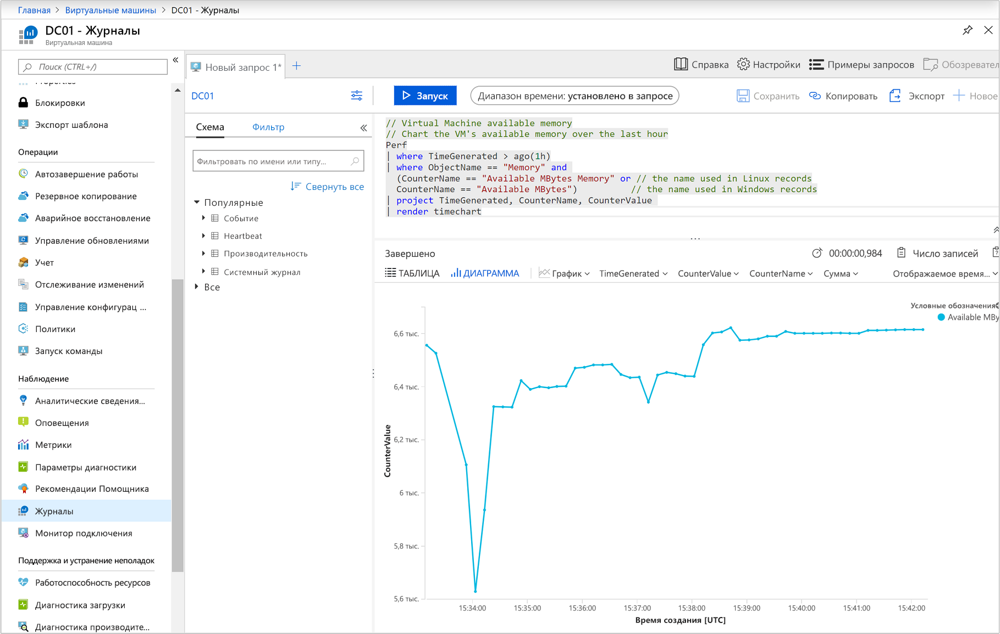
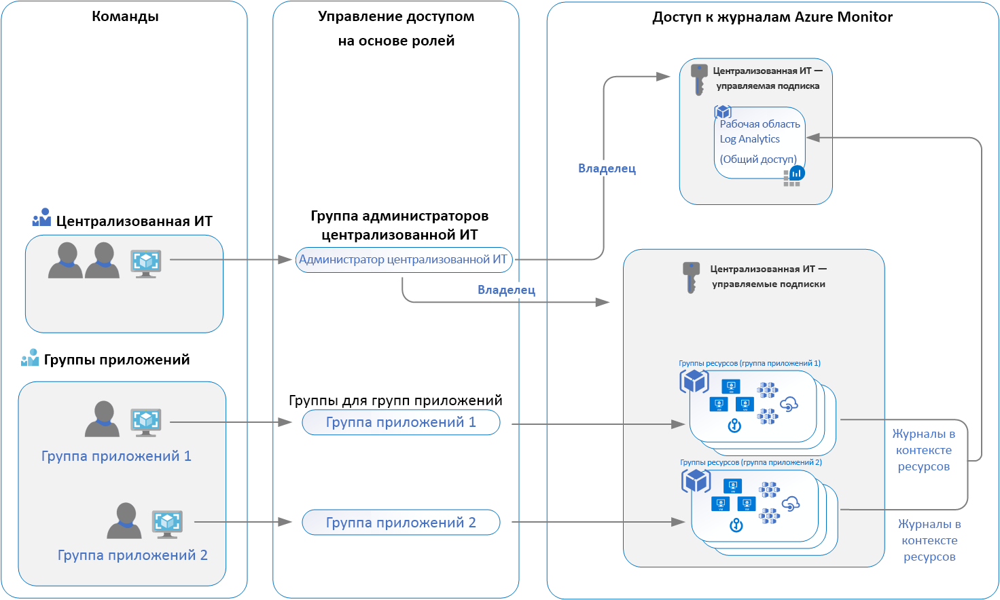

# <a name="designing-your-azure-monitor-logs-deployment"></a>Проектирование развертывания журналов Azure Monitor

Azure Monitor хранит данные [журналов](data-platform-logs.md) в рабочей области Log Analytics, которая является ресурсом Azure и контейнером, где данные собираются, агрегируются и служат административной границей. Хотя вы можете развернуть одно или несколько рабочих областей в подписке Azure, есть несколько соображений, которые вы должны понять, чтобы убедиться, что ваше первоначальное развертывание следует нашим рекомендациям, чтобы предоставить вам экономически эффективное, управляемое и масштабируемое развертывание, отвечая потребностям организаций.

Данные в рабочей области организуется в таблицы, каждая из которых хранит различные виды данных и имеет свой собственный уникальный набор свойств на основе ресурса, генерирующего данные. Большинство источников данных будут писать в свои таблицы в рабочей области Log Analytics.



Рабочая область Log Analytics предоставляет следующие преимущества:

* Географическое положение для хранения данных.
* Изоляция данных путем предоставления различным пользователям прав доступа после одной из наших рекомендуемых стратегий проектирования.
* Область для настройки настроек, таких как [уровень ценообразования,](https://docs.microsoft.com/azure/azure-monitor/platform/manage-cost-storage#changing-pricing-tier) [удержание](https://docs.microsoft.com/azure/azure-monitor/platform/manage-cost-storage#change-the-data-retention-period)и [ограничение данных.](https://docs.microsoft.com/azure/azure-monitor/platform/manage-cost-storage#manage-your-maximum-daily-data-volume)

В этой статье содержится подробный обзор соображений проектирования и миграции, обзор контроля доступа и понимание реализации проектов, которые мы рекомендуем для ИТ-организации.


## <a name="important-considerations-for-an-access-control-strategy"></a>Важные соображения для стратегии контроля доступа

Определение необходимого количества рабочих областей зависит от одного или нескольких из следующих требований:

* Вы являетесь глобальной компанией, и по причинам конфиденциальности или в соответствии с нормативными требованиями вам необходимо хранить данные журнала в определенных регионах.
* Вы используете Azure и хотите избежать расходов на передачу исходящих данных, создав рабочую область в том же регионе, где находятся ресурсы Azure, которыми она управляет.
* Вы управляете несколькими отделами или бизнес-группами, и вы хотите, чтобы каждый видел свои собственные данные, но не данные от других. Кроме того, нет бизнес-требования для консолидированного представления между собой отделами или бизнес-группой.

ИТ-организации сегодня моделируются либо по централизованному, децентрализованному, либо между ними гибридом обеих структур. В результате для картирования одной из следующих организационных структур обычно используются следующие модели развертывания рабочей области:

* **Централизованно**: Все журналы хранятся в центральном рабочем пространстве и управляются одной командой, а Azure Monitor обеспечивает дифференцированный доступ к команде. В этом сценарии легко управлять, искать ресурсы и перекрестно соотносить журналы. Рабочее пространство может значительно увеличиться в зависимости от объема данных, собранных из нескольких ресурсов в вашей подписке, с дополнительными административными накладными расходами для поддержания контроля доступа для разных пользователей. Эта модель известна как "хаб и говорил".
* **Децентрализованная**группа имеет свою собственную рабочую область, созданную в группе ресурсов, которой они владеют и управляют, и данные журнала сегрегированы на ресурсы. В этом сценарии рабочее пространство может быть защищено, а контроль доступа соответствует доступу к ресурсам, но трудно перекрестно соотнести журналы. Пользователи, которым необходимо широкое представление о многих ресурсах, не могут анализировать данные значимым образом.
* **Гибридные**требования к аудиту безопасности еще больше усложняют этот сценарий, поскольку многие организации реализуют обе модели развертывания параллельно. Это обычно приводит к сложной, дорогостоящей и трудно поддавкой конфигурации с пробелами в охвате журналов.

При использовании агентов Log Analytics для сбора данных необходимо понимать следующее, чтобы спланировать развертывание агента:

* Для сбора данных от агентов Windows можно [настроить каждый агент для отчета в одном или нескольких рабочих областях,](../../azure-monitor/platform/agent-windows.md)даже если он отчитывается перед группой управления управлением операциями ВИЭ. Агент Windows может сообщать о четырех рабочих областях.
* Агент Linux не поддерживает мульти-гонатинг и может отчитываться только о одном рабочем пространстве.

Если вы используете диспетчер операций System Center 2012 R2 или позже:

* Каждая группа управления менеджером операций может быть [подключена только к одному рабочему пространству.](../platform/om-agents.md) 
* Компьютеры Linux, сообщающие группе управления, должны быть настроены для непосредственного отчета в рабочее пространство Log Analytics. Если ваши компьютеры Linux уже отчитываются непосредственно в рабочей области, и вы хотите контролировать их с помощью менеджера операций, выполните следующие действия, чтобы [сообщить об этом группе управления операциями.](agent-manage.md#configure-agent-to-report-to-an-operations-manager-management-group) 
* Вы можете установить агент Log Analytics Windows на компьютер Windows и сообщить об этом как менеджеру операций, интегрированному с рабочим пространством, так и другому рабочему пространству.

## <a name="access-control-overview"></a>Общие сведения о контроле доступа

С помощью управления доступом на основе ролей (RBAC) можно предоставлять пользователям и группам только объем доступа, необходимый для работы с данными мониторинга в рабочей области. Это позволяет согласовывать с операционной моделью ИТ-организации с помощью единого рабочего пространства для хранения собранных данных на всех ресурсах. Например, вы предоставляете доступ к вашей команде, отвечающей за инфраструктурные службы, размещенные на виртуальных машинах Azure (VM), и в результате они будут иметь доступ только к журналам, генерируемым виртуальными машинами. Это следует за нашей новой моделью журнала ресурс-контекста. Основой для этой модели является каждая запись журнала, излучаемые ресурсом Azure, она автоматически связана с этим ресурсом. Логи препровождаются в центральное рабочее пространство, которое уважает scoping и RBAC на основе ресурсов.

Данные, к которым пользователь имеет доступ, определяются сочетанием факторов, перечисленных в следующей таблице. Каждый из них описан в разделах ниже.

| Фактор | Описание |
|:---|:---|
| [Режим доступа](#access-mode) | Метод, используемый пользователем для доступа к рабочей области.  Определяет область доступных данных и применяемый режим управления доступом. |
| [Режим управления доступом](#access-control-mode) | Настройка рабочего пространства, определяющего, применяются ли разрешения на рабочем или ресурсном уровне. |
| [Разрешения](manage-access.md) | Разрешения, применяемые к отдельным или группам пользователей для рабочего пространства или ресурса. Определяет, к каким данным пользователь будет иметь доступ. |
| [Таблица уровня RBAC](manage-access.md#table-level-rbac) | Дополнительные гранулированные разрешения, которые применяются ко всем пользователям, независимо от их режима доступа или режима управления доступом. Определяет, к каким типам данных пользователь может получить доступ. |

## <a name="access-mode"></a>Режим доступа

*Режим доступа* относится к тому, как пользователь получает доступ к рабочей области Log Analytics и определяет область данных, к которой он может получить доступ. 

Пользователи имеют два варианта доступа к данным:

* **Рабочее пространство-контекст**: Вы можете просматривать все журналы в рабочей области у вас есть разрешение. Запросы в этом режиме используются для всех данных во всех таблицах рабочей области. Это режим доступа, используемый при доступе к журналу с рабочим пространством в качестве области, например, при выборе **журналов** из меню **Azure Monitor** на портале Azure.

    

* **Контекст ресурсов:** При доступе к рабочей области для определенного ресурса, группы ресурсов или подписки, например при выборе **журналов** из меню ресурсов на портале Azure, можно просматривать журналы только для ресурсов во всех таблицах, к которым у вас есть доступ. Запросы в этом режиме относятся только к данным, связанным с этим ресурсом. Этот режим также позволяет гранулированный RBAC.

    

    > [!NOTE]
    > Логи доступны для запросов ресурсно-контекстного контекста только в том случае, если они были должным образом связаны с соответствующим ресурсом. В настоящее время следующие ресурсы имеют ограничения:
    > - Компьютеры за пределами Azure
    > - Service Fabric
    > - Application Insights
    >
    > Вы можете проверить, правильно ли журналы связаны с их ресурсом, запустив запрос и проверив интересующие вас записи. Если идентификатор ресурса находится в [_ResourceId](log-standard-properties.md#_resourceid) свойстве, данные доступны для запросов, ориентированных на ресурсы.

Azure Monitor автоматически определяет правильный режим в зависимости от контекста, из которых выполняется поиск журнала. Область всегда представлена в левом верхнем разделе Log Analytics.

### <a name="comparing-access-modes"></a>Сравнение режимов доступа

В следующей таблице кратко излагаются режимы доступа:

| | Рабочее пространство-контекст | Ресурс-контекст |
|:---|:---|:---|
| Для кого предназначена каждая модель? | Центральная администрация. Администраторы, которым необходимо настроить сбор данных, и пользователи, которым необходим доступ к широкому спектру ресурсов. Также в настоящее время требуется пользователям, которым необходимо получить доступ к журналам для ресурсов за пределами Azure. | Группы приложений. Мониторинг администраторов ресурсов Azure. |
| Что требуется пользователю для просмотра журналов? | Разрешения на рабочее пространство. Просмеливайте **разрешения Рабочего пространства** в [управлении доступом с помощью разрешений рабочего пространства.](manage-access.md#manage-access-using-workspace-permissions) | Прочитайте доступ к ресурсу. Просрвините **разрешения ресурсов** в [управлении доступом с помощью разрешений Azure.](manage-access.md#manage-access-using-azure-permissions) Разрешения могут быть унаследованы (например, от группы ресурсов) или непосредственно назначены ресурсу. Разрешение на журналы для ресурса будет автоматически назначено. |
| Какова сфера действия разрешений? | Рабочей области. Пользователи, имея доступ к рабочему пространству, могут задать запрос на все журналы в рабочей области из таблиц, на которые у них есть разрешения. Посмотреть [элемент управления доступом таблицы](manage-access.md#table-level-rbac) | Ресурс Azure. Пользователь может запросить журналы для определенных ресурсов, групп ресурсов или подписки, к которой они имеют доступ из любого рабочего пространства, но не могут запросить журналы для других ресурсов. |
| Как пользователи могут получить доступ к журналам? | <ul><li>Запустите **журналы** из меню **Azure Monitor.**</li></ul> <ul><li>Запуск **журналов** из **рабочих областей log Analytics.**</li></ul> <ul><li>Из [трудовых книжек](../visualizations.md#workbooks)Azure Monitor .</li></ul> | <ul><li>Запуск **журналов** из меню для ресурса Azure</li></ul> <ul><li>Запустите **журналы** из меню **Azure Monitor.**</li></ul> <ul><li>Запуск **журналов** из **рабочих областей log Analytics.**</li></ul> <ul><li>Из [трудовых книжек](../visualizations.md#workbooks)Azure Monitor .</li></ul> |

## <a name="access-control-mode"></a>Режим управления доступом

*Режим управления доступом* — это параметр на каждом рабочем пространстве, определяющий, как определяются разрешения для рабочего пространства.

* **Требуются разрешения рабочего пространства**: Этот режим управления не позволяет детализированный RBAC. Для того чтобы пользователь получил доступ к рабочей области, им должны быть предоставлены разрешения на рабочее пространство или на определенные таблицы.

    Если пользователь получает доступ к рабочей области в соответствии с режимом рабочего пространства и контекста, он имеет доступ ко всем данным в любой таблице, к которой ему был предоставлен доступ. Если пользователь получает доступ к рабочей области в соответствии с режимом ресурс-контекст, он имеет доступ только к данным для этого ресурса в любой таблице, к которой ему был предоставлен доступ.

    Это параметр по умолчанию для всех рабочих пространств, созданных до марта 2019 года.

* **Используйте разрешения ресурса или рабочего пространства:** Этот режим управления позволяет гранулированный RBAC. Пользователям может быть предоставлен доступ только к данным, связанным `read` с ресурсами, которые они могут просматривать, назначив разрешение Azure. 

    Когда пользователь получает доступ к рабочей области в режиме рабочего пространства и контекста, применяются разрешения рабочего пространства. Когда пользователь получает доступ к рабочей области в режиме ресурс-контекст, проверяются только разрешения ресурса и игнорируются разрешения рабочего пространства. Включите RBAC для пользователя, удалив его из разрешений рабочего пространства и позволив распознать разрешения ресурсов.

    Это параметр по умолчанию для всех рабочих пространств, созданных после марта 2019 года.

    > [!NOTE]
    > Если пользователь имеет только разрешения ресурса на рабочее пространство, он может получить доступ к рабочей области только с помощью режима ресурс-контекст, предполагая, что режим доступа в рабочее пространство настроен на **использование разрешений ресурса или рабочего пространства.**

Чтобы узнать, как изменить режим управления доступом на портале, с помощью PowerShell, или с помощью шаблона управления ресурсами, [см.](manage-access.md#configure-access-control-mode)

## <a name="ingestion-volume-rate-limit"></a>Ограничение объема приема

Azure Monitor — это высокомасштабируемая служба, которая обслуживает тысячи клиентов, ежемесячно отправляющих стремительными темпами терабайты данных. Порог скорости приема по умолчанию установлен на **уровне 6 ГБ/мин** на рабочее пространство. Это приблизительное значение, так как фактический размер может варьироваться между типами данных в зависимости от длины журнала и его соотношения сжатия. Это ограничение не распространяется на данные, отправляемые агентами или [API-коллектором данных.](data-collector-api.md)

Если данные с более высокой скоростью отправляется в одну рабочую область, некоторые данные отменяются, и событие отправляется в таблицу *операции* в рабочей области каждые 6 часов, в то время как порог продолжает быть превышен. Если объем приема не превысят лимит скорости или вы ожидаете достичь его в ближайшее время, вы можете запросить увеличение рабочей области, открыв запрос на поддержку.
 
Чтобы получать уведомления о таком событии в рабочем пространстве, создайте [правило оповещения о журнале,](alerts-log.md) используя следующий запрос с базой логики оповещения на терке количества результатов, чем ноль.

``` Kusto
Operation
|where OperationCategory == "Ingestion"
|where Detail startswith "The rate of data crossed the threshold"
``` 


## <a name="recommendations"></a>Рекомендации



Этот сценарий охватывает одну рабочую конструкцию в подписке ИТ-организаций, которая не ограничена суверенитетом данных или нормативным соответствием, или должна отображать регионы, в которые развертываются ресурсы. Это позволяет группам служб безопасности и ИТ-аминов организациям использовать улучшенную интеграцию с управлением доступом Azure и более безопасным управлением доступом.

Все ресурсы, решения мониторинга и исследования, такие как Application Insights и Azure Monitor для вс-миноносцев, поддерживающие инфраструктуру и приложения, поддерживаемые различными группами, настроены для передачи собранных данных журналов ИТ-организациям централизованное совместное рабочее пространство. Пользователям каждой группы предоставляется доступ к журналам для ресурсов, к которым они получили доступ.

После развертывания архитектуры рабочего пространства можно принудить ее к ресурсам Azure с [помощью Azure Policy.](../../governance/policy/overview.md) Он предоставляет способ определения политик и обеспечения соответствия ресурсам Azure, чтобы они отправляли все журналы ресурсов в определенное рабочее пространство. Например, с помощью виртуальных машин Azure или виртуальных наборов масштабов машин можно использовать существующие политики, которые оценивают соответствие рабочей области и отчетные результаты, или настраивают для устранения, если они не соответствуют требованиям.  

## <a name="workspace-consolidation-migration-strategy"></a>Стратегия миграции консолидации рабочего пространства

Для клиентов, которые уже развернули несколько рабочих областей и заинтересованы в консолидации к модели доступа к ресурсо-контексту, мы рекомендуем использовать дополнительный подход к переходу к рекомендуемой модели доступа, и вы не пытаетесь достичь этого быстро или агрессивно. При поэтапном подходе к планированию, миграция, проверка и вывод из эксплуатации после разумного срока помогут избежать любых незапланированных инцидентов или неожиданного воздействия на операции облака. Если у вас нет политики хранения данных по соображениям соответствия требованиям или бизнес-причинам, необходимо оценить соответствующий промежуток времени для хранения данных в рабочей области, из которой вы мигрируете во время процесса. Во время перенастройки ресурсов для отчета в общее рабочее пространство можно по мере необходимости анализировать данные в исходном рабочем пространстве. После завершения миграции, если вы будете хранить данные в исходной рабочей области до окончания периода хранения, не удаляйте их.

При планировании миграции к этой модели, рассмотрим следующее:

* Поймите, какие отраслевые правила и внутренние политики в отношении хранения данных вы должны соблюдать.
* Убедитесь, что группы приложений могут работать в рамках существующей функциональности контекста ресурсов.
* Определите доступ к ресурсам для групп приложений и тестируйте в среде разработки перед внедрением в процессе разработки.
* Настройка рабочего пространства для включения **разрешений на использование ресурсов или рабочего пространства.**
* Удалите разрешение групп приложений на чтение и запрос рабочего пространства.
* Включите и направьте любые решения мониторинга, Исследования, такие как Azure Monitor для контейнеров и/или Azure Monitor для ВМ, вашу учетную запись автоматизации (ы) и решения управления, такие как управление обновлениями, Start/Stop VMs и т.д., которые были развернуты в исходном рабочем пространстве.

## <a name="next-steps"></a>Дальнейшие действия

Для реализации разрешений и элементов управления безопасности, рекомендованных в данном руководстве, просмотрите [управление доступом к журналам.](manage-access.md)
