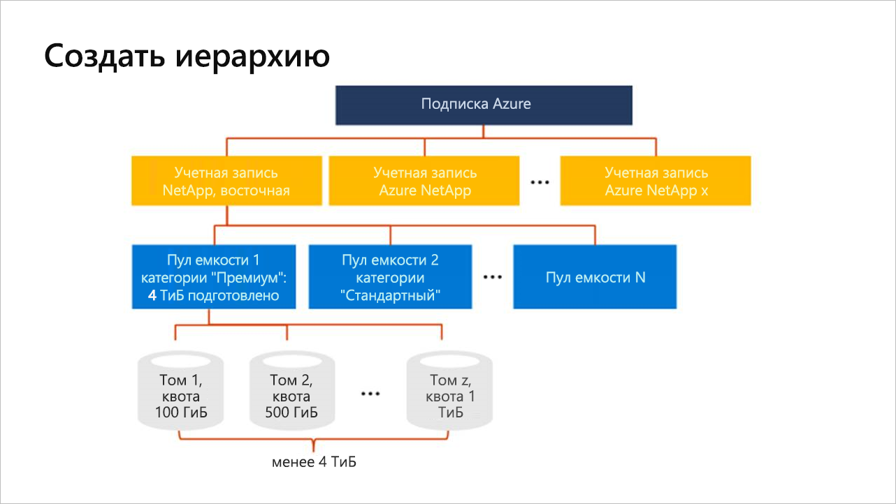

# Иерархия хранилища Azure NetApp Files

Перед созданием тома в Azure NetApp Files необходимо приобрести и настроить пул для подготовленной емкости.  Чтобы настроить емкость пула, необходимо иметь учетную запись NetApp. Понимание иерархии хранилища помогает настроить и управлять ресурсами Azure NetApp Files.

> [!IMPORTANT] 
> Azure NetApp Files в настоящее время не поддерживает миграцию ресурсов между подписками.

## Учетные записи NetApp

- Учетная запись NetApp служит в качестве административного группирования составных емкостей пулов.  
- Учетная запись NetApp отличается от учетной записи хранения Azure. 
- Учетная запись NetApp является региональной областью.   
- Можно иметь несколько учетных записей NetApp в регионе, но каждая учетная запись NetApp привязана только к одному региону.

## Пулы емкости

Сведения о работе пулов ресурсов помогают выбрать правильные типы пулов емкости для ваших потребностей в хранении. 

### Общие правила пулов емкости

- Емкость пула определяется по его производительности.   
    Дополнительные сведения см. в разделе [Типы качества обслуживания](#qos_types).  
- Емкость предоставляется в пределах фиксированных номеров SKU, которые вы приобрели (например, емкость 4 ТиБ).
- Пул емкости может содержать только один уровень службы.  
- Каждый пул емкости может принадлежать только одной учетной записи NetApp. Но в учетной записи NetApp может быть несколько пулов емкости.  
- Пул емкости нельзя перемещать между различными учетными записями NetApp.   
  Например, в [концептуальной схеме иерархии хранения](#conceptual_diagram_of_storage_hierarchy) ниже, Capacity Pool 1 невозможно переместить из учётной записи NetApp восточной части США в учётную запись NetApp западной части США 2.  
- Нельзя удалить пул емкости, пока не будут удалены все содержащиеся в нем тома.

### Типы качества обслуживания (QoS) для пулов емкости

Тип QoS является атрибутом пула емкости. Azure NetApp Files предоставляет два типа QoS пулов емкости. 

- Тип качества обслуживания *автоматический (или авто)*  

    При создании пула емкости по умолчанию используется тип QoS авто.

    В управляемом автоматически пуле емкости QoS пропускная способность автоматически назначается томам в пуле, пропорционально квоте размера, назначенной томам. 

    Максимальная пропускная способность, выделенная для тома, зависит от уровня обслуживания пула емкости и квоты размера тома. Пример вычисления см. в статье [Уровни обслуживания для Azure NetApp Files](azure-netapp-files-service-levels.md).

- Тип качества обслуживания *вручную*  

     > [!IMPORTANT] 
     > Чтобы использовать тип QoS вручную, для пула емкости требуется регистрация.  См. статью [Управление пулом емкости качества обслуживания вручную](manage-manual-qos-capacity-pool.md).  

    Вы можете использовать тип QoS вручную для пула емкости.

    В управляемом вручную пуле емкости QoS можно независимо назначать емкость и пропускную способность тома. Общая пропускная способность всех томов, созданных с помощью управляемого вручную пула емкости QoS, ограничена общей пропускной способностью пула.  Она определяется сочетанием размера пула и пропускной способности на уровне службы. 

    Например, пул емкости 4 ТиБ с уровнем обслуживания "Ультра" имеет общую емкость пропускной способности 512 МиБ/с (4 Тиб x 128 МиБ/с/Тиб), доступную для томов.

## Тома

- Том измеряется с использованием логической емкости и масштабируется. 
- Потребление емкости тома зависит от подготовленной емкости пула.
- Потребление пропускной способности тома зависит от доступной пропускной способности пула. См. раздел [Тип качества обслуживания вручную](#manual_qos_type).
- Каждый том принадлежит только одному пулу, но пул может содержать несколько томов. 

## Концептуальная схема иерархии хранения 
В следующем примере показаны связи подписки Azure, учетных записей NetApp, пулов емкости и томов.   

## Дальнейшие действия

- [Ограничения ресурсов для службы Azure NetApp Files](azure-netapp-files-resource-limits.md)
- [Регистрация в службе Azure NetApp Files](azure-netapp-files-register.md)
- [Уровни обслуживания для Azure NetApp Files](azure-netapp-files-service-levels.md)
- [Рекомендации по ускорению Azure NetApp Files](azure-netapp-files-performance-considerations.md)
- [Настройка пула емкости](azure-netapp-files-set-up-capacity-pool.md)
- [Управление пулом емкости качества обслуживания вручную](manage-manual-qos-capacity-pool.md)
