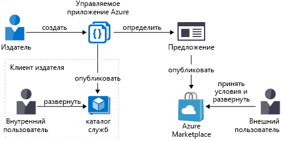
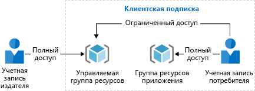

# Обзор управляемых приложений Azure

Управляемые приложения Azure позволяют реализовать облачные решения, которые пользователи могут легко развертывать и применять. Вы реализуете инфраструктуру и обеспечиваете непрерывную поддержку. Чтобы предоставить управляемые приложения всем пользователям, опубликуйте их в Azure Marketplace. Чтобы приложение было доступно только для пользователей из вашей организации, опубликуйте его во внутреннем каталоге. 

Управляемое приложение похоже на шаблон решения Marketplace, за исключением одного существенного отличия. В управляемом приложении ресурсы развертываются в группе ресурсов, управляемой поставщиком приложения. Группа ресурсов расположена в подписке пользователя, но идентификатор в клиенте издателя имеет доступ к группе ресурсов. Как издатель, вы указываете стоимость текущей поддержки решения.

> [!NOTE]
> Ранее документация по настраиваемым поставщикам Azure была включена в документацию по управляемым приложениям. Эта документация была перемещена. См. [Настраиваемые поставщики Azure](../custom-providers/overview.md).

## Преимущества управляемых приложений

Управляемые приложения устраняют препятствия, с которыми сталкиваются пользователи ваших решений. Им не нужно быть экспертами в области облачной инфраструктуры, чтобы использовать ваше решение. Доступ потребителей к критически важным ресурсам ограничен. Поэтому можно не беспокоиться об ошибках при управлении ими. 

Управляемые приложения позволяют поддерживать связь с пользователями. Вы определяете условия для управления приложением, и все начисления обрабатываются с помощью системы выставления счетов Azure.

Хотя клиенты развертывают эти управляемые приложения в своих подписках, им не нужно поддерживать, обновлять и обслуживать их. Вы можете удостовериться, что все клиенты используют утвержденные версии. Клиентам не нужно обладать знаниями о конкретных приложениях, чтобы управлять ими. Клиенты автоматически получают обновления приложений, не заботясь об устранении неполадок и диагностике проблем в приложениях. 

Управляемые приложения позволяют ИТ-отделам предлагать пользователям в организации предварительно утвержденные решения. Благодаря этому вы можете быть уверены, что такие решения соответствуют стандартам организации.

Управляемые приложения поддерживают [управляемые удостоверения для ресурсов Azure](./publish-managed-identity.md).

## Типы управляемых приложений

Вы можете опубликовать управляемое приложение во внешнем или внутреннем ресурсе.

### Каталог служб

Каталог служб — это внутренний каталог утвержденных решений для пользователей в организации. С помощью каталога вы можете обеспечить соответствие стандартам организации, предоставляя эффективные решения для пользователей. Каталог поможет сотрудникам в организации без труда найти набор приложений, рекомендуемых и утвержденных ИТ-отделом. Кроме того, они могут просматривать управляемые приложения, предоставленные им другими пользователями в организации.

Дополнительные сведения см. в статье о [публикации управляемых приложений в каталоге служб](publish-service-catalog-app.md).

### Marketplace

Чтобы выставлять счета за использование своих служб, поставщики могут предоставить доступ к своему управляемому приложению в Azure Marketplace. Когда поставщик публикует приложение, оно становится доступным для пользователей за пределами организации. Благодаря такому подходу поставщики управляемых служб, независимые поставщики программного обеспечения и системные интеграторы могут предлагать свои решения всем клиентам Azure.

Дополнительные сведения см. в статье о [публикации управляемых приложений в Azure Marketplace](../../marketplace/create-new-azure-apps-offer.md).

## Группы ресурсов в управляемых приложениях

Как правило, ресурсы управляемого приложения находятся в двух группах ресурсов. Одной группой ресурсов управляет пользователь, а другой — издатель. При определении управляемого приложения издатель задает уровни доступа. Издатель может запросить либо постоянное назначение ролей, либо [JIT-доступ](request-just-in-time-access.md) для использования назначений с ограниченным сроком действия.

В Azure пока невозможно ограничить доступ для [операций с данными](../../role-based-access-control/role-definitions.md) для всех поставщиков данных.

На приведенном ниже изображении показан сценарий, при котором издатель подает запрос на роль владельца группы управляемых ресурсов. Издатель блокирует эту группу ресурсов для пользователя, предоставив доступ только для чтения. Удостоверения издателей, которым предоставлен доступ к группе управляемых ресурсов, исключаются из блокировки.

### Группа ресурсов приложения

Эта группа ресурсов содержит экземпляр управляемого приложения. Эта группа ресурсов может содержать только один ресурс. Тип ресурса управляемого приложения: **Microsoft.Solutions/applications**.

У пользователя есть полный доступ к группе ресурсов, который он использует для управления жизненным циклом управляемого приложения.

### Управляемая группа ресурсов

Эта группа ресурсов содержит все ресурсы, которые требуются управляемому приложению. Например, эта группа ресурсов содержит виртуальные машины, учетные записи хранения и виртуальные сети решения. У пользователя ограниченный доступ к этой группе ресурсов, так как он не управляет отдельными ресурсами управляемого приложения. Доступ издателя к группе ресурсов соответствует роли, указанной в определении управляемого приложения. Например, издатель может подать запрос на роль владельца или участника для этой группы ресурсов. Доступ постоянный или с ограниченным сроком действия.

При публикации [управляемого приложения в Marketplace](../../marketplace/create-new-azure-apps-offer.md) издатель может разрешить пользователям выполнять определенные действия с ресурсами в управляемой группе ресурсов. Например, он может разрешить пользователям перезапускать виртуальные машины. Все остальные действия, кроме операций чтения, будут все так же запрещены. Изменение ресурсов в управляемой группе ресурсов объектом-получателем с предоставленными действиями управляется назначениями [Политики Azure](../../governance/policy/overview.md) в арендаторе объектов-получателей, для которых включена управляемая группа ресурсов.

Когда пользователь удаляет управляемое приложение, управляемый ресурс группы также удаляется.

## Политика Azure

Вы можете применить [Политику Azure](../../governance/policy/overview.md) для аудита управляемого приложения. Определения политик применяются, чтобы обеспечить для развернутых экземпляров управляемого приложения соответствие требованиям к данным и защите. Если ваше приложение взаимодействует с конфиденциальными данными, следует оценить возможные варианты их защиты. Например, если ваше приложение взаимодействует с данными из Microsoft 365, примените определение политики, чтобы обеспечить включение шифрования данных.

## Дальнейшие действия

В этой статье вы узнали о преимуществах использования управляемых приложений. Перейдите к следующей статье, чтобы создать определение управляемого приложения.

> [!div class="nextstepaction"]
> [Краткое руководство. Публикация определения для управляемого приложения Azure](publish-service-catalog-app.md)