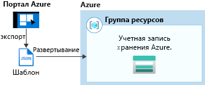

# Создание и развертывание шаблонов ARM с помощью IntelliJ IDEA

Узнайте, как развернуть шаблон Azure Resource Manager (ARM) в Azure с помощью IntelliJ IDEA, а также процесс редактирования и обновления шаблона непосредственно из IDE. ШАБЛОНы ARM — это файлы JSON, определяющие ресурсы, необходимые для развертывания решения. Основные понятия, связанные с развертыванием и администрированием решений Azure, см. в статье с [общими сведениями о развертывании шаблонов](overview.md).

Изучив это руководство, вы развернете учетную запись службы хранилища Azure. Тем же способом развертывайте ресурсы Azure.

Если у вас нет подписки Azure, [создайте бесплатную учетную запись](https://azure.microsoft.com/free/) перед началом.

## Предварительные требования

Для работы с этой статьей необходимо иметь следующее.

* Установленный [IntelliJ IDEA](https://www.jetbrains.com/idea/download/) Ultimate Edition или Community Edition.
* См. подробнее об [Azure Toolkit for IntelliJ](https://plugins.jetbrains.com/plugin/8053) в руководстве по [управлению подключаемыми модулями IntelliJ](https://www.jetbrains.com/help/idea/managing-plugins.html).
* [Войдите](/java/azure/intellij/azure-toolkit-for-intellij-sign-in-instructions) в свою учетную запись Azure для работы с Azure Toolkit for IntelliJ.

## Развертывание шаблона быстрого запуска

Чтобы не создавать шаблон с нуля, откройте его в [Шаблонах быстрого запуска Azure](https://azure.microsoft.com/resources/templates/). Шаблоны Azure quickstart — это репозиторий для шаблонов ARM. Шаблон, используемый в этой статье, называется [Создать стандартную учетную запись хранения.](https://github.com/Azure/azure-quickstart-templates/tree/master/101-storage-account-create/) Он определяет ресурс учетной записи службы хранилища Azure.

1. Нажмите правой [`azuredeploy.json`](https://raw.githubusercontent.com/Azure/azure-quickstart-templates/master/101-storage-account-create/azuredeploy.json) кнопкой мыши и сохранить и [`azuredeploy.parameters.json`](https://raw.githubusercontent.com/Azure/azure-quickstart-templates/master/101-storage-account-create/azuredeploy.parameters.json) на ваш местный компьютер.

1. Если ваш набор Azure Toolkit правильно установлен и в него выполнен вход, на боковой панели IntelliJ IDEA отобразится Azure Explorer. Щелкните правой кнопкой мыши **Управление ресурсами** и выберите **Создать развертывание**.

    

1. Укажите **имя развертывания**, **подписку**, **группу ресурсов** и **регион**. В рамках этого руководства мы развертываем шаблон в новой группе ресурсов `testRG`. Затем в качестве пути для **шаблона ресурса** укажите `azuredeploy.json`, а для **параметров ресурса** — скачанный файл `azuredeploy.parameters.json`.

    

1. Нажмите кнопку "Resource Parameters", и развертывание начнется. Ожидая завершения развертывания, вы можете просматривать ход выполнения в **строке состояния** IntelliJ IDEA внизу страницы.

    

## Просмотр имеющегося развертывания

1. После завершения развертывания отобразится новая группа ресурсов `testRG` и созданное развертывание. Щелкните развертывание правой кнопкой мыши, и отобразится список возможных действий. Выберите **Показать свойства**.

    

1. Откроется представление вкладки, отображающее некоторые полезные свойства, такие как состояние развертывания и структура шаблона.

    

## Редактирование и обновление имеющегося развертывания

1. Выберите **Edit Deployment** (Изменить развертывание) в контекстном меню или в представлении отображения свойств. Откроется еще одно представление вкладки с файлом шаблона и файлами параметров для развертывания в Azure. Чтобы сохранить эти файлы на локальном компьютере, щелкните **Export Template File** (Экспортировать файл шаблона) или **Export Parameter Files** (Экспортировать файлы параметров).

    

1. Вы можете отредактировать два файла на этой странице и развернуть изменения в Azure. Мы изменяем значение **storageAccountType** в файлах параметров с `Standard_LRS` на `Standard_GRS`. Затем щелкните **Обновить развертывание** внизу страницы и подтвердите обновление.

    

1. После того как вы обновите развертывание на портале, созданная учетная запись хранения должна отображаться как `Standard_GRS`.

## Очистка ресурсов

1. Если ресурсы Azure больше не нужны, их можно удалить. Для этого необходимо удалить группу ресурсов. Это можно сделать на портале Azure или с помощью Azure CLI. В Azure Explorer в IntelliJ IDEA щелкните правой кнопкой мыши созданную **группу ресурсов** и выберите "Удалить".

    

> [!NOTE]
> Обратите внимание, что удаление развертывания никоим образом не повлияет на ресурсы, созданные при развертывании. Если соответствующая группа ресурсов или определенные ресурсы вам больше не нужны, удалите их.

## Дальнейшие действия

Основное внимание в этой статье уделяется использованию IntelliJ IDEA для развертывания существующего шаблона из шаблонов Azure quickstart. Кроме того, в нем содержатся сведения о просмотре и обновлении имеющегося развертывания в Azure. Шаблоны быстрого запуска Azure могут не обеспечить вас всем необходимым. Дополнительные сведения о разработке шаблонов см. в новой серии

> [!div class="nextstepaction"]
> [Руководства для начинающих](./template-tutorial-create-first-template.md)

> [!div class="nextstepaction"]
> [Azure для разработчиков облачных решений Java](https://docs.microsoft.com/azure/java)
