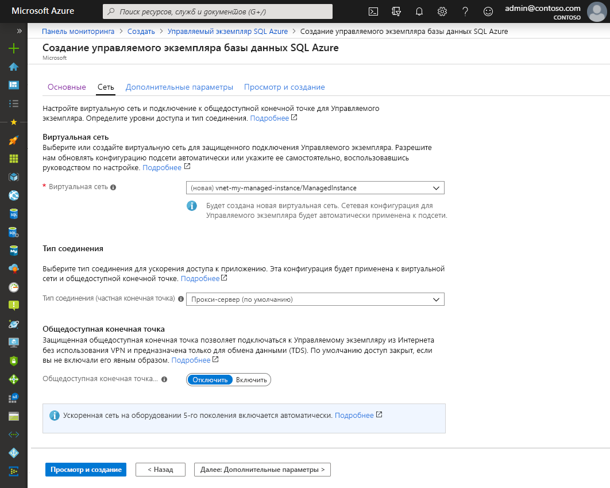
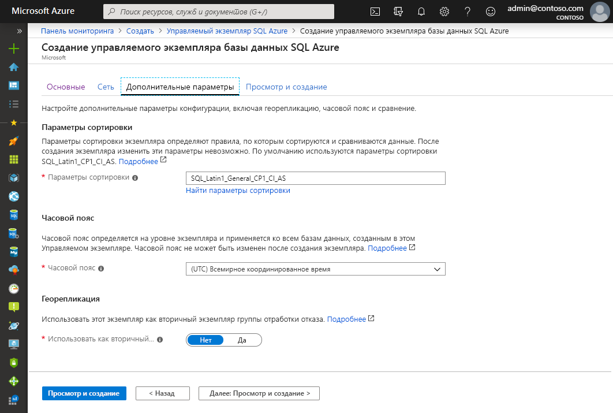
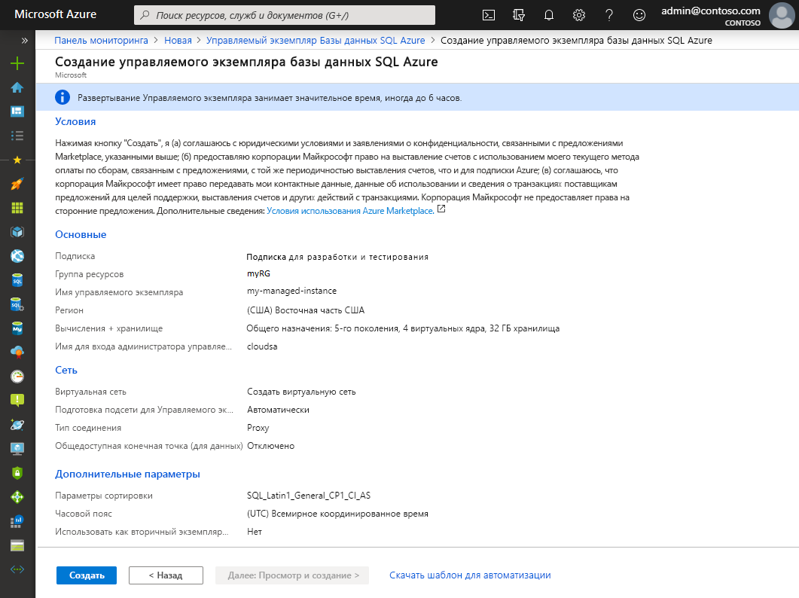
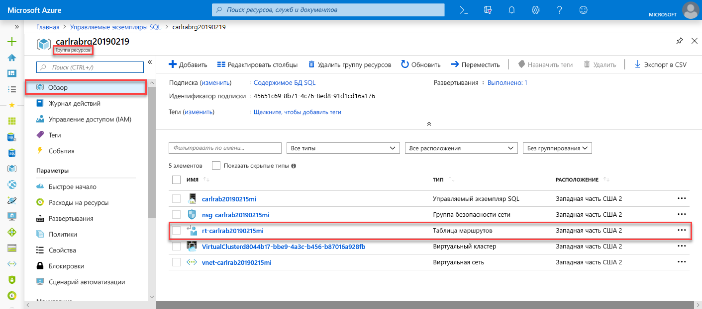
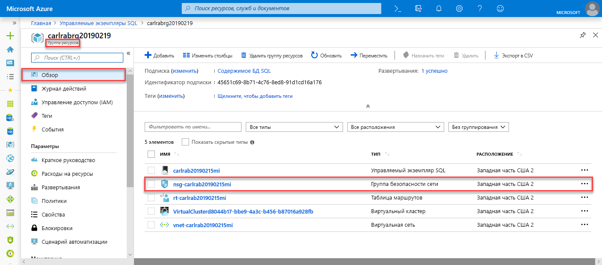

# Краткое руководство. Создание Управляемого экземпляра SQL Azure
[!INCLUDE[appliesto-sqlmi](../includes/appliesto-sqlmi.md)]

В этом кратком руководстве описано, как создать [Управляемый экземпляр SQL Azure](sql-managed-instance-paas-overview.md) на портале Azure.

> [!IMPORTANT]
> Сведения об ограничениях см. в разделах [Поддерживаемые регионы](resource-limits.md#supported-regions) и [Поддерживаемые типы подписок](resource-limits.md#supported-subscription-types).

## Создание Управляемого экземпляра

Чтобы создать Управляемый экземпляр SQL Azure, выполните указанные ниже действия. 

### Вход на портал Azure

Если у вас еще нет подписки Azure, [создайте бесплатную учетную запись](https://azure.microsoft.com/free/).

1. Войдите на [портал Azure](https://portal.azure.com/).
1. Выберите **Azure SQL** в левом меню портала Azure. Если **Azure SQL** отсутствует в списке, выберите **Все службы**, а затем введите **Azure SQL** в поле поиска.
1. Выберите **Добавить**, чтобы открыть страницу **выбора варианта развертывания SQL**. Вы можете просмотреть дополнительную информацию об Управляемом экземпляре SQL Azure, выбрав **Показать подробности** на плитке **Управляемый экземпляр SQL**.
1. Нажмите кнопку **создания**.

   

4. Укажите необходимую и дополнительную информацию о будущем Управляемом экземпляре на вкладках в форме подготовки **Создание Управляемого экземпляра SQL Azure**. Эти вкладки описываются в разделах ниже.

### Вкладка "Основные сведения"

- Укажите обязательные сведения, требуемые на вкладке **Основные сведения**. Это минимальный набор необходимых сведений для подготовки Управляемого экземпляра SQL.

   

   Используйте приведенную ниже таблицу в качестве справочной информации, необходимой на этой вкладке.

   | Параметр| Рекомендуемое значение | Описание |
   | ------ | --------------- | ----------- |
   | **Подписка** | Ваша подписка | Подписка, которая дает вам разрешение на создание ресурсов |
   | **Группа ресурсов** | Новая или существующая группа ресурсов.|Допустимые имена групп ресурсов см. в статье о [правилах и ограничениях именования](/azure/architecture/best-practices/resource-naming).|
   | **Имя управляемого экземпляра** | Любое допустимое имя|Сведения о допустимых именах см. в статье [Соглашения об именовании](/azure/architecture/best-practices/resource-naming).|
   | **Регион** |Регион, в котором нужно создать Управляемый экземпляр SQL.|Дополнительные сведения о регионах Azure см. [здесь](https://azure.microsoft.com/regions/).|
   | **Имя для входа администратора управляемого экземпляра** | Любое допустимое имя пользователя | Сведения о допустимых именах см. в статье [Соглашения об именовании](/azure/architecture/best-practices/resource-naming). Не используйте serveradmin. Это имя зарезервировано для роли уровня сервера.|
   | **Пароль** | Любой допустимый пароль| Пароль должен включать минимум 16 символов и соответствовать [определенным требованиям к сложности](../../virtual-machines/windows/faq.md#what-are-the-password-requirements-when-creating-a-vm).|

- Выберите **Настроить управляемый экземпляр** для определения размера вычислительных ресурсов и ресурсов хранения, а также для просмотра ценовой категории. Укажите нужный объем хранилища и количество виртуальных ядер, используя ползунки или текстовые поля. По завершении щелкните **Применить** для сохранения выбранных параметров. 

   

- Чтобы проверить выбранные параметры перед созданием Управляемого экземпляра SQL, нажмите **Просмотр и создание**. Или настройте сетевые параметры, выбрав **Далее: сеть**.

### Вкладка "Сеть"

- Заполните дополнительные сведения на вкладке **Сетевые подключения**. Если пропустить эти сведения, на портале будут применяться параметры по умолчанию.

   

   Используйте приведенную ниже таблицу в качестве справочной информации, необходимой на этой вкладке.

   | Параметр| Рекомендуемое значение | Описание |
   | ------ | --------------- | ----------- |
   | **Виртуальная сеть** | Щелкните **Создать виртуальную сеть** или выберите допустимую виртуальную сеть и подсеть.| Если поля сети или подсети недоступны, то прежде чем выбирать эти значения в качестве целевого объекта для нового Управляемого экземпляра SQL, нужно [изменить их в соответствии с требованиями сети](vnet-existing-add-subnet.md). Сведения о требованиях к настройке сетевой среды для Управляемого экземпляра SQL см. в статье [Настройка виртуальной сети для Управляемого экземпляра SQL](connectivity-architecture-overview.md). |
   | **Тип подключения:** | Выберите тип соединения: прокси-сервер или перенаправление.|[Подробнее о типах соединений, используемых для создания Управляемых экземпляров SQL Azure.](../database/connectivity-architecture.md#connection-policy)|
   | **Общедоступная конечная точка**  | Нажмите кнопку **Включить**. | Этот параметр необходимо включить, чтобы Управляемый экземпляр SQL был доступен через общедоступную конечную точку данных. | 
   | **Разрешить доступ из** (если **Общедоступная конечная точка** включена) | Выберите один из способов.   |Использование портала позволяет настроить группу безопасности с помощью общедоступной конечной точки.     Выберите один из следующих вариантов, соответствующий вашему сценарию.   <ul> <li>**Службы Azure**: Мы рекомендуем эту опцию при подключении через Power BI или другую многопользовательскую службу. </li> <li> **Интернет**. Используйте для тестирования, если вы хотите быстро запустить Управляемый экземпляр SQL. Мы не рекомендуем использовать его для рабочих сред. </li> <li> **Нет доступа**: Эта опция создает правило безопасности **Запретить**. Измените это правило, чтобы сделать Управляемый экземпляр SQL доступным через общедоступную конечную точку. </li> </ul>   [Подробнее о безопасном использовании Управляемого экземпляра SQL Azure с помощью общедоступной конечной точки.](public-endpoint-overview.md)|

- Чтобы проверить выбранные параметры перед созданием Управляемого экземпляра SQL, нажмите **Просмотр и создание**. Или настройте дополнительные пользовательские параметры, выбрав **Далее: Дополнительные параметры**.

### Дополнительные параметры

- Заполните дополнительные сведения на вкладке **Дополнительные настройки**. Если пропустить эти сведения, на портале будут применяться параметры по умолчанию.

   

   Используйте приведенную ниже таблицу в качестве справочной информации, необходимой на этой вкладке.

   | Параметр| Рекомендуемое значение | Описание |
   | ------ | --------------- | ----------- |
   | **Параметры сортировки** | Выберите параметры сортировки, которые нужно использовать для Управляемого экземпляра SQL. При переносе баз данных SQL Server необходимо проверить параметры сортировки источника с помощью `SELECT SERVERPROPERTY(N'Collation')` и использовать это значение.| Сведения о параметрах сортировки см. в статье [Задание или изменение параметров сортировки сервера](https://docs.microsoft.com/sql/relational-databases/collations/set-or-change-the-server-collation).|   
   | **Часовой пояс** | Выберите часовой пояс, который будет использоваться для Управляемого экземпляра SQL.|Дополнительные сведения см. в статье о [часовых поясах](timezones-overview.md).|
   | **Использовать как дополнительную отработку отказа** | Выберите **Да**. | Включите этот параметр, чтобы использовать Управляемый экземпляр SQL в качестве дополнительной группы отработки отказа.|
   | **Первичный Управляемый экземпляр SQL** (если для параметра **Использовать как дополнительную отработку отказа** выбрано значение **Да**) | Выберите существующий первичный Управляемый экземпляр SQL, который будет присоединен к создаваемому в той же зоне DNS. | Этот шаг включит конфигурацию после создания группы отработки отказа. Дополнительные сведения см. в статье [Учебник. Добавление Управляемого экземпляра SQL Базы данных SQL в группу отработки отказа](failover-group-add-instance-tutorial.md).|

## Отзыв и создание

1. Откройте вкладку **Просмотр и создание**, чтобы проверить выбранные параметры перед созданием Управляемого экземпляра SQL.

   

1. Выберите **Создать**, чтобы начать подготовку Управляемого экземпляра SQL.

> [!IMPORTANT]
> Развертывание Управляемого экземпляра SQL длится довольно долго. На развертывание самого первого экземпляра в подсети обычно нужно гораздо больше времени, чем на развертывание в подсети с уже имеющимися Управляемыми экземплярами SQL. Среднее время подготовки см. в информации об [операциях управления Управляемыми экземплярами SQL](sql-managed-instance-paas-overview.md#management-operations).

## Мониторинг хода выполнения развертывания

1. Щелкните значок **Уведомления**, чтобы просмотреть состояние развертывания.

   

1. Щелкните по ссылке **Выполняется развертывание** в уведомлении, чтобы открыть окно Управляемого экземпляра SQL и следить за подробной информацией о ходе развертывания. 

> [!TIP]
> Если вы закрыли веб-браузер или окно с ходом выполнения развертывания, выполните следующие действия, чтобы вернуться к экрану хода развертывания:
> 1. На портале Azure откройте группу ресурсов (на вкладке **Основные сведения**), в которую развертывается Управляемый экземпляр SQL.
> 2. Выберите **Развертывания**.
> 3. Выберите выполняемую операцию развертывания Управляемого экземпляра SQL.

> [!IMPORTANT]
> Чтобы узнать состояние создания Управляемого экземпляра SQL, требуется **разрешение на чтение** для соответствующей группы ресурсов. Если у вас нет этого разрешения или вы отменили его при создании Управляемого экземпляра SQL, то Управляемый экземпляр SQL может не отображаться в списке развертываний в группе ресурсов.
>

## Просмотр созданных ресурсов

Когда Управляемый экземпляр SQL будет успешно развернут, выполните приведенные ниже действия, чтобы просмотреть созданные ресурсы.

1. Откройте группу ресурсов, в которую развернут Управляемый экземпляр SQL. 

   

## Просмотр и точная настройка параметров сети

Чтобы точно настроить параметры сети, проверьте приведенные ниже параметры.

1. Выберите таблицу маршрутов, чтобы просмотреть созданный для вас пользовательский маршрут UDR.

   

2. В таблице маршрутизации просмотрите записи маршрутизации исходящего и внутреннего трафика виртуальной сети Управляемого экземпляра SQL. Если вы создаете или настраиваете таблицу маршрутизации вручную, обязательно создайте эти записи в таблице Управляемых экземпляров SQL.

   

3. Вернитесь в группу ресурсов и выберите группу безопасности сети.

   

4. Просмотрите правила безопасности относительно входящего и исходящего трафика. 

   

> [!IMPORTANT]
> Если вы настроили для Управляемого экземпляра SQL общедоступную конечную точку, необходимо открыть порты, чтобы разрешить сетевой трафик, допускающий подключения к Управляемому экземпляру SQL из Интернета. [Вот как это сделать.](public-endpoint-configure.md#allow-public-endpoint-traffic-on-the-network-security-group)
>

## Получение сведений о подключении к Управляемому экземпляру SQL

Чтобы подключиться к Управляемому экземпляру SQL, нужно получить имя узла и полное доменное имя (FQDN). Для этого выполните следующие действия:

1. Вернитесь в группу ресурсов и выберите нужный Управляемый экземпляр SQL.

   

2. На вкладке **Обзор** найдите свойство **Узел**. Скопируйте имя узла Управляемого экземпляра SQL: оно понадобится вам в следующем кратком руководстве.

   

   Скопированное значение — это полное доменное имя (FQDN), которое можно использовать для подключения к Управляемому экземпляру SQL. Оно похоже на следующий пример адреса: *your_host_name.a1b2c3d4e5f6.database.windows.net*.

## Дальнейшие действия

Узнайте, как подключиться к Управляемому экземпляру SQL:
- Обзор вариантов подключения для приложений см. в статье [Подключение приложений к Управляемому экземпляру SQL](connect-application-instance.md).
- Краткое руководство по подключению к Управляемому экземпляру SQL с виртуальной машины Azure см. [здесь](connect-vm-instance-configure.md).
- Краткое руководство по подключению к Управляемому экземпляру SQL с локального клиентского компьютера в режиме "точка — сеть" см. [здесь](point-to-site-p2s-configure.md).

Чтобы восстановить имеющуюся базу данных SQL Server из локальной среды в Управляемый экземпляр SQL, выполните следующие действия: 
- Используйте [Azure Database Migration Service для миграции](../../dms/tutorial-sql-server-to-managed-instance.md) для восстановления из файла резервной копии базы данных. 
- Дополнительные сведения о восстановлении из файла резервной копии базы данных см. в статье [Краткое руководство. Восстановление базы данных в Управляемый экземпляр](restore-sample-database-quickstart.md).

Сведения о расширенном мониторинге производительности базы данных Управляемого экземпляра SQL с использованием встроенных средств анализа проблем см. в статье о [мониторинге Управляемого экземпляра SQL Azure с помощью Аналитики SQL Azure](../../azure-monitor/insights/azure-sql.md).
