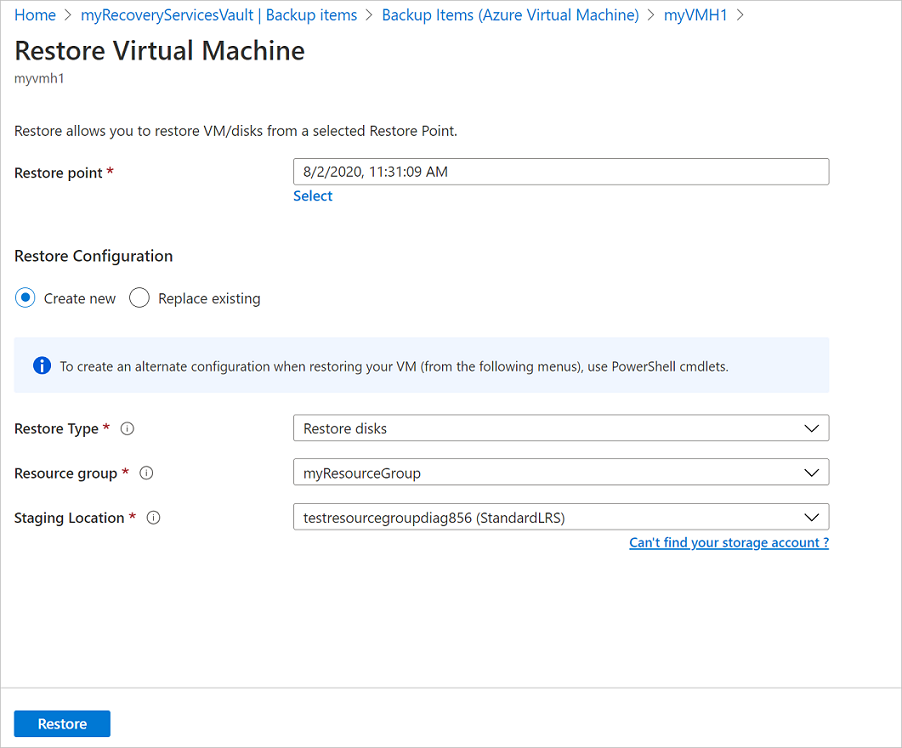
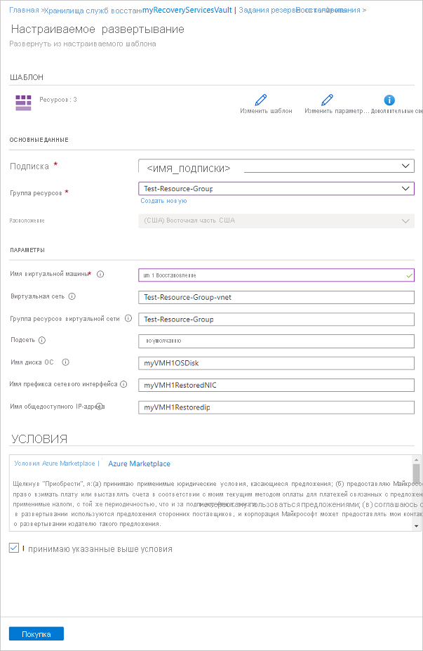
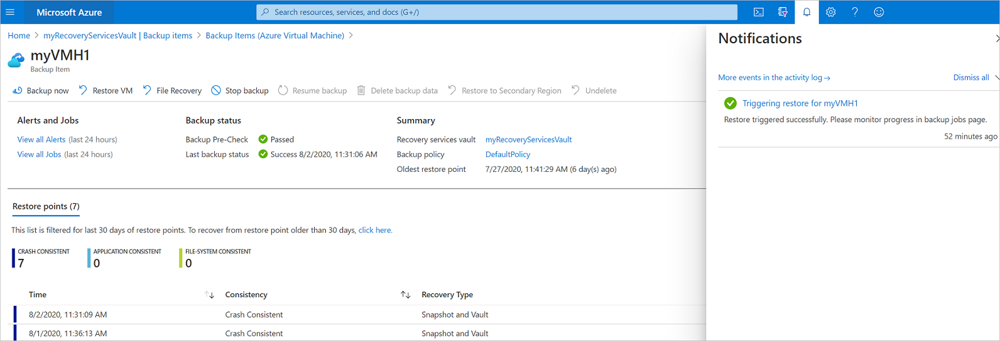

# Восстановление виртуальных машин Azure

В этой статье описывается восстановление данных виртуальной машины Azure из точек восстановления, хранящихся в хранилищах Служб восстановления [Azure Backup](backup-overview.md).

## Параметры восстановления

Azure Backup предоставляет несколько способов восстановления виртуальной машины.

**Вариант восстановления** | **Сведения**
--- | ---
**Создание виртуальной машины** | Быстрое создание и запуск базовой виртуальной машины из точки восстановления.   Можно указать имя для виртуальной Машины, выберите группу ресурсов и виртуальной сети, в котором он будет помещен и укажите учетную запись хранения для восстановленной виртуальной Машины (VNet).
**Восстановление диска** | Восстановление диска виртуальной машины, который затем можно использовать для создания новой виртуальной машины.   Azure Backup предоставляет шаблон для настройки и создания виртуальной машины.    Задание восстановления генерирует шаблон, который можно скачать и использовать, чтобы указать пользовательские параметры и создать виртуальную машину.   Диски будут скопированы в учетную запись хранения, указанную вами.   Кроме того, можно подключить диск к существующей виртуальной машине или создать новую виртуальную машину с помощью PowerShell.   Этот вариант полезен, если требуется настроить виртуальную машину, добавить параметры конфигурации, которых не было во время резервного копирования, или добавить параметры, которые необходимо настроить с помощью шаблона или PowerShell.
**Замена существующей** | Можно восстановить диск и заменить им диск на существующей виртуальной машине.   Текущая виртуальная машина должна существовать. Если она удалена, этот вариант невозможно использовать.   Служба архивации Azure создает моментальный снимок существующей виртуальной Машины перед заменой диска и сохраняет его в расположение промежуточного хранения, указанную вами. Существующих дисков, подключенных к виртуальной Машине заменяются на выбранную точку восстановления.   Моментальный снимок копируется в хранилище и сохраняются в соответствии с политикой хранения.    Замена существующей виртуальной машины поддерживается для незашифрованных управляемых виртуальных машин. Она не поддерживается для неуправляемых дисков, [общих виртуальных машин](https://docs.microsoft.com/azure/virtual-machines/windows/capture-image-resource) или для виртуальных машин, [созданных с помощью пользовательских образов](https://azure.microsoft.com/resources/videos/create-a-custom-virtual-machine-image-in-azure-resource-manager-with-powershell/).   Если точка восстановления содержит больше или меньше дисков, чем текущая виртуальная машина, то в конфигурации виртуальной машины будет отражено только количество дисков в точке восстановления.  

> [!NOTE]
> Вы также можете восстановить определенные файлы и папки на виртуальной машине Azure. [Узнайте больше](backup-azure-restore-files-from-vm.md).
>
> Если вы используете [последнюю версию](backup-instant-restore-capability.md) Azure Backup для виртуальных машин Azure (называемую мгновенным восстановлением), моментальные снимки хранятся до семи дней. Вы можете восстановить виртуальную машину из моментальных снимков, прежде чем отправлять данные резервного копирования в хранилище. Если вы хотите восстановить виртуальную машину из резервной копии за последние семь дней, быстрее можно восстановить ее из моментального снимка, а не из хранилища.

## Учетные записи хранения

Некоторые сведения об учетных записях хранения:

- **Создать виртуальную машину**. При создании новой виртуальной Машины, виртуальная машина будет помещен в указанную вами учетную запись хранения.
- **Восстановление диска**: При восстановлении диска, диск копируется в указанную вами учетную запись хранения. Задание восстановления создает шаблон, который можно загрузить и использовать для указания пользовательских параметров виртуальной Машины. Этот шаблон будет помещено в указанной учетной записи хранения.
- **Замена диска**: При замене диска, существующей виртуальной машины Azure Backup создает моментальный снимок существующей виртуальной Машины перед заменой диска. Моментальный снимок хранится во временной папке (учетная запись хранения), можно указать. Эта учетная запись хранения используется для временного хранения моментального снимка во время процесса восстановления, и мы рекомендуем создать новую учетную запись для этого, которые можно легко удалить после этого.
- **Расположение учетной записи хранения** : Учетная запись хранения должна быть в том же регионе, что и хранилище. Отображаются только эти учетные записи. Если в расположении нет учетных записей хранения, необходимо создать его.
- **Тип хранилища** : Хранилище BLOB-объектов не поддерживается.
- **Избыточность хранилища**: Хранилище, избыточное между зонами (ZRS), не поддерживается. Сведения о репликации и избыточности для учетной записи отображается в круглых скобках после имени учетной записи. 
- **Хранилище класса Premium**:
    - При восстановлении виртуальных машин без поддержки расширенной, учетных записей хранения уровня "премиум" не поддерживаются.
    - При восстановлении управляемых виртуальных машин, учетных записей хранения уровня "премиум", настроить, используя правила сети не поддерживаются.

## Перед началом работы

Восстановить виртуальную Машину (создать новую виртуальную Машину) убедитесь, что у вас есть элемент управления надлежащих прав доступа на основе ролей (RBAC) [разрешения](backup-rbac-rs-vault.md#mapping-backup-built-in-roles-to-backup-management-actions) для операции восстановления виртуальной Машины.

Если у вас нет разрешений, вы можете [восстановление диска](#restore-disks), а затем после восстановления диска, вы можете [шаблон](#use-templates-to-customize-a-restored-vm) , созданный как часть операции восстановления, чтобы создать новую виртуальную Машину.

## Выбор точки восстановления

1. В хранилище, связанном с виртуальной машиной, которую вы хотите восстановить, щелкните **Элементы архивации** > **Виртуальная машина Azure**.
2. Щелкните виртуальную машину. По умолчанию на панели мониторинга виртуальной машины отображаются точки восстановления за последние 30 дней. Можно отобразить точки восстановления за более чем 30 дней или выполнить фильтрацию, чтобы найти точки восстановления по датам, временным диапазонам и различным типам согласованности моментальных снимков.
3. Чтобы восстановить виртуальную машину, щелкните **Восстановить виртуальную машину**.

    

4. Выберите нужную точку восстановления.

## Выбор конфигурации восстановления для виртуальной машины

1. В разделе **Конфигурация восстановления** выберите вариант восстановления:
    - **Create new** (Создать). Этот параметр следует использовать, если вы хотите создать новую виртуальную машину. Вы можете создать виртуальную машину с простыми параметрами или восстановить диск и создать настроенную виртуальную машину.
    - **Replace existing** (Заменить существующую). Используйте этот параметр, если требуется заменить диски на существующей виртуальной машине.

        

2. Укажите параметры для выбранного варианта восстановления.

## Создание виртуальной машины

В качестве одного из [вариантов восстановления](#restore-options) можно быстро создать виртуальную машину с основными параметрами из точки восстановления.

1. В разделе **Конфигурация восстановления** > **Создать** > **Тип восстановления** выберите **Создать виртуальную машину**.
2. В поле **Имя виртуальной машины** укажите виртуальную машину, которая не существует в подписке.
3. В разделе **Группа ресурсов** выберите имеющуюся группу ресурсов для новой виртуальной машины или создайте новую с глобальным уникальным именем. При указании уже существующего имени Azure назначает группе имя, совпадающее с именем виртуальной машины.
4. В разделе **Виртуальная сеть** выберите виртуальную сеть, в которой будет размещена виртуальная машина. Здесь указаны все виртуальные сети, связанные с подпиской. Выберите подсеть. По умолчанию будет выбрана первая подсеть.
5. В **место хранения**, укажите учетную запись хранения для виртуальной Машины. [Узнайте больше](#storage-accounts).

    

6. В разделе **Конфигурация восстановления** нажмите **OK**. В разделе **Восстановление** щелкните **Восстановить**, чтобы активировать восстановление.

## Восстановление дисков

В качестве одного из [вариантов восстановления](#restore-options) можно создать диск из точки восстановления. Затем с использованием диска выполните одно из следующих действий:

- Используйте шаблон, который был создан как часть операции восстановления, чтобы настроить параметры и активировать развертывание виртуальной машины. Измените параметры шаблона по умолчанию и отправьте шаблон для развертывания виртуальной машины.
- [Подключите восстановленные диски](https://docs.microsoft.com/azure/virtual-machines/windows/attach-managed-disk-portal) к имеющейся виртуальной машине.
- [Создайте виртуальную Машину](https://docs.microsoft.com/azure/backup/backup-azure-vms-automation#create-a-vm-from-restored-disks) из восстановленных дисков с помощью PowerShell.

1. В разделе **Конфигурация восстановления** > **Создать** > **Тип восстановления** выберите **Восстановить диски**.
2. В разделе **Группа ресурсов** выберите имеющуюся группу ресурсов для восстановленных дисков или создайте новую с глобальным уникальным именем.
3. В разделе **Учетная запись хранения** укажите учетную запись, в которую необходимо скопировать виртуальные жесткие диски. [Узнайте больше](#storage-accounts).

    

4. В разделе **Конфигурация восстановления** нажмите **OK**. В разделе **Восстановление** щелкните **Восстановить**, чтобы активировать восстановление.

При восстановлении виртуальной Машины службы архивации Azure не использует учетную запись хранения. Но в случае **восстановить диски** и **мгновенное восстановление**, учетная запись хранения используется для хранения шаблона.

### Использование шаблонов для настройки восстановленной виртуальной машины

После восстановления диска используйте шаблон, созданный в ходе операции восстановления, чтобы настроить и создать новую виртуальную машину.

1. Откройте окно **сведений о нужном задании восстановления**.

2. В окне **сведений о задании восстановления** нажмите кнопку **Развернуть шаблон**, чтобы запустить развертывание шаблона.

    

3. Чтобы настроить параметр виртуальной машины, указанный в шаблоне, щелкните **Изменить шаблон**. Чтобы добавить дополнительные настройки, щелкните **Изменить параметры**.
    - [Подробнее](../azure-resource-manager/resource-group-template-deploy-portal.md#deploy-resources-from-custom-template) о развертывании ресурсов из пользовательского шаблона.
    - [Дополнительные сведения](../azure-resource-manager/resource-group-authoring-templates.md) о создании шаблонов.

   

4. Введите пользовательские значения для виртуальной машины, **примите условия** и нажмите кнопку **Купить**.

   

## Замена существующих дисков

В качестве одного из [вариантов восстановления](#restore-options) можно заменить существующий диск виртуальной машины на выбранную точку восстановления. [Просмотрите](#restore-options) все параметры восстановления.

1. В разделе **Конфигурация восстановления** нажмите **Заменить существующую**.
2. На вкладке **Тип восстановления** щелкните **Replace disk/s** (Замена дисков). Это точка восстановления, которая будет использоваться для замены имеющихся дисков виртуальной машины.
3. В **расположение промежуточного хранения**, укажите, где следует сохранить моментальные снимки управляемых дисков текущей в процессе восстановления. [Узнайте больше](#storage-accounts).

   

## Восстановление виртуальных машин с помощью специальных конфигураций

Существует ряд распространенных ситуаций, в которых может потребоваться восстановление виртуальных машин.

**Сценарий** | **Руководство**
--- | ---
**Восстановление виртуальных машин при участии в программе преимуществ гибридного использования** | Если на виртуальной машине Windows применяется [лицензия преимущества гибридного использования (HUB)](../virtual-machines/windows/hybrid-use-benefit-licensing.md), восстановите диски и создайте новую виртуальную машину на основе предоставленного шаблона (для параметра **Тип лицензии** установите значение **Windows_Server**) или PowerShell.  Этот параметр также может применяться после создания виртуальной машины.
**Восстановление виртуальных машин в случае отказа центра обработки данных Azure** | Если хранилище использует геоизбыточное хранилище, а основной центр обработки данных виртуальной машины выходит из строя, Azure Backup поддерживает восстановление резервных копий виртуальных машин в сопряженном центре обработки данных. Выберите учетную запись хранения в сопряженном центре обработки данных и восстановите ее как обычно. В службе Azure Backup для создания восстановленной виртуальной машины используется служба вычислений, расположенная в сопряженном расположении. [Узнайте больше](../resiliency/resiliency-technical-guidance-recovery-loss-azure-region.md) об отказоустойчивости центра обработки данных.
**Восстановление одной виртуальной машины контроллера домена в одном домене** | Восстановите эту виртуальную машину обычным образом. Обратите внимание на следующее.   С точки зрения Active Directory виртуальная машина Azure соответствует любой другой виртуальной Машине.   Кроме того, доступен режим восстановления служб каталогов, следовательно, все сценарии восстановления Active Directory также являются приемлемыми. [Дополнительные сведения](https://docs.microsoft.com/windows-server/identity/ad-ds/get-started/virtual-dc/virtualized-domain-controllers-hyper-v) о резервном копировании и восстановлении виртуальных контроллеров домена.
**Восстановление нескольких виртуальных машин контроллера домена в одном домене** | Если другие контроллеры домена в одном домене может получить доступ по сети, контроллер домена можно восстановить в любой виртуальной машине. Если это последний контроллер домена в домене или выполняется восстановление в изолированной сети, используйте [восстановление леса](https://docs.microsoft.com/windows-server/identity/ad-ds/manage/ad-forest-recovery-single-domain-in-multidomain-recovery).
**Восстановление нескольких доменов в одном лесу** | Мы рекомендуем [восстановить лес](https://docs.microsoft.com/windows-server/identity/ad-ds/manage/ad-forest-recovery-single-domain-in-multidomain-recovery).
**Восстановление исходного состояния системы** | Основным различием между виртуальными машинами Azure и локальными гипервизорами является отсутствие доступной консоли виртуальной машины в Azure. Консоль требуется в некоторых сценариях, например при восстановлении файла резервной копии с помощью восстановления исходного состояния системы. Хотя есть и полная замена такому типу восстановления. Это — восстановление виртуальной машины из хранилища.
**Восстановление виртуальных машин с использованием специальных конфигураций сети** | К специальным сетевым конфигурациям относятся виртуальные машины, использующие внутреннюю или внешнюю балансировку нагрузки, несколько сетевых интерфейсов или несколько зарезервированных IP-адресов. Эти виртуальные машины восстанавливаются с помощью варианта [восстановления диска](#restore-disks). Этот параметр создает копию виртуальные жесткие диски в указанной учетной записи хранения, а затем можно создать виртуальную Машину с помощью [внутренней](https://azure.microsoft.com/documentation/articles/load-balancer-internal-getstarted/) или [внешних](https://azure.microsoft.com/documentation/articles/load-balancer-internet-getstarted/) подсистемы балансировки нагрузки, [несколькими сетевыми КАРТАМИ](../virtual-machines/windows/multiple-nics.md), или [несколькими зарезервированными IP-адреса](../virtual-network/virtual-network-multiple-ip-addresses-powershell.md), в соответствии с вашей конфигурации.
**Группа безопасности сети (NSG) для сетевого Адаптера и подсети** | Служба архивации Azure виртуальной Машины поддерживает данные резервного копирования и восстановления из группы безопасности сети в виртуальной сети, подсети и сетевой карты.
**Зоны закрепленные виртуальных машин** | Azure Backup поддерживает резервное копирование и восстановление виртуальных машин с зонального закрепленных. [Подробнее](https://azure.microsoft.com/global-infrastructure/availability-zones/)

## Отслеживание восстановления
Когда вы запускаете операцию восстановления, служба Backup создает задание для отслеживания операции. Azure Backup отображает уведомления о задании на портале. Если они не отображаются, щелкните символ **Уведомления**, чтобы увидеть их.

 Отслеживание восстановления производится следующим образом:

1. Чтобы просмотреть операции для задания, щелкните гиперссылку уведомлений. Кроме того, в хранилище щелкните **Задания резервного копирования**, а затем выберите соответствующую виртуальную машину.

    

2. Чтобы отслеживать ход восстановления, щелкните любое задание восстановления с состоянием **Выполняется**. Появится индикатор выполнения, в котором отображаются сведения о ходе восстановления.

    - **Estimated time of restore** (Предполагаемое время восстановления): изначально показывает время, необходимое для завершения операции восстановления. В ходе выполнения операции время уменьшается и достигает 0, когда операция завершается.
    - **Percentage of restore** (Процент восстановления): показывает, какая часть операции восстановления выполнена.
    - **Number of bytes transferred** (Общее число переданных байтов): при восстановлении путем создания новой виртуальной машины в этом параметре отображается, сколько байтов передано по сравнению с общим количеством байтов для передачи.

## Действия после восстановления

После восстановления виртуальной машины необходимо отметить ряд моментов:

- Расширения, имеющиеся при настройке резервного копирования, установлены, но не включены. Обнаружив проблему, переустановите расширения.
- Если виртуальная машина, для которой выполнено резервное копирование, имеет статический IP-адрес, восстановленная виртуальная машина будет иметь динамический IP-адрес, чтобы избежать конфликтов. Для [восстановленной виртуальной машины можно добавить статический IP-адрес](../virtual-network/virtual-networks-reserved-private-ip.md#how-to-add-a-static-internal-ip-to-an-existing-vm).
- У восстановленной виртуальной машины нет группы доступности. Если вы используете вариант с восстановлением диска, вы можете [указать группу доступности](../virtual-machines/windows/tutorial-availability-sets.md) при создании виртуальной машины с диска с помощью шаблона или PowerShell.
- Если вы используете дистрибутив Linux на основе cloud-init (например, Ubuntu), то в целях безопасности пароль будет заблокирован после восстановления. Чтобы [сбросить пароль](../virtual-machines/linux/reset-password.md), на восстановленной виртуальной машине рекомендуется использовать расширение VMAccess. Мы советуем использовать ключи SSH в этих дистрибутивах, чтобы не сбрасывать пароль после восстановления.

## Резервное копирование восстановленных виртуальных машин

- Если виртуальная машина восстановлена в той же группе ресурсов и с тем же именем, что и первоначально заархивированная виртуальная машина, то резервное копирование будет продолжено и после восстановления виртуальной машины.
- Если восстановить виртуальную машину в другой группе ресурсов или задать для нее другое имя, необходимо настроить резервную копию для восстановленной виртуальной машины.

## Дальнейшие действия

- Если у вас возникли трудности во время процесса восстановления, [просмотрите](backup-azure-vms-troubleshoot.md#restore) распространенные проблемы и ошибки.
- После восстановления виртуальной машины ознакомьтесь со сведениями об [управлении виртуальными машинами](backup-azure-manage-vms.md).
