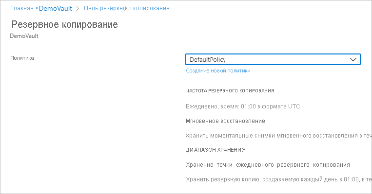
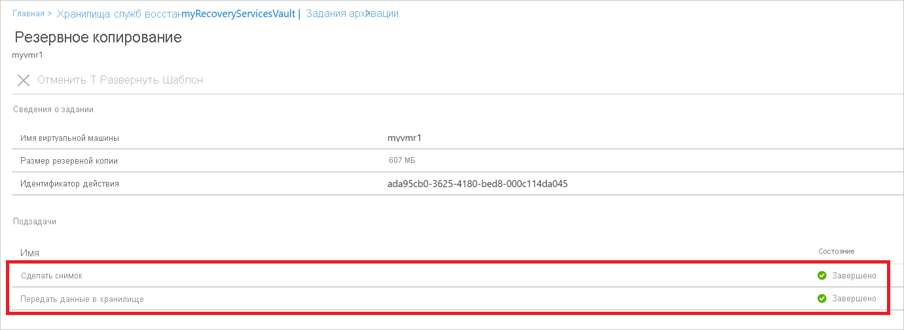

# Резервное копирование виртуальных машин Azure в хранилище Служб восстановления

В этой статье описывается, как выполнять резервное копирование виртуальных машин Azure в хранилище Служб восстановления с помощью службы [Azure Backup](backup-overview.md).

Вы узнаете, как выполнять следующие задачи:

> [!div class="checklist"]
>
> * Подготовка виртуальных машин Azure.
> * создание хранилища;
> * Обнаружение виртуальных машин и настройка политики резервного копирования.
> * Включение резервного копирования для виртуальных машин Azure.
> * Выполнение начального резервного копирования.

> [!NOTE]
> В этой статье описывается, как настроить хранилище и выбрать виртуальные машины для резервного копирования. Этот способ удобен, если вы хотите создать резервные копии нескольких виртуальных машин. Кроме того, можно [выполнить резервное копирование одной виртуальной машины Azure](backup-azure-vms-first-look-arm.md) непосредственно из параметров виртуальной машины.

## Перед началом работы

* [Ознакомьтесь](backup-architecture.md#architecture-built-in-azure-vm-backup) с архитектурой резервного копирования виртуальной машины Azure.
* [Узнайте о](backup-azure-vms-introduction.md) резервном копировании виртуальных машин Azure и расширении резервного копирования.
* [Перед настройкой резервного копирования ознакомьтесь с таблицей поддержки](backup-support-matrix-iaas.md).

Кроме того, в некоторых случаях может потребоваться несколько действий:

* **Установить агент виртуальной машины**. Для создания резервных копий виртуальных машин Azure служба Azure Backup устанавливает на них расширение агента виртуальной машины Azure. Если виртуальная машина создана из образа Azure Marketplace, агент установлен и запущен. Если вы создаете пользовательскую виртуальную машину или выполняете миграцию локального компьютера, может потребоваться [установить агент вручную](#install-the-vm-agent).

## Создание хранилища

 В хранилище хранятся резервные копии и точки восстановления, созданные со временем, а также политики резервного копирования, связанные с резервными копиями виртуальных машин. Создайте хранилище следующим образом.

1. Войдите на [портал Azure](https://portal.azure.com/).
2. В окне поиска введите **Службы восстановления**. В разделе **Службы** щелкните **Хранилища Служб восстановления**.

     

3. В меню **Хранилища Служб восстановления** щелкните **Добавить**.

     

4. В поле **Хранилище Служб восстановления** введите понятное имя для идентификации хранилища.
    * Имя должно быть уникальным в пределах подписки Azure.
    * Оно может содержать от 2 до 50 символов.
    * Имя должно начинаться с буквы, оно может содержать только буквы, цифры и дефисы.
5. Выберите подписку Azure, группу ресурсов и географический регион, в которых должно быть создано хранилище. Затем нажмите кнопку **Создать**.
    * Для создания хранилища может потребоваться некоторое время.
    * Следите за уведомлениями о состоянии на портале в верхней правой области.

После создания хранилище появится в списке хранилищ Служб восстановления. Если вы не видите хранилища, выберите **Обновить**.

>[!NOTE]
> Azure Backup теперь позволяет настраивать имя группы ресурсов, созданной службой Azure Backup. Дополнительные сведения см. в разделе [Группа ресурсов Azure Backup для виртуальных машин](backup-during-vm-creation.md#azure-backup-resource-group-for-virtual-machines).

### Изменение репликации хранилища

По умолчанию в хранилищах используется [геоизбыточное хранилище (GRS)](../storage/common/storage-redundancy.md).

* Если хранилище является основным механизмом резервного копирования, рекомендуется использовать GRS.
* Для более дешевого варианта можно использовать [локально избыточное хранилище (LRS)](../storage/common/storage-redundancy.md?toc=/azure/storage/blobs/toc.json).

Измените тип репликации хранилища следующим образом.

1. В новом хранилище выберите в разделе **Параметры** вкладку **Свойства**.
2. В разделе **Свойства** найдите элемент **Конфигурация архивации** и щелкните **Обновить**.
3. Выберите тип репликации хранилища и щелкните **Сохранить**.

      

> [!NOTE]
   > Вы не можете изменить тип репликации хранилища, когда хранилище уже настроено и содержит элементы для резервного копирования. Если вы хотите это сделать, необходимо создавать хранилище повторно.

## Добавление политики резервного копирования

Настройте политику резервного копирования для хранилища.

1. В хранилище в разделе **Обзор** щелкните **резервное копирование**.

   

2. В разделе **Цель резервного копирования** > **Где выполняется рабочая нагрузка?** выберите **Azure**. В раскрывающемся списке **Что необходимо архивировать?** выберите **Виртуальная машина** >  **ОК**. При этом расширение виртуальной машины зарегистрируется в хранилище.

   

3. В области **Политика архивации** выберите политику, которую вы хотите связать с хранилищем.
    * Политика по умолчанию создает резервную копию виртуальной машины один раз в день. Ежедневные резервные копии хранятся в течение 30 дней. Моментальные снимки восстановления хранятся в течение двух дней.
    * Если вы не хотите использовать политику по умолчанию, выберите **Создать новую** и создайте настраиваемую политику, как описано ниже.

      

4. В разделе **Выбор виртуальных машин** выберите виртуальные машины, для которых необходимо создать резервную копию с помощью политики. Нажмите кнопку **ОК**.

   * Выбранные виртуальные машины проверены.
   * Виртуальные машины можно выбрать только в том же регионе, что и хранилище.
   * Архивация виртуальных машин может выполняться только в одном хранилище.

     

    >[!NOTE]
    > Для настройки резервного копирования будут доступны только виртуальные машины в том же регионе и той же подписке, что и хранилище.

5. В разделе **Резервное копирование** щелкните **Включить резервное копирование**. При этом в хранилище и на виртуальных машинах развертывается политика и устанавливается расширение архивации на агенте ВМ на виртуальной машине Azure.

     

После включения резервного копирования

* Расширение резервного копирования устанавливается службой Azure Backup независимо от того, запущена ли виртуальная машина.
* Начальное резервное копирование запускается в соответствии с расписанием резервного копирования.
* При выполнении резервного копирования обратите внимание на следующее.
  * Виртуальная машина, которая работает, имеет наибольшие шансы на запись точки восстановления, соответствующей приложению.
  * Однако, даже если виртуальная машина отключена, для нее все равно выполняется резервное копирование. Такая виртуальная машина называется автономной виртуальной машиной. В этом случае точка восстановления будет отказоустойчивой.
* Явное исходящее подключение не требуется, чтобы разрешить резервное копирование виртуальных машин Azure.

### Создание настраиваемой политики

Если вы выбрали создание новой политики резервного копирования, заполните параметры политики.

1. В поле **Имя политики** укажите понятное имя.
2. В поле **Расписание резервного копирования** укажите, когда следует выполнять резервное копирование. Для виртуальных машин Azure можно создавать ежедневное или еженедельное резервное копирование.
3. В поле **Мгновенное восстановление** укажите, как долго следует хранить моментальные снимки локально для мгновенного восстановления.
    * При восстановлении резервные копии дисков виртуальных машин копируются из хранилища по сети в место хранения для восстановления. С помощью мгновенного восстановления можно использовать локально сохраненные моментальные снимки, созданные во время задания резервного копирования, не дожидаясь передачи данных резервного копирования в хранилище.
    * Моментальные снимки для мгновенного восстановления можно хранить от 1 до 5 дней. Значение по умолчанию — 2 дня.
4. В поле **Диапазон хранения** укажите, как долго нужно хранить точки ежедневного или еженедельного резервного копирования.
5. В поле **Хранение точки ежемесячного резервного копирования** укажите, следует ли хранить ежемесячные, ежедневные или еженедельные резервные копии.
6. Нажмите кнопку **ОК** , чтобы сохранить политику.

    

> [!NOTE]
   > Azure Backup не поддерживает настройку автоматического перехода на летнее время для резервных копий виртуальных машин Azure. При возникновении изменений во времени необходимо вручную изменить политики резервного копирования.

## Активация начального резервного копирования

Начальное резервное копирование будет выполняться в соответствии с расписанием, но его можно запустить немедленно, как показано ниже.

1. В меню хранилища щелкните **Элементы архивации**.
2. На плитке **Элементы архивации** щелкните **Виртуальная машина Azure**.
3. В списке **Элементы архивации** щелкните многоточие (...)
4. Щелкните **Создать резервную копию**.
5. В окне **Создать резервную копию** используйте элементы управления "Календарь", чтобы выбрать последний день, до которого должна храниться точка восстановления. Нажмите кнопку **ОК**.
6. Отслеживайте уведомления на портале. Вы можете отслеживать ход выполнения задания на панели мониторинга хранилища в разделе **Задания резервного копирования** > **Выполняется**. В зависимости от размера виртуальной машины создание начального архива может занять некоторое время.

## Проверка состояния задания Backup

Задание резервного копирования для каждой резервной копии виртуальной машины состоит из двух частей: этап **моментального снимка**, за которым следует этап **Передачи данных в хранилище**. 
Этап создания моментального снимка гарантирует доступность точки восстановления, хранящейся вместе с дисками, для **мгновенного восстановления**. Она доступна не более пяти дней в зависимости от срока хранения моментальных снимков, заданного пользователем. При переносе данных в хранилище создается точка восстановления для долгосрочного хранения. Перенос данных в хранилище начинается только после завершения этапа создания моментального снимка.

  

На стороне сервера выполняются две **подзадачи**, предназначенные для задания внешнего резервного копирования, которое можно назначить, установив флажок **Задание резервного копирования** в колонке сведений, как показано ниже:

  

Этап **Передача данных в хранилище** может занять несколько дней в зависимости от размера дисков, количества операций обработки на диск и ряда других факторов.

Состояние задания может различаться в зависимости от следующих сценариев.

**Моментальный снимок** | **Передача данных в хранилище** | **Состояние задания**
--- | --- | ---
Завершено | Выполняется | Выполняется
Завершено | Пропущено | Завершено
Завершено | Завершено | Завершено
Завершено | Ошибка | Выполнено с предупреждениями
Ошибка | Ошибка | Ошибка

Теперь с использованием этой возможности для одной и той же виртуальной машины две резервные копии могут создаваться параллельно, но на одном этапе (моментальный снимок, передача данных в хранилище) может выполняться только одна подзадача. Итак, в сценариях было задано задание резервного копирования, поэтому на следующий день резервное копирование с этой функцией разделения выполнить не удастся. Резервное копирование на следующий день может привести к завершению создания моментального снимка, когда **Передача данных в хранилище** пропускается, если задание резервного копирования за предыдущий день все еще выполняется.
Добавочная точка восстановления, созданная в хранилище, будет содержать все изменения после последней точки восстановления, созданной в хранилище. Пользователь при этом не несет никаких затрат.

## Другие возможные шаги

### Установка агента виртуальной машины

Для создания резервных копий виртуальных машин Azure служба Azure Backup устанавливает на них расширение агента виртуальной машины Azure. Если виртуальная машина создана из образа Azure Marketplace, агент установлен и запущен. Если вы создаете пользовательскую виртуальную машину или выполняете миграцию локального компьютера, может потребоваться установить агент вручную, как показано в таблице.

**Виртуальная машина** | **Сведения**
--- | ---
**Windows** | 1. [Скачайте и установите](https://go.microsoft.com/fwlink/?LinkID=394789&clcid=0x409) MSI-файл агента.   2. Требуется установка с разрешениями администратора на компьютере.   3. Проверьте установку. В папке *C:\WindowsAzure\Packages* на виртуальной машине щелкните правой кнопкой мыши файл **WaAppAgent.exe** > **Свойства**. На вкладке **Сведения** в строке **Версия продукта** должна быть указана версия 2.6.1198.718 или выше.   Если вам нужно обновить агент, убедитесь, что операции резервного копирования не выполняются, и [переустановите агент](https://go.microsoft.com/fwlink/?LinkID=394789&clcid=0x409).
**Linux** | Установите, используя RPM- или DEB-пакеты из репозитория пакетов дистрибутива. Это предпочтительный способ установки и обновления агента Linux для Azure. Все [поставщики поддерживаемых дистрибутивов](../virtual-machines/linux/endorsed-distros.md) встраивают пакет агента Linux для Azure в свои образы и репозитории. Агент можно найти в [GitHub](https://github.com/Azure/WALinuxAgent), но мы не рекомендуем устанавливать его оттуда.   Если вам нужно обновить агент, убедитесь, что операции резервного копирования не выполняются, и обновите двоичные файлы.

>[!NOTE]
> **Azure Backup теперь поддерживает выборочное резервное копирование и восстановление дисков с помощью решения для резервного копирования виртуальных машин Azure.**
>
>В настоящее время Azure Backup поддерживает одновременное резервное копирование всех дисков виртуальной машины (с операционной системой и данными) с помощью решения для резервного копирования виртуальных машин. С помощью функции исключения дисков можно выполнить резервное копирование одного или нескольких дисков данных виртуальной машины. Это обеспечивает эффективное и экономичное решение для резервного копирования и восстановления. Каждая точка восстановления содержит данные дисков, включенных в операцию резервного копирования, что позволяет восстанавливать подмножество дисков из определенной точки восстановления во время операции восстановления. Это относится к восстановлению как из моментального снимка, так и из хранилища.
>
>**Чтобы зарегистрироваться для получения предварительной версии, напишите нам по адресу AskAzureBackupTeam@microsoft.com**

## Дальнейшие действия

* Устраните проблемы с [агентами виртуальной машины Azure](backup-azure-troubleshoot-vm-backup-fails-snapshot-timeout.md) или [резервным копированием виртуальных машин Azure](backup-azure-vms-troubleshoot.md).
* [Восстановите](backup-azure-arm-restore-vms.md) виртуальные машины Azure.
